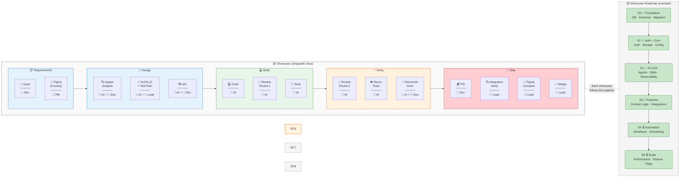

# Development Practices

This skill defines the full change workflow. **Apply it based on the change tier:**

| Tier | Change type | Use this skill? |
|------|-------------|----------------|
| 0 — Trivial | Typo, config value, log message | No — standard PR only |
| 1 — Bug fix | Regression fix, minor behavioral correction | Partial — start at step 2, skip training plan |
| 2 — Normal feature | Bounded, well-understood change within one domain | Yes — full workflow |
| 3 — Non-trivial / cross-domain | Migrations, cross-domain, AI systems, security, data model | Yes — full workflow, add HLD review gate |
| 4 — Incident / P0 | Active production problem | Fix first, then full docs within 48 hours |

When in doubt about the tier, use the heavier process. If you are touching more than one domain or writing more than a few dozen lines, treat it as Tier 2 or above.

---

## 1. Change Workflow

Tier 2 and above follow this sequence. Tier 1 (bug fixes) start at step 2 and skip the training plan stub.

### Pipeline View

Each **Showcase** is a shippable vertical slice (backend + frontend + tests + docs) that goes through this pipeline end-to-end:



**Roles:** 👤 PM = Product Manager · 👤 Dev = Developer · 👤 Lead = Team Lead · 🤖 AI = AI-assisted (Claude Code)

**Legend:** 🤖 = AI-driven · 👤 = Human-required · All other steps = AI-assisted, developer-supervised

### Detailed Flowchart

```mermaid
graph TD
    A["1. 🎫 GitHub Issue<br/>Describe change, root cause, proposed solution"] --> AA
    AA{"Figma<br/>design<br/>exists?"} -->|Yes| AB["1a. 🎨 Review Figma Design<br/>Extract requirements, interactions,<br/>visual specs into issue"]
    AA -->|No| B
    AB --> B
    B["2. 🔍 Impact Analysis<br/>Affected components, APIs, configs, deps"] --> C
    C["3. 📝 Update Docs<br/>HLD/LLD, design decisions, test cases<br/>Reference Figma specs if available"] --> D
    D["4. 🏗️ Update IaC<br/>Manifests, migrations, configs"] --> E
    E["5. 🧪 Test Case Planning<br/>New, updated, removed, regression tests"] --> EA
    EA{"New technical<br/>capability?"}
    EA -->|Yes| EB["5a. 📚 Training Plan Stub<br/>docs/03-engineering/training/&lt;capability&gt;.md<br/>Link from implementation issue"]
    EA -->|No| F
    EB --> F
    F["6. 💻 Code Changes<br/>Implement per updated docs"] --> G

    G["7. 🤖 Code Review — Round 1<br/>AI reviews: structure, security, LLD adherence"] --> H
    H{"Issues<br/>found?"}
    H -->|Yes| F
    H -->|No| I

    I["8. 🧪 Test Changes<br/>Add new, update changed, remove obsolete"] --> J
    J["9. ▶️ Run Full Test Suite<br/>All tests must pass"] --> K
    K{"Tests<br/>pass?"}
    K -->|No| F
    K -->|Yes| L

    L["10. 🤖 Code Review — Round 2<br/>AI reviews: edge cases, regressions, completeness"] --> M
    M{"Issues<br/>found?"}
    M -->|Yes| F
    M -->|No| N

    N["11. ▶️ Rerun Tests<br/>Confirm no regressions from Round 2 fixes"] --> O
    O{"Tests<br/>pass?"}
    O -->|No| F
    O -->|Yes| P

    P["12. 📄 Reconcile Docs<br/>If diverged: decide update docs or fix code"] --> Q
    Q["13. 📬 Create PR<br/>Link to issue, include docs + IaC + code + tests"] --> R

    R["14. 👤 Team Lead — Integration Verification<br/>Run feature E2E, verify intent matches HLD/LLD"]
    R --> S{"Figma<br/>design<br/>exists?"}
    S -->|Yes| T["15. 👤 Team Lead — Figma Comparison<br/>Compare implementation to Figma,<br/>list differences, resolve before sign-off"]
    S -->|No| U
    T --> U["16. ✅ Merge"]

    style A fill:#e3f2fd,stroke:#1565c0
    style B fill:#e3f2fd,stroke:#1565c0
    style C fill:#e3f2fd,stroke:#1565c0
    style D fill:#e3f2fd,stroke:#1565c0
    style E fill:#e3f2fd,stroke:#1565c0
    style EB fill:#e3f2fd,stroke:#1565c0
    style F fill:#e8f5e9,stroke:#2e7d32
    style G fill:#fff3e0,stroke:#e65100
    style I fill:#e8f5e9,stroke:#2e7d32
    style J fill:#f3e5f5,stroke:#6a1b9a
    style L fill:#fff3e0,stroke:#e65100
    style N fill:#f3e5f5,stroke:#6a1b9a
    style P fill:#e3f2fd,stroke:#1565c0
    style Q fill:#e3f2fd,stroke:#1565c0
    style R fill:#ffcdd2,stroke:#c62828
    style T fill:#ffcdd2,stroke:#c62828
    style U fill:#c8e6c9,stroke:#2e7d32
```



```
1.  GitHub Issue            → describe the change, root cause, proposed solution
1a. 🎨 Review Figma Design → if Figma exists, extract requirements, interactions, visual specs into issue
2.  Impact Analysis         → identify affected components, APIs, configs, dependencies.
                              ALSO query the test registry and incident registry for the affected domain:
                              • Test registry: "which tests cover this area? are there coverage gaps?"
                              • Incident registry: "what has gone wrong here before? are the regression
                                tests and canary criteria from past incidents still in place?"
                              (see §1g below)
2a. 📊 ROI Estimate        → if the change costs >1 day of effort, add an ROI Estimate section to the
                              issue: value dimension, expected outcome (specific + falsifiable), baseline
                              metric (measured, not guessed), cost (build + ongoing + maintenance),
                              measurement plan, 30/90-day checkpoint dates, decision if ROI not realized
                              (see §1d below)
3.  Update Docs             → HLD/LLD, design decisions, test cases BEFORE code (reference Figma specs)
4.  Update IaC              → infrastructure manifests, migrations, configs if affected
5.  Test Case Planning      → identify tests to add, update, or remove (see §1b below)
5a. 📚 Training Plan Stub  → if the change introduces a new technical capability, draft a training plan
                              in docs/03-engineering/training/<capability>.md and link from the issue (see §1c)
--- TDD as a design tool (see §1f below) ---
6.  🔴 AI Generates Tests   → AI generates as many tests as possible from the LLD + test plan +
                              manifest facade contracts. No implementation code exists. Tests cover:
                              happy paths, error paths, edge cases, preconditions, boundary entities,
                              contract compliance. The goal is MAXIMUM test coverage of the SPEC.
7.  👤 Human Reviews Tests  → developer + QA review the AI-generated tests. This is the highest-value
                              human step in the build phase. The developer:
                              • Adds edge cases AI missed (domain knowledge, "what if X?")
                              • Adds integration scenarios ("when this interacts with Y...")
                              • Removes tests that are trivial or test the wrong thing
                              • Challenges assumptions ("this test assumes Z, but actually...")
                              QA (if available, non-blocking):
                              • Adds regression scenarios from the incident registry for this domain
                              • Adds acceptance criteria from the user's perspective
                              • Cross-references the test registry: "is the test for INC-X here?"
                              Every new test case gets registered in the test registry with metadata
                              (domain, risk level, origin, incident ref). See §1g.
                              The combined human + AI + QA test suite IS the refined specification.
8.  🔄 Tests Improve Design → AI analyzes the test suite for gaps in the LLD. If tests reveal
                              behavior the LLD doesn't describe, UPDATE THE LLD FIRST. Examples:
                              • A test for rate-limit handling but the LLD doesn't mention rate limits
                              • A test for a retry path but the LLD doesn't specify retry behavior
                              • A test for an edge case that implies a precondition not in the manifest
                              The LLD and manifest are updated BEFORE any code is generated.
9.  🔴 Verify RED           → run the full test suite. All new tests MUST fail (no implementation
                              exists). If any pass, investigate — the test is wrong or the LLD
                              describes existing behavior.
10. 🟢 Generate Code (GREEN)→ AI generates implementation code to make ALL failing tests pass.
                              The tests are the spec. The goal is the SIMPLEST code that passes.
11. 🟢 Verify GREEN         → run the full test suite (new + existing). ALL must pass.
                              If new pass but old fail → regression. Fix before proceeding.
12. 🔵 Refactor             → simplify the passing code. Remove duplication, improve naming.
                              Rerun tests after each change. If any test breaks → revert.
--- TDD cycle ends ---
13. Code Review Round 1     → AI reviews structure, security, LLD adherence
14. Code Review Round 2     → AI reviews edge cases, regressions, completeness
15. Rerun Tests             → confirm no regressions from review fixes
16. Reconcile Docs + Training → if implementation diverged, explicitly decide: does the implementation reveal a better design (update docs) or did it drift from the intended design (fix code)? Document the decision. Never silently normalize drift.
17. Create PR               → link to GitHub issue, include docs + IaC + training plan + code + tests in same PR
18. 👤 Downstream Impact    → developer + AI produce impact brief: flows changed, risks, PM mental model
                              update, manual verification scenarios (see §1e below)
19. 📋 Rollout Plan         → risk-rated canary strategy with go/no-go criteria (see §1e below).
                              Query the incident registry for the affected domain — past incidents
                              shape the canary criteria. Ops reviews (non-blocking) if available.
20. 👤 Integration Verification → team lead runs feature E2E, verifies intent matches HLD/LLD,
                              reviews impact brief + rollout plan for completeness
21. 👤 Figma Comparison     → if Figma design exists, compare implementation, list & resolve differences
22. 🚀 Canary Deploy        → deploy per the risk-rated plan; AI monitors go/no-go criteria
23. ✅ Promote or Rollback   → lead promotes to full production or reverts canary
24. Merge + Demo            → after lead sign-off; demo to PM
--- post-ship ---
25. 📊 30-day ROI Check     → developer + lead review: is the metric moving in the right direction?
26. 📊 90-day ROI Check     → lead + PM review: actual vs estimated ROI; update ADR with Actual Outcome
```

**For Tier 2 and above, steps 1-8 (GitHub Issue through Training plan stub) are required.** For Tier 1 bug fixes, steps 1, 2, and the code/test steps are required — impact analysis and training plan are optional. Documentation is the source of truth, not code.

**Steps 9-15 are TDD-as-design** — AI generates maximum tests (step 9, AI generates tests RED) → humans add domain-expertise tests (step 10, Human reviews tests) → tests reveal LLD gaps → LLD is improved (step 11, Tests improve the design) → verify RED (step 12, Verify RED) → generate code (step 13, Generate code GREEN) → verify GREEN (step 14, Verify GREEN) → refactor (step 15, Refactor). This is mandatory. See §1f for the full explanation + contract tests + the "tests improve the design" loop.

**Step 4 (ROI estimate) is conditional** — it fires for any change costing more than ~1 day of effort. For smaller changes, state "ROI estimate not required — change is <1 day." See §1d for the template.

**Step 8 (Training plan stub) is conditional** — it fires only when the change introduces a new technical capability (see §1c below for the trigger list). When it doesn't fire, make the decision explicit in the chat: "no new capability — training plan not required."

**Steps 21-22 (Downstream impact brief + Risk-rated rollout plan) are the downstream assessment** — impact brief + rollout plan. These protect against organizational risk (team's mental model is wrong, ops doesn't know how to deploy). See §1e.

**Steps 27-28 (30-day ROI check + 90-day ROI check) are post-ship** — they don't block the merge but ARE mandatory follow-ups. The 30/90-day checkpoints are scheduled at issue creation time and tracked as checklist items on the issue.

**Figma bookends the workflow:** Figma feeds into requirements and design at step 2 (Figma review), and closes the loop as a verification check at step 25 (Figma comparison). The design is both the input and the acceptance criteria.

### 1b. Test Case Planning (Step 7)

Before writing any code, analyze the change and produce a test plan:

- **New tests needed** — what new behavior or edge cases require coverage?
- **Existing tests to update** — which tests assert on changed behavior and must be modified?
- **Obsolete tests to remove** — which tests cover deleted/replaced functionality?
- **Regression tests** — what existing tests must still pass to confirm no breakage?

Document this in the GitHub issue or PR description. The test plan is reviewed alongside the design, not added as an afterthought.

### 1c. Training Plan (Step 8 — conditional)

If the change introduces a new technical capability, draft a training plan alongside the design docs so the team can ramp on the new capability without rediscovering it from the code.

**Training plan required when the change introduces any of:**

- A new architectural pattern (e.g., bandit routing, plan-mode tools, context compression)
- A new external system integrated into the platform (e.g., vLLM, Cohere embeddings, DSPy)
- A new framework or primitive (e.g., LangGraph, MemoryProcessor, BrandScopedToolBroker)
- A new ML/AI technique (e.g., best-of-N sampling, Thompson sampling, DPO)
- A significant refactor that changes how engineers reason about a subsystem

**Not required for:**

- New endpoints on existing controllers
- Bug fixes
- Mental-model-preserving refactors
- Test/doc-only changes

When in doubt, write one — training plans are cheap. When the answer is no, state it explicitly in the chat (`no new capability — training plan not required`) so the decision is visible.

**Location:** `docs/03-engineering/training/<capability-name>.md` — follow the structure in the [training plan template](templates/training-plan-template.md) and the [worked example](examples/greenfield/docs/03-engineering/training/agent-architecture-example.md).

**Shape:**

- **Overview** — total estimated time, prerequisites, a one-sentence statement of what the reader will be able to do after completing the plan
- **Modules** — 30-60 min each, sequential, building on each other
- **Per module:** goal, reading list (files or docs to read), key concepts, hands-on exercise, checkpoint ("if you can answer these questions, you understood the module")
- **Audience note at the top** — primary dev team, secondary PM team; customer-facing enablement is a separate artifact

**Who writes it, when:**

1. **Dev Lead drafts the stub** during step 8 (Training plan stub), as part of the Design PR. Module outlines, reading list, learning goals — no working code examples yet (the implementation does not exist).
2. **Developer fleshes it out** in the implementation PR. Working code examples from the shipped code replace placeholders. Hands-on exercises are validated against the final code.
3. **AI code review (step 17, Code review Round 1)** checks the training plan compiles — referenced files exist, code examples run, reading list is accurate, exercises have known-good answers.
4. **Dev Lead traceability check (step 24, Integration verification)** verifies the implementation issue body has a link to the training plan doc.

**Issue link format:** add a dedicated section in the implementation issue body:

```markdown
## Training Plan

[training: <capability-name>](../blob/main/docs/03-engineering/training/<capability-name>.md)
```

This pattern makes it grep-able across the repo and easy to audit during traceability reviews.

### 1c-ii. Admin Guide Update (conditional)

If the change adds or modifies admin-facing features (feature flags, model profiles, user management, settings), update the admin guide at `docs/04-operations/admin-guide.md`.

**Required when:**
- New admin endpoint or UI toggle
- New feature flag
- New model profile or provider
- Changes to user management behavior

**Template:** [admin-guide-template.md](templates/admin-guide-template.md)

**What to add:**
- What the new feature does (one sentence, non-technical)
- How to use it (step-by-step from the admin UI)
- When to use it (scenarios)
- What happens when you change it (side effects)

### 1d. ROI Estimation (Step 4 — conditional)

If the change costs more than ~1 day of effort, add an ROI Estimate section to the GitHub issue during the design phase. This ensures every significant technical investment has a measurable thesis that can be verified after shipping.

**Issue template section:**

```markdown
## ROI Estimate

**Value dimension:** [Quality / Reliability / Velocity / Cost / Risk / UX]
**Expected outcome:** [specific, falsifiable prediction with timeframe]
  e.g., "self_eval/overall improves by 15-25% within 30 days"
**Baseline metric (before):** [current measured value, not estimated]
  e.g., "Current self_eval/overall mean = 0.72 (last 30 days from Langfuse)"
**Expected cost:**
  - Build: [engineering days]
  - Ongoing: [per-call or per-month cost delta]
  - Maintenance: [new operational burden]
**Measurement plan:** [which metric, which dashboard, when to check]
**Verification checkpoints:**
  - [ ] 30-day check: [date]
  - [ ] 90-day check: [date]
**Decision if ROI not realized:** [revert / rearchitect / accept partial return]
```

**Value dimension reference:**

| Dimension | Example changes | How to measure |
|-----------|----------------|----------------|
| Quality | Best-of-N sampling, context compression | Eval score lift, HITL rejection rate |
| Reliability | Retry policy, idempotency, DLQ | Error rate, incident count, MTTR |
| Velocity | System manifest, training plans | Time-to-first-PR, rework rate |
| Cost | Model routing, prompt caching | Cost per generation, tokens per output |
| Risk | Brand isolation, canary deployment | Blast radius, rollback frequency |
| UX | Latency improvements, streaming | p95 latency, time-to-first-token |

**Verification cadence:**

| Checkpoint | Who | What they check | Outcomes |
|-----------|-----|----------------|----------|
| **30-day** | Developer + Lead | Metric direction, cost within estimate, unexpected side effects | On track / Inconclusive (extend to 60d) / Off track (investigate) |
| **90-day** | Lead + PM | Actual vs estimated ROI, business impact | ROI realized / Partial / Not realized → execute decision plan |

**After the 90-day checkpoint:** update the ADR with an "Actual Outcome" section:

```markdown
## Actual Outcome (90-day verification, YYYY-MM-DD)

**Expected:** [original prediction]
**Actual:** [measured result]
**Verdict:** [ROI realized / Partial / Not realized — and what was done about it]
```

The 90-day reviews create a calibration loop: over 5-10 verified changes, the team learns whether it systematically overestimates value, underestimates cost, or misses timelines. Each estimate gets compared to reality, not just filed and forgotten.

**When step 4 (ROI estimate) is skipped:** for changes under ~1 day (config fix, doc update, small refactor), state "ROI estimate not required — change is <1 day" so the skip is explicit and auditable.

### 1f. TDD as a Design Tool (Steps 9-15)

TDD in this process is not just about test-first coding. **Tests are a design refinement loop** where AI generates maximum test coverage from the spec, humans inject domain expertise by adding and correcting tests, and the combined test suite reveals gaps in the design — BEFORE any implementation code is written.

**The insight:** writing "test that publishing fails gracefully when Instagram rate-limits at 100 posts/day" is more precise than writing that requirement in an LLD paragraph — and it's executable. Tests are a higher-fidelity spec language than prose.

**The three-phase loop:**

```
Phase A — AI generates tests (step 9)
    AI reads the LLD + test plan + manifest facade contracts.
    Generates as many tests as possible: happy paths, error paths,
    edge cases, preconditions, boundary entity validation, contract
    compliance. The goal is MAXIMUM coverage of the SPEC, not the code
    (which doesn't exist yet).

Phase B — Humans refine tests (step 10)
    The developer reviews every test. This is the highest-value
    human step in the build phase:
    • Adds edge cases AI missed ("what if the API returns 429
      mid-carousel but the first 2 images already published?")
    • Adds integration scenarios from domain knowledge
    • Removes trivial or wrong tests
    • Challenges assumptions ("this test assumes retry will
      succeed, but what if the budget is exhausted?")

Phase C — Tests improve the design (step 11)
    AI analyzes the combined test suite for LLD gaps:
    • A test for rate-limit handling but no rate-limit section in LLD
      → ADD rate-limit behavior to the LLD
    • A test for a retry path but no retry spec in the LLD
      → ADD retry behavior to the LLD
    • A test implying a precondition not in the manifest
      → ADD the precondition to the manifest facade

    The LLD and manifest are UPDATED before any code is generated.
    The tests drove the design improvement.
```

Then: verify RED (step 12), generate code (step 13), verify GREEN (step 14), refactor (step 15).

**Why this order matters:**

| Without TDD-as-design | With TDD-as-design |
|-----------------------|---------------------|
| LLD is written → code is generated → tests are written → gaps found → code is rewritten | LLD is written → tests are generated → humans add cases → gaps found → LLD is improved → code is generated right the first time |
| The LLD-to-code gap is discovered AFTER the code exists | The LLD-to-code gap is discovered BEFORE the code exists |
| Humans review prose (LLD) for completeness | Humans review executable tests for completeness — more concrete, less ambiguous |
| Edge cases are added after the fact | Edge cases drive the design before implementation |

**What the developer reviews at step 10 (Human reviews tests):**

The developer is NOT reviewing code. They are reviewing the SPECIFICATION expressed as tests. The questions to ask:

- "Does this test cover the behavior I actually need?"
- "What scenario would break this feature that no test covers?"
- "What does the PM expect to happen when [edge case]?"
- "What happened last time we deployed something similar?" (institutional knowledge → new test)
- "What does the manifest say about preconditions for this facade API? Are they all tested?"

Every test the developer adds is a piece of domain expertise that AI couldn't derive from the LLD. This is where the human-AI collaboration produces something neither could alone.

**Contract tests from the manifest:**

For changes that touch domain boundaries, step 9 (AI generates tests) should also generate **contract tests** from the manifest's facade APIs:

```python
# Generated from the manifest facade: publishing.instagram_publish
def test_instagram_publish_returns_tool_result_with_external_id():
    """Contract: PublishResult must contain external_id."""
    result = await tool.execute(
        image_url="...", caption="...", idempotency_key="test:0:ig"
    )
    assert result.success
    assert "external_id" in result.data

def test_instagram_publish_rejects_missing_idempotency_key():
    """Contract: precondition — idempotency_key required."""
    result = await tool.execute(image_url="...", caption="...")
    assert not result.success
    assert "idempotency_key" in result.error

def test_instagram_publish_returns_cached_on_duplicate_key():
    """Contract: idempotent — second call with same key returns cached."""
    await tool.execute(image_url="...", caption="...", idempotency_key="test:0:ig")
    result = await tool.execute(image_url="...", caption="...", idempotency_key="test:0:ig")
    assert result.data["cached"] is True
```

These tests are generated FROM the manifest, not from the LLD. They verify that the domain's promises to other domains are kept.

**When tests surface LLD gaps (step 11, Tests improve the design):**

This is the TDD forcing function. Examples:

| Test the developer added | LLD gap revealed | LLD update |
|--------------------------|------------------|------------|
| `test_publish_fails_on_rate_limit` | LLD doesn't mention rate limits | Add "rate-limited requests return 429; caller retries via resilience.retry_external_call" |
| `test_carousel_with_11_images_rejected` | LLD doesn't specify image count limit | Add "carousel accepts 2-10 images; >10 raises ValueError" |
| `test_publish_in_plan_mode_returns_preview` | LLD doesn't mention plan mode | Add "in PLAN mode, returns dry-run preview via _describe_plan()" |

Each gap → LLD update → the spec gets more precise → the generated code will be more correct. The tests DROVE the design improvement.

### 1e. Downstream Impact Assessment + Rollout Plan (Steps 21-22)

After all code + tests + docs are ready (steps 9-20, AI generates tests through Reconcile docs), and before creating the PR (step 23, Create PR), produce two artifacts:

**Downstream impact brief (step 21):**

The developer + AI produce a structured brief answering five questions, each aimed at a different stakeholder:

| Section | Question | Who reads it |
|---------|----------|-------------|
| 1. Flows + components | What user-visible behaviors changed? | PM, QA |
| 2. Risk assessment | What can break? Severity x likelihood | Lead, Ops |
| 3. Manual verification | What should be tested beyond the automated suite? | QA, Ops |
| 4. Mental model update | What assumptions does the PM hold that are no longer true? | PM |
| 5. Rollout strategy | How do we derisk deployment? | Ops, Lead |

Section 4 (mental model update) is the one teams most often skip and most often regret. Writing "approve now queues for scheduled delivery instead of publishing immediately" takes 30 seconds and prevents weeks of downstream confusion.

**Risk-rated rollout plan (step 22):**

| Risk level | Example | Rollout |
|-----------|---------|---------|
| Low | Config fix, doc update | Direct deploy |
| Medium | New feature behind flag, additive endpoint | Flag off → staging → 24h soak → production |
| High | Changed existing behavior, new external integration | Canary 5-10% → 4h monitor → 25% → 4h → 100% |
| Critical | Irreversible side effects, billing, migration | Canary 1% → manual gate each step → 24h soak per tier |

Each promotion step checks explicit go/no-go criteria calibrated to the specific change:
- Error rate delta < threshold
- Latency delta < threshold
- Business metric within tolerance of baseline
- No increase in failure-mode scores

If any criterion fails, the canary pauses for investigation. Rollback path: revert canary, full traffic returns to the previous version.

The developer proposes the criteria in the rollout plan; the lead reviews them during integration verification (step 24, Integration verification).

### 1g. Test Registry + Incident Registry (Steps 3, 10, 22, post-incident)

Two knowledge bases that grow with every change and every incident. They prevent the team from making the same mistake twice and make impact analysis concrete instead of guesswork.

**Test Case Registry** (`docs/03-engineering/testing/test-registry.yaml`)

A catalog of test cases with metadata — not the test code itself (that stays in `tests/`), but an index that makes tests queryable by domain, risk level, origin, and linked incident.

Each entry has:

| Field | Purpose |
|-------|---------|
| `id` | Unique identifier (TC-NNN) |
| `name` | Human-readable test name |
| `domain` | Which manifest domain this test covers |
| `risk` | low / medium / high / critical |
| `type` | unit / integration / contract / e2e / exploratory |
| `origin` | How the test was created: tdd / qa-review / incident-regression / design-pr |
| `incident_ref` | If added after an incident, which one (INC-NNN) |
| `file` | Path to the actual test file + function |

**How it grows:**
- Step 10 (Human reviews tests): every test added by developer or QA gets registered
- Post-incident: the regression test is registered with `origin: incident-regression` and `incident_ref: INC-NNN`

**How it's consumed:**
- Step 3 (Impact analysis): "which tests cover the affected domain? are there coverage gaps?"
- Step 9 (AI generates tests): AI reads relevant entries to inform what to generate — especially incident-regression tests that must not be accidentally removed
- Step 10 (Human reviews tests): QA cross-references — "is the regression test for INC-X in the plan?"

**Incident Registry** (`docs/incident-registry.yaml`)

A catalog of production incidents with root cause, affected domain, fix applied, regression test added, and canary criteria updated.

Each entry has:

| Field | Purpose |
|-------|---------|
| `id` | Unique identifier (INC-NNN) |
| `date`, `severity` | When and how bad |
| `domain` | Which manifest domain was affected |
| `summary` | One-line description |
| `root_cause` | What actually went wrong (not symptoms) |
| `fix` | What was done — PR link, ADR link if applicable |
| `regression_test` | TC-NNN linking to the test registry |
| `canary_criteria_added` | What monitoring was added to prevent recurrence |
| `lessons` | What the team learned — this is the institutional memory |

**How it grows:**
- Within 48 hours of incident resolution, Ops + the developer who fixed it write the entry
- When the regression test merges, the `regression_test` field is linked
- When canary criteria are updated, the `canary_criteria_added` field is linked

**How it's consumed:**
- Step 3 (Impact analysis): "what has gone wrong in this domain before?" — shapes the risk assessment
- Step 22 (Risk-rated rollout plan): past incidents shape the canary go/no-go criteria. If INC-001 was a duplicate publish, the canary for any publish change monitors for duplicate keys.
- Step 10 (Human reviews tests): "is there a test covering the scenario that caused INC-X?"
- Onboarding: new team members learn what broke and why, grounded in real incidents

**QA and Ops integration (non-blocking):**

QA and Ops are contributors to these registries, not gatekeepers in the workflow:

| Role | Contributes | When | Blocking? |
|------|------------|------|-----------|
| **QA** | Test cases (step 10, Human reviews tests), acceptance criteria, edge cases from the incident registry | Design PR review + TDD review | No — if QA is unavailable, developer proceeds. QA adds tests in a follow-up. |
| **Ops** | Incident entries (post-incident), canary criteria (step 22, Risk-rated rollout plan), infrastructure-specific go/no-go thresholds | Post-incident + rollout plan review | No — if Ops is unavailable, developer uses the incident registry to self-serve past criteria. |

The registries make QA and Ops expertise available even when the individuals are not — because their past inputs are captured in queryable form.

See `templates/test-registry-template.yaml` and `templates/incident-registry-template.yaml` for the full format with examples.

---

## 2. Doc-Driven AI Development

- **AI writes all docs and code.** Developer reviews, corrects, approves.
- **LLDs are the prompt.** Every LLD is precise enough to generate code from.
- **Design PR before code PR.** HLD/LLD/test cases reviewed and merged before code generation begins.
- **Chat with AI first.** Discuss the task, explore approaches, raise edge cases. AI produces the LLD at the end of the conversation.

---

## 3. Code Generation Standards

- **Inline comments on every significant line** — explain the "why", not the "what"
- **Type hints everywhere** — models, function signatures, return types
- **Async/await for all I/O** — database, HTTP, file system, all async where the framework supports it
- **Security first** — no injection vulnerabilities, sanitize inputs, validate at boundaries

---

## 4. Testing Standards

- **Tests must exercise real service code** — not reimplementations or mock-only assertions
- **Mock external APIs** — never make real API calls in tests
- **Every new feature needs** — happy path, error cases, edge cases, boundary conditions
- **Every bug fix needs** — a regression test that would have caught the bug
- **Every deleted feature needs** — removal of its tests (dead tests are worse than no tests)
- **Test names describe behavior** — `test_returns_404_when_brand_not_owned`, not `test_brand_3`

---

## 5. Impact Analysis

Before any change, identify:

- **Affected endpoints/APIs** — what callers will see different behavior?
- **Affected services/modules** — what internal code paths change?
- **Affected infrastructure** — do manifests, configs, secrets, or migrations need updating?
- **Affected documentation** — which HLD/LLD docs describe the changed behavior?
- **Affected tests** — which existing tests cover the changed code? (this feeds into §1a)

---

## 6. Infrastructure as Code

- **IaC for cloud resources** — networking, compute, storage, IAM, secrets, budgets
- **Declarative manifests for orchestration** — base + environment overlays
- **Secrets via external secrets management** — never hardcode credentials
- **Every new service/secret/job** — update IaC manifests and local dev config

---

## 7. Observability

- **Trace every LLM call** — observability platform must capture all AI operations
- **Include tenant/user context in traces** — for cost attribution and debugging
- **Structured logging** — JSON, with correlation IDs across services

---

## 8. API Design

- **Scope endpoints to the owning entity** — e.g., `/api/{tenant}/{resource}`
- **Consistent auth pattern** — one mechanism, one ownership check function
- **Return 404 not 403 for ownership failures** — prevent resource enumeration
- **Version or shim for backwards compatibility** — don't break existing clients

---

## 9. Code Review (Two Rounds)

### Round 1 — Before Unit Tests (after code generation)
- **Focus:** structural issues, security vulnerabilities, LLD adherence, naming conventions
- **Run AI review agents** (code-reviewer, silent-failure-hunter) on generated code
- **Fix all CRITICAL and HIGH findings** before proceeding to tests
- **Goal:** catch design-level problems early, before investing time writing and running tests

### Round 2 — After All Tests Pass
- **Focus:** edge cases, regressions, completeness, test quality
- **Run AI review agents** again on the full changeset (code + tests)
- **Fix findings, then rerun the full test suite** to confirm no regressions from fixes
- **MEDIUM/LOW findings** tracked as issues — can defer to next sprint

## 10. Integration Verification (👤 Team Lead Only)

After all automated tests pass and code review rounds are complete, the team lead performs a final intent verification before merge:

- **Run the feature end-to-end** — not unit tests, but the actual user journey
- **Compare behavior against HLD/LLD** — does the implementation deliver what was designed?
- **Check traceability** — requirement → design → IaC → code → tests (nothing missing)
- **Figma comparison (when applicable)** — if a Figma design exists for this feature:
  - Compare the implementation screen-by-screen against the Figma document
  - List all visual and behavioral differences
  - Resolve each difference (fix implementation, update Figma, or document as intentional deviation)
  - No merge until differences are resolved or explicitly accepted
- **Sign-off** — team lead approves the PR only after integration verification passes

---

## 11. Design Decisions

- **Document every decision** with rationale, alternatives considered, and conditions for revisiting
- **When technology changes** — check the decision rationale to know WHEN to switch
- **Reusable patterns** — extract and document patterns that apply across features

---

## 12. Team Process

- **PM brainstorms with AI** → updates PRD + mockups
- **Dev Lead designs with AI** → HLD + first-cut LLDs + IaC (all in Design PR)
- **Design PR must merge before code begins** — this is the gate
- **Developers refine LLD + generate code + tests** — each owns a vertical slice
- **AI code review before human review** — fix mechanical issues first
- **Lead reviews traceability** — requirement → design → IaC → code → tests
- **Demo to PM** → iterate based on feedback
