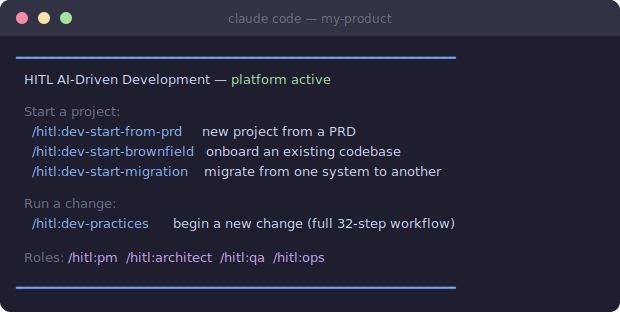

# HITL AI-Driven Development

## What this is

A document-driven delivery model for teams that use AI heavily in non-trivial software work. AI produces code faster than teams can review it — and does so confidently even when wrong. This process makes that speed safe by organizing the team around documentation as the shared source of truth. AI generates; humans shape, review, and decide.

**AI-assisted drafting works best for low-ambiguity artifacts.** For high-ambiguity work, debugging, security-sensitive design, or anything where the right answer requires judgment that the AI cannot yet reason about reliably — human-led design and writing is the better default. The process blends AI drafting with human-led work depending on what the task requires.

**Where this is especially useful:** migrations, cross-domain feature work, AI/agentic systems, regulated or high-audit environments, and platform teams introducing shared conventions. It is also useful for non-trivial features in any backend-heavy or architecture-heavy codebase.

**Where a reduced version is more realistic:** normal SaaS feature teams, internal tools, and full-stack product teams shipping weekly. For these teams, the most valuable subset is: shared AI rules, docs-first for non-trivial changes, traceability for important decisions, and explicit rollout notes for risky releases. See the [Adoption Ladder](#adoption-ladder) for a lightweight entry path.

**Where this is not a good fit as written:** understaffed startups, teams without good CI or test discipline, teams where most work is small bugfixes and iterative UX changes, or teams without an architect or senior lead who can own the review gates.

> **AI tool note:** This guide uses [Claude Code](https://docs.anthropic.com/en/docs/claude-code) as the primary AI coding tool with `CLAUDE.md` for project-level AI configuration. A [Codex CLI](https://github.com/openai/codex) version is also provided — see [Install for Codex CLI](#install-for-codex-cli) below. The process works with any AI coding assistant that supports auto-loaded project rules (e.g., Cursor rules, Windsurf rules, Cline memory banks). The principles and workflow are tool-agnostic; only the enforcement hooks are tool-specific.

> **Language note:** The enforcement tooling (manifest drift checker, import analysis, Semgrep rules) currently targets Python codebases. The process and documentation workflow are language-agnostic — only the automated checks are Python-first. TypeScript and other language support is planned.

**Yes, this looks like waterfall.** Design before code. That is intentional. Waterfall failed because the gap between "design done" and "working software" was months. With AI, that gap is often much shorter. You get waterfall's rigor (coherent design, traced decisions) with less wait — though how much less depends on the team, tooling maturity, and change complexity. Without this discipline, AI-generated code drifts — each session invents its own patterns, and by the time you have customers, you face a rewrite that is much harder than designing coherently from the start.

## Use This In Your Project

Once installed, this is the welcome banner that appears at the start of every Claude Code session:



Pick the path that matches where you are:

| Situation | Start here | Time |
|-----------|-----------|------|
| **New project** — want conventions and docs-first from day one | [Quick Start — New Project](docs/quick-start.md#quick-start--new-project) | 1-2 hours |
| **Existing project** — want to adopt the process on a live codebase | [Quick Start — Existing Project](docs/quick-start.md#quick-start--existing-project) | 1 day to set up; see baseline sprint below |
| **Migrating a backend** — using AI to rewrite or modernise a system | [Migration Guide](docs/playbook/migration-guide.md) | Varies by system size |
| **Just the conventions layer** — one `CLAUDE.md` and shared AI rules, nothing else | [Adoption Ladder — Level 1](#adoption-ladder) | 1 hour |
| **Not sure** — want to understand what you're getting into first | [Adoption Ladder](#adoption-ladder) → pick a level | Start at Level 1 |

### By Role

Each role has its own command set and setup guide:

| Role | Commands | Guide |
|------|----------|-------|
| **Developer** | `/dev-practices`, `/generate-docs`, `/tdd`, `/apply-change`, `/check-conventions`, `/impact-brief`, `/conclude` | [Developer guide](docs/roles/developer.md) |
| **Product Manager** | `/pm:add-feature`, `/pm:design-feature`, `/pm:prioritize`, + 6 more | [PM guide](docs/roles/pm.md) |
| **Architect** | `/architect:design-system`, `/architect:design-feature`, `/architect:review-design`, `/architect:verify-traceability` | [Architect guide](docs/roles/architect.md) |
| **QA Engineer** | `/qa:plan-tests`, `/qa:review-tests`, `/qa:verify-quality`, `/qa:report-defect` | [QA guide](docs/roles/qa.md) |
| **Ops Engineer** | `/ops:build`, `/ops:deploy`, `/ops:apply-iac`, `/ops:review-release`, `/ops:monitor-canary` | [Ops guide](docs/roles/ops.md) |

### Installing the plugin

The HITL platform is packaged as a Claude Code plugin. Installing it makes all workflow commands, subagents, and enforcement hooks available in your project.

**Step 1 — Clone the platform to a stable path on your machine**

```bash
git clone https://github.com/your-org/hitl-dev-platform ~/tools/hitl-dev-platform
```

**Step 2 — Register the plugin**

_Option A: Per-project (recommended)_ — run `init-project.sh` and it writes the plugin entry automatically:

```bash
bash ~/tools/hitl-dev-platform/scripts/init-project.sh ~/code/my-product
```

This creates `.claude/settings.json` in your product repo with the plugin path already set. Open the product repo in Claude Code and the commands are immediately available.

_Option B: Global install_ — add the plugin to your user-level Claude Code settings so it is available in every project without running `init-project.sh`:

```jsonc
// ~/.claude/settings.json
{
  "plugins": ["~/tools/hitl-dev-platform/.claude-plugin/plugin.json"]
}
```

**Step 3 — Verify**

Open Claude Code in your project directory and type `/`. You should see `/start-prd`, `/start-brownfield`, `/start-migration`, `/dev-practices`, `/tdd`, and the role namespaces (`/pm`, `/architect`, `/qa`, `/ops`). If the commands do not appear, confirm the plugin path in `.claude/settings.json` points to the correct location of your platform clone.

**Step 4 — Run the appropriate start command**

`Use `/start-prd` for a new project, `/start-brownfield` to onboard an existing codebase, or `/start-migration` for a migration project.

---

### What it looks like after setup

Once the plugin is installed, Claude Code auto-loads your project conventions and exposes all workflow commands as slash commands. Type `/` to browse or `/namespace:` to filter by role (`/pm`, `/architect`, `/qa`, `/ops`). Run the appropriate `/start-*` command first if you are setting up a new project or onboarding an existing codebase.

### Recommended: Fork and install as a shared platform

Fork this repo on GitHub, clone your fork once to a stable location, then use `init-project.sh` to bootstrap each product repo. The platform lives in one place; product repos reference it — nothing is copied except your project-specific files.

```bash
# 1. Fork on GitHub, then clone your fork once
git clone https://github.com/your-org/hitl-dev-platform ~/tools/hitl-dev-platform

# 2. Bootstrap a product repo (creates it if it doesn't exist)
bash ~/tools/hitl-dev-platform/scripts/init-project.sh ~/code/my-product

# 3. Repeat for every additional product — the platform stays in one place
bash ~/tools/hitl-dev-platform/scripts/init-project.sh ~/code/my-other-product
```

`init-project.sh` accepts `--tool claude|codex|both` (default: both) and `--name <project-name>`. It sets up Claude Code via plugin reference and Codex via file copy — see below for what each produces.

**After init, each product repo contains only product-specific files:**
- `CLAUDE.md` — customize with your project's coding standards
- `docs/system-manifest.yaml` — document your domains and API boundaries
- `docs/` structure for HLDs, LLDs, and ADRs
- `.claude/settings.json` pointing to the shared platform plugin and hooks
- `.hitl/hooks/` — wrapper scripts that resolve the platform at runtime via `HITL_PLATFORM_ROOT`
- `.semgrep/`, `tools/manifest-drift/`, `scripts/fix_mermaid_br_tags.py` — convention tools required by `/check-conventions`
- `AGENTS.md` and `codex/hook-scripts/` (Codex only)

**To edit a skill, agent, or hook:** open `~/tools/hitl-dev-platform` and edit the file directly. See [docs/customization-guide.md](docs/customization-guide.md) for the full command-to-file map.

**Version isolation:** By default all products on one machine share one platform checkout and pick up changes on the next `git pull`. If a product needs to stay pinned to a specific version, clone the fork to a separate path and point `HITL_PLATFORM_ROOT` at it. See [docs/quick-start.md](docs/quick-start.md#version-isolation) for details.

**CI setup:** Hook wrappers read `HITL_PLATFORM_ROOT` at runtime. On CI machines, set this env var to the path where you clone the platform:
```bash
export HITL_PLATFORM_ROOT=/path/to/hitl-dev-platform
```

**To pull upstream improvements into your fork:**

```bash
cd ~/tools/hitl-dev-platform
git fetch upstream && git merge upstream/main
# Skills and agents update immediately (referenced, not copied).
# Convention tools in product repos: copy manually or re-run init-project.sh.
```

### Optional: Graphify (knowledge graph — recommended for Level 4+ systems)

The HITL process works fully without Graphify. Skills fall back to direct file reads automatically if it is not installed.

On systems with many domains or large design doc sets, [Graphify](https://github.com/safishamsi/graphify) acts as a retrieval accelerator: skills run targeted graph queries instead of reading the full `system-manifest.yaml` on every operation, cutting token cost and keeping AI grounded on docs that would otherwise exceed the context window. It is the right addition once a repo has enough domains that full-manifest reads become expensive or noisy — not from day one.

```bash
# Install once per environment
pip install graphifyy && graphify install

# From your repo root — build the initial graph
graphify . --directed --no-viz

# Start the MCP server so Claude Code can query it (keep running in background)
python3 -m graphify.serve graphify-out/graph.json
```

The PostToolUse hook (included in the plugin) triggers an incremental graph rebuild automatically after every design doc edit — no manual re-runs needed.

### Install for Codex CLI

Codex CLI uses `AGENTS.md` instead of `CLAUDE.md` and has no plugin system. `init-project.sh` handles Codex setup automatically (it delegates to `codex/install.sh` internally):

```bash
bash ~/tools/hitl-dev-platform/scripts/init-project.sh ~/code/my-product --tool codex
```

This copies `AGENTS.md` to your project root (Codex reads it automatically), installs git hooks, and copies the enforcement hook scripts to `codex/hook-scripts/`. After init, edit `AGENTS.md` to add your project's coding standards.

**Enforcement:** When `codex_hooks = true` is set in `.codex/config.toml`, Codex loads `.codex/hooks.json` and enforces HITL context checks before every Write/Edit — the same real-time timing as Claude Code's PreToolUse hooks. Git hooks provide a portable fallback at commit time.

See [`codex/`](codex/) for Codex-specific artifacts and [`docs/customization-guide.md`](docs/customization-guide.md) for editing Codex hook scripts.

### Fallback: Manual copy (without init script)

If you prefer to copy files by hand rather than using `init-project.sh`:

```bash
cp templates/CLAUDE.md.template your-repo/CLAUDE.md
cp -r skills/ your-repo/.claude/skills/
cp -r agents/ your-repo/.claude/agents/
cp -r commands/ your-repo/.claude/commands/
```

That is Level 1 of the [Adoption Ladder](#adoption-ladder). You can stop there or add layers incrementally.

---

### Minimum viable: CLAUDE.md only

If you want a single thing from this repo, copy the `CLAUDE.md` template and fill in your conventions. Every developer's AI assistant will follow the same rules from the next session onward — no other tooling required.

```bash
cp templates/CLAUDE.md.template your-repo/CLAUDE.md
```

### Full setup (Levels 2–5)

See **[docs/quick-start.md](docs/quick-start.md)** for the complete steps: manifest generator, convention checker, CI templates, preflight traceability tool, and PR template.

---

## What you get by adopting this

| Outcome | How |
|---------|-----|
| **Every piece of code traces back to a reviewed decision** | Issue → design PR → LLD → code → tests → traceability check at integration verification |
| **AI generates code that matches what the team agreed** | LLD is the spec AI executes. Convention checker + TDD + two-round review enforce compliance. |
| **New team members onboard from docs, not from "ask the senior dev"** | HLDs, LLDs, ADRs, and the system manifest ARE the onboarding material |
| **You can change any part of the system without breaking other parts** | System manifest scopes each domain. Facade APIs define the contracts between them. |
| **QA and Ops are never surprised by a deployment** | Downstream impact brief communicates what changed. Canary criteria come from the incident registry. |
| **Past mistakes don't repeat** | Test registry and incident registry capture every lesson. Impact analysis queries them before every change. |
| **You know whether a technical investment paid off** | ROI estimation at the start, 30/90-day verification after. Actual outcomes documented in the ADR. |
| **The system doesn't need a rewrite as it scales** | Coherent from the start because every AI session follows the same conventions and domain boundaries |
| **Architects delegate without losing coherence** | HLD → LLD decomposition creates disjoint knowledge packets. Developers implement from their LLD alone. Architect reviews contracts and boundaries, not every line of code. |
| **The system has a written memory at 12 months** | Incident registry, ADRs with actual outcomes, calibrated canary criteria — institutional knowledge that survives developer turnover and accumulates with each change. |

## Core Concepts in Brief

> AI makes code cheap. This process makes decisions durable.

Design decisions are discussed as a team and captured in version-controlled documents — HLDs, LLDs, ADRs, and a System Manifest. All downstream activity (code generation, testing, deployment) is driven from those documents. Every change traces back to a reviewed decision; AI implements what the team agreed, it does not invent it.

→ [Full concepts and rationale](docs/playbook/core-concepts.md) | [Roles and responsibilities](docs/playbook/roles.md) | [System manifest and AI context management](docs/playbook/system-manifest.md)

---

## Core Workflow in Brief

1. **Requirements**: GitHub issue (with ROI estimate for Tier 3+ changes)
2. **Design**: Impact analysis → HLD/LLD update → test plan → QA/Ops input → Design PR merge
3. **Build (TDD)**: Generate tests first (RED) → human review → generate code (GREEN) → refactor → convention checks
4. **Verify**: Two-round AI code review → reconcile docs against implementation
5. **Assess + Ship**: Downstream impact brief → risk-rated rollout plan → PR + lead integration verification → canary deploy

Of 31 steps: 10 AI-driven, 11 AI-assisted, 10 human-only. Not every change uses all 31 — see the [process tiers](docs/playbook/common-pitfalls.md#61-process-tiers-by-change-type) for which steps to abbreviate.

→ [Full 31-step workflow reference](docs/playbook/workflow-reference.md) | [Process overview](docs/playbook/process-overview.md)

---

## Adoption Ladder

**Start here.** You do not need the full process on day one. Pick the level that matches where your team is right now; add layers as the team matures and you see value.

| Level | What you adopt | What you get | Effort |
|---|---|---|---|
| **1. Shared AI rules** | `CLAUDE.md` with coding standards + conventions | Every AI session follows the same rules. Convention drift stops. | 1 hour |
| **2. Docs-first for non-trivial changes** | HLD/LLD before code. ADRs for decisions. | Design is reviewed before code exists. Rework drops. | 1 day |
| **3. Decision packets + traceability** | Decision packet per change. PR template with checkboxes. Traceability CI. | Every PR traces to a reviewed decision. Nothing ships undocumented. | 1 day |
| **4. System manifest + domain facades** | Manifest with domains, files, facades, conventions. Manifest drift checker. | AI stays scoped. Cross-domain drift detected. New team members onboard from the manifest. | 1 week |
| **5. Full workflow** | Incident registry, test registry, rollout planning, ROI checks, deployment gates. | Past mistakes don't repeat. Deployments are risk-rated. Investments are measured. | 1-2 weeks |

Levels 1-3 are the minimum viable adoption — shared conventions, docs-first design, and basic traceability, without the full 31-step workflow.

---

## Deeper Reading

| Topic | Playbook |
|-------|---------|
| Why this process exists + the problem it solves | [Core concepts](docs/playbook/core-concepts.md) |
| Role definitions and responsibilities | [Roles](docs/playbook/roles.md) |
| System manifest and AI context management | [System manifest](docs/playbook/system-manifest.md) |
| Full 31-step workflow + design room | [Workflow reference](docs/playbook/workflow-reference.md) |
| Process tiers, pitfalls, architect scaling | [Common pitfalls](docs/playbook/common-pitfalls.md) |
| Adoption checklist | [Adoption checklist](docs/playbook/adoption-checklist.md) |
| Brownfield adoption baseline sprint | [Adoption guide](docs/playbook/adoption-guide.md) |
| AI governance and security | [AI governance](docs/playbook/ai-governance.md) |
| Evidence taxonomy and open questions | [Evidence](docs/playbook/evidence.md) |
| Manifest ownership and CI enforcement | [Manifest governance](docs/playbook/manifest-governance.md) |
| **How HITL was designed** — context model rationale | [Context models](docs/reference/context-models/README.md) |
| Claude Code context loading (detailed) | [Claude Code context map](docs/reference/context-models/claude-code-context-map.md) |
| Codex CLI context loading (detailed) | [Codex CLI context map](docs/reference/context-models/codex-cli-context-map.md) |

---

## Skills and Tools

Skills are Claude Code commands that automate parts of the workflow. Tools run in CI or from the command line. Templates provide the starting structure for project artifacts. Everything lives in two repos:

- **hitl-dev-platform** — the process, skills, tools, and templates (this repo)
- **agentic-platform** — reusable Python/LangGraph infrastructure for building agents (BaseAgent, tools, resilience, routing, observability) + 7 agentic patterns for transitioning from deterministic to agentic systems

### Available now

| Type | Name | Source | What it does |
|------|------|--------|-------------|
| Skill | `/dev-practices` | [skills/dev-practices/SKILL.md](skills/dev-practices/SKILL.md) | The full workflow — phases, steps, TDD cycle, ROI, downstream impact |
| Skill | `/apply-change` | [skills/apply-change/SKILL.md](skills/apply-change/SKILL.md) | Impact analysis — affected components, APIs, docs, tests |
| Skill | `/generate-docs` | [skills/generate-docs/SKILL.md](skills/generate-docs/SKILL.md) | HLD/LLD/ADRs from feature description (new) or from existing code (reverse-engineer) |
| Skill | `/architect:design-system` | [skills/architect/design-system/SKILL.md](skills/architect/design-system/SKILL.md) | Greenfield system design from PRD — domain decomposition, manifest, HLDs, ADRs, LLDs |
| Skill | `/architect:design-feature` | [skills/architect/design-feature/SKILL.md](skills/architect/design-feature/SKILL.md) | Steps 3–9: impact analysis, HLD/LLD with approval gates, slice decomposition, decision packets |
| Command | `/architect:review-design` | [commands/architect/review-design.md](commands/architect/review-design.md) | Review HLD/LLD/ADR — approve design before implementation starts |
| Command | `/architect:verify-traceability` | [commands/architect/verify-traceability.md](commands/architect/verify-traceability.md) | Verify issue→design→code→tests→brief chain before merge |
| Skill | `/qa:plan-tests` | [skills/qa/plan-tests/SKILL.md](skills/qa/plan-tests/SKILL.md) | Design time — contribute test scenarios from incident history before TDD starts |
| Skill | `/qa:review-tests` | [skills/qa/review-tests/SKILL.md](skills/qa/review-tests/SKILL.md) | After RED generation — formal review before implementation; ACs, LLD edges, regressions |
| Skill | `/qa:verify-quality` | [skills/qa/verify-quality/SKILL.md](skills/qa/verify-quality/SKILL.md) | Post-handoff independent verification against running build — block or approve promotion |
| Skill | `/qa:report-defect` | [skills/qa/report-defect/SKILL.md](skills/qa/report-defect/SKILL.md) | File structured defect when blocking — AC reference, repro steps, severity |
| Skill | `/ops:build` | [skills/ops/build/SKILL.md](skills/ops/build/SKILL.md) | Verify branch state and trigger build — confirm artifact integrity before deploy |
| Skill | `/ops:apply-iac` | [skills/ops/apply-iac/SKILL.md](skills/ops/apply-iac/SKILL.md) | Dry-run IaC changes, then apply with explicit human approval |
| Skill | `/ops:deploy` | [skills/ops/deploy/SKILL.md](skills/ops/deploy/SKILL.md) | Deploy per approved rollout plan — pre-checks, canary, post-deploy verification |
| Command | `/ops:review-release` | [commands/ops/review-release.md](commands/ops/review-release.md) | Assess rollout plan, canary criteria, observability, and rollback before release |
| Command | `/ops:monitor-canary` | [commands/ops/monitor-canary.md](commands/ops/monitor-canary.md) | Read dashboards for active canary — produce go/no-go recommendation |
| Tool | Convention rules (semgrep) | [.semgrep/](.semgrep/) | Project convention rules — runs via semgrep in CI and pre-commit |
| Tool | Graphify (knowledge graph) | `pip install graphifyy` · [github.com/safishamsi/graphify](https://github.com/safishamsi/graphify) | Indexes design docs as a knowledge graph; HITL skills query it instead of reading full `system-manifest.yaml` on every operation. Reduces token cost on large doc sets. PostToolUse hook keeps graph current after every doc edit. |
| Script | Mermaid fixer | [scripts/fix_mermaid_br_tags.py](scripts/fix_mermaid_br_tags.py) | Removes `<br/>` from Mermaid blocks for Obsidian compatibility |
| Tool | PDF renderer | [tools/render-pdf/](tools/render-pdf/) | Markdown to PDF with Mermaid diagram rendering |
| Template | PRD | [templates/prd-template.md](templates/prd-template.md) | Product requirements with inline guidance on writing for AI |
| Template | CLAUDE.md | [templates/CLAUDE.md.template](templates/CLAUDE.md.template) | Project CLAUDE.md with placeholder sections for conventions |
| Template | System manifest | [skills/generate-docs/templates/system-manifest.schema.yaml](skills/generate-docs/templates/system-manifest.schema.yaml) | Schema definition for the system manifest |
| Template | Issue | [templates/issue-template.md](templates/issue-template.md) | GitHub issue template with ROI + downstream impact sections |
| Template | Test registry | [templates/test-registry-template.yaml](templates/test-registry-template.yaml) | Test case catalog (domain, risk, origin, incident link) |
| Template | Incident registry | [templates/incident-registry-template.yaml](templates/incident-registry-template.yaml) | Incident catalog (root cause, fix, regression test, canary criteria) |
| Template | ADR, Training plan | [templates/adr-template.md](templates/adr-template.md), [templates/training-plan-template.md](templates/training-plan-template.md) | Standard doc formats |
| Template | Test strategy | [templates/test-strategy-template.md](templates/test-strategy-template.md) | Multi-layer testing tied to vertical slices |
| Template | Security audit | [templates/security-audit-template.md](templates/security-audit-template.md) | Vulnerability findings, severity, remediation tracking |
| Template | Best practices | [templates/best-practices-template.md](templates/best-practices-template.md) | Origin-tagged practice catalog by category |
| Template | Cost analysis | [templates/cost-analysis-template.md](templates/cost-analysis-template.md) | Infrastructure cost comparison framework |
| Template | Performance | [templates/performance-optimization-template.md](templates/performance-optimization-template.md) | Tiered optimization plan (foundation → per-phase → deferred) |
| Template | Data model mapping | [templates/data-model-mapping-template.md](templates/data-model-mapping-template.md) | Field-by-field schema migration mapping |
| Template | API contract mapping | [templates/api-contract-mapping-template.md](templates/api-contract-mapping-template.md) | Endpoint-by-endpoint migration mapping |
| Template | Decision catalog | [templates/consolidated-decisions-template.md](templates/consolidated-decisions-template.md) | Searchable catalog of all architectural decisions |
| Template | Deployment manifest | [templates/deployment-manifest-template.yaml](templates/deployment-manifest-template.yaml) | Service inventory with health checks — verify any deployment |
| Template | Admin guide | [templates/admin-guide-template.md](templates/admin-guide-template.md) | User documentation for admin UI — feature flags, model profiles, user management |
| Pattern | Failure mode taxonomy | [docs/patterns/failure-mode-taxonomy.md](docs/patterns/failure-mode-taxonomy.md) | Classify HOW agents fail, not just that they fail |
| Pattern | Idempotency keys | [docs/patterns/idempotency-keys.md](docs/patterns/idempotency-keys.md) | Exactly-once external side effects across retries |
| Skill | `/tdd` | [skills/tdd/SKILL.md](skills/tdd/SKILL.md) | TDD-as-design loop: generate tests → human review → improve LLD → RED → GREEN → refactor |
| Skill | `/impact-brief` | [skills/impact-brief/SKILL.md](skills/impact-brief/SKILL.md) | Generate 5-section downstream impact brief from PR diff + manifest + incident registry |
| Skill | `/check-conventions` | [skills/check-conventions/SKILL.md](skills/check-conventions/SKILL.md) | Run convention checker in-chat, offer to fix violations |
| Skill | `/conclude` | [skills/conclude/SKILL.md](skills/conclude/SKILL.md) | Turn a Slack design-room thread into GitHub artifacts (ADR, issue, HLD/LLD updates) |
| Tool | Manifest generator | [tools/generate-manifest/](tools/generate-manifest/) | Auto-generate system-manifest.yaml from codebase via AST scanning |
| Guide | AI governance | [docs/playbook/ai-governance.md](docs/playbook/ai-governance.md) | What AI can access, secrets protection, generated code ownership, audit trail |
| Guide | Evidence + observations | [docs/playbook/evidence.md](docs/playbook/evidence.md) | What has been observed, what is hypothetical, what is unknown |
| Guide | Manifest governance | [docs/playbook/manifest-governance.md](docs/playbook/manifest-governance.md) | Ownership model, update triggers, what CI enforces vs. what requires judgment |
| Guide | Migration hard parts | [docs/playbook/migration-guide.md#the-hard-parts](docs/playbook/migration-guide.md) | Cutover strategies, dual-write, rollback, data integrity, observability parity |
| Infra | Agent platform | agentic-platform repo (companion) | BaseAgent, tools, resilience, routing, observability, 7 patterns |

> **CI note:** The workflows under `ci/` are copyable templates, not active workflows for this platform repo. They are designed to run inside your product repo after `docs/system-manifest.yaml` has been generated. Copy them to `.github/workflows/` in your target repo.

---

## Known Limitations

- **Enforcement tooling is Python-first.** Manifest drift detection, import analysis, and Semgrep rules target Python codebases. The process and documentation workflow are language-agnostic — only the automated checks need adaptation for other languages.
- **CI workflows under `ci/` are copyable templates.** They are not active for this platform repo. Copy to `.github/workflows/` in your product repo after generating `docs/system-manifest.yaml`.
- **Deployment gate workflow is a starter implementation.** Production teams should resolve merged PR metadata through the GitHub API rather than `git diff HEAD~1`.
- **The process depends on human review.** AI generates artifacts faster, but the value comes from humans actually reviewing, challenging, and correcting those artifacts before they become code. Without that review, the process is just faster drift.

---

## Further Reading

- **Context models** — [How Claude Code and Codex load context, and how HITL was designed around it](docs/reference/context-models/README.md)
- **Conway's Law (1967)** — Melvin Conway, "How Do Committees Invent?" — the architectural principle behind the knowledge hierarchy
