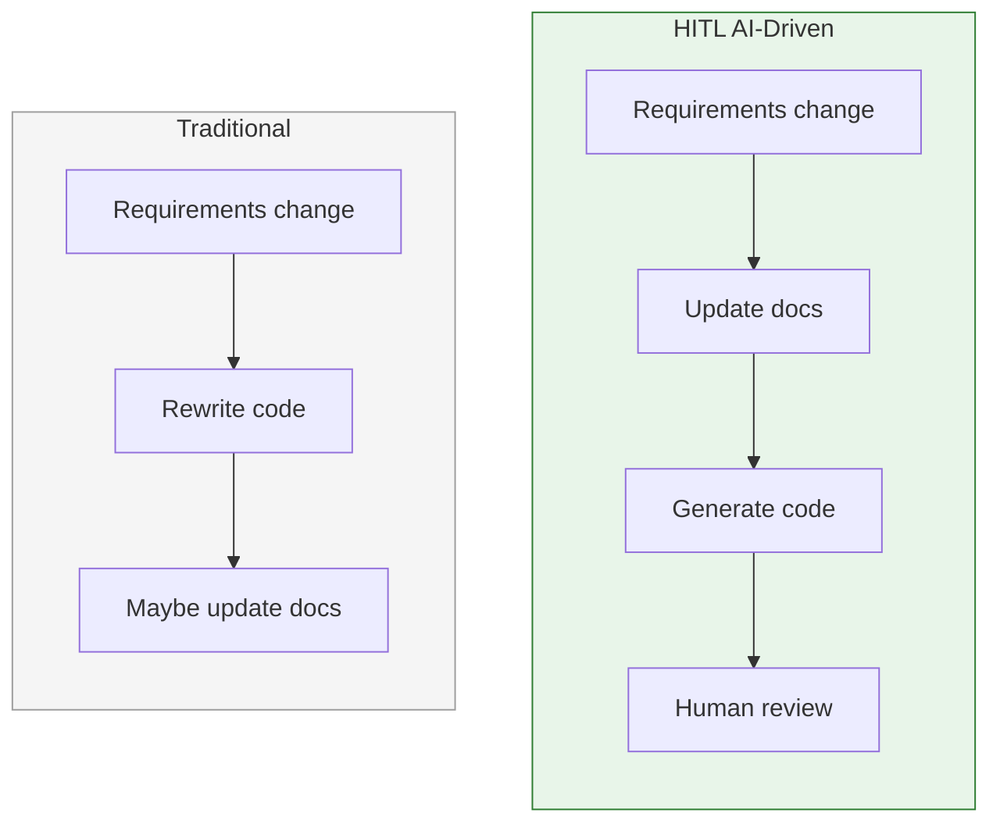
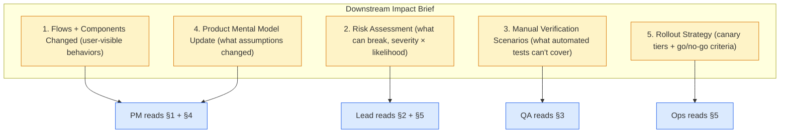
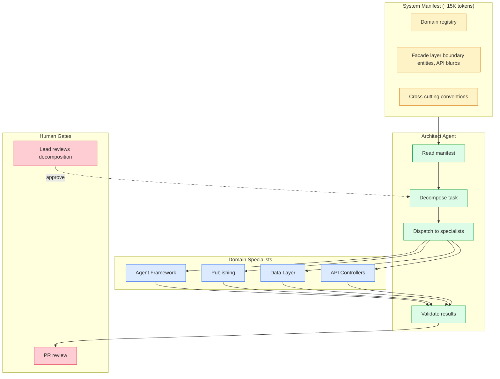

## Pre-publish checklist

**Anonymization** (see `ANONYMIZATION.md`):
- [x] No project name, vertical, customer type, team name
- [x] No specific costs, metrics, file paths, commit SHAs
- [x] No proprietary prompts or agent internals
- [x] Passed the competitor test

**Tone**:
- [ ] No criticism of people, teams, or vendors
- [ ] Framed as tradeoff, not "right vs wrong"
- [ ] Sounds like "here's what worked for me", not "this is THE answer"
- [ ] At least one counterargument acknowledged per section

**Form**:
- [x] Leads with TL;DR
- [x] Mermaid diagrams where appropriate
- [x] Tables for structured comparisons
- [x] Blockquotes for key insights

---

## The Core Idea

The team — PM, Dev Lead, Developers, and AI — discusses every design decision together. Once a decision is finalized, it's captured in documentation: HLDs for architecture, LLDs for component design, ADRs for trade-offs, and a System Manifest for domain boundaries. From that point forward, **all downstream activities — code generation, testing, code review, deployment planning, and ROI verification — are driven off that documentation.** The documentation is not a record of what was built. It's the specification that drives what gets built.

This inverts the traditional relationship between docs and code. In most teams, documentation is written after the code (if at all) and drifts almost immediately. In this process, documentation is written first — with AI's help, in minutes rather than weeks — and the code is generated from it. When the code diverges from the docs, the docs are updated to match, not the other way around. The docs are the source of truth. The code is a derivative.

The result: any developer (or AI session) can pick up any part of the system, read the docs, and produce correct, convention-honoring code — because the docs capture not just *what* the system does, but *why* it does it that way, *what alternatives were considered*, and *what conventions must be followed*.


---

## TL;DR

- **Design decisions are discussed as a team, then captured in documentation. Everything downstream — code, tests, reviews, deployment — is driven off those docs.** The docs are the source of truth; the code is generated from them.
- We built a 22-step workflow (20 to merge + 2 post-ship verification) where AI does the production work and humans hold gates at every decision point. This includes **downstream impact assessment** for stakeholders and **ROI estimation with 30/90-day verification** to confirm changes deliver expected value. The term for this is **HITL AI-driven**.
- As the system grew past what one agent context window could hold, we needed a **hierarchical knowledge architecture** — a System Manifest that gives agents scoped context instead of everything-or-nothing.
- Quality improvement on closed-API models (where you cannot fine-tune) is still possible through **prompt-level techniques**: best-of-N sampling, bandit-routed model selection, and HITL preference datasets.
- The biggest barrier to adopting this process is cultural, not technical. Teams need docs discipline before they can do docs-first AI development.
- **Brownfield projects don't need months of documentation work to start.** An architect working with AI can produce a complete documentation baseline — system manifest, HLDs, LLDs, ADRs — in one week. The bottleneck is the architect's review capacity, not the writing. Weekly re-runs keep the baseline current.
- We got several things wrong along the way, and the process is still evolving. This article describes what we figured out, not what we recommend as universal truth.

---

## 1. The Starting Point

We work in a domain that moves weekly. Competitors ship new AI features on tight cycles. Frameworks release breaking changes monthly. If the team builds the traditional way — write code by hand, maintain it indefinitely, refactor when requirements shift — the system is perpetually six months behind the market.

That was the constraint: **we needed an approach where changing the entire system takes days, not months.**

We started, like most teams, by handing developers AI coding assistants and saying "use these." What happened was predictable in hindsight:

**Convention drift.** Different developers used different prompts, different context, different amounts of specification. The AI-generated code from one session didn't match the patterns from another. Within two weeks, the codebase had three different error handling strategies, two naming conventions for the same concept, and a service layer that was half dependency-injected and half module-level singletons.

**Untraceable decisions.** When someone asked "why does this work this way?", the answer was "the AI generated it." The actual design decision — the tradeoff, the alternatives considered, the constraints that drove the choice — existed only in a chat transcript that nobody could find. There was no link from the code back to the reasoning.

**Hallucination from under-specification.** The AI tools were given broad instructions ("implement campaign publishing") without precise context about the existing system. They generated plausible but wrong code — functions that called APIs that didn't exist, models that duplicated fields from other models, integration patterns that contradicted the architecture. The code *looked* right, compiled, even passed naive tests. The bugs showed up in integration.

**Hallucination from over-specification.** When we overcorrected by dumping entire codebases into context, different failure modes appeared. The AI would make connections between unrelated modules, "helpfully" modify code outside its scope, or produce outputs that mixed patterns from different domains. More context was not better — it was differently wrong.

These aren't unique problems. They're the standard failure modes of unstructured AI-assisted development, and every team using these tools at scale hits them. The question was whether we could structure things so the AI's production capacity was *constrained* to produce correct output most of the time, with humans catching the rest at well-defined gates.

## 2. The Core Insight: Documentation Drives Code

The breakthrough — though "breakthrough" overstates it; it was more of a slow realization — was that **design documents are no longer documentation. They're the input to code generation.** The precision of the Low-Level Design (LLD) determines the precision of the generated code.

This inverts the traditional flow:



Here is the part that surprised us: the economics of writing detailed design docs completely change when AI writes both the docs and the code.

The traditional argument against detailed LLDs was "they're outdated by the time the code is written." That argument assumed a human was writing both, sequentially, over weeks. When AI drafts the LLD in a 15-minute conversation with the developer, and then generates code from that LLD in the next session, the "outdated" problem disappears. The doc is written minutes before the code, not months.

We tracked the output over the first two weeks of using this approach:

| Output | Volume | Time |
|--------|--------|:----:|
| Architecture + design docs | 35 (HLD + LLD) | ~6 days |
| Data mapping + API contracts | 7 docs | 1 day |
| Backlog | 32 stories, 125 tickets | 1 day |
| Working code (foundation sprint) | 13 models, 5 controllers, 79 tests | 3 days |
| **Total** | **58 docs + working code** | **~2 weeks** |

The key proof point came later: **adding a new monitoring agent touched 12 documents and took 2 hours** — not two sprints. The documentation was precise enough that code generation was fast and correct on the first pass.

> The LLD is not a document for humans to read. It's a prompt for AI to execute. Treat it that way: precise interfaces, explicit edge cases, exact method signatures. Vague prose produces vague code.

A few teams we've talked to pushed back on this: "That sounds like waterfall." It is, in the sense that design precedes implementation. The difference: the design takes 30 minutes, not 3 weeks, because AI helps write it too. And if the implementation diverges, you update the doc — the doc stays the source of truth, not the code.

Where we're less sure: this works best when the framework and language are stable. For genuinely exploratory work — where the API is being discovered through prototyping — we haven't found a good doc-first pattern yet. Those are the cases we still approach with freeform code and document afterward.

## 3. The Full Workflow — Step by Step

The workflow has 20 steps. That sounds heavy, and for truly small changes (a one-line config fix), it is. We'll talk about where the process breaks down in Section 8. For non-trivial changes, the 20 steps are the minimum we've found that prevents the failure modes described in Section 1 — including the organizational failure modes (team's mental model is wrong, ops doesn't know how to deploy safely) that most AI-dev processes ignore.

### The Pipeline View

Each shippable unit — we call them "showcases" internally, meaning a vertical slice of backend + frontend + tests + docs — goes through this pipeline:

```mermaid
graph LR
    subgraph Pipeline["Shippable Slice"]
        direction LR

        subgraph Requirements["Requirements"]
            R1["Issue"]
            R2["Design spec (if exists)"]
        end

        subgraph Design["Design"]
            D1["Impact Analysis"]
            D2["HLD/LLD + Test Plan"]
            D3["IaC"]
        end

        subgraph Build["Build"]
            B1["Code"]
            B2["Review Round 1"]
            B3["Tests"]
        end

        subgraph Verify["Verify"]
            V1["Review Round 2"]
            V2["Rerun Tests"]
            V3["Reconcile Docs"]
        end

        subgraph Assess["Assess"]
            A1["Downstream Impact"]
            A2["Risk + Rollout Plan"]
        end

        subgraph Ship["Ship"]
            S1["PR"]
            S2["Integration Verify"]
            S3["Canary Deploy"]
            S4["Promote / Rollback"]
        end

        Requirements --> Design --> Build --> Verify --> Assess --> Ship
    end

    style Pipeline fill:#fafafa,stroke:#616161
    style Requirements fill:#e3f2fd,stroke:#1565c0
    style Design fill:#e3f2fd,stroke:#1565c0
    style Build fill:#e8f5e9,stroke:#2e7d32
    style Verify fill:#fff3e0,stroke:#e65100
    style Ship fill:#ffcdd2,stroke:#c62828
```



### The 16 Steps Explained

Here is what happens at each step, and who does what:

1. **GitHub Issue** — Describe the change, root cause, proposed solution. This is the only step where a human writes from scratch (and even here, AI helps draft it).

2. **Design spec review** (conditional) — If a visual design exists, extract requirements, interactions, and visual specs into the issue. This feeds into both the design phase and the final verification.

3. **Impact analysis** — AI analyzes the existing docs to identify affected components, APIs, configs, and dependencies. The developer reviews the analysis and corrects it. This is where convention drift gets caught early — the AI reads the *whole* doc set, something no human does consistently.

4. **Update docs** — HLD, LLD, design decisions, test cases — all updated *before* code. AI drafts the updates; the developer reviews and corrects. This is the highest-leverage human step: 15 minutes of review here saves hours of rework later.

5. **Update IaC** — Infrastructure manifests, migrations, configs. If the change needs a new secret, a new cron job, a new database migration, it's captured here, not as a "oh wait, we also need..." after the code is written.

6. **Test case planning** — Before writing any code, the team produces a test plan: new tests needed, existing tests to update, obsolete tests to remove, regression tests that must still pass. This locks in what "done" means.

7. **Training plan stub** (conditional) — If the change introduces a new technical capability (a new framework, a new architectural pattern, a new ML technique), a training plan is drafted alongside the design docs. This ensures the team can ramp on the new capability without rediscovering it from the code. When the change doesn't introduce a new capability, this step is skipped explicitly.

8. **Code generation** — AI generates code from the updated LLD + test plan. The developer reviews and corrects.

9. **Code review Round 1** — AI reviews the generated code for structure, security, and LLD adherence. This happens *before* tests, so structural problems are caught before test effort is invested. Critical and high findings are fixed before proceeding.

10. **Test changes** — AI generates tests from the test plan. Developer reviews.

11. **Run full test suite** — All tests must pass.

12. **Code review Round 2** — AI reviews again, this time for edge cases, regressions, and completeness. The focus is different from Round 1 — Round 1 catches shape problems, Round 2 catches behavior problems.

13. **Rerun tests** — After Round 2 fixes, confirm no regressions.

14. **Reconcile docs** — If the implementation diverged from the design (it always does, at least slightly), update the docs. The docs stay the source of truth.

15. **Create PR** — Links to the issue, includes docs + IaC + code + tests in the same PR.

16. **Downstream impact assessment** — Before asking anyone to review, the developer (with AI assistance) produces a structured impact brief for every stakeholder group affected by this change. This is NOT the same as the step-3 impact analysis (which identifies affected *code*). This step identifies affected *people and processes*. The brief answers five questions:

    - **What flows and components change?** — A concrete list of user-visible behaviors that are different after this change. Not code paths — user journeys. "Campaign creation now asks for a TikTok account ID" is useful; "`campaigns.py` line 47 changed" is not.
    - **What can break?** — Risk assessment. Which existing features could regress? Which edge cases are untested? Which integrations are fragile? Severity × likelihood matrix, not just a list.
    - **What needs to be tested beyond the automated suite?** — Manual verification scenarios that automated tests can't cover. "Verify the Instagram post appears with the correct image within 60 seconds" is a deployment-time check, not a unit test.
    - **How does the product team's mental model need to change?** — What assumptions does the PM currently hold that are no longer true? What new capabilities exist that the PM should know about for roadmap planning? Written for a non-engineer audience.
    - **How does the deployment team derisk the rollout?** — Canary deployment strategy with explicit promotion criteria (see step 19).

17. **Risk-rated rollout plan** — Based on the impact brief, produce a concrete rollout plan:

    | Risk level | Rollout strategy |
    |-----------|-----------------|
    | **Low** (cosmetic, internal-only, no external side effects) | Direct merge → deploy to all environments |
    | **Medium** (new feature, additive, no existing behavior changed) | Feature flag off by default → enable in staging → 24h soak → enable in production |
    | **High** (changes existing behavior, touches external integrations, modifies data schema) | Canary deploy to 5-10% of traffic → monitor error rate + latency + business metrics for 4h → promote to 25% → monitor 4h → full rollout |
    | **Critical** (irreversible side effects, billing/payment, data migration) | Canary to 1% → manual promotion gate with lead sign-off at each step → 24h soak at each tier → rollback plan tested before promotion |

    Each promotion step has explicit **go/no-go criteria**:
    - Error rate delta < 0.1% vs baseline
    - p95 latency delta < 50ms vs baseline
    - No increase in Langfuse `failure_mode` scores
    - No increase in HITL rejection rate (for agent changes)
    - Business metric (campaign publish success rate, email delivery rate) within 2% of baseline

    If any criterion fails, the rollout pauses and the team investigates before promoting. The rollback path is always "revert the canary, full traffic returns to the previous version."

18. **Integration verification** — The team lead runs the feature end-to-end, verifies intent matches the design, checks traceability, and reviews the downstream impact brief for completeness. If a visual design exists, compare screen-by-screen. The lead also confirms the rollout plan matches the risk level.

19. **Canary deploy** — Deploy to the staging environment first, then canary to production per the risk-rated plan from step 17. The deployment team monitors the go/no-go criteria at each promotion step. AI assists by summarizing Langfuse traces, error rates, and latency distributions for the canary cohort vs baseline.

20. **Promote or rollback** — If all criteria pass at each tier, promote to full production. If any criterion fails, rollback to the previous version, open a follow-up issue with the failure details, and re-enter the workflow at step 3 (impact analysis) for the fix. The rollout plan, promotion decisions, and any rollback events are documented on the GitHub issue as comments — the same "conclusions flow back to GitHub" principle from the rest of the process.

### The Two-Round Code Review

The two-round pattern deserves a note. Most teams do code review after tests pass. We split it because the two rounds look at genuinely different things:

| | Round 1 (pre-test) | Round 2 (post-test) |
|---|---|---|
| **Focus** | Structure, security, spec adherence | Edge cases, regressions, completeness |
| **What it catches** | Design-level problems | Behavior-level problems |
| **When it saves time** | Before test investment | After tests reveal unexpected behavior |
| **Who** | AI reviewer | AI reviewer |

Finding structural problems after tests pass means the tests are now wrong too. Round 1 catches those early. Whether this saves time overall is something we believe but haven't rigorously measured.

### The Design Spec Bookend

If a visual design exists for the feature, it appears twice in the workflow: once at the beginning (feeding requirements) and once at the end (verification). The design is both the input and the acceptance criteria. This prevents the common drift where the implemented feature gradually diverges from the original intent as the developer makes "small" adjustments during implementation.

### The Training Plan Requirement

When a change introduces a genuinely new technical capability — a new framework, a new architectural pattern, a new ML technique — we require a training plan alongside the design docs. The trigger list:

- A new architectural pattern (e.g., bandit routing, plan-mode tools)
- A new external system integration
- A new framework or primitive
- A new ML/AI technique
- A significant refactor that changes how engineers reason about a subsystem

The plan follows a modular structure: 30-60 minute modules, each with reading list, key concepts, hands-on exercise, and checkpoint questions. The lead drafts the stub during design; the developer fills in working examples after implementation.

What's NOT required to have a training plan: new endpoints on existing controllers, bug fixes, refactors that preserve the existing mental model, test-only or doc-only changes.

### ROI Estimation — Every Technical Change Has a Measurable Thesis

Before a technical change enters the build phase, it needs a measurable thesis: what value will this add, and how will we know? This isn't a business case with spreadsheets — it's three concrete statements in the GitHub issue:

1. **The expected outcome** — specific and falsifiable. "Best-of-N sampling should improve `self_eval/overall` by 15-25% within 30 days" is good. "Best-of-N will improve quality" is not — it can't be proven wrong, so it can't be verified.

2. **The baseline metric** — the current value of whatever you're trying to improve. Measured before the change ships, not estimated. "Current `self_eval/overall` mean = 0.72 (last 30 days from the observability dashboard)."

3. **The measurement plan** — how and when you'll check. "Compare 30-day rolling mean, same agent, same task type, before vs. after rollout. 30-day checkpoint on May 10, 90-day checkpoint on July 10."

These go in a dedicated "ROI Estimate" section on the issue, written during the design phase. The section also includes: expected cost (build + ongoing + maintenance), and critically, **what happens if ROI isn't realized** ("disable the feature and reallocate compute budget to prompt optimization").

| Value dimension | Example changes | How to measure |
|----------------|----------------|----------------|
| **Quality** | Best-of-N sampling, context compression | Eval score lift, HITL rejection rate |
| **Reliability** | Retry policy, idempotency, DLQ | Error rate, incident count, MTTR |
| **Developer velocity** | System manifest, training plans | Time-to-first-PR, rework rate, PR cycle time |
| **Cost efficiency** | Model routing optimization, prompt caching | Cost per generation, tokens per output |
| **Risk reduction** | Brand isolation, canary deployment | Blast radius, cross-tenant events, rollback frequency |

Most changes target one primary dimension. Name it explicitly — it determines which metrics you track.

**After the change ships**, verification happens at two checkpoints:

- **30 days**: Is the metric moving in the right direction? On track / inconclusive / off track.
- **90 days**: Did it achieve the expected magnitude? The lead + PM review actual vs. estimated ROI. The outcome — whether positive, partial, or negative — is documented in the ADR as an "Actual Outcome" section, right alongside the original estimate.

The 90-day reviews create a calibration loop: the team learns whether it systematically overestimates value, underestimates cost, or misses the timeline. Over 5-10 verified changes, the estimates get measurably better — because each one is compared to reality, not just filed and forgotten.

> **The uncomfortable truth about ROI verification:** sometimes the answer is "this didn't work." A feature that cost two weeks to build and shows no improvement at 90 days should be reverted or rearchitected, not defended. The ROI checkpoint makes that decision explicit rather than letting underperforming features accumulate silently.

### The Downstream Impact Assessment

This step deserves its own discussion because it solves a problem that most AI-assisted development processes ignore entirely: **the people downstream of the code change need to understand what happened and why.**

When AI generates code at high velocity, the blast radius of each change increases. A developer using AI can produce in a day what previously took a sprint — but that also means the product team, QA, ops, and customer support need to absorb a sprint's worth of changes in a day. If they don't, you get a different class of problems: the code is correct but the team's mental model is wrong, leading to mis-prioritized roadmap items, missed regression scenarios, and deployment incidents that the ops team didn't anticipate.

The impact brief has five sections, each aimed at a different stakeholder:



**Section 4 — the mental model update — is the one teams most often skip and most often regret skipping.** Example: if you change the campaign approval flow so that "approved" no longer triggers publishing (instead it queues for scheduled delivery), the PM's mental model of "approve = publish" is now wrong. Every roadmap discussion, every customer promise, every support playbook that assumed "approve = publish" is silently incorrect. Writing "approve now queues for scheduled delivery instead of publishing immediately" in the impact brief takes 30 seconds and prevents weeks of downstream confusion.

> **The impact brief is not about protecting against technical risk.** Tests and code review handle that. The brief is about protecting against **organizational risk** — the risk that the humans around the code don't understand what changed.

**Who writes it**: the developer, with AI assistance. AI can draft the flows/components section from the diff and the risk section from the test plan. The mental model section requires human judgment — you need to know what assumptions the PM holds, which AI doesn't.

**When it's reviewed**: by the team lead during integration verification (step 18). The lead checks: "Is this brief complete? Would the PM understand what changed from reading this? Would ops know how to deploy it safely?"

### The Canary Deployment Strategy

The rollout plan at step 17 is risk-rated — not every change gets the full canary treatment:

| Risk level | Example | Rollout |
|-----------|---------|---------|
| **Low** | CSS fix, copy change, internal doc update | Direct deploy |
| **Medium** | New feature behind feature flag, additive endpoint | Flag off → staging → 24h soak → production |
| **High** | Changed existing behavior, external integration, schema migration | Canary 5-10% → 4h monitor → 25% → 4h → 100% |
| **Critical** | Irreversible side effects, billing, data migration | Canary 1% → manual gate each step → 24h soak per tier |

Each promotion step checks explicit go/no-go criteria: error rate delta, latency delta, business metric delta (e.g., campaign publish success rate), and failure-mode score trends from the observability layer. If any criterion fails, the canary pauses — not rolls back immediately, but pauses so the team can investigate. Most "failures" turn out to be noise or pre-existing; automatic rollback on noise creates churn.

The criteria are calibrated to the specific change, not universal thresholds. A change to the payment flow has tighter thresholds than a change to a dashboard component. The developer proposes the criteria in the rollout plan; the lead reviews them during integration verification.

> **Canary deployment is not new.** What's new is making it a formal step in the dev workflow with AI-generated monitoring summaries. AI reads the observability dashboards during the canary window and produces a go/no-go recommendation — the human still makes the call, but the analysis is pre-digested.

### Worked Example: "Add a New Publishing Channel"

To make this concrete, here's how a non-trivial feature flows through the full pipeline, including the downstream assessment:

| Step | Who | What happens |
|------|-----|-------------|
| 1 | PM + AI | PM describes the need. AI drafts PRD update with user stories, acceptance criteria. PM reviews and adjusts. |
| 2 | Lead + AI | AI analyzes impact: publishing agent LLD needs a new channel, integration service needed, API contract needs new endpoint, test cases need new entries. IaC: new API secret required. Lead opens Design PR with all changes. |
| 3 | Team | Developers review Design PR. Dev A checks the publishing LLD. Dev B checks the API contract + frontend impact. Discussion in PR comments. PR merged — design locked, code generation begins. |
| 4 | Dev A + AI | Refines the publishing LLD section, AI generates test plan + integration code + tests. Dev reviews, corrects API specifics. |
| 4 | Dev B + AI | Refines the frontend section, AI generates the UI component. Dev reviews, adjusts. |
| 5 | Both devs | Integrate: frontend calls new endpoint, publishing agent routes to new channel. Test together. Fix integration issues. |
| 6 | AI | Reviews both PRs against LLD + test plan. Flags missing error handling on rate limits, catches that tests don't cover a specific format. Devs fix. |
| **7** | **Dev A + AI** | **Downstream impact brief**: (1) Flows changed: campaign creation now shows a new channel option; publishing agent routes to new API. (2) Risk: new API has stricter rate limits than existing channels — could hit 429s under burst load. (3) Manual verification: publish a real post to the new channel and verify it appears within 60s. (4) PM mental model update: "publishing now supports 3 channels, not 2; the new channel has a daily post limit of 100." (5) Rollout: HIGH risk (new external integration) — canary 10% → 4h monitor → promote. |
| **8** | **Dev A** | **Rollout plan**: canary criteria — error rate < 0.5%, publish success rate > 95%, new channel API 429 rate < 2%. Rollback: revert canary, traffic falls back to existing channels only. |
| 9 | Lead | Reviews traceability + impact brief + rollout plan. Confirms the PM mental model section is clear. |
| 10 | Ops + AI | Canary deploy to 10%. AI monitors dashboards for 4h, produces go/no-go summary. Lead reviews. |
| 11 | Lead | Promotes to 100%. |
| 12 | Team to PM | Demo. PM: "Looks good, but add video format support." Back to step 1 for next iteration. |

**Total time: days, not sprints.** The downstream impact brief added ~30 minutes to the process. The canary monitoring added ~4 hours of wall-clock time (mostly waiting, not working). Both prevent classes of problems that would otherwise take days to diagnose and fix.

## 4. Roles in the Process

The process changes every role's day-to-day work. Not in the "learn a new tool" sense — in the "your job is fundamentally different" sense.

| Role | Traditional Job | HITL AI-Driven Job |
|------|---|---|
| **PM** | Writes PRDs, manages backlog | Reviews AI-drafted PRDs, decides what to build, creates/reviews mockups |
| **Dev Lead** | Writes architecture docs, reviews code | Reviews AI-generated architecture, verifies traceability, integration-tests features |
| **Developer** | Writes code, writes tests, writes docs | Reviews AI-generated code/tests/docs, corrects domain logic, owns vertical slices |

The mindset shift table is blunt:

| Old habit | New expectation |
|-----------|----------------|
| Write docs by hand | AI writes all docs. You review, correct, approve. |
| Start coding, figure it out as you go | Tell AI what you need. AI generates the LLD. You review. AI generates code. You review. |
| Docs after the feature ships | Docs first. AI drafts them in minutes. You spend time thinking, not typing. |
| One developer owns a feature end-to-end | The *doc* owns the feature. Any developer (or AI session) can pick it up. |

> You are a reviewer and decision-maker, not a typist. If you're typing more than a few sentences of correction, you're doing it wrong. Let AI draft; you steer.

### The Dev Lead's Integration Verification

The lead's final verification step exists because AI code review, even in two rounds, catches *mechanical* issues but misses *intent* issues. The lead runs the feature end-to-end and asks: "Does this actually do what the design said it would?" They check traceability: requirement, design, IaC, code, tests — is the chain unbroken? This catches the cases where each individual piece is correct but the whole doesn't match the intent.

### Vertical Ownership

Every developer owns a full vertical slice — not "the frontend part" or "the backend part." If you're building the monitoring feature, you own the doc, the backend endpoint, the frontend component, the tests, and the bugs. When one person owns the full slice, there's no "it works on my side" across teams. AI helps you move fast across layers you're less familiar with; teammates help with review.

## 5. Hierarchical Agent Knowledge — Scaling AI Beyond One Conversation

### The Problem

This process worked well when the system was small. A single AI session could hold the full context — all the docs, all the code, all the patterns — and produce correct output. But systems grow. Ours reached 50+ source modules, 33 LLDs, 14 HLDs, 55 architectural decisions, 300+ tests. No single context window could hold all of it productively, and even if it could, most of the content was noise for any given task.

The two failure modes from Section 1 reappeared at scale:
- **Agent reads too much** — hallucinated connections between unrelated modules, made changes outside its scope.
- **Agent reads too little** — violated conventions it didn't know about, produced interfaces that didn't match what other parts of the system expected.

### Conway's Law Applied to AI Agents

Conway's Law (1967): "The structure of a system mirrors the communication structure of the organization that builds it."

The Inverse Conway Maneuver: "Design the communication structure you want, and the system structure will follow."

Applied to AI: **design the knowledge boundaries explicitly, and the quality of agent output mirrors those boundaries.** Scoped agents with clean facades produce modular, convention-honoring output. Unshaped agents with unlimited context produce monolithic, inconsistent output.

### The System Manifest

We introduced a **System Manifest** — a single YAML file checked into the repo that describes the system at three levels of detail:

| Level | What it captures | Who reads it | Size per domain |
|-------|-----------------|-------------|-----------------|
| **Topology** | Domain boundaries, dependency graph, convention assignments | Architect agent only | ~200 tokens |
| **Facade** | Boundary entities, API blurbs, mutation descriptions, preconditions, error modes, events | Architect + any specialist that interacts with this domain | ~500-1500 tokens |
| **Internals** | Source code, test files, LLD detail | Only that domain's specialist | ~5K-30K tokens |

The manifest contains levels 1 and 2. Level 3 (internals) is loaded on demand from the actual source files.

**Why YAML and not a knowledge graph?** Simpler to author, version, diff, and review in a pull request. A knowledge graph would be more powerful for complex cross-domain queries, but harder to maintain. We'd revisit this if cross-domain queries become too complex for flat YAML — that hasn't happened yet.

**Why three levels, not two?** Two levels (manifest + source) would force the architect to either include all source code (back to "reads too much") or include no cross-domain information (specialists can't honor interfaces). The facade level is the resolution: **enough to call correctly and reason about side effects, not enough to understand the internal implementation.** Same principle as a Java or Go interface — the contract, not the body.

### The Architect/Specialist Pattern

The architecture works like this:



1. **Architect reads the manifest** (~15K tokens) and decomposes the task into scoped task packets.
2. **Human gate**: the lead reviews the decomposition before execution.
3. **Specialists receive task packets** that include exactly the files they need, exactly the conventions to follow, exactly the facades of adjacent domains — and explicit boundaries on what they must *not* modify.
4. **Specialists return result packets** that include files created/modified, conventions honored, interface compliance checks, and cross-cutting discoveries.
5. **Architect validates** interface compliance, propagates cross-cutting discoveries, and updates the manifest.

Specialists are stateless. They re-read their domain files each activation. This is simpler and more reproducible than maintaining warm state, and the cost is acceptable — reading a few source files is cheap compared to re-reading the whole codebase.

### Facade-Level Interop

The facade is how disjoint agents know about each other. When the publishing specialist needs to interact with the agent framework, it doesn't read the framework's source code. It reads a blurb like:

> *"The tool loop in the base agent calls your tool via tool.execute(**args). It expects a ToolResult back. brand_id is auto-injected if not in args."*

That's enough to produce a correct integration. The specialist doesn't need to understand the framework's internal state machine — just its boundary contract. This is the same principle as microservice API contracts, applied to AI agent context.

## 6. Continuous Quality Improvement Without Fine-Tuning

A hard ceiling exists when using closed-API models (the major commercial LLM providers): **you cannot fine-tune the model on your domain data.** No RLHF, no DPO, no adapter layers. The model is what the provider ships.

This doesn't mean quality is static. Several techniques work at the prompt and routing level:

**Best-of-N sampling.** Generate N candidate outputs, score each with an LLM judge, return the best. This trades compute cost for quality — and for high-value outputs (a marketing campaign that represents the brand), the tradeoff is worth it.

**Thompson-sampled model routing.** Maintain a Bayesian posterior over model performance per task type. Route each request to the model most likely to produce the best output based on historical performance. As quality scores accumulate, the router naturally gravitates toward the best model for each task category.

**HITL preference datasets.** When humans approve, edit, or reject agent outputs, those signals become preference pairs: (chosen output, rejected output) for the same input. These pairs feed into prompt refinement and eval function tuning — and if a fine-tunable model is ever adopted, they become the training dataset.

**Eval-driven prompt iteration.** Every agent output is scored against a rubric. When scores trend downward, the system flags it. The team reviews the failing traces, identifies the pattern, and updates the prompt or guardrails. The eval scores are the feedback loop, not vibes.

We mapped this into four tiers, from immediate to future:

| Tier | Technique | Requires fine-tuning? |
|------|-----------|:---------------------:|
| 1 | Best-of-N sampling + LLM judges | No |
| 2 | Thompson-sampled model routing | No |
| 3 | HITL preference dataset collection | No (collection only) |
| 4 | DPO/adapter fine-tuning (future) | Yes — when models allow it |

Tiers 1-3 are implementable today with any API provider. Tier 4 is aspirational — a hedge for the day when fine-tuning closed models becomes viable, or when we switch to an open-weight model.

The broader point: **the platform gets better with every interaction** without touching model weights. The quality improvement is real even if it's slower and more manual than true RLHF.

## 7. The AI Design Room — Collaborative Development with AI as a Participant

The process described above works, but it has a coordination problem: the steps happen in sequence across different tools — GitHub issues, design docs, code editors, PR reviews. There's no single thread where PM + lead + developers + AI are all present.

The vision we're working toward (and haven't fully built) is an **AI Design Room**: a per-feature thread where the team collaborates with AI as a participant, not just a tool.

The operating model:
- **Slack (or similar) as the working medium** — the thread where discussion, AI drafts, and human decisions happen in real time
- **GitHub as the source of truth** — every decision materializes as a commit, PR, or issue update
- **PRs as decision gates** — the thread generates artifacts, but nothing ships without PR review and merge

This is different from autonomous coding tools (which operate without human oversight) and different from simple AI assistants (which respond to individual prompts without maintaining conversation context across the team). The design room is collaborative: multiple humans and AI in one thread, with AI drafting but humans deciding.

What exists today: the workflow steps, the manifest, the role definitions. What doesn't exist yet: a unified thread experience. Today the coordination happens across Slack conversations, GitHub PRs, and separate AI sessions. Unifying that is an open project.

## 8. What We Got Wrong and What We'd Change

No point in writing a process guide without being honest about the failures.

**The integration-without-issues session.** Early on, we shipped five integrations in one session without creating GitHub issues for any of them. The code worked, the tests passed, but there was zero traceability. No link from requirements to design to code. When someone later asked "why does this integration use this retry strategy?", the answer was buried in a chat transcript. This failure directly motivated the "GitHub issue first, always" rule in step 1 of the workflow. We added a preflight check that blocks code generation if no issue is linked.

**The training plan gap.** We shipped a set of architectural decisions around reinforcement learning techniques — Thompson sampling, bandit routing, preference datasets — without creating any training materials. The designs were in the docs, the code was implemented, but no training plan existed for the team to learn the new patterns. A developer encountering the bandit router for the first time had to reverse-engineer it from code. This is exactly the problem training plans are supposed to prevent, and we failed to follow our own process. The conditional step 5a (training plan stub) was added as a direct result.

**Where the process is too heavy.** For a one-line config change, 16 steps is absurd. We don't have a clean answer for this. In practice, developers skip steps for trivial changes and nobody objects — but "trivial" is a judgment call, and sometimes what looks trivial has architectural implications that only surface later. We've discussed a "light path" (issue + code + review) for changes below some complexity threshold, but we haven't formalized it because defining that threshold reliably is hard.

**Where the process is too light.** For cross-cutting changes that affect every domain — a new convention, a framework upgrade, a security patch — the process treats it as a single pipeline. But cross-cutting changes have n-domain impact, and the pipeline's single Design PR doesn't adequately capture the review burden. The hierarchical knowledge architecture helps (the architect decomposes across domains), but the human review bottleneck at the integration verification step doesn't scale. If the lead has to verify integration across 8 domains in one PR, something's going to get missed.

**Open questions we haven't resolved:**

- How to handle genuinely exploratory work where the design emerges from the code. We believe in design-first but acknowledge there are tasks where you don't know what you're building until you build it.
- How to onboard developers who are uncomfortable with the "review, don't write" model. Some engineers derive identity from writing code. Telling them "your job is review" can feel like a demotion even when it isn't.
- How to keep the manifest accurate as the system evolves fast. The generator script helps, but human-authored blurbs (mutation descriptions, preconditions, the "IRREVERSIBLE" annotation on side effects) require judgment that can't be automated yet.
- Whether the two-round code review actually saves time compared to a single thorough review. We believe it does, but we're running on intuition, not data.

## 9. What This Means for Teams Considering AI-Native Development

If you're an engineering lead considering something like this for your team, here's what I'd suggest based on what we've learned:

**You need docs discipline first.** If your team doesn't currently maintain design docs, you can't suddenly switch to docs-first AI development. The transition is: (1) start writing docs at all, (2) make them precise enough to generate from, (3) start generating. Skipping to step 3 produces the convention drift and hallucination problems from Section 1.

**The biggest barrier is cultural, not technical.** The tools work. Claude Code, Cursor, Copilot — they all generate competent code from precise specs. The hard part is convincing a team of experienced developers that their job is now "review and correct" instead of "write." This feels threatening. It requires trust — in the tools, in the process, and in the fact that review is harder and more valuable than generation.

**Start with one change, one agent session, one manifest entry.** Don't reorganize your entire process at once. Pick one non-trivial feature, try the doc-first flow, and see what happens. If the generated code is better than what would have been written by hand, the process sells itself. If it's not, either the docs weren't precise enough or the feature isn't a good fit for this approach.

**The docs are the moat, not the AI tools.** Every team has access to the same AI models. The competitive advantage is in the documentation that makes those models produce *your* system's conventions, *your* architecture's patterns, *your* domain's edge cases. A team with 55 well-maintained architectural decisions and 33 precise LLDs will outproduce a team with better AI tools but no docs.

**Invest in evals early.** Quality scoring — even simple LLM-judge rubrics — gives you the feedback loop to improve. Without evals, you're flying blind: you don't know if the AI output is getting better or worse over time, and you can't compare the effect of process changes. Eval infrastructure is boring to build but transformative to have.

**Accept that the process will evolve.** We've modified ours significantly since the first version. Steps were added (the training plan requirement), steps were reordered (two-round review), and entire concepts were introduced late (the hierarchical manifest). Treat your process as a living system, not a fixed standard.

> The goal is not to ship faster. The goal is to minimize the problems that come from AI-generated code — convention drift, untraceable decisions, hallucination — so the system evolves correctly. Speed is a side effect of correctness, not a goal in itself.

## 10. Brownfield Adoption: The One-Week Baseline Sprint

Everything above describes the process in its mature form. The question every team with an existing codebase asks: "We have 200K lines of undocumented code. Do we need to document all of it before we can start?"

No. An architect working with AI can produce the full documentation baseline in one week. The bottleneck is the architect's review capacity (~6-8 hours/day of focused review), not the AI's generation capacity. Here's the concrete playbook.

### What the architect brings vs. what AI handles

| Architect contributes | AI handles |
|----------------------|-----------|
| "Why" knowledge — why decisions were made, what alternatives were rejected | File inventory, directory scanning, import graph |
| Domain boundary judgment — "these two modules are actually one bounded context" | Class hierarchies, method signatures, dependency extraction |
| Risk calibration — which mutations are irreversible, which areas are fragile | Sequence diagrams, data flow analysis, convention detection |
| Tribal knowledge — "don't change X without Y," "the vendor API lies about its rate limits" | Formatting, cross-referencing, producing consistent doc structure |

Everything in the right column is mechanical. Everything in the left column requires someone who has lived with the system. That's why this takes a week with an architect and wouldn't work with a junior developer — the judgment is the bottleneck, not the typing.

### Day-by-Day Sprint Plan

**Day 1 — System manifest from code**

The architect points AI at the codebase root and works through these steps:

1. AI scans the directory tree and import graph, produces a draft domain boundary map
2. Architect corrects: "billing and payments are one domain, not two" / "this utils folder is actually three unrelated domains"
3. AI generates the full manifest: file lists per domain, dependency graph, cross-cutting convention detection (from decorators, base classes, shared patterns)
4. Architect fills in the judgment-dependent fields: mutation descriptions ("IRREVERSIBLE"), preconditions, risk notes, and the "DO NOT MODIFY WITHOUT" warnings for fragile areas

End of Day 1: a working system manifest — ~80% accurate, 100% coverage.

**Days 2-3 — HLDs from infrastructure + architecture**

AI reads deployment configs, database schemas, network policies, and the service layer to produce system-level architecture docs. Five to eight HLDs covering:

- System architecture (components + deployment topology)
- Data architecture (entity relationships, tenant isolation, data flow)
- Service/agent architecture (how components interact)
- Security posture (auth, secrets, network boundaries)
- Observability (logging, tracing, metrics)

The architect reviews each HLD for 30-60 minutes, correcting factual errors and adding the "why" that code can't tell you: "we chose Redis for sessions because of the connection pool exhaustion incident in Q3."

**Days 3-4 — LLDs from source code**

AI generates one LLD per domain from the manifest's file list:

- Extract class hierarchy, public methods, state machines, error handling patterns
- Produce class diagrams, method signature tables, sequence diagrams for key flows
- Cross-reference facade APIs from adjacent domains

The architect reviews in priority order: hot domains first (the ones the team changes weekly), cold domains last. Cold domains get marked "DRAFT — not reviewed" rather than holding up the sprint.

**Days 4-5 — ADRs from tribal knowledge + forensics**

This is the most valuable day. Two sources of ADRs:

*Architect-driven* — the architect tells AI about each significant decision: "We use JWT with 15-minute expiry because of the session fixation audit in 2024." AI formats it as an ADR with context, decision, alternatives, consequences. These are high-confidence because they're verified by the person who made or witnessed the decision.

*AI-forensic* — for decisions nobody remembers, AI produces an inferred ADR: "Based on the code, this system uses eventual consistency for campaign metrics via a background poller rather than real-time aggregation. The likely rationale was latency reduction under load. NEEDS VERIFICATION." These are lower-confidence but still useful — they surface implicit decisions that would otherwise remain invisible.

**Day 5 afternoon — Process setup + first real change**

Commit everything, set up the manifest generator as a CI action, and apply the full 20-step process to one real change as a proof-of-concept. This is the moment the team sees the process work end-to-end against their actual codebase.

### The Quality Curve

The docs won't be perfect on day 5. They don't need to be.

| Timeframe | Accuracy | What drives improvement |
|-----------|----------|------------------------|
| Day 1 (manifest) | ~80% | Architect review |
| Day 5 (full baseline) | ~70% overall | Mix of architect-verified (90%) and AI-drafted (60%) |
| Week 2 | ~75% | First weekly re-run corrects drift + first real changes improve hot-path docs |
| Month 1 | ~85% | 10-15 changes have each corrected their area's docs |
| Month 3 | ~95% | Hot paths are battle-tested; cold paths filled in deliberately |

The key insight: **70% accurate docs on day 5 are infinitely more useful than 100% accurate docs on month 6.** The process corrects the remaining 30% through natural use — every change that follows the workflow is a correction pass on the affected area's docs.

### The Weekly Delta Re-run

After the baseline sprint, the manifest generator runs weekly (or on every merge to main) and produces a delta report:

```
Manifest drift report — week of April 14:

NEW FILES not in manifest:
  + app/integrations/tiktok.py → suggested domain: publishing

DELETED FILES still in manifest:
  - app/services/old_billing.py → remove from services domain

CHANGED INTERFACES:
  ~ ModelRouter.generate() — new parameter: temperature
    → update facade signature

CONVENTION DRIFT:
  ! app/integrations/tiktok.py uses retry logic but doesn't use
    the shared retry helper
    → possible convention violation
```

The architect reviews the delta (~15 minutes/week), accepts or rejects suggestions, and the manifest stays current. The re-run catches what the process misses — files added without updating the manifest, conventions that drifted silently, interfaces that changed without updating the facade description.

### Handling the "Nobody Knows Why" Areas

Every brownfield codebase has areas where the original author left and the code works but nobody understands it. Don't try to document these with false confidence. Instead:

```yaml
legacy_billing:
    purpose: "Legacy billing integration — poorly understood"
    files: [app/billing/]
    facade_apis:
      note: >
        DO NOT modify without full manual regression testing.
        No LLD exists. Original author (departed Q2 2024)
        did not document the reconciliation logic. Any change
        requires a senior engineer + the finance team in the room.
    conventions:
      - "Changes to this domain skip AI code-generation and are written by hand"
```

Documenting "we don't understand this" is MORE valuable than a wrong LLD. It prevents an AI agent from confidently generating code in an area where confidence is unwarranted. The manifest entry functions as a warning sign, not a guide.

### The Expedited Path for Production Incidents

The 20-step process is for planned work. Brownfield projects have production incidents that can't wait:

| Urgency | Process | Documentation requirement |
|---------|---------|--------------------------|
| **P0** — system down | Fix first. Create the issue retroactively. | Write the LLD for the affected area within 48 hours as a follow-up PR. The post-incident doc is often the BEST documentation — it's grounded in real failure. |
| **P1** — significant but not blocking | Abbreviated: issue → minimal impact analysis → code → test → PR. | Write the LLD during PR review, not before. |
| **P2+** — everything else | Full 20-step process. No shortcuts. | Standard docs-before-code flow. |

The retroactive documentation from P0/P1 fixes is surprisingly valuable. It captures failure modes, edge cases, and "never do this" knowledge that proactive documentation misses because nobody anticipated the failure.

### Common Objections

| "We don't have time to write docs" | You're not writing them — AI is. You're reviewing. 15-30 minutes per change. The architect's one-week sprint produces more docs than most teams write in a year. |
|---|---|
| "Our code changes too fast for docs to stay current" | The docs change WITH the code in the same PR (step 14: reconcile docs). The weekly delta re-run catches anything that slipped. |
| "The AI won't understand our legacy code" | It doesn't need to understand all of it. It needs the manifest (domain boundaries + facades) and the LLD for the area being changed. The 70% it gets right is useful; the 30% it gets wrong is what the architect corrects in review. |
| "Nobody will read the docs" | The AI reads them. That's the primary consumer. The docs are input to code generation and review, not shelf decoration. |
| "We tried documentation sprints and they didn't stick" | A documentation sprint separate from feature work is dead on arrival — it produces docs that are stale by the time features resume. This is different: the sprint produces a BASELINE, and the process keeps it current through daily work. The docs never drift because they're updated in every PR. |

### The Real Adoption Timeline

| When | What happens |
|------|-------------|
| **Week 0** | Architect + AI produce the full baseline (manifest + HLDs + LLDs + ADRs) |
| **Week 1** | Team applies the process to one real change. Retrospective: what worked, what was too heavy? |
| **Week 2** | Process is the default for all non-urgent work. Second change goes through. |
| **Month 1** | 10-15 changes have flowed through. Hot-path docs are battle-tested. New team members start onboarding from docs instead of "ask the senior dev." |
| **Month 3** | Manifest is ~95% complete. The process is muscle memory. AI-generated code quality is noticeably higher because the context is precise. |
| **Month 6** | The team can't imagine going back. The documentation IS the system, and the code is generated from it. |

> **The insight that makes brownfield adoption practical:** you don't need the documentation to exist before you start the process. You need an architect and a week. AI does the drafting. The architect does the judgment. The process keeps it current. The documentation builds itself.

---

## Further Reading

- **Conway's Law (1967)** — Melvin Conway, "How Do Committees Invent?" — the architectural principle behind the knowledge hierarchy
- **Team Topologies** (Skelton & Pais, 2019) — the modern framework for applying Conway's Law to human teams, directly applicable to AI agent boundaries
- **DSPy** (Khattab et al., Stanford) — programmatic prompt optimization, relevant to the continuous quality improvement discussion
- **LangGraph** (LangChain) — the agent framework pattern of graph-based state machines with checkpointing, relevant to HITL implementation
- **arc42** (Starke & Hruschka) — the documentation template that influenced the HLD/LLD structure described here
- **"Prompt Engineering vs. Fine-Tuning"** (various) — background on why API-only continuous learning matters as an alternative to model adaptation

---

*This is what we figured out. The process is still evolving, and we're sure there are failure modes we haven't hit yet. If you've tried something similar and it worked differently — or didn't work at all — I'd genuinely like to hear about it.*
