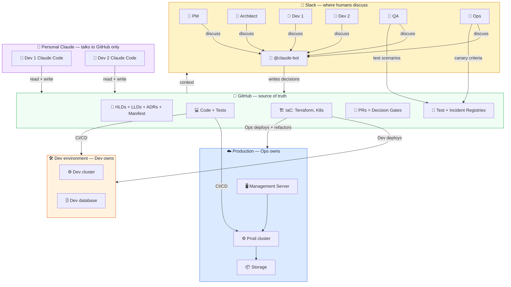
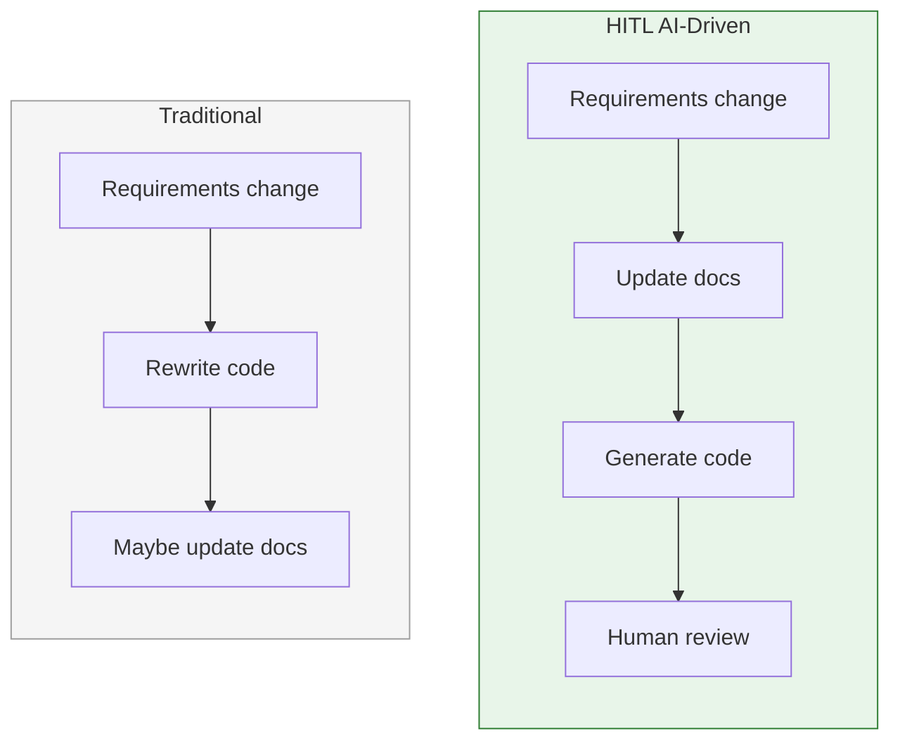
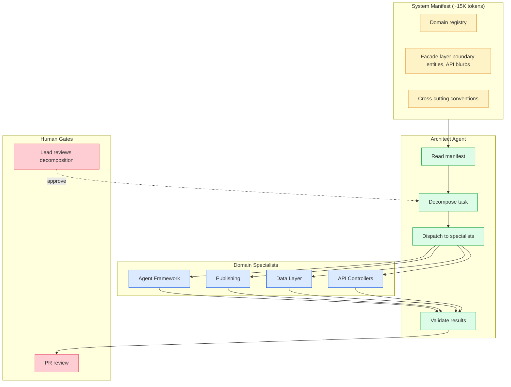
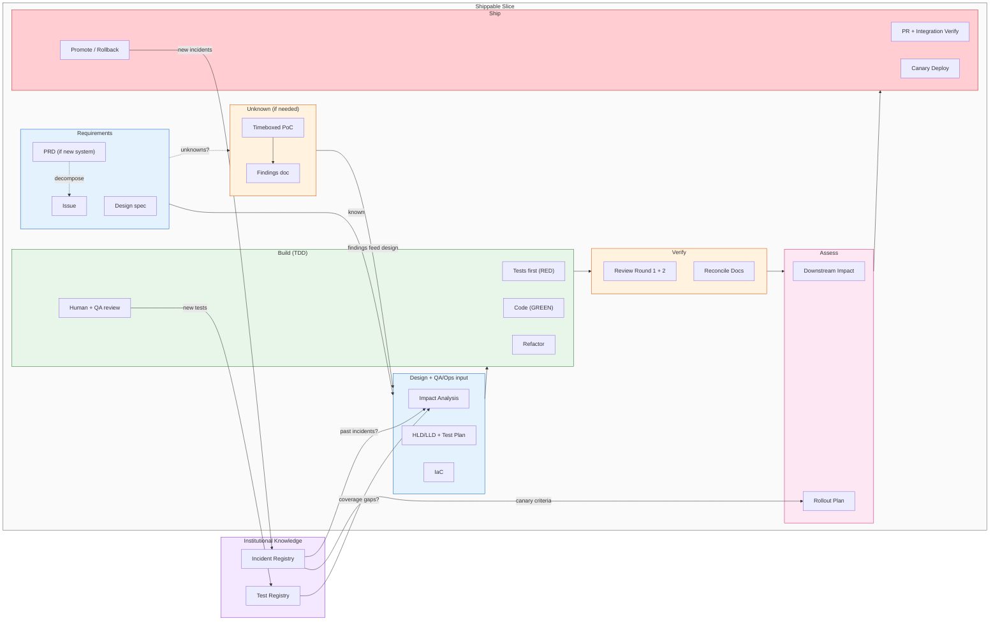
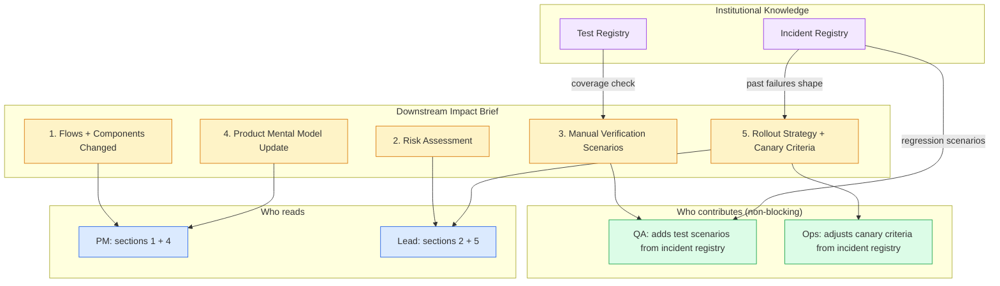

# HITL AI-Driven Development

## What this is

A document-driven delivery model for teams that use AI heavily in non-trivial software work. AI produces code faster than teams can review it — and does so confidently even when wrong. This process makes that speed safe by organizing the team around documentation as the shared source of truth. AI generates; humans shape, review, and decide.

**AI-assisted drafting works best for low-ambiguity artifacts.** For high-ambiguity work, debugging, security-sensitive design, or anything where the right answer requires judgment that the AI cannot yet reason about reliably — human-led design and writing is the better default. The process blends AI drafting with human-led work depending on what the task requires.

**Where this is especially useful:** migrations, cross-domain feature work, AI/agentic systems, regulated or high-audit environments, and platform teams introducing shared conventions. It is also useful for non-trivial features in any backend-heavy or architecture-heavy codebase.

**Where a reduced version is more realistic:** normal SaaS feature teams, internal tools, and full-stack product teams shipping weekly. For these teams, the most valuable subset is: shared AI rules, docs-first for non-trivial changes, traceability for important decisions, and explicit rollout notes for risky releases. See the [Adoption Ladder](#adoption-ladder) for a lightweight entry path.

**Where this is not a good fit as written:** understaffed startups, teams without good CI or test discipline, teams where most work is small bugfixes and iterative UX changes, or teams without an architect or senior lead who can own the review gates.

> **AI tool note:** This guide uses [Claude Code](https://docs.anthropic.com/en/docs/claude-code) as the AI coding tool and `CLAUDE.md` for project-level AI configuration. The process works with any AI coding assistant that supports auto-loaded project rules (e.g., Cursor rules, Windsurf rules, Cline memory banks). Substitute your tool of choice — the principles and workflow are tool-agnostic.

> **Language note:** The enforcement tooling (manifest drift checker, import analysis, Semgrep rules) currently targets Python codebases. The process and documentation workflow are language-agnostic — only the automated checks are Python-first. TypeScript and other language support is planned.

**Yes, this looks like waterfall.** Design before code. That is intentional. Waterfall failed because the gap between "design done" and "working software" was months. With AI, that gap is often much shorter. You get waterfall's rigor (coherent design, traced decisions) with less wait — though how much less depends on the team, tooling maturity, and change complexity. Without this discipline, AI-generated code drifts — each session invents its own patterns, and by the time you have customers, you face a rewrite that is much harder than designing coherently from the start.

## What you get by adopting this

| Outcome | How |
|---------|-----|
| **Every piece of code traces back to a reviewed decision** | Issue → design PR → LLD → code → tests → traceability check at integration verification |
| **AI generates code that matches what the team agreed** | LLD is the spec AI executes. Convention checker + TDD + two-round review enforce compliance. |
| **New team members onboard from docs, not from "ask the senior dev"** | HLDs, LLDs, ADRs, and the system manifest ARE the onboarding material |
| **You can change any part of the system without breaking other parts** | System manifest scopes each domain. Facade APIs define the contracts between them. |
| **QA and Ops are never surprised by a deployment** | Downstream impact brief communicates what changed. Canary criteria come from the incident registry. |
| **Past mistakes don't repeat** | Test registry and incident registry capture every lesson. Impact analysis queries them before every change. |
| **You know whether a technical investment paid off** | ROI estimation at the start, 30/90-day verification after. Actual outcomes documented in the ADR. |
| **The system doesn't need a rewrite as it scales** | Coherent from the start because every AI session follows the same conventions and domain boundaries |

## The Core Idea

> AI makes code cheap. This process makes decisions durable.

Design decisions are discussed as a team — PM, Architect, Developers, QA, Ops, and AI — in a shared thread. Once a decision is finalized, it is captured in documentation: HLDs for architecture, LLDs for component design, ADRs for trade-offs, and a System Manifest for domain boundaries. From that point forward, **all downstream activities — code generation, testing, code review, deployment planning, and ROI verification — are driven off that documentation.** The documentation is not a record of what was built. It is the specification that drives what gets built.

This inverts the traditional relationship between docs and code. Write documentation first — with AI's help, significantly faster (observed in pilot projects) — and generate the code from it. When the code diverges from the docs, pause and decide: does the implementation reveal a better design (update the docs), or did the implementation drift from the intended design (fix the code)? The decision is explicit and documented — never silently normalize drift. Any developer (or AI session) can then pick up any part of the system, read the docs, and produce correct, convention-honoring code — because the docs capture not just *what* the system does, but *why* it does it that way, *what alternatives were considered*, and *what conventions must be followed*.

### The Core Loop

The process is not "AI writes docs, then AI writes code."

The process is:

1. A human states intent.
2. AI turns that intent into a concrete artifact: PRD, HLD, LLD, ADR, test plan, decision packet, or code.
3. Humans review the artifact and disagree with it where needed.
4. AI revises the artifact.
5. The team repeats until the artifact expresses the decision accurately.
6. Only then does AI use that artifact to generate the next downstream artifact.

Design is reviewed through generated documents. LLD is reviewed through precise interfaces, edge cases, and tests. Code is reviewed against the LLD and tests. Each layer is an iterative human-AI convergence loop before it becomes input to the next layer.

**The value is not that AI produces artifacts. The value is that AI makes intent visible fast enough for humans to correct it before it becomes code.**

### Shared Memory Across AI Harnesses

Every developer's AI harness has its own context window, chat history, local memory, and assumptions. If decisions live inside those private sessions, the team fragments.

This process moves team knowledge out of private AI memory and into version-controlled artifacts:

- Requirements live in issues and PRDs.
- Architecture lives in HLDs.
- Component behavior lives in LLDs.
- Tradeoffs live in ADRs.
- Domain boundaries and facade contracts live in the system manifest.
- Standards live in `CLAUDE.md` and convention checks.
- Past failures live in the incident registry.
- Test expectations live in the test registry.
- Per-change intent lives in decision packets.

Any human or AI harness can read the same artifacts and continue from the same agreed context. The unit of collaboration is not the chat session. **The unit of collaboration is the documented decision.**

> Private AI context does not scale. Version-controlled decisions do.


> **[Download editable PowerPoint version](docs/hitl-team-collaboration.pptx)** — 4 slides covering team collaboration, the 28-step workflow, and the three boundaries.

<details open>
<summary>View as Mermaid diagram (text-based, copy-pasteable)</summary>



</details>

---

## 1. The Problem This Solves

The goal is a **coherent, traceable implementation** where:

- The team **critically reviews requirements** before anyone writes or generates code
- Design decisions are **thought through, discussed, and agreed** — not invented by individual AI sessions
- Every piece of code **traces back to a reviewed design decision** — requirement → design → code → test → deployment
- The team **communicates important decisions** to each other and to downstream stakeholders (PM, ops, QA)
- **Everything is documented** — not as an afterthought, but as the specification that drives what gets built
- AI generates code that **conforms to what the team agreed and documented** — it implements decisions, it does not make them

Without this discipline, AI code generation amplifies problems instead of solving them:

| What goes wrong | Why it happens | What it costs |
|----------------|---------------|---------------|
| **Incoherent codebase** — three error handling strategies, two naming conventions, inconsistent patterns | Each developer's AI session invents its own approach. No shared specification constrains the output. | Rework. Every new feature must untangle which pattern to follow. |
| **Untraceable decisions** — "why does this work this way?" has no answer | Design decisions live in ephemeral AI chat transcripts, not in reviewed documents. | Debugging is significantly more expensive than prevention (industry consensus). New team members can't understand the system. |
| **AI invents instead of implementing** — plausible but wrong code that compiles and passes naive tests | AI was given a vague instruction ("implement publishing") instead of a precise spec. It filled the gaps with hallucinated assumptions. | Bugs surface in integration, not in unit tests. The fix requires re-examining the design. |
| **Decisions don't reach stakeholders** — PM promises features that don't exist, ops deploys without knowing the failure modes | No formal step for communicating what changed, what can break, and how the team's mental model needs to update. | Organizational confusion. Support troubleshoots based on stale assumptions. |

These problems exist in traditional development too, but AI amplifies them because of the sheer volume of code it produces.

### 1.1 How this process addresses each goal

| Goal | How the process achieves it | Where in the workflow |
|------|----------------------------|----------------------|
| **Coherent implementation** | System manifest defines domain boundaries and conventions. CLAUDE.md inlines the rules into every AI session. Convention checker enforces in CI. | Manifest (pre-work), CLAUDE.md (every session), CI (every PR) |
| **Critical review of requirements** | Design PR must merge before code starts. Team reviews HLD/LLD in PR comments. No code generation until design is locked. | Steps 3-5 (design phase), Design PR gate |
| **Decisions thought through** | HLD captures architecture. LLD captures component design. ADRs capture trade-offs and alternatives. TDD tests reveal spec gaps before code exists. | Update docs (step 5), Test case planning through Verify RED (steps 7, 9-12) |
| **Traceability** | Issue → design PR → impl PR → traceability check. Lead verifies the chain is unbroken at integration verification. | GitHub issue (step 1), Integration verification (step 24) |
| **Team communication** | Downstream impact brief tells PM, QA, and ops what changed. PM mental model update section ensures product team stays current. | Downstream impact brief (step 21) |
| **Institutional memory** | Test registry catalogs every test by domain, risk, and origin. Incident registry connects past failures to regression tests and canary criteria. Both are queryable during impact analysis so the team doesn't repeat past mistakes. | Impact analysis (step 3), Test case planning (step 7), Risk-rated rollout plan (step 22), post-incident |
| **QA + Ops without bottlenecks** | QA and Ops contribute to specs (design time) and monitoring (canary time), not to gates (merge time). Their past inputs live in the registries — available even when the individuals are not. | Design PR review, Test case planning (step 7), Risk-rated rollout plan (step 22), canary monitoring |
| **Everything documented** | Docs written before code (steps 3-5). If implementation diverged, the team explicitly decides whether to update docs or fix the code (reconcile docs, step 20). Updated in every PR. | Steps 3-5 (before), Reconcile docs step 20 (after), every PR |
| **AI conforms to agreements** | Tests written first define expected behavior. Convention checker verifies compliance. Two-round code review checks LLD adherence. | TDD phase (steps 9-12), Code review rounds (steps 17-18), CI |

### 1.2 Why documentation first



Treat the LLD as a spec, not a narrative: precise interfaces, explicit edge cases, exact method signatures. Vague prose produces vague code.

**Known limitation:** this works best when the domain and framework are well-understood. For exploratory work, see the Unknown (PoC) phase in Section 5.

---

## 2. Role Definitions

Every role is a mix of producing artifacts, reviewing AI drafts, and making decisions. For well-understood, low-ambiguity work, AI drafts and humans review. For ambiguous design problems, debugging depth, security-sensitive decisions, or anything where the right answer requires judgment the AI cannot reliably exercise — humans lead and AI assists. The balance shifts by task, not by role.

> **On "review, don't write":** The goal is not for engineers to stop writing. The goal is that low-value mechanical production (boilerplate, obvious patterns, predictable transforms) does not consume the hours that should go to design, debugging, and judgment. Many experienced engineers find the shift uncomfortable at first; that discomfort is worth naming explicitly.

| Role | In Dev | After handoff to QA/Prod |
|------|--------|------------------------|
| **PM** | Defines requirements. Reviews AI-drafted PRDs. | Reviews demo. Accepts or requests changes. |
| **Architect** | Designs, reviews, gates PRs. Verifies traceability. | Available if QA/Ops need design clarification. |
| **Developer** | Owns everything in dev: code, tests, IaC, docs, QA-level testing, infra setup. Builds until the change is stable enough to hand off. | Pulled in by QA/Ops as needed for fixes. Retroactively applies Ops IaC refinements back to dev. |
| **QA** | Contributes test scenarios from incident registry to the dev test plan (non-blocking input). | Takes the handoff. Runs independent quality verification. Can block promotion if criteria not met. |
| **Ops** | Contributes canary criteria from incident registry (non-blocking input). | Takes the handoff. Refactors baseline IaC Dev provides. Monitors + promotes to production. Can block if system not stable. |
| **Claude** | Drafts docs, generates code + tests, reviews PRs, monitors metrics. Proposes, never decides. | Reports canary metrics. Available to QA/Ops for analysis. |

**The model:** Dev is empowered to do everything in dev — including QA-level testing and Ops-level IaC. Once the build is stable, Dev hands off with evidence (test registry results, impact brief, rollout plan). QA and Ops take it from there independently and pull Dev in as needed. Ops may refactor the IaC Dev provided; Dev retroactively applies those refinements back to the dev environment.

| Common practice | With this process |
|-----------|----------------|
| Write docs by hand | AI drafts most docs. You review, correct, approve — and write the parts that require judgment. |
| Start coding, figure it out as you go | Tell AI what you need. AI drafts the LLD. You review. Iterate — refine, add detail, challenge assumptions — until the doc reflects exactly what should happen. Only then does AI generate code from it. |
| Docs after the feature ships | Docs first. AI drafts them quickly. You spend time thinking and deciding, not formatting. |
| One developer owns a feature end-to-end | The *doc* owns the feature. Any developer (or AI session) can pick it up. |

### 2.1 The Dev Lead's Integration Verification

The lead's final verification step exists because AI code review, even in two rounds, catches *mechanical* issues but misses *intent* issues. Run the feature end-to-end and ask: "Does this actually do what the design said it would?" Check traceability: requirement, design, IaC, code, tests — is the chain unbroken? This catches the cases where each individual piece is correct but the whole does not match the intent.

### 2.2 Vertical Ownership

Every developer owns a full vertical slice — not "the frontend part" or "the backend part." If you are building the monitoring feature, you own the doc, the backend endpoint, the frontend component, the tests, and the bugs. When one person owns the full slice, there is no "it works on my side" across teams. AI helps you move fast across layers you are less familiar with; teammates help with review.

---

## 3. Scaling AI Context: The System Manifest

### 3.1 Problem

The process works well when the system is small. A single AI session can hold the full context — all the docs, all the code, all the patterns — and produce correct output. But systems grow. At 50+ source modules, 33 LLDs, 14 HLDs, 55 architectural decisions, and 300+ tests, no single context window can hold all of it productively. Even if it could, most of the content is noise for any given task.

The two failure modes from Section 1 reappear at scale:
- **Agent reads too much** — hallucinated connections between unrelated modules, changes outside its scope.
- **Agent reads too little** — violated conventions it did not know about, produced interfaces that did not match what other parts of the system expected.

### 3.2 Solution: Hierarchical Knowledge Architecture

Conway's Law (1967): "The structure of a system mirrors the communication structure of the organization that builds it." Applied to AI: **design the knowledge boundaries explicitly, and the quality of agent output mirrors those boundaries.** Scoped agents with clean facades produce modular, convention-honoring output. Unshaped agents with unlimited context produce monolithic, inconsistent output.

### 3.3 How It Works: The System Manifest

A **System Manifest** is a single YAML file checked into the repo that describes the system at three levels of detail:

| Level | What it captures | Who reads it | Size per domain |
|-------|-----------------|-------------|-----------------|
| **Topology** | Domain boundaries, dependency graph, convention assignments | Architect agent only | ~200 tokens |
| **Facade** | Boundary entities, API blurbs, mutation descriptions, preconditions, error modes, events | Architect + any specialist that interacts with this domain | ~500-1500 tokens |
| **Internals** | Source code, test files, LLD detail | Only that domain's specialist | ~5K-30K tokens |

The manifest contains levels 1 and 2. Level 3 (internals) is loaded on demand from the actual source files.

**Why YAML and not a knowledge graph?** Simpler to author, version, diff, and review in a pull request. A knowledge graph would be more powerful for complex cross-domain queries, but harder to maintain. Revisit if cross-domain queries become too complex for flat YAML.

**Why three levels, not two?** Two levels (manifest + source) would force the architect to either include all source code (back to "reads too much") or include no cross-domain information (specialists cannot honor interfaces). The facade level is the resolution: **enough to call correctly and reason about side effects, not enough to understand the internal implementation.** Same principle as a Java or Go interface — the contract, not the body.

### 3.4 The Architect/Specialist Pattern



1. **Architect reads the manifest** (~15K tokens) and decomposes the task into scoped task packets.
2. **Human gate**: the lead reviews the decomposition before execution.
3. **Specialists receive task packets** that include exactly the files they need, exactly the conventions to follow, exactly the facades of adjacent domains — and explicit boundaries on what they must *not* modify.
4. **Specialists return result packets** that include files created/modified, conventions honored, interface compliance checks, and cross-cutting discoveries.
5. **Architect validates** interface compliance, propagates cross-cutting discoveries, and updates the manifest.

Specialists are stateless. They re-read their domain files each activation. This is simpler and more reproducible than maintaining warm state, and the cost is acceptable — reading a few source files is cheap compared to re-reading the whole codebase.

### 3.5 Prompt Management (for agentic systems)

For systems that include AI agents, the agent's prompts are design artifacts — not string literals buried in code. A different system prompt produces different agent behavior, so prompt changes go through the same review process as code changes.

Prompts live in git-managed skill files alongside the agent they belong to:

```
skills/
  campaign-generation/
    system-prompt.md        # The agent's personality and instructions
    guardrails.md           # Input/output validation rules
    eval-criteria.yaml      # Quality dimensions + weights + pass threshold
    tools.yaml              # Which tools this agent can use
    examples/               # Few-shot examples for the prompt
```

The skill loader reads these at agent init time. Changes are PRs — reviewed, version-controlled, rollback-able. PMs can iterate on prompts without engineering involvement. A/B testing becomes "change the prompt file, run eval, compare scores."

See the Skill System pattern in the companion agentic-platform repo for the full implementation guide.

### 3.6 Facade-Level Interop

The facade is how disjoint agents know about each other. When the publishing specialist needs to interact with the agent framework, it does not read the framework's source code. It reads a blurb like:

> *"The tool loop in the base agent calls your tool via tool.execute(**args). It expects a ToolResult back. tenant_id is auto-injected if not in args."*

That is enough to produce a correct integration. The specialist does not need to understand the framework's internal state machine — just its boundary contract. This is the same principle as microservice API contracts, applied to AI agent context.

---

## 4. Collaborative Development: The Design Room

### 4.1 What It Is

An **AI Design Room** is a per-feature thread where the team collaborates with AI as a participant, not just a tool. This is different from autonomous coding tools (which operate without human oversight) and different from simple AI assistants (which respond to individual prompts without maintaining conversation context across the team).

### 4.2 Three Boundaries

| Boundary | Rule |
|----------|------|
| **Working medium** | Slack (or similar) — the thread where discussion, AI drafts, and human decisions happen in real time |
| **Source of truth** | GitHub — every decision materializes as a commit, PR, or issue update |
| **Decision gates** | PRs — the thread generates artifacts, but nothing ships without PR review and merge |

### 4.3 How It Works

Multiple humans and AI participate in one thread. AI drafts; humans decide. The workflow steps, the manifest, and the role definitions provide the structure. The design room provides the collaboration layer.

**Current state:** The workflow steps, the manifest, and the role definitions exist. A unified thread experience does not yet exist — coordination currently happens across Slack conversations, GitHub PRs, and separate AI sessions. Unifying that is an open project.

---

## 5. The Workflow

**Two phases — Unknown and Known:**

Some changes have unknowns that must be resolved before the team can commit to a design. The workflow splits into an **exploration phase** (resolve the unknowns) and an **execution phase** (build the known).

| Phase | When | What happens | Output |
|-------|------|-------------|--------|
| **Unknown (PoC / Spike)** | The team cannot write a precise LLD because a key question is unanswered — "will the API support this?", "can the model handle this latency?", "does this approach scale?" | Timeboxed PoC. AI generates the throwaway code. Developer validates the hypothesis. No production standards required — this is learning, not building. | Findings doc: what worked, what didn't, constraints discovered, revised assumptions. |
| **Known (Execution)** | The design is understood well enough to write a precise LLD. | Full workflow below. The findings from the PoC feed directly into the LLD — they ARE the design input. | Production code, tests, docs, deployment. |

The PoC phase is explicitly **not** held to the full workflow. Its purpose is to answer questions cheaply so the execution phase doesn't discover unknowns mid-build. But PoC findings MUST be documented — they become the basis for the LLD. A PoC without a findings doc is wasted learning.

**Three entry points:**

| Starting from | What happens first |
|---------------|-------------------|
| **A PRD (new system or major feature)** | AI helps decompose the PRD into HLD → LLDs → issues. Each issue enters the workflow. |
| **An issue with unknowns** | PoC phase first → findings doc → then enter the execution workflow with the unknowns resolved. |
| **An issue (known, ready to build)** | Enter the execution workflow directly. |

For truly small changes (a one-line config fix), this workflow is too heavy — see "Common Pitfalls" (Section 6) for when to abbreviate.

### 5.1 The Pipeline View

Each shippable unit — a vertical slice of backend + frontend + tests + docs — goes through this pipeline:



### 5.2 The Steps

Most steps are AI-driven. Human work is review and judgment, not production.

> 🤖 AI does it &nbsp; 👤🤖 AI drafts, human reviews &nbsp; 👤 Human only &nbsp; 🔁 Iterative until correct

| Phase | Steps |
|-------|-------|
| **Requirements** | Issue 👤🤖 → Figma review 👤🤖 (if exists) |
| **Design** | Impact analysis 🤖 → ROI estimate 👤🤖 (conditional) → Update docs 👤🤖 🔁 → Update IaC 👤🤖 → Test plan 👤🤖 🔁 → Training plan 👤🤖 |
| **Build (TDD)** | Generate tests (RED) 🤖 → Human reviews tests 👤 🔁 → Tests improve design 🤖 🔁 → Verify RED 🤖 → Generate code (GREEN) 🤖 → Verify GREEN 🤖 🔁 → Refactor 👤🤖 🔁 → Convention checks 🤖 |
| **Verify** | Code review R1 🤖 🔁 → Code review R2 🤖 🔁 → Rerun tests 🤖 → Reconcile docs 👤🤖 🔁 |
| **Assess** | Impact brief 👤🤖 🔁 → Rollout plan 👤 |
| **Ship** | Create PR 👤🤖 → Integration verify 👤 → Figma comparison 👤🤖 (if exists) → Merge + canary deploy 👤🤖 |
| **Post-ship** | 30-day ROI check 👤 → 90-day ROI check 👤 |

The 🔁 steps loop until the human is satisfied — AI revises, human re-reviews, repeat. Non-🔁 steps run once.

Of 28 steps: **10 AI-driven** 🤖, **13 AI-assisted** 👤🤖, **5 human-only** 👤.

### 5.3 The Two-Round Code Review

| | Round 1 (pre-test) | Round 2 (post-test) |
|---|---|---|
| **Focus** | Structure, security, spec adherence | Edge cases, regressions, completeness |
| **What it catches** | Design-level problems | Behavior-level problems |
| **When it saves time** | Before test investment | After tests reveal unexpected behavior |
| **Who** | AI reviewer | AI reviewer |

Finding structural problems after tests pass means the tests are now wrong too. Round 1 catches those early.

### 5.4 Design Spec: Input at the Start, Verification at the End

If a visual design (Figma or similar) exists, it appears twice in the workflow: at the start it feeds requirements into the issue, and at the end it verifies the implementation matches the original intent. The design is both the input and the acceptance criteria. This prevents the common drift where the implemented feature gradually diverges from the original design during implementation.

### 5.5 ROI Estimation

**When it applies (Tier 3 changes and above):** initiatives larger than one sprint, infrastructure spend, reliability investments, or major architecture bets. Not required for ordinary feature work — applying it to every change makes it feel like paperwork and teams will stop filling it out.

When it applies, add three items to the GitHub issue before build starts: (1) a specific, falsifiable expected outcome with timeframe, (2) the current baseline metric (measured, not estimated), and (3) what happens if ROI is not realized. Verify at 30 days (direction check) and 90 days (magnitude check). Document the actual outcome in the ADR so future estimates calibrate against reality.

### 5.6 Downstream Impact Assessment

This step solves a problem that most AI-assisted development processes ignore entirely: **the people downstream of the code change need to understand what happened and why.**

When AI generates code at high velocity, the blast radius of each change increases. A developer using AI can produce in a day what previously took a sprint — but the product team, QA, ops, and customer support then need to absorb a sprint's worth of changes in a day. If they do not, the code is correct but the team's mental model is wrong, leading to mis-prioritized roadmap items, missed regression scenarios, and deployment incidents that ops did not anticipate.

The impact brief has five sections, each aimed at a different stakeholder:



**Section 4 — the mental model update — is the one most often skipped and most often regretted.** Example: if you change the campaign approval flow so that "approved" no longer triggers publishing (instead it queues for scheduled delivery), the PM's mental model of "approve = publish" is now wrong. Every roadmap discussion, every customer promise, every support playbook that assumed "approve = publish" is silently incorrect. Writing "approve now queues for scheduled delivery instead of publishing immediately" in the impact brief takes 30 seconds and prevents weeks of downstream confusion.

> **The impact brief is not about protecting against technical risk.** Tests and code review handle that. The brief is about protecting against **organizational risk** — the risk that the humans around the code do not understand what changed.

**Who writes it**: the developer, with AI assistance. AI can draft the flows/components section from the diff and the risk section from the test plan. The mental model section requires human judgment — you need to know what assumptions the PM holds.

**When it is reviewed**: by the team lead during integration verification (step 24). The lead checks: "Is this brief complete? Would the PM understand what changed from reading this? Would ops know how to deploy it safely?"

### 5.7 Canary Deployment Strategy

The rollout plan at step 22 is risk-rated — not every change gets the full canary treatment:

| Risk level | Example | Rollout |
|-----------|---------|---------|
| **Low** | CSS fix, copy change, internal doc update | Direct deploy |
| **Medium** | New feature behind feature flag, additive endpoint | Flag off, staging, 24h soak, production |
| **High** | Changed existing behavior, external integration, schema migration | Canary 5-10%, 4h monitor, 25%, 4h, 100% |
| **Critical** | Irreversible side effects, billing, data migration | Canary 1%, manual gate each step, 24h soak per tier |

Each promotion step checks explicit go/no-go criteria: error rate delta, latency delta, business metric delta (e.g., campaign publish success rate), and failure-mode score trends from the observability layer. If any criterion fails, the canary pauses — not rolls back immediately, but pauses so the team can investigate. Most "failures" turn out to be noise or pre-existing; automatic rollback on noise creates churn.

Calibrate the criteria to the specific change, not universal thresholds. A change to the payment flow has tighter thresholds than a change to a dashboard component. The developer proposes the criteria in the rollout plan; the lead reviews them during integration verification.

> **Canary deployment is not new.** What is new is making it a formal step in the dev workflow with AI-generated monitoring summaries. AI reads the observability dashboards during the canary window and produces a go/no-go recommendation — the human still makes the call, but the analysis is pre-digested.

### 5.8 Worked Example: "Add a New Publishing Channel"

| Step | Who | What happens |
|------|-----|-------------|
| 1 | PM + AI | PM describes the need. AI drafts PRD update. PM reviews. |
| 2 | Architect + AI | AI analyzes impact across LLDs. Architect opens Design PR with HLD/LLD/IaC/test plan changes. |
| 3 | Team + QA + Ops | Devs review LLD sections. QA adds test scenarios from incident registry. Ops reviews IaC. PR merged — design locked. |
| 4 | Devs + AI | AI generates tests (RED). Dev + QA review, add edge cases. AI generates code (GREEN). Refactor. |
| 5 | AI | Reviews both PRs against LLD. Flags gaps. Devs fix. |
| 6 | Dev + AI | Downstream impact brief. QA adds manual verification scenarios. PM mental model update written. |
| 7 | Dev + Ops | Rollout plan. Ops adjusts canary criteria from incident registry. |
| 8 | Architect | Reviews traceability + impact brief + rollout plan. |
| 9 | Dev → QA + Ops | **Handoff.** Dev delivers stable build with evidence: test registry results, impact brief, rollout plan, baseline IaC. QA and Ops take it from here. |
| 10 | QA | Independent quality verification. Exploratory testing. Blocks promotion if criteria not met. Pulls Dev in for fixes if needed. |
| 11 | Ops + AI | Deploys to canary. Refactors IaC if needed (Dev applies refinements back to dev). AI monitors go/no-go criteria. Promotes or rolls back. |
| 12 | Team + PM | Demo. PM gives feedback. Next iteration if needed. |

**Total time: varies by team and change complexity.** In practice, the process often compresses implementation time compared to informal approaches — but that depends on how precisely the LLD is written and how familiar the team is with the workflow. The downstream impact brief adds ~30 minutes of active work. The canary monitoring adds ~4 hours of wall-clock time (mostly waiting, not working). Both prevent classes of problems that would otherwise take days to diagnose and fix.

---

## 6. Common Pitfalls

| Pitfall | Symptom | Fix |
|---------|---------|-----|
| **Shipping without issues** | Code works, tests pass, but there is zero traceability. No link from requirements to design to code. When someone later asks "why does this integration use this retry strategy?", the answer is buried in a chat transcript. | Add a preflight check that blocks code generation if no issue is linked. GitHub issue first, always (step 1). |
| **Skipping the training plan** | Architectural decisions around new techniques (e.g., Thompson sampling, bandit routing) ship without training materials. A developer encountering the new pattern for the first time has to reverse-engineer it from code. | Use the conditional training plan stub (step 8). The trigger list is explicit. |
| **Using the full process for trivial changes** | A one-line config change goes through 20 steps. The overhead exceeds the value. | Use the light path decision table below. |
| **Using the full process for cross-cutting changes** | A cross-cutting change (new convention, framework upgrade, security patch) is treated as a single pipeline. But it has n-domain impact, and the pipeline's single Design PR does not adequately capture the review burden. | The hierarchical knowledge architecture helps (the architect decomposes across domains), but the human review bottleneck at the integration verification step does not scale. If the lead has to verify integration across 8 domains in one PR, something will get missed. Break cross-cutting changes into domain-scoped PRs. |

### 6.1 Process Tiers by Change Type

Not every change needs the full workflow. Use this table to decide the right process weight. **The full 28-step workflow is for Tier 3.** Most routine work is Tier 1 or Tier 2.

| Tier | Change type | Required artifacts | Required human gates | Overhead |
|------|-------------|-------------------|---------------------|----------|
| **0 — Trivial** | Typo, config value, log message | Linked issue or task | Standard PR review | Minutes |
| **1 — Bug fix** | Regression fix, minor behavioral correction | Issue + regression test first + risk note | PR review | 30-60 min |
| **2 — Normal feature** | Bounded, well-understood change within one domain | Issue + LLD update + test plan + impact brief | Design review + PR review | Hours to 1-2 days |
| **3 — Non-trivial / cross-domain** | Migrations, cross-domain changes, AI/agentic systems, security, data model changes | Full workflow: HLD/LLD + ADR + test plan + downstream impact brief + rollout plan | Design PR + two-round code review + integration verify | Days to weeks |
| **4 — Incident / P0** | Active production problem | Fix first + incident registry entry + full docs within 48 hours | Senior sign-off on fix + post-mortem | Immediate fix, deferred docs |

When in doubt, use the heavier tier. "Trivial" is a judgment call — sometimes what looks trivial has cross-domain or architectural implications that surface later. If you find yourself writing more than a few lines or touching more than one domain, move up a tier.

### 6.2 Architect Capacity and Delegation

The architect/lead is a bottleneck by design — they are the quality gate. But the bottleneck must scale with team size and handle unavailability gracefully.

**Scaling by team size:**

- **Teams of 3-5:** One architect can handle all gates (design approval, code review, integration verification).
- **Teams of 6-10:** Architect delegates code review Round 1 to senior engineers, retains design approval and integration verification.
- **Teams of 10+:** Consider splitting into domain leads, each owning their manifest domain's gates. The architect retains cross-domain design approval.

**When the architect is unavailable:**

| Gate | Substitute | Constraint |
|---|---|---|
| **Design approval** | Technical advisor (or most senior engineer if advisor unavailable) | Must have context on the affected domain |
| **Code review Round 1** | Any team member can perform Round 1 | Round 2 waits for architect return (max 24h) |
| **Integration verification** | Most experienced engineer on the affected domain | Documents any judgment calls for architect post-review |
| **Emergency (P0)** | Any senior engineer can approve | Architect reviews post-merge within 48h |

Gates should not block progress for more than 24 hours. When a substitute approves, the decision is documented and the architect reviews within the specified window.

See [templates/team-responsibilities-template.md](templates/team-responsibilities-template.md) for the full delegation framework.

### 6.3 Evidence Taxonomy

The claims in this repo have different levels of support. They are labeled here to avoid overstating certainty.

| Status | Meaning |
|--------|---------|
| **Measured** | Quantified outcome from at least one real project |
| **Observed** | Directional pattern seen in practice, not formally measured |
| **Hypothesis** | Reasonable expectation based on mechanism, not yet validated |
| **Open question** | Genuinely unknown; research or case studies needed |

Selected claims and their status:

| Claim | Status |
|-------|--------|
| AI-generated code drifts across sessions without shared conventions | Observed — consistent pattern in pilot projects |
| The manifest reduces hallucinated cross-domain dependencies | Observed — fewer cross-domain violations after manifest adoption |
| Documentation-first reduces mid-build rework | Observed — fewer design-level rewrites after the design PR gate was introduced |
| The baseline sprint produces an accurate-enough starting point | Observed — initial accuracy varies widely; 70% is a rough midpoint, not a floor |
| Two-round code review saves time vs. one thorough review | Open question — directional intuition, no measurement |
| The process improves lead time or defect escape rate | Open question — anecdotally positive, not formally measured |
| "Days rather than sprints" for a bounded feature | Hypothesis — depends heavily on LLD precision and team familiarity with the workflow |
| One architect can baseline any brownfield system in one week | Hypothesis — feasible for small-to-medium systems; larger systems take longer |

See [docs/playbook/evidence.md](docs/playbook/evidence.md) for a fuller breakdown.

### 6.4 Open Questions

- **Exploratory work**: How to handle genuinely exploratory work where the design emerges from the code. The design-first approach has clear value, but some tasks require building before knowing what to build.
- **Developer identity**: How to onboard developers who are uncomfortable with the shift away from writing as primary output. Some engineers derive identity from writing code; the process should acknowledge this explicitly.
- **Manifest accuracy**: How to keep the manifest accurate as the system evolves fast. The generator script helps, but human-authored blurbs (mutation descriptions, preconditions, the "IRREVERSIBLE" annotation on side effects) require judgment that cannot be automated yet.
- **Two-round review ROI**: Whether the two-round code review actually saves time compared to a single thorough review is an open question without data.
- **Measurement**: How to quantify the process's impact on lead time, defect rates, and onboarding speed. Without measurement, the strongest claims remain hypotheses.

---

## 7. Adoption Checklist

Use this checklist when considering or implementing this process:

- [ ] **Docs discipline first.** If the team does not currently maintain design docs, do not jump to docs-first AI development. The transition is: (1) start writing docs at all, (2) make them precise enough to generate from, (3) start generating. Skipping to step 3 produces convention drift and hallucination.
- [ ] **Address the cultural barrier.** The tools work. The harder part is helping experienced developers find the right balance for each task — using AI drafting for low-ambiguity, high-volume work while leading directly on design problems, debugging, and security-sensitive decisions. The shift is by task risk and ambiguity, not by ideology. Engineers who feel their craft is being sidelined will disengage; framing this as "AI handles the mechanical parts so you can focus on the judgment parts" lands better than "your job is now review."
- [ ] **Start with one change.** Pick one non-trivial feature, try the doc-first flow, and see what happens. If the generated code is better than what would have been written by hand, the process sells itself. If it is not, either the docs were not precise enough or the feature is not a good fit for this approach.
- [ ] **Recognize that docs are the moat.** Every team has access to the same AI models. The competitive advantage is in the documentation that makes those models produce *your* system's conventions, *your* architecture's patterns, *your* domain's edge cases. A team with 55 well-maintained architectural decisions and 33 precise LLDs will outproduce a team with better AI tools but no docs.
- [ ] **Invest in evals early.** Quality scoring — even simple LLM-judge rubrics — gives you the feedback loop to improve. Without evals, you cannot tell whether AI output is getting better or worse over time, and you cannot compare the effect of process changes. Eval infrastructure is boring to build but transformative to have.
- [ ] **Accept that the process will evolve.** Steps will be added, reordered, and entire concepts introduced late. Treat the process as a living system, not a fixed standard.

> The goal is not to ship faster. The goal is to minimize the problems that come from AI-generated code — convention drift, untraceable decisions, hallucination — so the system evolves correctly. Speed is a side effect of correctness, not a goal in itself.

### Adoption Ladder

**Start here.** You do not need the full process on day one. The repo is designed to be adopted incrementally. Pick the level that matches where your team is right now; add layers as the team matures and you see value.

After 2 weeks at Level 1: every developer's AI assistant follows the same rules; the most common convention drift problem is solved.
After 2 weeks at Level 2: design decisions are captured before code is written; mid-build rework becomes rarer.
After 1 month at Level 3-4: the team has a traceable, enforceable process for non-trivial changes.

| Level | What you adopt | What you get | Effort |
|---|---|---|---|
| **1. Shared AI rules** | `CLAUDE.md` with coding standards + conventions | Every AI session follows the same rules. Convention drift stops. | 1 hour |
| **2. Docs-first for non-trivial changes** | HLD/LLD before code. ADRs for decisions. | Design is reviewed before code exists. Rework drops. | 1 day |
| **3. Decision packets + traceability** | Decision packet per change. PR template with checkboxes. Traceability CI. | Every PR traces to a reviewed decision. Nothing ships undocumented. | 1 day |
| **4. System manifest + domain facades** | Manifest with domains, files, facades, conventions. Manifest drift checker. | AI stays scoped. Cross-domain drift detected. New team members onboard from the manifest. | 1 week |
| **5. Full workflow** | Incident registry, test registry, rollout planning, ROI checks, deployment gates. | Past mistakes don't repeat. Deployments are risk-rated. Investments are measured. | 1-2 weeks |

**For teams not ready for Level 5:** Levels 1-3 are the minimum viable adoption. They give you shared conventions, docs-first design, and basic traceability — the three things that prevent the worst outcomes from AI-assisted development — without the full overhead of the 28-step workflow.

Each level is independently valuable. Level 1 alone eliminates the most common AI coding problem (every session invents its own conventions). Level 2 prevents the second most common problem (code that doesn't match what the team agreed). Levels 3-5 add enforcement and organizational safety.

---

## 8. Brownfield: Adopting This on an Existing Codebase

An architect working with AI can often produce the documentation baseline — manifest, HLDs, LLDs, ADRs, CLAUDE.md, convention checks — in a sprint. AI does the mechanical work (scanning code, generating drafts). The architect does the judgment (correcting boundaries, adding "why" knowledge, verifying inferred decisions). Elapsed effort depends on system size, architecture sprawl, integration count, and how much tribal knowledge is missing from the code.

The initial baseline will be incomplete and partially inaccurate. That is expected. It is more useful than having nothing, and the process corrects it through normal use. See [docs/playbook/adoption-guide.md](docs/playbook/adoption-guide.md) for a breakdown by system complexity and an honest accounting of what the sprint produces.

Use the `/generate-docs reverse-engineer` skill to automate the sprint. See [docs/playbook/adoption-guide.md](docs/playbook/adoption-guide.md) for the full guide including: the sprint structure, gap assessment and closure plan, handling areas nobody understands, the expedited path for production incidents, and common objections.

---

## Skills and Tools

Skills are Claude Code commands that automate parts of the workflow. Tools run in CI or from the command line. Templates provide the starting structure for project artifacts. Everything lives in two repos:

- **hitl-dev-platform** — the process, skills, tools, and templates (this repo)
- **agentic-platform** — reusable Python/LangGraph infrastructure for building agents (BaseAgent, tools, resilience, routing, observability) + 7 agentic patterns for transitioning from deterministic to agentic systems

### Available now

| Type | Name | Source | What it does |
|------|------|--------|-------------|
| Skill | `/dev-practices` | [skills/dev-practices.md](skills/dev-practices.md) | The full workflow — phases, steps, TDD cycle, ROI, downstream impact |
| Skill | `/apply-change` | [skills/apply-change.md](skills/apply-change.md) | Impact analysis — affected components, APIs, docs, tests |
| Skill | `/generate-docs` | [skills/generate-docs/](skills/generate-docs/) | HLD/LLD/ADRs from feature description (new) or from existing code (reverse-engineer) |
| Tool | Convention rules (semgrep) | [.semgrep/](.semgrep/) | Project convention rules — runs via semgrep in CI and pre-commit |
| Script | Mermaid fixer | [scripts/fix_mermaid_br_tags.py](scripts/fix_mermaid_br_tags.py) | Removes `<br/>` from Mermaid blocks for Obsidian compatibility |
| Tool | PDF renderer | [tools/render-pdf/](tools/render-pdf/) | Markdown to PDF with Mermaid diagram rendering |
| Template | PRD | [templates/prd-template.md](templates/prd-template.md) | Product requirements with inline guidance on writing for AI |
| Template | CLAUDE.md | [templates/CLAUDE.md.template](templates/CLAUDE.md.template) | Project CLAUDE.md with placeholder sections for conventions |
| Template | System manifest | [skills/generate-docs/templates/system-manifest.schema.yaml](skills/generate-docs/templates/system-manifest.schema.yaml) | Schema definition for the system manifest |
| Template | Issue | [templates/issue-template.md](templates/issue-template.md) | GitHub issue template with ROI + downstream impact sections |
| Template | Test registry | [templates/test-registry-template.yaml](templates/test-registry-template.yaml) | Test case catalog (domain, risk, origin, incident link) |
| Template | Incident registry | [templates/incident-registry-template.yaml](templates/incident-registry-template.yaml) | Incident catalog (root cause, fix, regression test, canary criteria) |
| Template | ADR, Training plan | [templates/adr-template.md](templates/adr-template.md), [templates/training-plan-template.md](templates/training-plan-template.md) | Standard doc formats |
| Template | Test strategy | [templates/test-strategy-template.md](templates/test-strategy-template.md) | Multi-layer testing tied to vertical slices |
| Template | Security audit | [templates/security-audit-template.md](templates/security-audit-template.md) | Vulnerability findings, severity, remediation tracking |
| Template | Best practices | [templates/best-practices-template.md](templates/best-practices-template.md) | Origin-tagged practice catalog by category |
| Template | Cost analysis | [templates/cost-analysis-template.md](templates/cost-analysis-template.md) | Infrastructure cost comparison framework |
| Template | Performance | [templates/performance-optimization-template.md](templates/performance-optimization-template.md) | Tiered optimization plan (foundation → per-phase → deferred) |
| Template | Data model mapping | [templates/data-model-mapping-template.md](templates/data-model-mapping-template.md) | Field-by-field schema migration mapping |
| Template | API contract mapping | [templates/api-contract-mapping-template.md](templates/api-contract-mapping-template.md) | Endpoint-by-endpoint migration mapping |
| Template | Decision catalog | [templates/consolidated-decisions-template.md](templates/consolidated-decisions-template.md) | Searchable catalog of all architectural decisions |
| Template | Deployment manifest | [templates/deployment-manifest-template.yaml](templates/deployment-manifest-template.yaml) | Service inventory with health checks — verify any deployment |
| Template | Admin guide | [templates/admin-guide-template.md](templates/admin-guide-template.md) | User documentation for admin UI — feature flags, model profiles, user management |
| Pattern | Failure mode taxonomy | [docs/patterns/failure-mode-taxonomy.md](docs/patterns/failure-mode-taxonomy.md) | Classify HOW agents fail, not just that they fail |
| Pattern | Idempotency keys | [docs/patterns/idempotency-keys.md](docs/patterns/idempotency-keys.md) | Exactly-once external side effects across retries |
| Skill | `/tdd` | [skills/tdd.md](skills/tdd.md) | TDD-as-design loop: generate tests → human review → improve LLD → RED → GREEN → refactor |
| Skill | `/impact-brief` | [skills/impact-brief.md](skills/impact-brief.md) | Generate 5-section downstream impact brief from PR diff + manifest + incident registry |
| Skill | `/check-conventions` | [skills/check-conventions.md](skills/check-conventions.md) | Run convention checker in-chat, offer to fix violations |
| Tool | Manifest generator | [tools/generate-manifest/](tools/generate-manifest/) | Auto-generate system-manifest.yaml from codebase via AST scanning |
| Guide | AI governance | [docs/playbook/ai-governance.md](docs/playbook/ai-governance.md) | What AI can access, secrets protection, generated code ownership, audit trail |
| Guide | Evidence + observations | [docs/playbook/evidence.md](docs/playbook/evidence.md) | What has been observed, what is hypothetical, what is unknown |
| Guide | Manifest governance | [docs/playbook/manifest-governance.md](docs/playbook/manifest-governance.md) | Ownership model, update triggers, what CI enforces vs. what requires judgment |
| Guide | Migration hard parts | [docs/playbook/migration-guide.md#the-hard-parts](docs/playbook/migration-guide.md) | Cutover strategies, dual-write, rollback, data integrity, observability parity |
| Infra | Agent platform | agentic-platform repo (companion) | BaseAgent, tools, resilience, routing, observability, 7 patterns |

> **CI note:** The workflows under `ci/` are copyable templates, not active workflows for this platform repo. They are designed to run inside your product repo after `docs/system-manifest.yaml` has been generated. Copy them to `.github/workflows/` in your target repo.

---

## Known Limitations

- **Enforcement tooling is Python-first.** Manifest drift detection, import analysis, and Semgrep rules target Python codebases. The process and documentation workflow are language-agnostic — only the automated checks need adaptation for other languages.
- **CI workflows under `ci/` are copyable templates.** They are not active for this platform repo. Copy to `.github/workflows/` in your product repo after generating `docs/system-manifest.yaml`.
- **Deployment gate workflow is a starter implementation.** Production teams should resolve merged PR metadata through the GitHub API rather than `git diff HEAD~1`.
- **The process depends on human review.** AI generates artifacts faster, but the value comes from humans actually reviewing, challenging, and correcting those artifacts before they become code. Without that review, the process is just faster drift.

---

## Further Reading

- **Conway's Law (1967)** — Melvin Conway, "How Do Committees Invent?" — the architectural principle behind the knowledge hierarchy
- **Team Topologies** (Skelton & Pais, 2019) — the modern framework for applying Conway's Law to human teams, directly applicable to AI agent boundaries
- **DSPy** (Khattab et al., Stanford) — programmatic prompt optimization, relevant to the continuous quality improvement discussion
- **LangGraph** (LangChain) — the agent framework pattern of graph-based state machines with checkpointing, relevant to HITL implementation
- **arc42** (Starke & Hruschka) — the documentation template that influenced the HLD/LLD structure described here
- **"Prompt Engineering vs. Fine-Tuning"** (various) — background on why API-only continuous learning matters as an alternative to model adaptation
