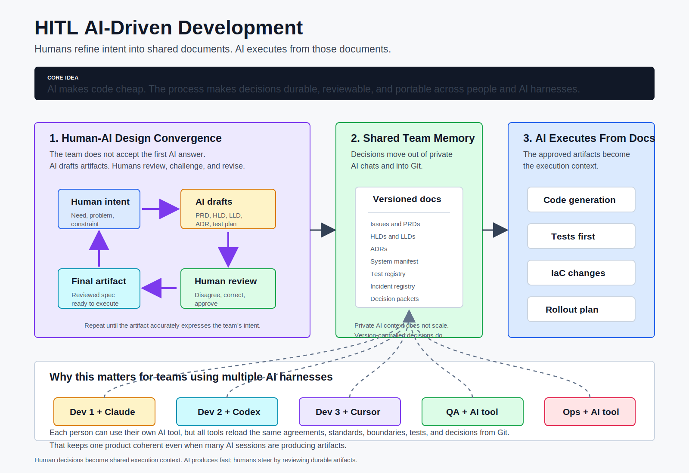

# HITL AI-Driven Development



## What this is

A document-driven delivery model for teams that use AI heavily in non-trivial software work. AI produces code faster than teams can review it — and does so confidently even when wrong. This process makes that speed safe by organizing the team around documentation as the shared source of truth. AI generates; humans shape, review, and decide.

**Where this is especially useful:** migrations, cross-domain feature work, AI/agentic systems, regulated or high-audit environments, and platform teams introducing shared conventions.

**Where a reduced version is more realistic:** normal SaaS feature teams, internal tools, and full-stack product teams shipping weekly. The most valuable subset for these teams: shared AI rules, docs-first for non-trivial changes, traceability for important decisions, and explicit rollout notes for risky releases. See the [Adoption Ladder](#adoption-ladder) for a lightweight entry path.

**Where this is not a good fit as written:** understaffed startups, teams without good CI or test discipline, teams where most work is small bugfixes and iterative UX changes, or teams without an architect or senior lead who can own the review gates.

> **AI tool note:** This guide uses [Claude Code](https://docs.anthropic.com/en/docs/claude-code) as the primary AI coding tool. The process works with any AI coding assistant that supports auto-loaded project rules. The principles and workflow are tool-agnostic; only the enforcement hooks are tool-specific.

> **Language note:** Enforcement tooling currently targets Python codebases. The process and documentation workflow are language-agnostic — only the automated checks are Python-first.

**Yes, this looks like waterfall.** Design before code. That is intentional. Waterfall failed because the gap between "design done" and "working software" was months. With AI, that gap is often much shorter — you get waterfall's rigor with less wait. Without this discipline, AI-generated code drifts: each session invents its own patterns, and by the time you have customers, you face a rewrite that is much harder than designing coherently from the start.

---

## Repo Map

```
hitl-dev-platform/
│
│  ── AI runtime (Claude Code loads and executes these) ──────────────────────────
├── ai/claude/
│   ├── [skill folders]   Slash command prompts — /dev-practices, /tdd, /architect:*, /pm:*, /qa:*, /ops:*
│   ├── agents/           Subagent role definitions (code reviewer, QA verifier, ops reviewer, etc.)
│   ├── commands/         Lightweight single-purpose prompts (review-design, verify-traceability, etc.)
│   └── hooks/            Enforcement hooks — fire at PreToolUse/PostToolUse during every Claude session
│
│  ── Codex CLI (parallel surface for OpenAI Codex users) ──────────────────────
├── ai/codex/                AGENTS.md, hooks, install script — mirrors the Claude Code skill surface
│
│  ── CI enforcement (workflows + scripts they invoke) ──────────────────────────
├── ci/
│   ├── workflows/        Copyable CI workflow templates — copy to .github/workflows/ in your product repo
│   └── manifest-drift/   Manifest drift checker (invoked by CI workflows)
│
│  ── Developer tooling (run from the command line) ─────────────────────────────
├── tools/
│   ├── [tool folders]    Python tools: preflight checker, manifest generator
│   └── scripts/          init-project.sh — bootstraps a product repo
│
│  ── Human-readable documentation ─────────────────────────────────────────────
├── docs/
│   ├── [playbook etc.]   Playbooks, role guides, patterns, reference, quick-start
│   └── examples/         Worked examples of the process applied to specific project types
├── ai/shared/templates/            Document templates to copy into product repos (PRD, ADR, manifest, etc.)
```

---

## Use This In Your Project

Once installed, this is the welcome banner that appears at the start of every Claude Code session:


Pick the path that matches where you are:

| Situation | Start here | Time |
|-----------|-----------|------|
| **New project** — want conventions and docs-first from day one | [Quick Start — New Project](docs/quick-start.md#quick-start--new-project) | 1-2 hours |
| **Existing project** — want to adopt the process on a live codebase | [Quick Start — Existing Project](docs/quick-start.md#quick-start--existing-project) | 1 day to set up |
| **Migrating a backend** — using AI to rewrite or modernise a system | [Migration Guide](docs/playbook/migration-guide.md) | Varies by system size |
| **Just the conventions layer** — one `CLAUDE.md` and shared AI rules, nothing else | [Adoption Ladder — Level 1](#adoption-ladder) | 1 hour |
| **Not sure** — want to understand what you're getting into first | [Adoption Ladder](#adoption-ladder) → pick a level | Start at Level 1 |

### By Role

| Role | Commands | Guide |
|------|----------|-------|
| **Developer** | `/dev-practices`, `/generate-docs`, `/tdd`, `/apply-change`, `/check-conventions`, `/impact-brief`, `/conclude` | [Developer guide](docs/roles/developer.md) |
| **Product Manager** | `/pm:add-feature`, `/pm:design-feature`, `/pm:prioritize`, + 6 more | [PM guide](docs/roles/pm.md) |
| **Architect** | `/architect:design-system`, `/architect:design-feature`, `/architect:review-design`, `/architect:verify-traceability` | [Architect guide](docs/roles/architect.md) |
| **QA Engineer** | `/qa:plan-tests`, `/qa:review-tests`, `/qa:verify-quality`, `/qa:report-defect` | [QA guide](docs/roles/qa.md) |
| **Ops Engineer** | `/ops:build`, `/ops:deploy`, `/ops:apply-iac`, `/ops:review-release`, `/ops:monitor-canary` | [Ops guide](docs/roles/ops.md) |

---

## Install

Install the Claude Code plugin into your project:

```bash
claude plugin install pappar/hitl-claude-plugin
```

To update to the latest version later:

```bash
claude plugin update hitl-claude-plugin
```

Once installed, open Claude Code in your project directory and run the command that matches your situation:

| Situation | Command |
|-----------|---------|
| New project — greenfield from a PRD | `/start-prd` |
| Existing codebase — adopt the process | `/start-brownfield` |
| Migrating a system | `/start-migration` |
| Already set up — start a change | `/dev-practices` |

### Optional: Graphify (knowledge graph — recommended for Level 4+ systems)

The HITL process works fully without Graphify. On systems with many domains or large design doc sets, [Graphify](https://github.com/safishamsi/graphify) acts as a retrieval accelerator: skills run targeted graph queries instead of reading the full `system-manifest.yaml` on every operation, cutting token cost and keeping AI grounded when docs would otherwise exceed the context window.

```bash
uv tool install graphifyy
graphify claude install
graphify .
```

The PostToolUse hook triggers an incremental rebuild automatically after every design doc edit.

---

## What you get by adopting this

| Outcome | How |
|---------|-----|
| **Every piece of code traces back to a reviewed decision** | Issue → design PR → LLD → code → tests → traceability check at integration verification |
| **AI generates code that matches what the team agreed** | LLD is the spec AI executes. Convention checker + TDD + two-round review enforce compliance. |
| **New team members onboard from docs, not from "ask the senior dev"** | HLDs, LLDs, ADRs, and the system manifest ARE the onboarding material |
| **You can change any part of the system without breaking other parts** | System manifest scopes each domain. Facade APIs define the contracts between them. |
| **QA and Ops are never surprised by a deployment** | Downstream impact brief communicates what changed. Canary criteria come from the incident registry. |
| **Past mistakes don't repeat** | Test registry and incident registry capture every lesson. Impact analysis queries them before every change. |
| **You know whether a technical investment paid off** | ROI estimation at the start, 30/90-day verification after. Actual outcomes documented in the ADR. |
| **Architects delegate without losing coherence** | HLD → LLD decomposition creates disjoint knowledge packets. Developers implement from their LLD alone. |

## Core Concepts in Brief

> AI makes code cheap. This process makes decisions durable.

Design decisions are captured in version-controlled documents — HLDs, LLDs, ADRs, and a System Manifest. All downstream activity (code generation, testing, deployment) is driven from those documents. AI implements what the team agreed; it does not invent it.

→ [Full concepts and rationale](docs/playbook/core-concepts.md) | [Roles and responsibilities](docs/playbook/roles.md) | [System manifest](docs/playbook/system-manifest.md)

## Core Workflow in Brief

1. **Requirements**: GitHub issue (with ROI estimate for Tier 3+ changes)
2. **Design**: Impact analysis → HLD/LLD update → test plan → QA/Ops input → Design PR merge
3. **Build (TDD)**: Generate tests first (RED) → human review → generate code (GREEN) → refactor → convention checks
4. **Verify**: Two-round AI code review → architect code review on GitHub PR → reconcile docs against implementation
5. **Assess + Ship**: Downstream impact brief → risk-rated rollout plan → verify PR completeness → lead integration verification → canary deploy

Of 32 steps: 10 AI-driven, 11 AI-assisted, 12 human-only. Not every change uses all 32 — see the [process tiers](docs/playbook/common-pitfalls.md#61-process-tiers-by-change-type) for which steps to abbreviate.

→ [Full 32-step workflow reference](docs/playbook/workflow-reference.md) | [Process overview](docs/playbook/process-overview.md)

---

## Adoption Ladder

**Start here.** You do not need the full process on day one. Pick the level that matches where your team is right now; add layers as the team matures and you see value.

| Level | What you adopt | What you get | Effort |
|---|---|---|---|
| **1. Shared AI rules** | `CLAUDE.md` with coding standards + conventions | Every AI session follows the same rules. Convention drift stops. | 1 hour |
| **2. Docs-first for non-trivial changes** | HLD/LLD before code. ADRs for decisions. | Design is reviewed before code exists. Rework drops. | 1 day |
| **3. Decision packets + traceability** | Decision packet per change. PR template with checkboxes. Traceability CI. | Every PR traces to a reviewed decision. Nothing ships undocumented. | 1 day |
| **4. System manifest + domain facades** | Manifest with domains, files, facades, conventions. Manifest drift checker. | AI stays scoped. Cross-domain drift detected. New team members onboard from the manifest. | 1 week |
| **5. Full workflow** | Incident registry, test registry, rollout planning, ROI checks, deployment gates. | Past mistakes don't repeat. Deployments are risk-rated. Investments are measured. | 1-2 weeks |

Levels 1–3 are the minimum viable adoption — shared conventions, docs-first design, and basic traceability, without the full 32-step workflow.

---

## Deeper Reading

| Topic | Playbook |
|-------|---------|
| Why this process exists + the problem it solves | [Core concepts](docs/playbook/core-concepts.md) |
| Role definitions and responsibilities | [Roles](docs/playbook/roles.md) |
| System manifest and AI context management | [System manifest](docs/playbook/system-manifest.md) |
| Full 32-step workflow + design room | [Workflow reference](docs/playbook/workflow-reference.md) |
| Process tiers, pitfalls, architect scaling | [Common pitfalls](docs/playbook/common-pitfalls.md) |
| Adoption checklist | [Adoption checklist](docs/playbook/adoption-checklist.md) |
| Brownfield adoption baseline sprint | [Adoption guide](docs/playbook/adoption-guide.md) |
| AI governance and security | [AI governance](docs/playbook/ai-governance.md) |
| Evidence taxonomy and open questions | [Evidence](docs/playbook/evidence.md) |
| Manifest ownership and CI enforcement | [Manifest governance](docs/playbook/manifest-governance.md) |
| Skills, commands, agents, hooks — full map | [Customization guide](docs/customization-guide.md) |
| Context model rationale | [Context models](docs/reference/context-models/README.md) |

---

## Known Limitations

- **Enforcement tooling is Python-first.** Manifest drift detection, import analysis, and Semgrep rules target Python codebases. The process and documentation workflow are language-agnostic.
- **CI workflows under `ci/workflows/` are copyable templates.** They are not active for this platform repo. Copy to `.github/workflows/` in your product repo after generating `docs/system-manifest.yaml`.
- **The process depends on human review.** AI generates artifacts faster, but the value comes from humans actually reviewing, challenging, and correcting those artifacts before they become code. Without that review, the process is just faster drift.
