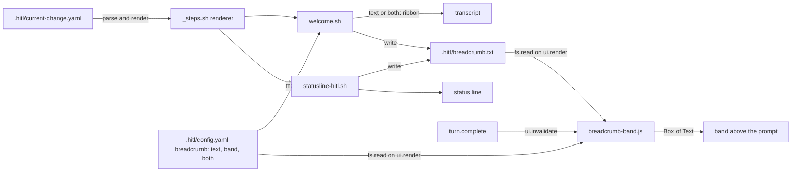

# Breadcrumb as a Mod: High-Level Design (the HOW)

> Status: **draft v1 (2026-10-05)**. HLD for **FR-37**, BM-1 to BM-8 in
> [requirements v1](../../01-product/breadcrumb-mod/requirements.md), issue
> [#150](https://github.com/Prasad-Apparaju/hitl-dev-platform/issues/150). Decisions in
> [`02-adrs.md`](02-adrs.md), exact shapes in [`03-lld.md`](03-lld.md), what must fail in
> [`04-test-plan.md`](04-test-plan.md), build order in [`05-implementation-plan.md`](05-implementation-plan.md).

## 1. The idea in one paragraph

The shell renderer already draws the breadcrumb twice: into the transcript on every prompt and into
the status line. It now also writes the rendered lines to a four-line cache file next to the
change file. A mod inside the HITL plugin reads that file when Claude Code draws the band above
the prompt, and draws it there with the current phase in bold and the step line under it. The mod handles two events, calls
four methods, and parses nothing but a one-key setting. A team turns it on with one line in
`.hitl/config.yaml`; with the line absent nothing changes. Where a mod cannot draw, the transcript
line and the status line carry on as the setting says.

## 2. What we build on (reuse map)

| Existing mechanism | Reuse |
|---|---|
| `ai/claude/hooks/_steps.sh`, the one renderer, locked by `ci/breadcrumb/run_matrix.sh` | Gains three functions: read the mode, write the cache, format the next-step hint plainly. Rendering rules untouched. |
| `welcome.sh` (UserPromptSubmit) and `statusline-hitl.sh` | Both call the cache writer after rendering. The welcome hook prints nothing for an active change in `band` mode. |
| `.hitl/config.yaml` with `change_id_prefix`, `prefixes`, `scenario_review_gate` | The `breadcrumb` key lives beside them: a team setting, committed, read by the hooks with `hitl_scalar`. |
| The plugin's `hooks/` directory, shipped by `build.sh` | Gains `hooks.json` with a `modules` key and `breadcrumb-band.js`. The plugin becomes a mod with no second plugin and no change to how it installs. |
| `tools/scripts/init-project.sh`, `dev-update` Step 4.9, `start-from-prd` Step 0 | Each adds one ignore line for the cache file, the way `.hitl/people/` is handled. |
| `claude plugin validate` and `claude plugin test` | The footprint guard and the mod's own tests, run by a pytest file under `ci/breadcrumb-mod/` that assembles a plugin-shaped directory from the source. |

## 3. Components

1. **The cache file** `.hitl/breadcrumb.txt`: line 1 the ribbon line as the banner prints it, line 2
   the step line, line 3 the next-step hint, line 4 the branch warning; written to a temp name and moved.
2. **The renderer** writes it from both callers. The welcome hook reads the mode and, for `band`,
   prints only the plain-English directive line when there is an active change; the intake directive for no active change
   still prints in every mode.
3. **The mod** `hooks/breadcrumb-band.js`: on `ui.render` for the band, read the mode; unless
   `band` or `both`, draw nothing of its own; else read the cache and draw four lines, keeping
   whatever another mod drew in the band. On `turn.complete`, ask for a redraw.
4. **The guard** `ci/breadcrumb-mod/test_breadcrumb_mod.py` assembles a plugin directory from
   the source, runs `claude plugin validate --json` and asserts the exact set of events and calls,
   then runs `claude plugin test`. CI installs the `claude` CLI so the guard does not skip there.

## 4. What a person sees

| Setting | Terminal or Desktop app, Claude Code 2.1.287 or later | Anywhere else |
|---|---|---|
| absent or `text` | Transcript ribbon each prompt, status line. Exactly 2.17.0. | Same |
| `band` | Band above the prompt, status line. The transcript ribbon is gone (the one-line plain-English directive stays); the intake directive still prints when no change is active. | Status line only, no ribbon. The docs say so and recommend `both` for a mixed team. |
| `both` | Band and transcript ribbon, status line. | Transcript ribbon, status line. |

## 5. Freshness

The welcome hook writes the cache on every prompt, before the turn starts, and Claude Code redraws
the band when the turn starts. The status line writes it whenever it refreshes, which is often
during a turn. The mod asks for a redraw at the end of every turn. So the band is current at the
start of a prompt and at the end of a turn, and usually in between.

## 6. What this does not change

The ribbon's content and rules. The status line. The gate and the welcome directive. The workflow
catalog and the breadcrumb matrix's existing assertions (271, all unchanged; the new case adds to
them). The trust model: the mod approves nothing and reaches nothing but two files in the project.
