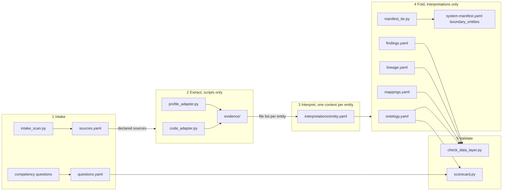

# Data Layer: High-Level Design (the HOW)

> Status: **draft v1 (2026-09-30)**, Phase 0 of the [implementation plan](05-implementation-plan.md).
> HLD for **FR-31**, slice 1 (DL-1 to DL-9 in
> [requirements v1.1](../../01-product/data-layer/requirements.md)). Decisions are in
> [`02-adrs.md`](02-adrs.md); file schemas, adapter contracts, validator rules and scorecard metrics are
> in [`03-lld.md`](03-lld.md); what must fail is in [`04-test-plan.md`](04-test-plan.md). Nothing here
> is built. The evidence core (§3.1) is shared with the business-rule layer (FR-35, Part B of
> [#131](https://github.com/Prasad-Apparaju/hitl-dev-platform/issues/131)), which is designed later
> on top of it.

## 1. The idea in one paragraph

Brownfield onboarding writes down the architecture of a system and nothing about its data. The data
layer adds four YAML documents and an evidence folder next to the manifest: an ontology (what the
business things are), mappings (where each one lives), lineage (how one dataset is made from another)
and findings (what is wrong or unconfirmed). Scripts read the repo and, with the person's stated
authorization, the stores, and write typed evidence. A model reads the evidence one entity at a time
and writes an interpretation that cites it. A fold turns the interpretations into the four files. A
validator rejects anything that cites no evidence, mixes the layers, or claims more confidence than
it has, and a scorecard says how good the layer is and whether it can answer the questions the team
wrote down at the start. The skill is run on purpose, writes nothing a team did not ask for, and a
repo without the files behaves exactly as today.

## 2. What we build on (reuse map)

| Existing mechanism | Data-layer reuse |
|---|---|
| `tools/generate-manifest/generator.py` (scan, write YAML; it overwrites on re-run) | The shape of every adapter: a script that scans one source and writes one evidence file. The tie block is re-written after any generator run (LLD §7). |
| `ci/manifest-drift/check_manifest_drift.py` (exit 0 or 1, `--strict`, run by Conventions and a CI template) | The shape of the validator and the scorecard. Advisory unless `--strict` (ADR-9). |
| `ci/first-pass/check_skips.py` (table of codes, `waivable` per finding, exit 2 on a blocker, never a traceback) | The validator's finding model and the mutation-tested fail-closed set. |
| `ci/manifest-agentic/manifest-waivers.yaml` (human-authored, code plus locus, tier limit, revisit date) | The row shape of the data layer's own `ci/data-layer/data-layer-waivers.yaml` for its one waivable structural rule (ADR-1). |
| `start-brownfield` Step 3 copy block; `dev-update --sync-validators`; `ci/shipped-validators.sha256` | How `ci/data-layer/` and `tools/data-layer/` reach a product repo and stay current. |
| `ops/pentest` Step 1b (scope listed, reply **AUTHORIZED**, nothing active before it) | DL-8: the same exchange before any live-store read, recorded in `sources.yaml`. |
| `ai/shared/issue-hygiene.md` (search first, one confirmation per batch) | Findings become tickets only through this rule (ADR-7). |
| `ai/shared/plain-english.md` | The scorecard report and every message the skill says. |
| The impact record (`surfaces: data`, `data_migration`) and `cond:` steps in `workflows.yaml` | Slice 2's activator. Decided now (ADR-2), built later. |

## 3. Components

### 3.1 The evidence core (shared with FR-35)

Every assertion in every file has the same three fields: `confidence` (one of `confirmed`, `inferred`,
`needs-review`), `evidence` (a list of references into typed evidence files), and, when confirmed,
`confirmed_by` (a person or a verification run). Evidence files have one envelope: type, source, time
taken, access used, items with locators. The business-rule layer will write `rules.yaml` with the same
three fields and the same envelope, so one validator core and one scorecard serve both (ADR-13).

### 3.2 The five stages

| Stage | Who runs it | Reads | Writes |
|---|---|---|---|
| 1 Intake | script, then the person | the repo | `sources.yaml`, `questions.yaml`, authorization records |
| 2 Extract | scripts, no model | `sources.yaml`, the repo, exports or live stores | `evidence/<source>/<type>-<timestamp>.yaml`, `run.log` |
| 3 Interpret | a slicing script, then one sub-agent per entity, clean context | that entity's evidence slice only | `evidence/slices/<entity>.yaml`; `interpretations/<entity>.yaml` with `inputs:` |
| 4 Fold | one sub-agent, clean context, then two scripts | `interpretations/`, plus the previous `lineage.yaml` and `findings.yaml` read-only | the four files; `assign_ids.py` numbers new edges and findings; `manifest_tie.py` writes `boundary_entities` |
| 5 Validate | scripts, then the person | the four files, `questions.yaml`, `sources.yaml`, `evidence/`, `run.log`, `interpretations/`, the manifest, the waiver file, the config | validator findings, `scorecard.yaml`, tickets on confirmation |

What a stage is handed is all it can read (DL-4). Evidence files are one per source and type, so a
script first slices them per entity; the skill builds each Interpret prompt from that slice and records
it as `inputs:`, and the validator rejects a citation outside it (ADR-5). Every
stage is re-runnable on its own.

### 3.3 The four files and the folder

Under `docs/02-design/data/` (ADR-8): `sources.yaml`, `questions.yaml`, `ontology.yaml`,
`mappings.yaml`, `lineage.yaml`, `findings.yaml`, `evidence/`, `interpretations/`, `scorecard.yaml`.
Semantic relationships live in the ontology, derivation edges in lineage with PROV relation names,
store and field facts in mappings. Negative findings are entries in `findings.yaml` with an `about:`
list; the edge schemas have no field that could hold one (DL-5). Schemas are in LLD §2.

### 3.4 Validator and scorecard

`ci/data-layer/check_data_layer.py` is table-driven and fails closed: a file it cannot parse, a fourth
confidence value, an assertion with no resolvable evidence, a confirmed entry nobody promoted, an
ontology entry that names a store, job, file or endpoint, a lineage relation outside PROV, a citation
outside an interpretation's inputs, a mapping on a source that was declared but not extracted at any
confidence other than `needs-review`. One rule is waivable: a manifest boundary entity absent from the
ontology, because generated manifests are wrong before the ontology is (ADR-1). Rules in LLD §4.

`ci/data-layer/scorecard.py` reports the DL-7 metrics and answerability (DL-2, ADR-6), writes
`scorecard.yaml`, diffs against `--baseline`, and prints a one-page plain-English report. Conventions
runs both and reports; CI fails only when the team turns blocking on (ADR-9). Metrics in LLD §5.

### 3.5 Adapters

Three ship in slice 1 under `tools/data-layer/`: `intake_scan.py` (what the repo says its sources are),
`code_adapter.py` (Python first: ORM entities, collection and table literals, reads, writes, joins,
keys), `profile_adapter.py` (counts, field presence, key overlap; offline export first, live mode
behind a read-only fetch layer that refuses to run without an authorization record). Each writes one
envelope and one line in `run.log` naming the access it used. Drivers import lazily; a missing driver
is recorded as access not obtained. Contracts in LLD §3.

### 3.6 The skill

`/hitl:dev-map-data-layer`, one skill, five stages, a `--stage` argument to re-run one (ADR-3). It is
not a workflow step in slice 1 (ADR-10): `start-brownfield` points to it in prose and copies the
validators; it keeps its own stage state in `.hitl/data-layer/state.yaml`. Stage contracts in LLD §6.

## 4. The primary flow (first run on an existing system)

1. **Intake.** The scan proposes sources with the file and line each was declared in. The person
   confirms, adds what the scan missed, and sets per source: environment, access granted, in scope.
   The skill collects competency questions from the problem statement, open tickets and the people
   who will use the layer, and the person confirms each question's needs list. For every in-scope
   live source the skill lists the environment and the read-only access it will use and waits for
   **AUTHORIZED**; the reply is recorded in `sources.yaml`. A source without it is
   `declared-not-extracted`.
2. **Extract.** Scripts run per source and write evidence. Nothing here is written by a model.
3. **Interpret.** The skill lists candidate entities from the evidence (ORM classes, collections,
   tables, dbt models), slices the evidence per entity, and starts one sub-agent per entity with that
   entity's slice and the schema. Each writes an interpretation at `inferred` or `needs-review`; a model never writes
   `confirmed` (DL-9).
4. **Fold.** One sub-agent reads `interpretations/` and the previous lineage and findings files, and
   writes the four files, merging duplicates by stable ID and leaving new edges and findings without
   one. `assign_ids.py` numbers them. `manifest_tie.py` derives `boundary_entities` from mappings and
   the manifest's domain file lists and writes the block.
5. **Validate.** The validator runs; a blocker sends the stage back to Interpret or Fold for the named
   entities. The scorecard runs against the last `scorecard.yaml` if one exists. Findings are listed
   once; on one confirmation they are filed under issue hygiene. The person promotes entries to
   `confirmed`, or a verification run does.

## 5. Integration points (what changes, minimally)

- **New:** `ci/data-layer/` (validator, scorecard, waiver file, tests), `tools/data-layer/` (three
  adapters, slicer, ID assigner, manifest tie), `ai/shared/templates/data-layer/` (six templates plus `data-layer.schema.yaml`),
  `ai/claude/map-data-layer/SKILL.md`, `docs/examples/data-layer/` (the synthetic fixture),
  `ci/workflows/data-layer-check.yml` (template, copied only when the team turns the layer on).
- **Edited:** `start-brownfield` Step 3 (copy block) and Step 7 (one paragraph pointing to the skill);
  `check-conventions` Step 1 (run validator and scorecard, report absent as SKIPPED); `dev-update`
  removal and sync lists; `ci/shipped-validators.sha256`; plugin `build.sh` copy blocks and
  `SHARED_PROSE`; `help`; `plugin.json`; `docs/README.md`; `docs/examples/README.md`; CHANGELOG.
- **Unchanged:** `workflows.yaml` and the catalog, every hook, every gate, the change file schema.
  A repo with no `docs/02-design/data/` sees one SKIPPED line in Conventions and nothing else.

## 6. Non-goals and boundaries (from requirements §7)

No graph database, agent, query layer, catalog UI, embeddings or retrieval loop. No writes to any
source. No column-level SQL lineage. No agent tool definitions or prompt fragments. No formal
ontology; YAML with PROV names. No fixed agent cast: isolation is by what a stage is handed, and a
stage that fails validation is re-run from its inputs, never patched by another stage.

## 7. Traceability (DL to where designed)

| DL | Designed in |
|---|---|
| DL-1 sources declared then confirmed | §4 step 1; LLD §2.1, §3.1; ADR-4 |
| DL-2 competency questions | §3.4; LLD §2.2, §5.3; ADR-6 |
| DL-3 evidence apart from interpretation | §3.1; LLD §2.7, §2.8 |
| DL-4 stage isolation | §3.2; LLD §6; ADR-5 |
| DL-5 three layers, findings apart | §3.3; LLD §2.3 to §2.6, §4 |
| DL-6 manifest and ontology agree | §3.4; LLD §4, §7; ADR-1 |
| DL-7 scorecard and diff | §3.4; LLD §5 |
| DL-8 read-only, authorized | §3.5, §4 step 1; LLD §3.3, §4; ADR-4 |
| DL-9 model-assisted, human-confirmed | §4 steps 3 and 5; LLD §2.8, §4; ADR-7 |
| DL-10, DL-11 (slice 2) | ADR-2, ADR-9; plan §5 |

## 8. Deferred to later slices

Catalog harvest and OpenLineage export (DL-12, DL-13), languages beyond Python in the code adapter,
greenfield and migration (DL-14, DL-15), deploy-time verification and the extraction schema (DL-16,
DL-17), the business-rule layer (FR-35) on the shared core.
