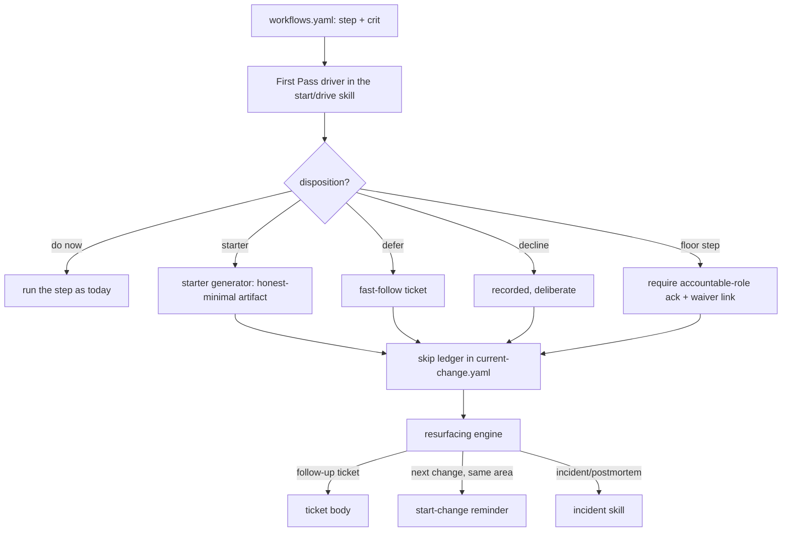

# First Pass — High-Level Design (the HOW)

> Status: **IMPLEMENTED (Phases A–I), v1 (2026-07-27)** — HLD for **FR-29** (requirements: [`../../01-product/first-pass/requirements.md`](../../01-product/first-pass/requirements.md)). Code under `ci/first-pass/` + `ai/shared/first-pass/`; hardened across **4 clean-context adversarial rounds (converged)**. On branch `feat/first-pass`, not yet released.
> First Pass is a **mode overlay** on the existing workflow model, not a new workflow. It ships as
> document/schema/skill assets (governs-not-runtime). Design decisions are in [`02-adrs.md`](02-adrs.md);
> concrete schemas + tables in [`03-lld.md`](03-lld.md).

## 1. The idea in one paragraph

HITL already determines a tiered step plan for every change and drives it via `workflow.steps[]` in
`.hitl/current-change.yaml`. First Pass adds one property to each step — a **criticality** — and one durable
structure to the change record — a **skip ledger**. With those, a team can mark a step **skipped** (with a
disposition: defer, decline, or starter), proceed to build, and always leave a polite record. The **floor**
(the load-bearing steps) cannot be skipped silently. Skipped choices **resurface** at defined triggers. Nothing
about the workflow forks: First Pass is the same 31 steps, with each one now answerable by *do it now / thin it
now (starter) / defer it / decline it*, bounded by the floor.

This is **thin-whole-first**: a walking skeleton through the whole (the AC starter "a working version of the
system," a skeleton design), then deepen via slices and the fast-follow enhancements — HITL's own
*think-holistically, implement-incrementally* philosophy, at its lightest honest setting.

## 2. What we build on (reuse map — ADR-1, ADR-2, ADR-5)

| Existing mechanism | First Pass reuse |
|---|---|
| `workflow.steps[]` in `.hitl/current-change.yaml` (single-line flow-maps, awk-parsed breadcrumb) | Gains a `skipped` status; skip detail lives in a separate ledger to keep the parser simple (ADR-8). |
| `ai/shared/workflows.yaml` (canonical step catalog) | Each step gains a `crit` (criticality) property, tier-resolved. Single source of truth. |
| Tiers 0–4, and existing per-tier step requirements ("security review required Tier 3+") | Criticality is **tier-scoped** — the same prose rule, made machine-readable (ADR-2). |
| `challenge-stance.md` **TODO Deferral** (defer + record + surface-before-ship, design phase only) | Generalized to the whole workflow and given teeth (fast-follows, active resurfacing). The record format converges. |
| **Agentic Advisor skip** (FR-28): `{control, owner, reason}`, never silent, skip ≠ waiver | The **skip-record schema** — one dialect across FR-28 and FR-29. |
| **Waivers** (`ci/manifest-agentic/manifest-waivers.yaml`, #10) | A **floor** skip that maps to a fail-closed gate links to (and requires) the human-authored waiver. |
| The **issue/ticket model** | Deferred steps seed **fast-follow tickets**. |
| Claude Code **permission modes** | First Pass maps to a scoped `acceptEdits`-style policy with a critical-action list that still prompts (ADR-7). |

## 3. Components

1. **Criticality model** — every step in `workflows.yaml` declares `crit: ceremony | standard | floor`,
   resolved against the change's tier (a step may be `standard` at Tier 1 and `floor` at Tier 3). HITL surfaces
   each step's criticality when it presents the plan. (LLD §2, §3.)
2. **First Pass driver** — the behavior added to `dev-start-change` / `dev-practices`: present the plan with
   criticality, take a per-step disposition, enforce the floor, write the ledger, generate starters, seed
   fast-follows. Runs in **brief mode** (CR-14) and under the **reduced-friction permission policy** (CR-15).
3. **Skip ledger** — a `skips:` array in `.hitl/current-change.yaml` plus a project-level roll-up
   (`.hitl/skip-ledger.yaml`) so skips are durable and referable across changes. (LLD §4.)
4. **Starter generator** — a per-step registry of *honest-minimal* starters (AC → "a working version of the
   system"; test plan → a skeleton), each emitted **marked `needs-enhancement`**. Steps with no sensible
   starter fall back to defer/decline. (LLD §5.)
5. **Resurfacing engine** — surfaces recorded skips at three triggers with escalation by criticality, in
   polite/persuasive language, honoring "no challenge mid-build." (LLD §6.)
6. **Floor + waiver bridge** — a floor skip requires the accountable role's risk-accepted ack, and, when the
   step maps to a fail-closed gate, a linked waiver. Skip ≠ waiver; the two are linked, not merged. (LLD §7.)

## 4. The primary flow

1. **Determine the plan** — unchanged: HITL tiers the change and seeds `workflow.steps[]`. First Pass annotates
   each step with its tier-resolved `crit`.
2. **Offer dispositions** — for each step the team wants to lighten, HITL offers *do now / starter / defer /
   decline*. `ceremony`/`standard` are the team's call; a `floor` step routes to the accountable-role ack (§7).
3. **Record** — every skip writes a ledger entry (`step, crit, actor, reason, ts, disposition`,
   plus `waiver_ref` / `followup_ref` / `starter_artifact` as applicable). Never silent (CR-3).
4. **Produce starters** — for `starter` dispositions, generate the honest-minimal artifact, mark it
   `needs-enhancement`, and record it as the enhancement target.
5. **Proceed to build** — the remaining (kept) steps run as today; skipped steps are `skipped` in the
   breadcrumb, visibly distinct from `done`/`open`.
6. **Seed fast-follows** — deferred steps (and starters' enhancement) become follow-up tickets linked back.
7. **Resurface** — at the follow-up, the next overlapping change, and any incident, HITL brings the record back
   politely, escalating by criticality (§6).

## 5. Integration points (what changes, minimally)

- **`ai/shared/workflows.yaml`** — add `crit` (and, where it differs by tier, a compact `crit_by_tier`) to each
  step. Additive; a step without `crit` defaults to `standard` (back-compat).
- **`ai/shared/templates/change-context.schema.yaml`** — add the `skips[]` ledger and a `first_pass: true` marker; add
  `skipped` to the step `status` enum. The awk breadcrumb parser only reads `status`, so it renders `skipped`
  with a new glyph and ignores the ledger (ADR-8).
- **`dev-start-change` / `dev-practices` skills** — the driver behavior, brief mode, permission policy.
- **`challenge-stance.md`** — TODO Deferral converges onto the ledger format and points forward to the fuller
  resurfacing (it remains the design-phase entry point).
- **A resurfacing hook / the start-change + incident skills** — read the project roll-up and surface at triggers.
- **The Advisor skip schema (FR-28)** — refactor the record into a shared schema both features use.

No runtime, dashboard, or engine ships — this is schema + skill + prose, consistent with governs-not-runtime.

## 6. Non-goals / boundaries (from requirements §Non-goals)

First Pass is per-step and opt-in (never a global off switch), never silently auto-skips, never bypasses a hard
gate without the linked waiver, and its reduced permission friction is scoped to routine/reversible/in-scope
work — never "bypass all safety." Starters are always marked incomplete.

## 7. Traceability (CR → where designed)

| CR | Designed in |
|---|---|
| CR-1 mode of the plan | §1, §4; ADR-1 |
| CR-2 criticality taxonomy, tier-scoped | §3.1; ADR-2; LLD §2–3 |
| CR-3 never-silent record | §3.3; LLD §4 |
| CR-4 skip ≠ waiver | §3.6, §7; ADR-4; LLD §7 |
| CR-5 floor protected | §3.6, §7; ADR-4 |
| CR-6 defer/decline/starter | §4; LLD §4–5 |
| CR-7 fast-follows | §3, §4.6; LLD §6 |
| CR-8 resurface at triggers | §3.5; ADR-5; LLD §6 |
| CR-9 polite language | ADR-5; LLD §6 |
| CR-10 durable ledger | §3.3; LLD §4 |
| CR-11 authority by criticality | §7; ADR-4 |
| CR-12 iteration first-class | §1, §4.6 |
| CR-13 starter over omission | §3.4; ADR-6; LLD §5 |
| CR-14 brief comms | §3.2; LLD §8 |
| CR-15 permission friction | §3.2; ADR-7; LLD §9 |

## 8. Deferred to follow-ons

- Automated "next change touches the same area" detection beyond manifest-domain / changed-path overlap
  (semantic overlap) — a later enhancement; v1 uses domain + path intersection (LLD §6.2).
- A cross-project skip analytics view (belongs with the metrics epic #22, not here).
- Auto-authoring richer starters (beyond the honest-minimal set) — kept deliberately minimal (ADR-6).
