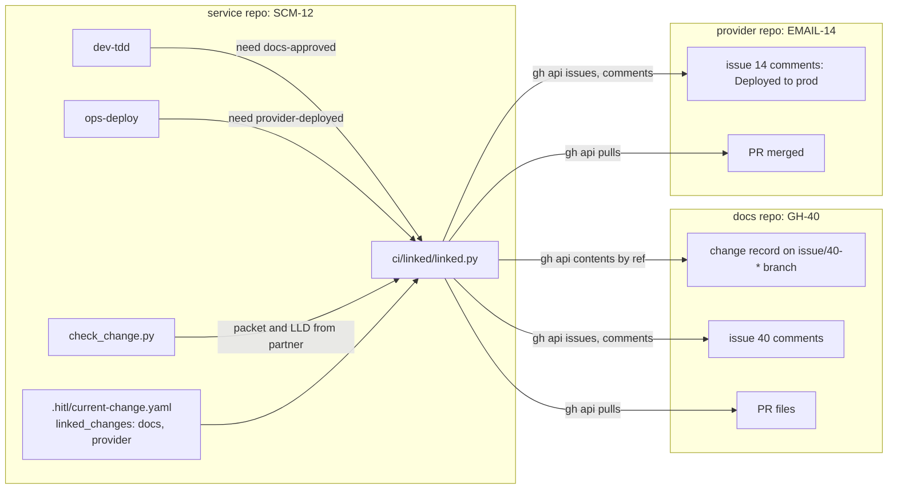

# Multi-Repo Workspace: High-Level Design (the HOW)

> Status: **draft v1 (2026-09-30)**, slice 0 (linked changes) designed in full, slices 1 to 3
> outlined. HLD for **FR-30** (requirements v1.1:
> [`../../01-product/multi-repo-workspace/requirements.md`](../../01-product/multi-repo-workspace/requirements.md),
> LC-1 to LC-7). Decisions in [`02-adrs.md`](02-adrs.md); schemas, the checker's contract and the
> skill edits in [`03-lld.md`](03-lld.md); what must fail in [`04-test-plan.md`](04-test-plan.md);
> phases in [`05-implementation-plan.md`](05-implementation-plan.md).

## 1. The idea in one paragraph

A change that spans repositories stays one change per repository, each with its own record, branch
and PR, and the records point at each other. The pointer is a `linked_changes` list in the change
record naming the partner's repository, change id and role. Two checks read a partner's state from
the host, never from its code: a code change may not leave design while its `docs` partner is
unapproved, and a `consumer` may not deploy before its `provider` is merged and deployed. An LLD
approved in another repository is accepted by pinned reference, `owner/repo@commit:path`. The change
id's prefix comes from the repository's config so ids do not collide across repositories, and the
skills that file issues read from the same config which repository an epic or a slice belongs in.
Nothing changes for a project that declares no partner.

## 2. What we build on (reuse map)

| Existing mechanism | Slice 0 reuse |
|---|---|
| `.hitl/current-change.yaml` (one record per change, `expected_branch`, `status`, `source_artifacts`) | gains an optional `linked_changes` list; `status: implementation-approved` on the partner's branch is the approval signal |
| The issue-comment markers HITL already posts (`**HITL progress**`, `## ✅ Gate Approved`, `## ✅ Ready for Development`, `## 🚀 Deployed to <env>`) | the host-visible state of a partner when its record is not readable |
| `gh` (issues, PRs, contents API by ref, sub-issues API) | the only way a partner is read; a contributor with read on the docs repository sees exactly what the host lets them see |
| `ci/preflight/check_change.py` (traceability gate, one diff) | gains a linked-partner source for the decision packet and the LLD/ADR check when a `docs` partner is declared |
| `tdd`, `apply-change`, `review-lld-adherence` refusal rules | gain the partner check and the pinned reference |
| `ops-deploy` pre-deployment checks | gain the provider check |
| `.hitl/config.yaml` (`team_pulse`, `data_layer` blocks) | gains `repo`, `change_id_prefix`, `issues` |
| `shared/issue-hygiene.md` and the wiring test behind it | gains the "which repository" rule |
| `gen_change.py` (issue number from the digits at the end of a change id) | unchanged: `SCM-12` already yields 12 |

## 3. Components

### 3.1 The record

`linked_changes` is an optional top-level list in the change record. Each entry names the partner's
`repo` (`owner/name`), its `change_id`, its `role` from the declaring change's point of view
(`docs`: holds this change's design; `provider`: must ship before this change; `consumer`: ships
after this change; `code`: implements this docs change), and optionally `issue` when the number is
not the digits at the end of the change id. Schema in LLD §2.

### 3.2 The checker, `ci/linked/linked.py`

One script, four subcommands, every host read through `gh`:

| Subcommand | Reads | Answers |
|---|---|---|
| `state` | each partner's record by ref, its issue, its comments, its PRs | a table: partner, role, status, approved, merged, deployed environments |
| `need docs-approved` | the `docs` partners | exit 0 when every one is approved, 2 when one is not, 3 when the host could not be read |
| `need provider-deployed --env E` | the `provider` partners | exit 0 when every one is merged and deployed to E |
| `need code-merged` | the `code` partners | exit 0 when every one is merged (LC-7, fold timing) |
| `fetch owner/repo@commit:path` | the contents API | writes `.hitl/linked/<repo>/<commit>/<path>`, prints the path |
| `issue-repo epic` or `slice` or `bug` | `.hitl/config.yaml` | prints `-R owner/repo` or nothing |
| `link-sub <epic-repo#N> <child-repo#M>` | the sub-issues API | links a slice issue under its epic |

Approval of a `docs` partner is read in this order: the partner's record on its branch
(`status: implementation-approved`), else a `## ✅ Ready for Development` or `## ✅ Gate Approved`
comment on its issue, else its PR merged. A `provider` is shipped when a PR for its change is merged
and a `## 🚀 Deployed to <env>` comment names the environment asked for. Unreadable is never a pass:
exit 3 with the reason. Contract in LLD §3.

### 3.3 Where the checks run

| Point | Check | Outcome on failure |
|---|---|---|
| `dev-tdd` Step 0 (and `dev-apply-change` Step 2) | `need docs-approved` | the refusal text names the partner and what it waits on |
| `check_change.py` (the CI traceability gate) | with a `docs` partner: the decision packet and the LLD/ADR update are looked for in the partner's PR files and fetched by ref | the usual failed check, naming the partner |
| `ops-deploy` Step 1 | `need provider-deployed --env <target>` | the deploy stops before Step 2 |
| `dev-conclude` fold | `need code-merged` for a docs change | asks before folding early and records the choice in the change file |

### 3.4 Pinned references

`owner/repo@<commit>:<path>` is accepted wherever a skill takes an LLD path, and in the manifest's
`lld:`. The skill runs `linked.py fetch`, reads the local copy, and cites the reference, never the
copy, in what it writes. The copy lives under `.hitl/linked/`, which onboarding adds to `.gitignore`.
A reference to a branch instead of a commit is refused: the design that was approved is a commit.

### 3.5 Prefix and issue repositories

`.hitl/config.yaml` gains three keys. `change_id_prefix` (default `GH`) is read by `start-change` when
it forms the change id, so the breadcrumb, Team Pulse and the retro show it without change, and Team
Pulse's own `change_id_prefix` falls back to it. `repo` names this repository as `owner/name` (default:
what `gh repo view` says). `issues` names where an epic and where a slice or bug is filed; the skills
that file issues pass `-R` from it, and `start-change` links a new slice issue under its epic as a
sub-issue when both are on the host.

## 4. The primary flows

**Docs in one repository, code in another.** The PM and architect run the docs change `GH-40` in the
docs repository through design; `ta-approve` sets `implementation-approved` and posts the marker. The
implementer starts `SCM-12` in the service repository; intake asks once whether the change has a
partner and writes `linked_changes: [{repo: org/docs, change_id: GH-40, role: docs}]`. `dev-tdd`
runs `need docs-approved`; it passes. The implementer gives the LLD as `org/docs@<sha>:docs/02-design/technical/lld/scm.md`;
`fetch` brings it in. The PR's CI runs `check_change.py`; the packet and the LLD are found in the
docs partner. The retro lists the partner. The docs change folds its PRD delta when `SCM-12` merges.

**Code in two repositories.** `EMAIL-14` (provider) adds the endpoint; `SCM-13` (consumer) declares it.
`SCM-13` builds against the design, and `ops-deploy` refuses until `EMAIL-14` carries a `Deployed to
prod` comment and a merged PR.

## 5. Integration points (what changes, minimally)

New: `ci/linked/linked.py` and its tests, `ai/shared/linked-changes.md`, `docs/linked-changes.md`.
Edited: the change-record schema (one optional list), `start-change` (prefix, partner question, issue
repo and sub-issue link), `tdd`, `apply-change`, `review-lld-adherence` (partner check, reference),
`ops-deploy` (provider check), `conclude` (fold rule), `retro` (partners section), `pm-add-feature`,
`pm-report-bug`, `qa-report-defect` (issue repo), `check_change.py` (partner source), `issue-hygiene.md`,
`workflow-steps.md` (one sentence at 8, 9 and 27), `pulse.py` (prefix fallback), the copy blocks, the
sync sets, the hash manifest, the build. Unchanged: every hook, the catalog, the gate's shape.

## 6. Later slices (outlined)

| Slice | Delivers | Requirements |
|---|---|---|
| 1 Workspace declaration | `.hitl/workspace.yaml`: the docs repository, the code repositories, access tiers; manifest domains mapped to repositories; the validator for unmapped paths | WR-1 to WR-3 |
| 2 Scope by workspace | hooks and First Pass permissions scope by the repositories a person has; byproducts never land in the shared tree; registry partitioning | WR-8 to WR-11 |
| 3 Lanes and reviews | the scoped contributor's full lane, cross-repository reviews, topology check against the platform, onboarding and monorepo split guidance | WR-4, WR-5, WR-12 to WR-14 |

## 7. Traceability (LC to where designed)

| LC | Designed in |
|---|---|
| LC-1 record | §3.1; LLD §2; ADR-1 |
| LC-2 docs approval | §3.2, §3.3; LLD §3, §5; ADR-2, ADR-3 |
| LC-3 provider deployed | §3.2, §3.3; LLD §3, §5; ADR-2 |
| LC-4 pinned reference | §3.4; LLD §4, §5; ADR-4 |
| LC-5 prefix | §3.5; LLD §6; ADR-5 |
| LC-6 issue repositories | §3.5; LLD §6; ADR-6 |
| LC-7 fold timing | §3.3; LLD §5; ADR-7 |
