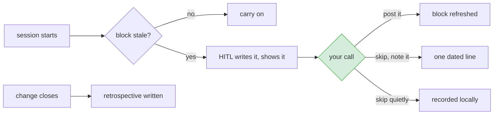

# Progress updates and the closing retrospective

**Status:** agreed, ready to build
**Issues:** progress updates extend #93 · the retrospective is #98

Two additions, kept in one design because they share a voice, a destination and an attribution line.

- a **progress update**, refreshing the current-state block while work is open
- a **retrospective** written once, when the change closes

## When each fires



## The progress update

### Where it goes

Into the "Where this stands" block at the top of the issue body, which #93 defines. Not a comment.

#93 measured why, on two tier-3 changes in a downstream project: roughly 7,300 words across eight
comments on one of them, about 36 minutes to read. GitHub renders the body first, so a comment
however good sinks, and the current state ends up eighth on the page while the body still describes
last week's problem statement.

The discussion thread is left exactly as it is. It is the audit trail and should not be trimmed.

### What triggers it

#93 refreshes the block at each gate. This adds a second trigger, because a change can sit between
gates for a week and the block goes stale with nothing to nudge it.

It runs on your machine, during a session. At the start of a session on an open change, HITL checks
when the block was last refreshed. Two days or more, and one is due.

Nothing holds that timestamp today, so the trigger has nothing to read. It goes in the change file,
written whenever the block is refreshed **or a refresh is declined**. A decline has to reset the
clock too, or every later session re-asks a question already answered.

Same scope as #93: tier 2 and above. A tier 0 or tier 1 change does not accumulate enough thread to
need a current-state block, and refreshing one on a two-line fix is the ceremony this whole effort
exists to remove.

There is no clock and nothing scheduled. HITL exists only while someone is running it, so a change
nobody opens gets no updates. That is a real limit, not an oversight: silence in the issue means
nobody has worked on it, which is information, but it is information nobody is told about.

### What it says

Brief. What moved since the last refresh, what is next, what is blocked. Not a narrative, and no
longer than the block #93 specifies.

The voice is blameless, and it is the voice HITL already uses when resurfacing a skipped step:
describe state and movement, never who did or did not do something.

> The impact analysis is done and the build has not started.

not

> Nobody has started the build.

This is not politeness for its own sake. An update that reads as an accusation gets the feature
turned off, and then there are no updates at all.

The tone is already defined and already enforced. `ai/shared/first-pass/language.md` names the
resurfacing voice and bans *failed, negligent, careless, fault, blame, lazy, should have, sloppy*,
and `ci/first-pass/resurface.py` lints for them. The progress update reuses both rather than
inventing a second tone nobody checks.

### How it is offered

Persuasively, as a policy, and never by trickery.

HITL states that a refresh is due on this cadence and why, shows what it wrote, and waits. You can
edit the text before it goes. It is never published on your behalf, and there is no default that
results in something appearing on a shared issue without you reading it.

Declining is recorded, with a reason, like any other skip.

**Whether the decline is visible is the person's choice, asked once.** "Never published on your
behalf" and "the block shows it is deliberately stale" cannot both be true: writing *anything* into
the block is publishing to a shared issue. So the refusal is not a second question. It is the same
question, with three answers:

```
An update is due. Here is what I would post:
  [post it]   [skip, note it on the issue]   [skip quietly]
```

The middle option writes one dated line and nothing about the work. The default, for anyone who says
no and moves on, is the quiet skip: recorded in the change file, issue untouched. Publishing
something a person did not affirmatively choose is the thing the guarantee exists to prevent.

The guarantee is therefore: **nothing goes out that you have not read.** Not "nothing goes out".

### Attribution

The block carries its provenance:

> Generated by Claude, approved by <name>, <date>.

The team knows what wrote it and who stood behind it. An AI-written update appearing silently under
a person's name is the thing this line exists to prevent.

## The retrospective

A step in the catalog, at the end, and **floor at every tier**. It cannot be unticked.

Saying it "never falls out of the fast track" was not enough. Right-sizing lets anything that is not
floor-locked be unticked, so a rule keeping it in the plan would have been undone by one click, and
on exactly the fast-tracked changes whose feedback matters most. A loop that switches off whenever
someone is in a hurry never corrects anything. Being floor is the only thing that actually holds.

The cost is real and worth stating: the tier-1 locked set goes from four steps to five. That is
process added to the lightest path, which this work otherwise exists to reduce. It is defensible
only because the retrospective collects nothing and asks nobody anything. It is generated from
records already written by the time it runs.

### What it reads

Nothing new is collected. All of it is already written down by the time the change closes:

| where it comes from | what it gives |
|---|---|
| the requirement and its definition of done | what was asked for |
| the plan, and which option was taken | what was agreed to do |
| every removed step, with its reason | what was left out and why |
| the acceptance criteria and QA's results | whether each line was met |
| review records | what was found and what was fixed |
| lines flagged vague and accepted anyway | where the agreement was known to be soft |
| the impact analysis record, in its own file | what was found, and what each rule concluded from it |

### What it produces

Three short parts, in the same blameless voice, with the same attribution line.

**What happened.** What was asked, what shipped, what was left out.

**What is still open.** Skipped steps, deferred work, definition-of-done lines that were never
verified. This feeds the resurfacing that already exists, so the next change touching this area
hears about it rather than the work disappearing at close.

**How the sizing turned out.** The impact record says what each rule concluded and why. The change
says what actually happened. Comparing them answers: did a step the fast track dropped come back
during build, did a step it kept turn out to be unnecessary, was a criterion untestable in practice.
This is the part that corrects the rules, and right-sizing already admits they will be wrong at
first.

### The boundary

**The retrospective records observations about the rules. It never edits them.**

A mechanism that judges its own sizing decisions and then rewrites the rules it was judged by is
grading its own homework. HITL already holds this line elsewhere: `hitl:agentic-intake` authors no
field of the manifest that the #10 validators check, for exactly this reason.

That precedent is enforced, not merely stated. The intake certifies the boundary in code, with
`records.handoff_authors_no_manifest_field(handoff) == set()`. This one is checked the same way, not
left as a sentence in a design doc, because a boundary nobody tests is a boundary that erodes on the
first convenient afternoon.

So the third part produces a note that a person reads and acts on. Changing a rule is a change, and
goes through the normal flow like any other.

## Relationship to right-sizing

Separate features. Right-sizing decides which steps run. This adds two things that run.

They meet in three places: the retrospective is a new catalog step, and the one step whose rule is
always true; its third part is the feedback loop that corrects right-sizing's rules, which is why it
cannot be allowed to drop out; and both write to the issue that the requirement was written into.

## Not in scope

- Anything scheduled, installed, or running while you are not.
- Publishing without a person reading it first.
- Automatic edits to the workflow catalog.
- Trimming the discussion thread. It is the audit trail.
