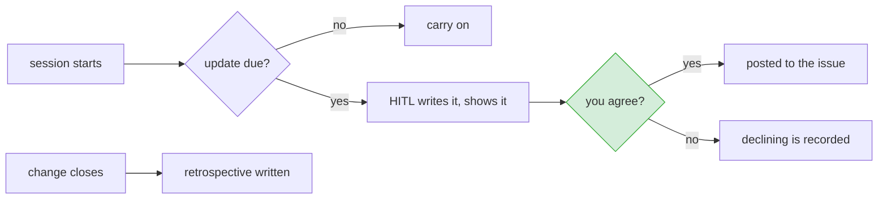

# Progress updates and the closing retrospective

**Status:** agreed, ready to build · **Issue:** not yet filed

Two additions, kept in one design because they share a voice, a destination and an attribution line.

- a **progress update** posted to the issue on a cadence while work is open
- a **retrospective** written once, when the change closes

## When each fires

## The progress update

### What triggers it

It runs on your machine, during a session. At the start of a session on an open change, HITL checks
when the last update went out. If that was two days ago or more, one is due.

There is no clock and nothing scheduled. HITL exists only while someone is running it, so a change
nobody opens gets no updates. That is a real limit, not an oversight: silence in the issue means
nobody has worked on it, which is information, but it is information nobody is told about.

### What it says

A few lines. What moved since the last update, what is next, what is blocked. Not a narrative.

The voice is blameless, and it is the voice HITL already uses when resurfacing a skipped step:
describe state and movement, never who did or did not do something.

> The impact analysis is done and the build has not started.

not

> Nobody has started the build.

This is not politeness for its own sake. An update that reads as an accusation gets the feature
turned off, and then there are no updates at all.

The tone is already defined and already enforced. `ai/shared/first-pass/language.md` names the
resurfacing voice and bans *failed, negligent, careless, fault, blame, lazy, should have, sloppy*,
and `ci/first-pass/resurface.py` lints for them. The progress update reuses both rather than
inventing a second tone nobody checks.

### How it is offered

Persuasively, as a policy, and never by trickery.

HITL states that an update is due on this cadence and why, shows the lines it wrote, and waits. You
can edit the text before it goes. It is never posted on your behalf, and there is no default that
results in something being published without you reading it.

Declining is recorded, with a reason, like any other skip. The issue then shows a gap rather than
simply having nothing in it, so a quiet change and a change whose owner chose not to report are
distinguishable.

### What appears on the issue

Every posted update carries its provenance:

> Generated by Claude, approved by <name>.

The team knows what wrote it and who stood behind it. An AI-written comment posted silently under a
person's name is the thing this line exists to prevent.

## The retrospective

A step in the catalog, at the end. It gets a criticality and a rule, and it falls out of the fast
track when it does not apply, like every other step.

### What it reads

Nothing new is collected. The change file already holds all of it:

| from the change | what it gives |
|---|---|
| the requirement and its definition of done | what was asked for |
| the plan, and which option was taken | what was agreed to do |
| every removed step, with its reason | what was left out and why |
| the acceptance criteria and QA's results | whether each line was met |
| review records | what was found and what was fixed |
| lines flagged vague and accepted anyway | where the agreement was known to be soft |

### What it produces

Three short parts, in the same blameless voice, with the same attribution line.

**What happened.** What was asked, what shipped, what was left out.

**What is still open.** Skipped steps, deferred work, definition-of-done lines that were never
verified. This feeds the resurfacing that already exists, so the next change touching this area
hears about it rather than the work disappearing at close.

**How the sizing turned out.** Was the fast track the right call. Did a dropped step turn out to
matter. Was a criterion untestable in practice. This is the part that corrects the rules, and the
design for right-sizing already admits those rules will be wrong at first.

### The boundary

**The retrospective records observations about the rules. It never edits them.**

A mechanism that judges its own sizing decisions and then rewrites the rules it was judged by is
grading its own homework. HITL already holds this line elsewhere: `hitl:agentic-intake` authors no
field of the manifest that the #10 validators check, for exactly this reason.

That precedent is enforced, not merely stated. The intake certifies the boundary in code, with
`records.handoff_authors_no_manifest_field(handoff) == set()`. This one should be checked the same
way rather than left as a sentence in a design doc, because a boundary nobody tests is a boundary
that erodes on the first convenient afternoon.

So the third part produces a note that a person reads and acts on. Changing a rule is a change, and
goes through the normal flow like any other.

## Relationship to right-sizing

Separate features. Right-sizing decides which steps run. This adds two things that run.

They meet in three places: the retrospective is a new catalog step and so needs a criticality and a
rule; its third part is the feedback loop that corrects right-sizing's rules; and both write to the
issue that the requirement was written into.

## Not in scope

- Anything scheduled, installed, or running while you are not.
- Posting without a person reading it first.
- Automatic edits to the workflow catalog.
