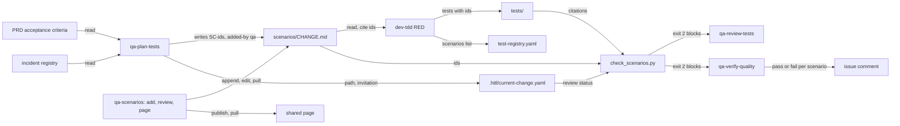

# Readable Test Scenarios: High-Level Design (the HOW)

> Status: **draft v1 (2026-10-04)**. HLD for **FR-36**, TS-1 to TS-12 in
> [requirements v1.3](../../01-product/readable-test-scenarios/requirements.md), issue
> [#148](https://github.com/Prasad-Apparaju/hitl-dev-platform/issues/148). Decisions are in
> [`02-adrs.md`](02-adrs.md); the file format, the validator rules and the change-record fields are
> in [`03-lld.md`](03-lld.md); what must fail is in [`04-test-plan.md`](04-test-plan.md); the build
> order is in [`05-implementation-plan.md`](05-implementation-plan.md).

## 1. The idea in one paragraph

QA's plan-tests skill already drafts Given/When/Then scenarios and then loses them in chat. This
design gives those scenarios a home: one markdown file per change under
`docs/03-engineering/testing/scenarios/`, with a short context block at the top and one scenario per
heading, each with a stable ID. The TDD skill reads the file and puts the IDs into the tests it
writes. A validator, shipped the same way as the First Pass checker, proves the link both ways and
blocks QA approval when a scenario has no test and no recorded reason, or an acceptance or
integration test has no scenario. Anyone adds a scenario by saying it to HITL, in any role's session
or on a shared page HITL publishes from the file and pulls back into it. The PM's review runs
alongside the build and is recorded; it never holds up RED unless the team sets a preference that
says it should. No new workflow step, no new grammar, no runner.

## 2. What we build on (reuse map)

| Existing mechanism | Reuse |
|---|---|
| `ai/claude/qa/plan-tests/SKILL.md` Step 4 and 5 | Already writes Given/When/Then with layer, priority and a Why. Step 5 changes from "names into the change record" to "the whole scenario into the file, the path into the change record". |
| `ai/claude/tdd/SKILL.md` Phase 1 step 7 and Phase 2 | Phase 1 reads the file and cites IDs; the Phase 2 checklist gains one line; step 7 registers scenario IDs. |
| `ai/claude/qa/review-tests/SKILL.md` Step 3 and 6 | The coverage matrix gains a scenario column; Step 6 runs the validator and blocks on exit 2. |
| `ai/claude/qa/verify-quality/SKILL.md` Step 6 | The approval comment lists pass or fail per scenario title with who added it; the PM review deadline is applied here. |
| `ci/first-pass/check_skips.py` | The validator's shape: a table of codes, `waivable` per finding, exit 2 on a blocker, never a traceback, `MALFORMED` for anything it cannot parse. |
| `ai/shared/skip-record.md` | The field dialect (`actor`, `reason`, `ts`, `disposition`) for a PM review recorded as skipped and for a scenario deferred without a test. |
| `ci/first-pass/migrate_project.py` `SYNC_SETS`, `tools/scripts/init-project.sh`, the start-brownfield and start-from-prd copy blocks, `tools/scripts/shipped-validators-hashes.py`, the plugin repo's `scripts/build.sh` | How `ci/test-scenarios/` reaches a product repo and stays current. |
| `ai/shared/templates/test-registry-template.yaml` | Gains a `scenarios` list per entry (TS-7). |
| `ai/shared/plain-english.md` | Gains one ceiling row; the validator's length and word checks read the same table. |
| `ai/shared/next-step.md`, `ai/shared/first-pass/permissions.md` | The one-line invitation per role (TS-11) follows the step-close and brief-comms rules. |
| The Artifact tool, when present in a session | The shared page (TS-12). The skill publishes from the file and pulls comments and edits back. No HITL runtime is shipped. |

## 3. Components

Seven touch points, one new file kind, one new validator, one new skill.

1. **The file** (`docs/03-engineering/testing/scenarios/<change-id>.md`). Context block, then one
   `### SC-<change-id>-<nn>: <title>` heading per scenario with a fixed field list. Format in the LLD
   section 2. Written by HITL, edited by people, parsed by the validator.
2. **qa-plan-tests** writes the file at the test plan step, records its path in the change record,
   and invites the PM in one line.
3. **dev-tdd** reads the file before generating tests, puts each scenario's ID into the test that
   serves it, writes the file itself when the test plan step was skipped (TS-9), registers scenario
   IDs in the registry, and invites the developer with one line in the Phase 1 checklist. When
   `.hitl/config.yaml` has `scenario_review_gate: true`, it refuses to start RED until the PM
   review is recorded.
4. **qa-scenarios** (new, any role runs it) adds, changes or reviews scenarios by conversation,
   publishes the page and pulls page activity back into the file.
5. **check_scenarios.py** (new, `ci/test-scenarios/`) proves the link both ways and the review
   status. Codes and exits in the LLD section 4.
6. **qa-review-tests** runs the validator at stage `review` and blocks on a blocker; QE is invited
   here.
7. **qa-verify-quality** runs the validator at stage `verify`, applies the PM review deadline, and
   posts pass or fail per scenario with who added it.

## 4. The PM review without a gate

The review has three states in the change record: `pending` (file written, PM not yet recorded),
`done` (who, when) and `skipped` (who, why, under the skip-record dialect). It starts `pending` when
qa-plan-tests writes the file. `qa-scenarios` records `done` when the PM finishes the conversation
or when a pull from the page finds the PM's review comment. At `qa-verify-quality`, `pending` is a
blocker unless the person running the step records it `skipped` with the PM named and a reason, in
the same brief exchange Fast Track uses for a step. Nothing before that point waits.

A scenario the PM adds after RED is just another scenario with `added by: pm`; the validator finds
no test citing it and reports SCENARIO_UNCITED at the next run, which is at QA review or at verify.
That is TS-5 without any runner.

## 5. The shared page

The page is a rendering of the file. `qa-scenarios publish` reads the file, builds a page that shows
the context, the scenarios grouped by acceptance criterion and the review state, each with a comment
affordance and an "add a scenario" form when the session's Artifact tool supports collecting, and
gives back the link. `qa-scenarios pull` reads comments and submitted rows, turns each into a file
edit (new scenario with the next ID and `added by: <name>`, an edit to an existing one, or a
question for the PM appended under the scenario), rewrites the file, and republishes so the page
shows the pulled state. Until pulled, a page row is marked pending on the page and does not exist to
the validator. When the Artifact tool is absent or cannot collect, the skill says so in one line and
publishes a read-only page or nothing. No HITL code runs on the page beyond what the Artifact runtime
provides; HITL ships no page service.

## 6. Fast Track

When the test plan step is skipped, there is no file at RED. `dev-tdd` writes one from the tests it
generated: one scenario per acceptance or integration test, title from the test's name in plain
words, `added by: dev`, and records the review as `skipped` with the developer named and the reason
"test plan step skipped under Fast Track". The validator then runs as normal. The PM can still read
and add later; a later addition is a gap until a test cites it.

## 7. What this does not change

The workflow catalog (no new step, no renumbering, no breadcrumb matrix change). The acceptance
criteria as the source of truth. The 90 percent coverage gate. The test registry's existing fields.
The Codex surface (not maintained).
