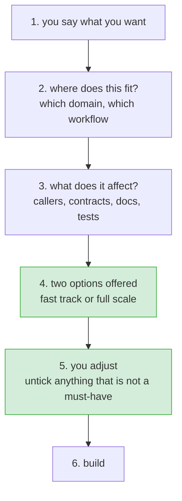

# Right-sizing a change

**Status:** draft, for review · **Issue:** #97

## What happens

Six steps. One conversation. Nothing is handed to a second command.

## 1. You say what you want

Unchanged. Intake asks, and asks again if it is unclear.

## 2. Where does this fit

Which domain in the system manifest, and which workflow. The domain is the important part: it is what makes step 3 possible.

If no domain owns it, say so and carry on. It changes what step 3 can find, not whether we proceed.

## 3. What does it affect

From the domain's entry in the manifest, without reading the codebase:

| from the manifest | tells us |
|---|---|
| `files` | what code is in scope |
| `lld` | which design doc describes it |
| `facade_apis`, `boundary_entities` | what other code can see |
| `depends_on` | who breaks if this changes |
| `events_emitted`, `events_consumed` | what it sends and listens for |
| `tests` | what covers it |

Read source only where the change clearly goes beyond what the manifest describes, and say so when it does.

If there is no domain, this comes back thin. That is a fact about the project, not a reason to stop.

## 4. Two options

**Fast track.** The must-haves, plus the steps this change's own facts say are needed. If it touches a public interface, compatibility is in. If something depends on it, integration is in. If it has a design doc, docs are in.

**Full scale.** Everything the workflow defines.

Show both, with the difference between them. Say which one is recommended and why, in one line.

## 5. You adjust

The offered list is tickable. Untick anything, except a must-have.

Must-haves cannot be unticked here. That is the floor for this change's tier, plus the test-first cycle, which can be thinned but never dropped.

Everything unticked is recorded: which step, who, why. That is what the existing validator reads.

## 6. Build

The change file records the plan and what was dropped. Then the normal flow continues.

## What has to be decided

1. **What goes in the fast track for a change with no domain?** The must-haves and nothing else, or the must-haves plus a basic set that applies to any change?
2. **How is risk handled?** Some work should not be offered a fast track at all: secrets, auth, anything that deploys or migrates data. Is that a separate check, or does it just force full scale?
3. **What does a must-have look like on screen?** Shown and locked, or not shown at all?
4. **Is the recommendation binding?** If fast track is recommended and someone takes full scale, is that worth recording?

## Not in scope

- Moving impact analysis out of the second command. Step 3 here is a manifest lookup, not the full impact analysis, and both can exist.
- Changing what the floor protects.
- Making profiles and tags filter the plan.
