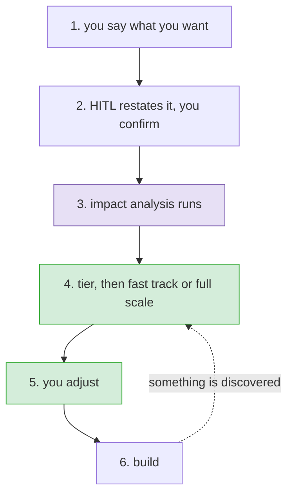

# Right-sizing a change

**Status:** agreed, ready to build · **Issue:** #97

## What happens

Six steps. The plan does not exist until step 3 has run, and it is not final once it does.

## 1. You say what you want

Unchanged. Intake asks, and asks again if it is unclear.

## 2. HITL restates it, you confirm

Before anything is read or planned, HITL writes back what it understood:

| | |
|---|---|
| what you want | the ask, corrected |
| in scope | what this change covers |
| out of scope | what it explicitly does not, so it can be pointed at later |
| definition of done | what counts as delivered, in the requester's terms |

Length comes from the change, not from a cap. A one-line fix has a one-line definition of done. A
feature has a list. You confirm or correct all of it.

This is the cheapest moment to catch a misread. Everything downstream is derived from this text, so
a misunderstanding here becomes a wrong impact analysis and then a wrong plan, and a wrong plan is
harder to argue with than a wrong sentence because it looks considered.

### What the definition of done is for

It is not the plan restated. The plan is how the work gets done. This is what counts as delivered,
in the requester's own words, agreed before anyone starts.

The two are written at different moments by different people and answer different questions, so
neither can stand in for the other. A completed plan does not prove the thing does what was asked.
A met definition of done does not prove it was built properly.

Three properties:

**It is attributed.** Who agreed, and when. An agreement with nobody's name on it is not one.

**Vague lines are flagged, not blocked.** "The system should be fast" cannot be shown to be met.
HITL says so, offers a sharper version, and takes whatever answer comes back. If the vague line
stays, the record says it was flagged as unverifiable and accepted anyway, with a name and a date.
That record does not require HITL to have been right about the wording, only to have asked.

**Changing it after work starts is a scope change,** routed through the existing scope-change review
rather than edited in place.

### Acceptance criteria are translated from it

Not written alongside it. The definition of done is the anchor, in the requester's language. The
criteria are the checkable translation, written once the work is understood well enough to say how
each line gets proved. Every criterion has to be something QA can actually test, because QA is who
reads them. "Works properly" is not a criterion. "Returns 400 with a message naming the missing
field" is.

Every definition-of-done line must name at least one criterion that satisfies it. A line with none
stops progress before Build begins, until it either gets a criterion or is explicitly marked as not
verifiable in this change, with a reason and a name.

The link is read in the other direction at the end. QA already verifies each criterion at the QA
post-handoff verification step and can block promotion. Because the criteria point back, those
results report against the definition of done rather than against a list of criteria the requester
never wrote: four of the five lines are verified, one was never tested.

### Where the requirement is written

| where | when |
|---|---|
| the issue description | always; HITL edits it directly, since you just approved the wording |
| the change file | always |
| the PRD | appended when the area has one; created only when the workflow is a feature |

A fix or a chore never creates a PRD. Both destinations depend on which area owns the change, so
they are written after step 3 answers that, even though the text is agreed here.

### The change file starts here as a stub

Intake writes a stub: change id, branch, the confirmed requirement and its definition of done, and
a pointer to the impact record. No workflow steps and no plan, because neither exists yet.

The stub is not merely tidiness. It persists the agreed requirement and definition of done, so a
session that dies between step 2 and step 3 does not lose the text everything downstream derives
from; it is what the analysis reads; and it names the impact record, so the blocking
missing-record check has something to check.

What it deliberately does **not** do is unblock editing. A stub carries no plan, so it does not
satisfy the active-change gate and source edits stay blocked through intake. That is correct:
nothing has authorised an edit yet. Step 3 fills in the rest.

The generator refuses a planless change file today, so it has to learn to write a stub. Three places
set or read the tier before step 4 and all three change:

| where | what happens to it |
|---|---|
| `start-change` Step 3b, confirm the tier | deleted; the tier is proposed from findings at step 4 |
| the Step 6 generator's `TIER=2` default with `tier_set_by` / `tier_reason` | moves to step 4, keeping the attribution rules |
| `apply-change` Step 7, which sets `tier` "from Step 3" | goes with the change-file init it no longer owns |

The stub cannot simply omit the tier: `check_skips` raises `INVALID_TIER` for anything outside 0..4
and resolves criticality at the strictest tier when it cannot read one. So it declares a
**provisional tier of 3**, the strictest, so it fails closed, marked `tier_provisional: true`.
`TIER_PROVISIONAL` blocks if that survives past intake, because the tier is proposed from findings
and confirmed by a person, and a provisional value on a planned change means nobody confirmed it.

`status: intake` exempts the stub from the plan checks, narrowly. Measured before deciding: a stub
run through the validator produces **9 blocking `INCOMPLETE_PLAN` errors and 25 `PLAN_PRUNED`
warnings**, so the missing tier was one problem in thirty-five. The exemption covers only a change
with no steps and no skips; claiming `intake` while carrying either is `INTAKE_NOT_EMPTY`,
non-waivable, with every normal check still running alongside it.

## 3. Impact analysis runs

**Impact analysis is not a step in the plan. It is the thing that produces the plan.** It always
runs, it cannot be ticked off, and there is no plan yet to put it in.

### Who calls whom

`start-change` stays the enforced front door and owns the whole sequence. It calls the analysis as a
subroutine between its own step 2 and step 4, and continues when the record comes back:

| | |
|---|---|
| `start-change` | restate, confirm, write the stub, **call the analysis**, propose the tier, build the plan, run 4b, create the branch |
| `apply-change` | read the stub, produce the record, write the criteria, return |

`apply-change` loses two things it does today, because intake already owns both: creating the feature
branch (its Step 2a) and initialising the change file (its Step 7). Its Step 1 challenge moves to
intake's restate-and-confirm. What is left is one job done well.

The branch is created **after** the plan is agreed, not before the analysis. Nothing about the
analysis needs a branch, and creating one for a change that has not been sized yet leaves a stray
branch whenever intake is abandoned.

### It runs on every workflow, asking different questions

Impact analysis is not a manifest lookup. It is "what does this touch, and what does it demand". The
manifest is only one place that answer lives, and which questions to ask depends on the work:

| workflow | what it is asking | where it reads |
|---|---|---|
| development | what does this change reach | the manifest, the design docs, the code |
| brownfield | what security posture and CI/CD compliance exist already, and what is missing | the codebase itself |
| migration | what does changing the tech stack cost, what breaks, what has no equivalent | the source system |
| prd | what has to be created: repo, docs, structure | the product doc and the empty ground |

The three that have no manifest are not degraded cases. They are the workflows that exist to produce
one, and asking what that will take is exactly the analysis worth doing.

The output is the same shape everywhere: findings, provenance, and what the rules concluded. So
everything downstream works unchanged, because it keys off findings rather than off the manifest.

**Which area does this belong to.** The workflow was already chosen at intake, as a routing decision.
Step 3 does not revisit it; it answers which area of the system owns the work.

If no area owns it, HITL says so and asks one question: is this genuinely outside the system, like a
demo script or a CI config, or is the manifest missing an area? Outside means the fast track is the
locked floor and nothing else. Missing means HITL will not pretend it sized correctly, and offers
full scale or asks you to name the area.

**What does this change reach.** Read top-down, cheapest source first: the manifest entry, then the
design docs it points at, then source, and only where the declared picture is thin or the change
clearly goes beyond it.

The distinction that matters is between what the *area* has and what this *change* touches. An area
having tests is not a fact about your change. Your change altering behaviour those tests cover is.
Rules read the second kind, never the first, for the reason in step 4.

### What it writes

Its own file, referenced from the change file. The change file names it; if the named record is
missing or empty, that blocks. A second artifact is only safe when something notices its absence,
and data that quietly stops being written is this repo's recurring defect.

The record holds three things:

| | |
|---|---|
| the findings | which area owns it or none, what this change reaches, what depends on it, which interfaces and events are involved, what tests cover the behaviour being changed |
| provenance, per finding | manifest, design doc, or source, so a hand-written field is never presented as if it came from the code |
| what the rules concluded | which step each finding put in or left out, and why |

The third part is what makes the retrospective's feedback loop possible. You cannot ask whether a
rule was right if you never recorded what it decided.

### It also writes the acceptance criteria

The definition of done was agreed at step 2 in the requester's language. The criteria are its
checkable translation, and this is the first moment the work is understood well enough to write them.

They belong here for a structural reason, not a tidy one. Step 2 blocks progress before Build until
every definition-of-done line names a criterion. Nothing in the 34-step plan produces criteria today,
and any step that did could be unticked, which would leave a block with no producer and a stall with
no next command. Impact analysis always runs and cannot be removed, so the check can never fire
without its producer having run.

### What this costs elsewhere

`impact` is currently a step in the catalog, marked floor at tier 3. Taking it out of the plan means:

- the development workflow drops from 34 steps to 33, then back to 34 when the retrospective is
  added as a step (see progress-and-retro)
- the tier 3 locked floor goes ten → nine without `impact`, then back to ten with the retrospective
  locked. Tier 1 goes four → five, tier 2 five → six
- the check that every floor step must appear in the plan stops expecting it
- `impact` is the only step in any workflow that invokes `dev-apply-change`, so that skill stops
  being reachable from a plan. It becomes the impact analysis rather than being deleted: it already
  holds the analysis, the challenge stance and the artifact identification, and rebuilding those
  elsewhere is how tested behaviour quietly stops working
- `apply-change` Step 7a **splits**, because its two halves have different preconditions. It was
  written as one step because both preconditions happened to be satisfied at the same moment; they no
  longer are.

  | half | needs | now runs |
  |---|---|---|
  | resurface earlier unresolved entries | the area | at step 3, so it informs the plan |
  | fold this change's skips into the roll-up | this change's skips | after step 5, when they exist |

  Running the fold at step 3 would append an empty set, this change's skips would never reach
  `.hitl/skip-ledger.yaml`, and `check_skips` would raise `ROLLUP` for every one of them. Calling
  this a move rather than a split was exactly the defect this design keeps naming: data that quietly
  stops being written
- every step after it renumbers, so `workflow-steps.md` and anything else citing a step by number
  has to be updated in the same pass

## 4. Tier, then fast track or full scale

### The tier is decided here, once

Not at intake. HITL proposes a tier from what impact analysis found, and a human confirms or
corrects it exactly as before, with the same attribution rules.

This is the root fix for the change that started this. `FIRECRAWL_API_KEY` in an issue title is what
tiered a shell script up to a three and a half hour path. Impact analysis would have found a file in
no area, with no dependents and no callers. The evidence existed; it just arrived after the decision
that needed it. Deciding once, on evidence, means a word in the issue text can no longer outvote
what the code says.

Anything that reads the tier before the plan exists has to be found and checked as part of this.

### The choice appears only where there is something to size

Every workflow gets an impact analysis. Not every workflow gets offered two options.

HITL has eight workflows, from 34 steps down to five. Offering a fast track on a five-step process
adds a confirmation and a decision to the lightest path in the system, which is the ceremony this
work exists to remove.

**The choice applies to `development` only,** and that is a deliberate limit rather than an
unfinished one. It is the only workflow with the data the choice needs: an importance rating per
step, a sentence saying what each protects, and a change file with a ledger to record decisions in.

`platform` is the near miss worth naming. It is 17 steps, so it looks like a candidate, but it is a
one-time readiness checklist rather than a change: no `crit` on any step, no `step_costs`, and its
progress lives in `docs/04-operations/platform-readiness.yaml`, not a change file. It also already
answers "we are not doing this one" with a waiver carrying evidence, which is stronger than a skip
carrying a reason. Giving it a fast track would be a second way to say the same thing, and the worse
one.

Elsewhere the analysis runs and the plan is simply the plan.

### Three sets, two predicates

| | | decided by |
|---|---|---|
| every step the workflow defines | a list, not an offer | the catalog |
| the ones that **apply** to this change | this is **full scale** | `engages` |
| the ones **needed now** | this is **fast track** | `needed_now` |

Full scale is not every step. Offering a Figma comparison on a backend change, or a training plan on
a one-line fix, makes the thorough option look stupid and teaches people to distrust it.

**`engages` answers: does this step make sense here at all?** A Figma comparison needs interface
files in the change.

**`needed_now` answers: does it have to happen before this ships?** A step is in the fast track when
impact analysis found something *this change reaches* that the step protects. Three dependent areas
found, integration is in. Nothing depends on it, integration is out. A published interface is
touched, compatibility is in.

Both read the change's reach, never the area's paperwork. That distinction is the whole point. Rules
keyed to whether an area *has* a design doc, dependents and tests give identical answers for every
change to that area, so a one-line fix in the best-documented part of the system would draw the
longest plan, and documenting an area would make every future change to it more expensive. A new
feature in a new area would draw almost nothing, because it has no history to match on. Both
backwards.

### What is locked

- **The tier floor**, plus the test-first cycle, plus the retrospective. Five steps at tier 1, six at
  tier 2, ten at tier 3. These cannot be dropped by the rules and are not offered as a tick.

  "Locked" here means what it already means in `check_skips`, not something stronger: a floor step
  can still be skipped, but only as a risk-accepted decision carrying an accountable person's
  `ack_by` and a reason, plus a waiver where the step maps to a hard gate. Step 4b's menu already
  says so: `floor | keep · request risk-accepted skip`. Nothing here makes that stricter.
- **Anything `needed_now` put in.** These can be unticked, but not with one click. See step 5.

Risk is handled by the tier and by nothing else. A risky change is a high tier, a high tier locks
more, and the gap between the two options closes on its own. There is no second list of dangerous
categories, because a rule matching the word `API_KEY` is what caused this in the first place.

Both options are shown with the difference between them, and one line saying which is recommended
and why. The recommendation is advice. Taking full scale instead is not recorded.

### Where a rule is silent

Rules first, judgement second. Where a rule answers, that is the answer, and it is testable. Where
no rule fits, HITL decides and says so in one line, such as "dropping the Figma comparison, this
change touches no interface files." The override is shown rather than buried, so a bad call gets
argued with and becomes a rule next time.

### The catalog data

Each step carries three lines. Two exist already and are unchanged:

| line | what it is |
|---|---|
| `protects` | the sentence shown next to the step |
| `forgo_cost` | high, medium or low; orders the steps that are not in the fast track |
| `engages` + `needed_now` | the two rules above |

**`step_costs` lives in two files, and both have to change.** It is authored in
`tools/workflow-catalog/catalog.yaml` and derived into `ai/shared/workflows.yaml`, with
`derive.py verify` and a wiring test asserting they agree. The `engages` rewrite, the new
`needed_now`, and the retrospective step all have to land in the spine, in `step_costs`, and pass the
derive gate. Saying "the catalog" hides a step.

`engages` was rewritten on all 38 steps, and `needed_now` authored alongside it. Before that: Twenty-one development steps say
`always`, which decides nothing. Five key off profiles, which never reach the runtime, so they can
never fire. Four match folder patterns, which is guesswork about what a path means. Only three key
off a real fact, and one off a tag. Nineteen development steps still say `always` for `engages`, and that is correct rather than
unfinished: most are locked or genuinely universal, and `needed_now` does the discriminating. Some
of the rules will be wrong at first, and step 6 is how they get corrected.

## 5. You adjust

**This is not a new mechanism. It is First Pass, with a better way of deciding what to pre-select.**

`start-change` Step 4b already does the hard part: it presents steps pre-selected with a one-line
reason filled in, takes **one confirmation for the whole set**, writes nothing until the human
confirms, and puts that person's name on every resulting record. Today its pre-selection logic is
"tier 0 or 1, so decline the ceremony steps". Right-sizing replaces that logic with "here is what
this change reaches, so here is what it needs".

Everything else stays exactly as it is: the `skips:` ledger, `first_pass`, `check_skips.py`,
`PLAN_PRUNED`, `LEDGER_STEPS`, and the rule that the actor is the person who confirmed and never the
agent. Nothing new to certify, and no second ledger.

That also disposes of a problem an earlier draft created. Writing fast-track omissions as "HITL's
decision, no prompt" was wrong twice over: it contradicts 4b's actor rule, and the validator has no
clean shape for a step that is neither present nor recorded. One confirmation records the lot, with
the rule that dropped each step as its reason. A tier-1 fast track does not ask for twenty-four
reasons; it asks once.

The list is tickable. A step the tier floor put there is not offered as a tick. Anything else can be
unticked, and unticking something the rules put in opens one short prompt: which of the three (a thin
version now, later with a ticket, or not at all) and why. That is the disposition the ledger already
carries.

### One addition to the ledger

The ledger has three dispositions: `defer`, `decline`, `starter`. None of them means *the rules
determined this does not apply to this change*, and that is not the same fact as a person choosing to
skip something.

Without a fourth, a tier-1 fast track writes about 25 entries and the only cheap one is `decline`
(`defer` fails without a linked follow-up, `starter` means writing a thin artifact). That records a
named human as having declined 25 steps they never looked at, and the retrospective reads that list
back as "what was left out and why".

So one disposition is added, meaning the rules excluded it, carrying the rule that decided it as its
reason. It does not resurface later, because nothing was deferred. It is what the retrospective
compares against what actually happened.

**This is the one place the reuse is not free.** Everything else about First Pass is untouched; this
changes `check_skips.py`, the disposition set and the resurfacing rules.

### First Pass stops being opt-in

It is the default. Every change is shown a proposal and confirms or adjusts it; full scale is simply
the answer set where nothing is dropped.

This closes the third root cause named in #97: the one feature built for this problem had to be
asked for by someone who already knew it existed. The cost is that `first_pass: true` lands on
nearly every change, so the flag stops distinguishing much. It does not weaken anything: the flag
gates enforcement, so always-true means enforcement always engages. `FP_UNDECLARED` stays, because
its job is catching a driver that forgets to write the flag, and that failure is still possible.

Locked steps are shown, greyed, with their reason next to them. Hiding them would mean you cannot
see what HITL decided on your behalf.

## 6. Build, and re-plan as you learn

**The plan is not final.** Implementation and testing discover things the plan did not account for,
and the plan changes when they do.

HITL proposes a **delta**, never the whole list again: what it now thinks should be added, and the
finding that caused it. You deselect from the delta the same way, must-haves stay locked, removals
are recorded the same way.

A step the fast track left out is not gone. It is not-yet, and it comes back when a finding calls
for it.

### When it interrupts

| | |
|---|---|
| **a finding makes a dropped step load-bearing** | raised immediately; carrying on is the expensive mistake |
| **everything else** | accumulates and is put to you at the next phase move, as one small delta |

This is also what makes the rest of this design tolerable. Being approximately right at step 4 is
good enough when step 4 can happen again. Most of the risk in a wrong fast track is not that
something is missed, but that it is missed permanently.

## What gets deleted

Already done, in `8561080`: `rank.py`, `plan_select.py`, `test_rank.py`, `selection.md`,
`right-sizing.md` and `first-pass-choices.md`, the intake changes that called them, and the version
stamps. The catalog data was kept and is guarded by two wiring tests.

## What we are watching after this ships

**The friction is back on the light path.** Asking for a reason at each untick is the same cost named
in #97: the cheap path asks for paperwork while the expensive one asks for nothing. It only stays
cheap if the fast track is right often enough that unticking is rare. If the rules are poor, this
shows up as people quietly taking full scale because it asks fewer questions.

**Every change now runs an impact analysis up front.** That is what it takes for the plan to be
built on what is actually there. If it is slow on small changes, the fix is to make the top-down read
stop earlier, not to make it skippable, because a skippable plan-generator leaves no plan.

## Not in scope

- Changing what the floor protects.
- Making profiles and tags filter the plan.
