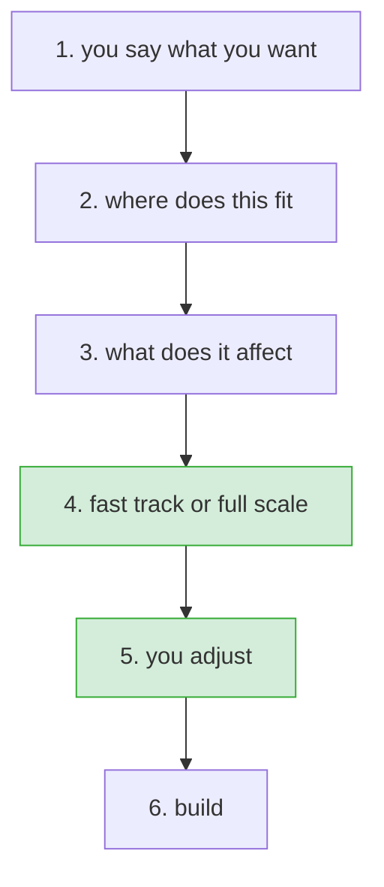

# Right-sizing a change

**Status:** agreed, ready to build · **Issue:** #97

## What happens

Six steps, one conversation. Nothing is handed to a second command.

## 1. You say what you want

Unchanged. Intake asks, and asks again if it is unclear.

## 2. Where does this fit

Which area of the system manifest owns this, and which workflow applies. The area is the important
part, because it is what makes step 3 possible.

If no area owns it, HITL says so and asks one question: is this genuinely outside the system, like a
demo script or a CI config, or is the manifest missing an area? Outside means the fast track is the
locked floor and nothing else. Missing means HITL will not pretend it sized correctly, and offers
full scale or asks you to name the area.

## 3. What does it affect

Read from the area's entry in the manifest, without reading the codebase:

| from the manifest | tells us |
|---|---|
| `files` | what code is in scope |
| `lld` | which design doc describes it |
| `facade_apis`, `boundary_entities` | what other code can see |
| `depends_on` | who breaks if this changes |
| `events_emitted`, `events_consumed` | what it sends and listens for |
| `tests` | what covers it |

Read source only where the change clearly goes beyond what the manifest describes, and say so when
it does.

## 4. Fast track or full scale

**Full scale** is every step the workflow defines.

**Fast track** is the locked set plus every step whose rule comes out true for this change.

Both are shown, with the difference between them, and one line saying which is recommended and why.
The recommendation is advice. Taking full scale instead is not recorded.

### What is locked

Two things, and nothing else:

- **The tier floor**, plus the test-first cycle. At tier 1 that is four steps, at tier 2 five, at
  tier 3 ten. These cannot be unticked here.
- **Anything a rule put in.** These can be unticked, but not with one click. See step 5.

Risk is handled by the tier and by nothing else. A risky change is a high tier, a high tier locks
more, and the gap between the two options closes on its own. There is no second list of dangerous
categories, because a rule matching the word `API_KEY` is what turned a one-line shell script edit
into a three and a half hour path in the first place.

### The rules

Each step carries three lines of data in the catalog. Two exist already and stay as they are:

| line | what it is | example |
|---|---|---|
| `protects` | the sentence shown next to the step | "catches an interface change that breaks a caller" |
| `forgo_cost` | high, medium or low; orders the steps that are not in the fast track | `high` |
| `engages` | **the rule**: what must be true for this step to be in the fast track | needs rewriting |

`engages` exists on all 38 steps but does not yet do the job. Twenty-one development steps say
`always`, which puts them in every fast track and so decides nothing. Five key off profiles, which
never reach the runtime, so they can never fire. Four match folder patterns, which is guesswork
about what a path means. Only three key off a real fact about the change, and one off a tag.

Every one gets rewritten in a single pass, to key off facts step 3 can actually read: does this area
have a design doc, does anything depend on it, does it publish an interface, does it emit events,
does it have tests. Some will be wrong at first, and real changes will correct them.

## 5. You adjust

The list is tickable. A step put there by the tier floor cannot be unticked. Anything else can.

Unticking a step that a rule put in opens one short prompt, at that moment, asking two things:

- which of the three: a thin version now, later with a ticket, or not at all
- why

That is what the pull request checker reads, and it refuses to pass without both. Asking in the
moment rather than collecting reasons at the end means the answer is given while the thinking is
fresh, at the cost of an interruption per removal.

Locked steps are shown, greyed, with their reason next to them. Hiding them would mean you cannot
see what HITL decided on your behalf.

## 6. Build

The change file records the plan and everything removed, with who and why. The normal flow continues.

## What gets deleted

The whole 2.9.0 selection attempt: `ci/first-pass/rank.py`, `ci/first-pass/plan_select.py`,
`ci/first-pass/test_rank.py`, `ai/claude/start-change/selection.md`, and the intake changes that
call them. Steps 4 and 5 are built clean.

The catalog data stays. Only the code that scored with it goes.

The version rolls back to 2.8.0, which is what is actually published.

## What we are watching after this ships

Asking for a reason at each untick puts friction back on the light path, and that friction is the
root cause in #97: the cheap path costs paperwork while the expensive one is free. It only stays
cheap if the fast track is right often enough that unticking is rare, which rests entirely on the
rewritten rules being good.

If they are poor, this shows up as people quietly taking full scale because it asks fewer questions.
That is the signal to watch, and the reason to watch it rather than design around it now.

## Not in scope

- Moving impact analysis out of the second command. Step 3 is a manifest lookup, not the full impact
  analysis, and both exist.
- Changing what the floor protects.
- Making profiles and tags filter the plan.
