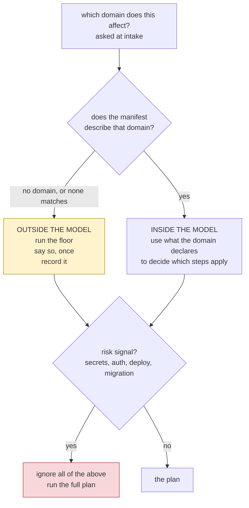

# Deciding how much process a change needs

**Status:** draft, for review · **Issue:** #97

The plan only. Background is on issue #97.

## The rule

What HITL does depends on whether it knows anything about the change.

## 1. Outside the model, HITL steps back

If no domain claims the work, HITL knows nothing useful about it. It does not know the callers, the contracts, the tests, or the requirement. Running 31 steps over it is ceremony performed on something the framework cannot see.

So: run the floor, say once that this is outside the model, record that as the reason, and get on with it.

This is the case that started this. `scripts/demo.sh` is in no domain. Nothing declares it. A short path is the honest answer, not the risky one.

The earlier version of this document had this backwards. It treated "we know nothing" as a reason for more process.

## 2. Inside the model, use what is declared

If a domain claims the work, the manifest already says what matters:

| field | what it tells you |
|---|---|
| `files` | what code belongs to it |
| `lld` | the design doc |
| `facade_apis`, `boundary_entities` | what other code can see |
| `depends_on` | who breaks if this changes, read backwards |
| `events_emitted`, `events_consumed` | what it sends and listens for |
| `tests` | what covers it |

A step applies when the change touches something it protects. Docs matter when there is an `lld`. Compatibility matters when a facade moves. Integration matters when something depends on this domain.

## 3. Risk overrides both

Some work is not safe to shorten regardless of what the model says. Secrets moving, auth, permissions, anything that deploys, anything that rewrites data in place.

A risk signal means the full plan. It beats "outside the model" and it beats a clean manifest entry. This is the rule the earlier version was missing: its conditions were all about how confident we were in the manifest, and none about how dangerous the change was.

## 4. How much gets cut depends on how much we know

Today the plan is cut to a fixed eight steps whatever the evidence. That makes the evidence decorative.

The cut has to be a function of what we know:

- outside the model: the floor, and nothing else claimed
- inside the model, one domain, no dependents: short
- inside the model, several domains or dependents: longer
- any risk signal: everything

## 5. This happens at intake, and nothing moves

Intake asks which domain the work affects. The manifest is a file, so looking it up needs nothing that has not happened yet.

That means the existing order already works. Sizing happens at step 4, the change file records it at step 6, the skip check reads it at step 6b. No step moves, no second command is involved, nothing is handed between runs.

The previous version moved impact analysis into intake to make this work. That is not needed. Impact analysis is about what the change will affect in detail; sizing only needs to know which domain we are in.

## 6. What changes

- Intake asks which domain, and looks it up.
- Sizing uses the domain's declared model, or the floor if there is none.
- A risk check runs before either.
- The cut stops being a constant.
- `dev-apply-change` is untouched.

## 7. Upgrading

- A project with no manifest is always outside the model, so it gets the floor and a note. That is a change in behaviour and needs saying in the release notes.
- A project that has not refreshed its workflow file has no ranking data, so nothing is shortened and it behaves as it does today.
- Existing change files are not re-read or rewritten.

## 8. Not in scope

- Making profiles and tags filter the plan. They stay as advice.
- Any change to what the floor protects.
- Moving impact analysis.

## 9. To decide before building

1. What is the floor for a change outside the model? The existing tier floor, or something smaller?
2. How is the risk signal detected? Asked, inferred from paths, or from the issue?
3. If a project keeps doing work outside its model, is that worth telling them? It is a signal their manifest is incomplete.
4. Who is named as responsible for the shortening at intake?
