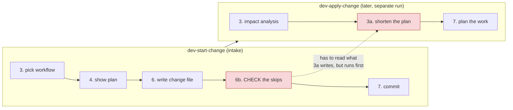
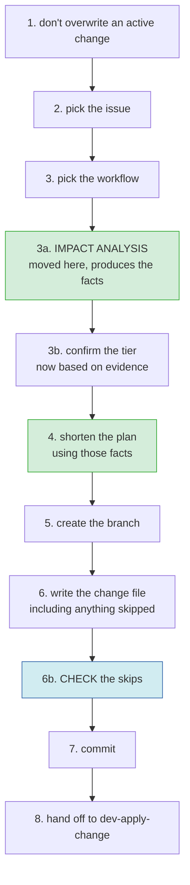
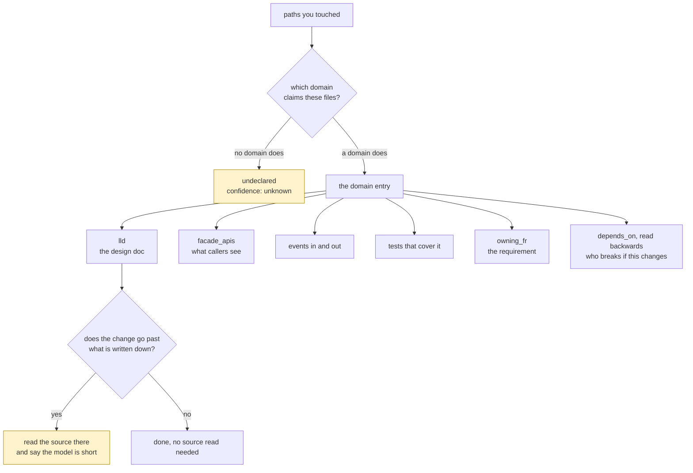

# Deciding how much process a change needs

**Status:** draft, for review
**Issue:** #97
**Replaces:** three attempts at this in 2.9.0, all of which failed review

## Why this document exists

I built this feature three times. All three failed review. Nine reviewers across three rounds, every one saying don't ship.

None of the three was ever designed first. I went from idea to code each time. And every failure was the same kind of problem: two parts of the system that had to agree, and didn't. Each part worked on its own, so reviewing the code never caught it.

| attempt | what went wrong |
|---|---|
| 1 | nothing ever called the tool, so no record was written |
| 2 | the tool looked at your change before you had made it |
| 3 | the record was written correctly, but the thing meant to check it had already finished |

Each time I fixed the part I was shown, and the break moved one link along.

## The problem we are solving

Someone asked for one line to be added to a shell script. HITL ran 31 steps and took three and a half hours.

There are two reasons for that. The second is the real one.

First, nothing shortens a plan. The settings meant to do that never reach the file HITL actually reads, so every change in every project gets the same 31 steps.

Second, HITL decides how much process a change needs before it has looked at the change. Intake asks you to pick a tier, then shows you a plan. Your code is not read until a separate command, run later.

## Why the three attempts could not work

Three things all have to be true, and today they cannot be.

1. The plan can only be shortened after something has read the code. That is the only point where anyone knows what the change involves.
2. The check that skipped steps were skipped legitimately runs near the end of intake.
3. That check has to see what the shortening produced.

Impact analysis lives in a second command that runs later. So the check finishes before the record exists. Fixing the writing end cannot help.



The dotted line is the problem. The check needs what the shortening produces, and it runs in an earlier command.

## What we are changing

Move impact analysis into intake, right after the conversation about what you want.

Then everything happens in one command, in an order where each step has what it needs:



Nothing else moves. The check stays where it is and starts working, because the record is now written before it runs. No file passed between commands, no second writer, no state crossing a boundary. All three of my failures were machinery I invented to bridge a gap that should not have been there.

## Impact analysis should look things up, not search

Today it says: search the codebase, don't guess, read the files. It does not look at the system manifest and does not look at Graphify.

That matters because the project already writes this down. Each domain in the manifest records:

| field | what it tells you |
|---|---|
| `files` | which domain owns the code you touched |
| `lld` | the design doc for that domain |
| `facade_apis`, `boundary_entities` | what other code can see |
| `depends_on` | who breaks if this changes, read backwards |
| `events_emitted`, `events_consumed` | what it sends and listens for |
| `tests` | what covers it |
| `owning_fr` | which requirement this exists to satisfy |
| `last_changed` | whether that description is likely still true |

Graphify indexes the code and the docs, rebuilds whenever a file is written, and is committed to the repo. So all of this can be looked up.



So impact analysis becomes: find the domain, follow what it declares, and read source code only where the change goes past what is written down.

That last part is where the quality comes from. If the change touches something no domain claims, that is worth saying. Either the manifest is out of date, or the change crosses a line nobody recorded. Searching the codebase would not tell you either way.

This also changes the cost. I told you earlier that moving impact analysis into intake would make intake slower. That was wrong. Most of the answer is already written down.

## What impact analysis has to hand over

Sizing needs facts, not prose. This is what it reads:

```yaml
impact:
  domains:      [billing]
  dependents:   [checkout, reporting]
  facades:      [POST /refund]
  events:       [refund.issued]
  docs:         [docs/.../billing.md]
  tests:        [tests/billing/]
  owning_fr:    FR-12
  paths:        [src/billing/refund.py]
  undeclared:   []          # touched, and no domain claims it
  confidence:   declared | partial | unknown
```

The last two matter most. If confidence is `unknown`, or anything is undeclared, the plan does not get shortened.

## What sizing does with it

Ranking already works. What is wrong is how a step decides whether it applies to your change. Right now it matches folder-name patterns I made up. It should match what the project actually declares:

- this step matters when the change touches these domains
- this step matters when something depends on the domain you touched
- this step matters when a public interface moves

The incident registry check can also work properly, because it can now match on domain names.

## When the plan does not get shortened

Shortening is earned by having good information. It is off when:

- confidence is `unknown`, or something touched is undeclared
- the project has no manifest
- the ranking data is missing or incomplete
- the workflow is anything other than `development`

In all of those cases you see the full plan and nothing is dropped. That is how 2.8.0 behaves. A plan gets shortened when there is a reason to shorten it, never because information was missing.

## What happens to the second command

- Its impact analysis step goes away. The facts arrive in the change file.
- Its first step currently re-guesses the tier from your description. That becomes a check against the recorded evidence.
- It becomes what it mostly already is: the thing that plans the implementation.

Both commands change together. This is the part most likely to go wrong and the part that most needs reviewing before any code is written.

## Upgrading

- A project that updates the plugin but not its own copy of the workflow file has no ranking data, so shortening is off and nothing changes for them.
- An existing change file is never re-read or rewritten.
- `dev-update` refreshes the copy. Until someone runs it, that project behaves as it does today.

## Not in scope

- Making profiles and tags actually filter the plan. They stay as advice.
- Any change to which steps are protected, or to the test-first rule.
- The compound-agentic manifest fields. This reads domains only.

## Questions for the reviewer

1. Does putting impact analysis in intake make the front door too heavy? Or should shortening be its own command, run between the two?
2. What should a stale manifest do? `last_changed` is a hint, not proof. Is `partial` confidence enough to shorten on?
3. Who is named as responsible for a skipped step recorded during intake? Only one person is there.
4. Should the workflow choice in step 3 also be rechecked once the analysis has run? It is picked from the issue text and never looked at again. That is the same weakness the tier had.
