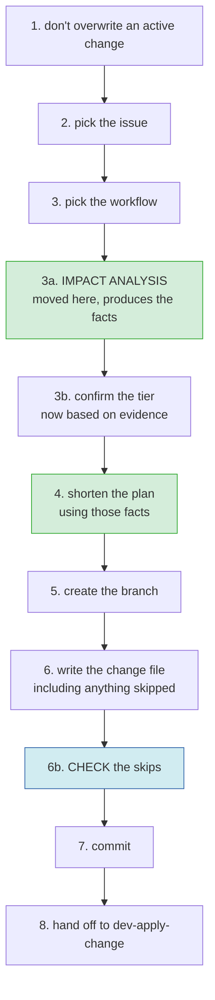
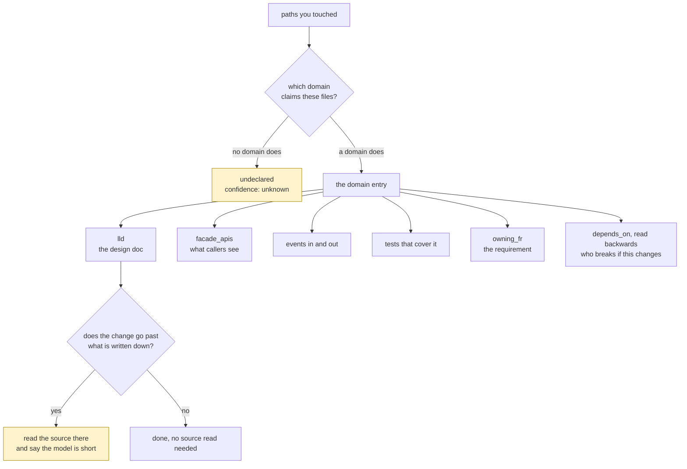

# Deciding how much process a change needs

**Status:** draft, for review · **Issue:** #97

The plan only. Background, the three earlier attempts and the review findings are on issue #97 and in `.hitl/reviews/incoming/`.

## 1. Move impact analysis into intake

It runs straight after the conversation about what you want, before the plan is shown.



Nothing else moves. The skip check stays at 6b and starts working, because the record now exists by the time it runs.

## 2. Impact analysis looks things up instead of searching



What it reads, per domain, from the system manifest:

| field | what it tells you |
|---|---|
| `files` | which domain owns the code you touched |
| `lld` | the design doc for that domain |
| `facade_apis`, `boundary_entities` | what other code can see |
| `depends_on` | who breaks if this changes, read backwards |
| `events_emitted`, `events_consumed` | what it sends and listens for |
| `tests` | what covers it |
| `owning_fr` | which requirement this exists to satisfy |
| `last_changed` | whether that description is likely still true |

Graphify already indexes the code and the docs and rebuilds on write, so this is a lookup.

Source code gets read only where the change goes past what is written down. When that happens, say so: either the manifest is out of date or the change crosses a line nobody recorded.

## 3. Impact analysis hands over facts, not prose

```yaml
impact:
  domains:      [billing]
  dependents:   [checkout, reporting]
  facades:      [POST /refund]
  events:       [refund.issued]
  docs:         [docs/.../billing.md]
  tests:        [tests/billing/]
  owning_fr:    FR-12
  paths:        [src/billing/refund.py]
  undeclared:   []
  confidence:   declared | partial | unknown
```

## 4. Shortening matches structure, not folder names

A step currently decides whether it applies to your change by matching folder-name patterns. Change it to match what the project declares:

- this step matters when the change touches these domains
- this step matters when something depends on the domain you touched
- this step matters when a public interface moves

The incident-registry check can then match on domain names, which it cannot do today.

## 5. When the plan is not shortened

Shortening is off, and you see the full plan, when:

- confidence is `unknown`, or something touched is undeclared
- the project has no manifest
- the ranking data is missing or incomplete
- the workflow is anything other than `development`

## 6. What changes in dev-apply-change

- Its impact analysis step is removed. The facts arrive in the change file.
- Its first step stops re-guessing the tier from your description and checks it against the recorded evidence instead.
- It becomes the thing that plans the implementation.

Both commands change together.

## 7. Upgrading

- A project that updates the plugin but not its own copy of the workflow file has no ranking data, so shortening is off and nothing changes for them.
- An existing change file is never re-read or rewritten.
- `dev-update` refreshes the copy. Until someone runs it, that project behaves as it does today.

## 8. Not in scope

- Making profiles and tags filter the plan. They stay as advice.
- Any change to which steps are protected, or to the test-first rule.
- The compound-agentic manifest fields. This reads domains only.

## 9. Questions for the reviewer

1. Does putting impact analysis in intake make the front door too heavy? Or should shortening be its own command, run between the two?
2. What should a stale manifest do? `last_changed` is a hint, not proof. Is `partial` confidence enough to shorten on?
3. Who is named as responsible for a skipped step recorded during intake? Only one person is there.
4. Should the workflow choice in step 3 also be rechecked once the analysis has run?
