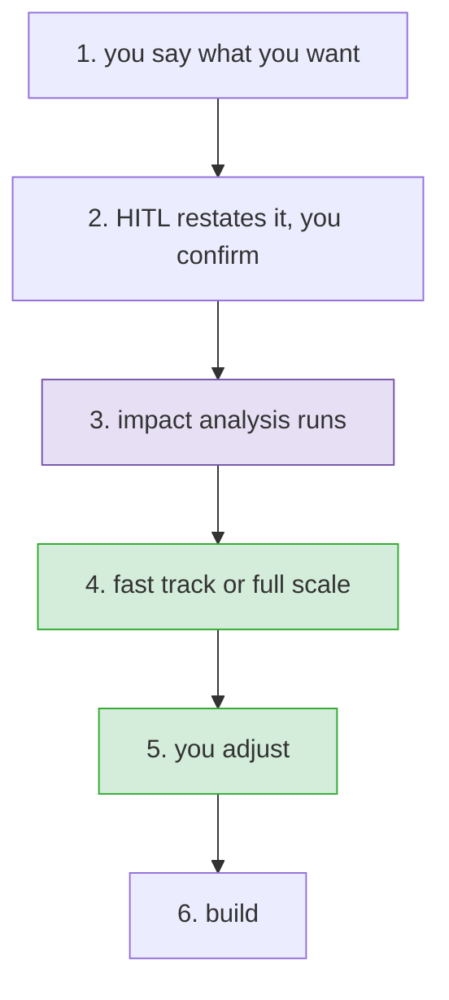

# Right-sizing a change

**Status:** agreed, ready to build · **Issue:** #97

## What happens

Six steps, one conversation. The plan does not exist until step 3 has run.

## 1. You say what you want

Unchanged. Intake asks, and asks again if it is unclear.

## 2. HITL restates it, you confirm

Before anything is read or planned, HITL writes back what it understood, in a fixed short shape:

- what you want
- what is in scope
- what is out

Three or four lines, not a document. You confirm or correct it.

This is the cheapest moment to catch a misread. Everything downstream is derived from this text, so
a misunderstanding here becomes a wrong impact analysis and then a wrong plan, and a wrong plan is
harder to argue with than a wrong sentence because it looks considered.

The confirmed text is written down, because it has to outlive the conversation:

| where | when |
|---|---|
| the issue description | always; HITL edits it directly, since you just approved the wording |
| the change file | always |
| the PRD | appended when the area has one; created only when the workflow is a feature |

A fix or a chore never creates a PRD.

## 3. Impact analysis runs

**Impact analysis is not a step in the plan. It is the thing that produces the plan.** It always
runs, it cannot be ticked off, and there is no plan yet to put it in.

It answers two questions:

**Where does this fit.** Which area of the system manifest owns it, and which workflow applies.

If no area owns it, HITL says so and asks one question: is this genuinely outside the system, like a
demo script or a CI config, or is the manifest missing an area? Outside means the fast track is the
locked floor and nothing else. Missing means HITL will not pretend it sized correctly, and offers
full scale or asks you to name the area.

**What does it affect.** Read top-down, cheapest source first:

| from the manifest | tells us |
|---|---|
| `files` | what code is in scope |
| `lld` | which design doc describes it |
| `facade_apis`, `boundary_entities` | what other code can see |
| `depends_on` | who breaks if this changes |
| `events_emitted`, `events_consumed` | what it sends and listens for |
| `tests` | what covers it |

Then the design docs the manifest points at, then source, and only where the declared picture is
thin or the change clearly goes beyond it. Say which of the three the answer came from, so a finding
resting on a hand-written field is not presented as if it came from the code.

### What this costs elsewhere

`impact` is currently a step in the catalog, marked floor at tier 3. Taking it out of the plan means:

- the development workflow drops from 34 steps to 33
- the tier 3 locked floor drops from ten steps to nine
- the check that every floor step must appear in the plan stops expecting it
- `apply-change` loses its step 3, because the work has already happened

## 4. Fast track or full scale

There are three sets, not two:

| | |
|---|---|
| every step the workflow defines | a list, not an offer |
| **the ones that apply to this change** | this is **full scale** |
| **the ones needed now** | this is **fast track** |

Full scale is not every step. Offering a Figma comparison on a backend change, or a training plan on
a one-line fix, makes the thorough option look stupid and teaches people to distrust it.

Both are shown, with the difference between them, and one line saying which is recommended and why.
The recommendation is advice. Taking full scale instead is not recorded.

### How a step is judged not to apply

Rules first, judgement where they are silent.

Each step's rule is checked against what impact analysis actually found. Where a rule answers, that
is the answer, and it is testable. Where no rule fits, HITL decides and says so in one line, such as
"dropping the Figma comparison, this change touches no interface files." The override is shown
rather than buried, so a bad call gets argued with and becomes a rule next time.

### What is locked

Two things, and nothing else:

- **The tier floor**, plus the test-first cycle. Four steps at tier 1, five at tier 2, nine at tier 3
  once `impact` leaves the plan. These cannot be unticked here.
- **Anything a rule put in.** These can be unticked, but not with one click. See step 5.

Risk is handled by the tier and by nothing else. A risky change is a high tier, a high tier locks
more, and the gap between the two options closes on its own. There is no second list of dangerous
categories, because a rule matching the word `API_KEY` is what turned a one-line shell script edit
into a three and a half hour path in the first place.

### The rules

Each step carries three lines of data in the catalog. Two exist already and stay as they are:

| line | what it is | example |
|---|---|---|
| `protects` | the sentence shown next to the step | "catches an interface change that breaks a caller" |
| `forgo_cost` | high, medium or low; orders the steps that are not in the fast track | `high` |
| `engages` | **the rule**: what must be true for this step to apply | needs rewriting |

`engages` exists on all 38 steps but does not yet do the job. Twenty-one development steps say
`always`, which puts them in every plan and so decides nothing. Five key off profiles, which never
reach the runtime, so they can never fire. Four match folder patterns, which is guesswork about what
a path means. Only three key off a real fact about the change, and one off a tag.

Every one gets rewritten in a single pass, to key off what impact analysis found rather than what a
path is called: does this area have a design doc, does anything depend on it, does it publish an
interface, does it emit events, does it have tests, did the analysis have to read source to answer.
Some will be wrong at first, and real changes will correct them.

## 5. You adjust

The list is tickable. A step put there by the tier floor cannot be unticked. Anything else can.

Unticking a step that a rule put in opens one short prompt, at that moment, asking two things:

- which of the three: a thin version now, later with a ticket, or not at all
- why

That is what the pull request checker reads, and it refuses to pass without both. Asking in the
moment rather than collecting reasons at the end means the answer is given while the thinking is
fresh, at the cost of an interruption per removal.

Locked steps are shown, greyed, with their reason next to them. Hiding them would mean you cannot
see what HITL decided on your behalf.

## 6. Build

The change file records the plan and everything removed, with who and why. The normal flow continues.

## What gets deleted

The whole 2.9.0 selection attempt: `ci/first-pass/rank.py`, `ci/first-pass/plan_select.py`,
`ci/first-pass/test_rank.py`, `ai/claude/start-change/selection.md`, and the intake changes that
call them. Steps 4 and 5 are built clean.

The catalog data stays. Only the code that scored with it goes.

The version rolls back to 2.8.0, which is what is actually published.

## What we are watching after this ships

**The friction is back on the light path.** Asking for a reason at each untick is the same cost named
in #97: the cheap path asks for paperwork while the expensive one asks for nothing. It only stays
cheap if the fast track is right often enough that unticking is rare. If the rewritten rules are
poor, this shows up as people quietly taking full scale because it asks fewer questions.

**Every change now pays for an impact analysis up front.** That is the price of the plan being built
on what is actually there. If it turns out to be slow on small changes, the fix is to make the
top-down read stop earlier, not to make it skippable, because a skippable plan-generator leaves no
plan.

## Not in scope

- Changing what the floor protects.
- Making profiles and tags filter the plan.
