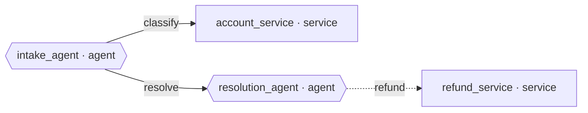

# Support assistant — evolving system map (generated)

```
support-assistant · compound-agentic surface
  ⬡ intake_agent  (agent · simple_agent)
  ▢ account_service  (service · deterministic)
  ⬡ resolution_agent  (agent · simple_agent)
  ▢ refund_service  (service · deterministic)
    intake_agent ─▶ account_service
    intake_agent ─▶ resolution_agent
    resolution_agent ··▶ refund_service
  getting:    boundary · classify · evals · observability · privilege · reliability
  available:  deploy
  not needed: memory
```


