# Fast Track, start to finish

Fast Track is the fewest steps that get a change to done. HITL works out which steps your change
needs from what it touches, shows you everything it left out, and lets you tick any of it back in.
Nothing drops silently, and the steps that protect production never drop without a named person.

This page follows one bug fix through intake. Every screenshot is from a real session: Claude Code
2.1.269 running HITL 2.13.0 on a small demo store called Shopfront. The only edit is the folder
path, shortened to `~/shopfront`.

**The bug (issue #42).** A customer who clears the discount box and presses Pay gets a 500:
`apply_discount(total, "")` raises `KeyError`. Done means a blank code leaves the total unchanged.

## 1. Say your goal

With no change active, the status line says what to do.

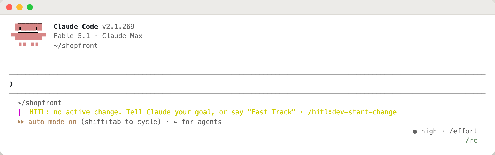

Give the goal in one sentence and what done looks like. Saying "Fast Track" is optional: intake
offers it either way.

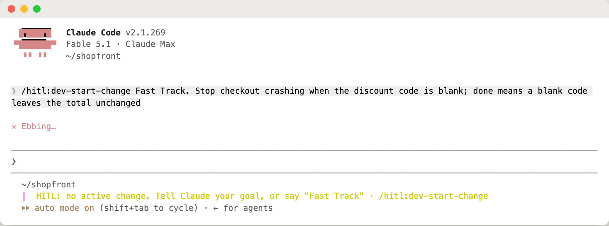

## 2. It checks the bug, then says back what it understood

Before planning anything, Claude ran the code and confirmed the crash: a blank code raises
`KeyError` and `None` raises `AttributeError`. Then it asks you to confirm its restatement, and
settles the one open question: what an unknown code should do.

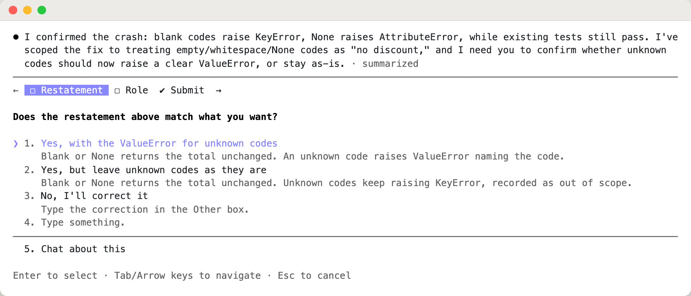

## 3. It works out what the change reaches

The impact analysis reads the manifest, the design doc and the code, and looks for callers. Here it
found one area, no dependents and no data change. The one thing it can't read from code is whether
the change touches security, so it asks.

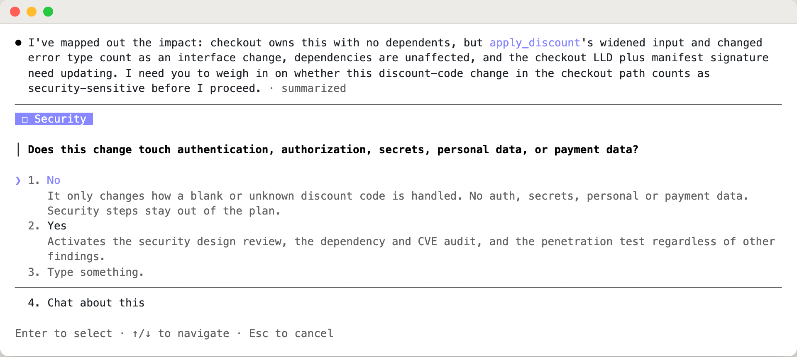

## 4. A tier from the findings, and the call it made for you

Claude proposes Tier 1 and names the finding behind it. It also tells you the judgement it made that
you might not share: it did not count accepting `None` as an interface change. If you disagree,
three steps come back into the plan. Each tier option shows what it would do to the Fast Track step
count.

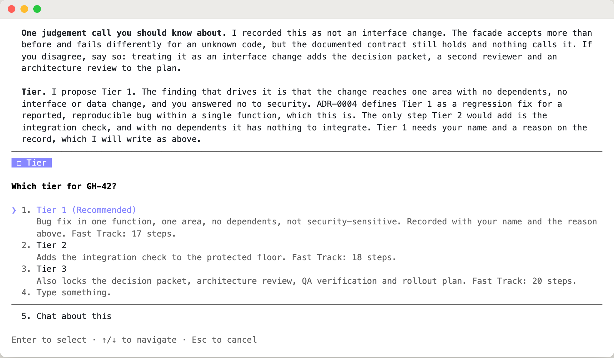

## 5. Fast Track or Full Scale

Two sizes of the same plan. The preview lists every step in Fast Track and everything it leaves out;
move down to Full Scale to see the other list. For this fix, Fast Track is 17 steps and Full Scale
is 27.

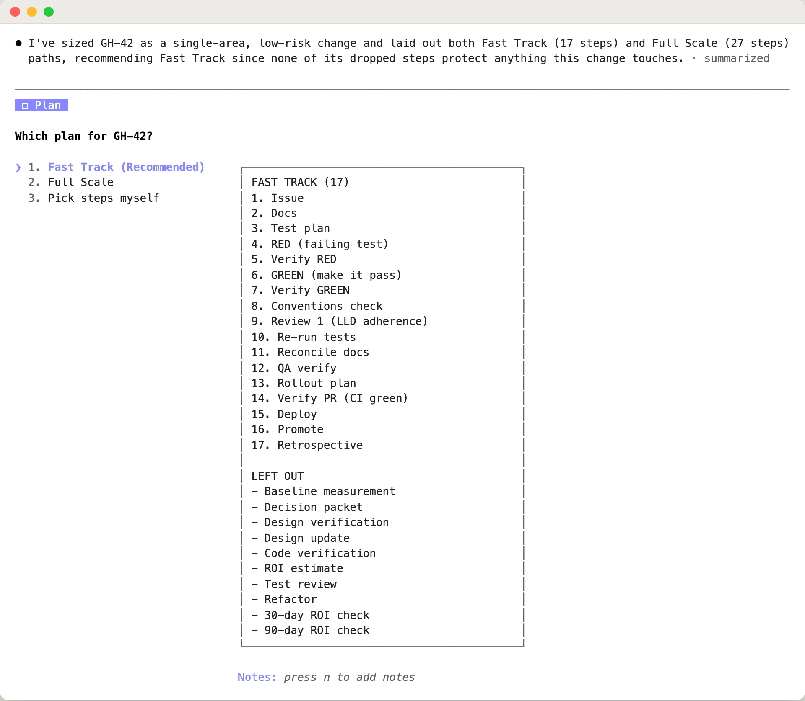

## 6. Tick anything back in

Everything Fast Track left out comes back as checkboxes, most consequential first. Each one says
what the step protects and what leaving it out costs. You don't have to ask for them.

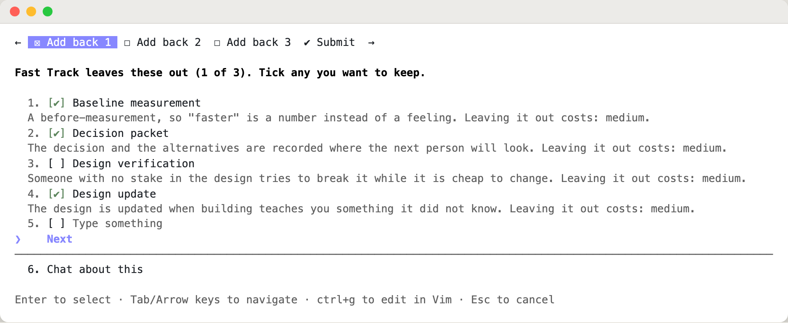

In this run the developer kept five: baseline, decision packet, design update, code verification
and test review. Before submitting, you see every choice in one place.

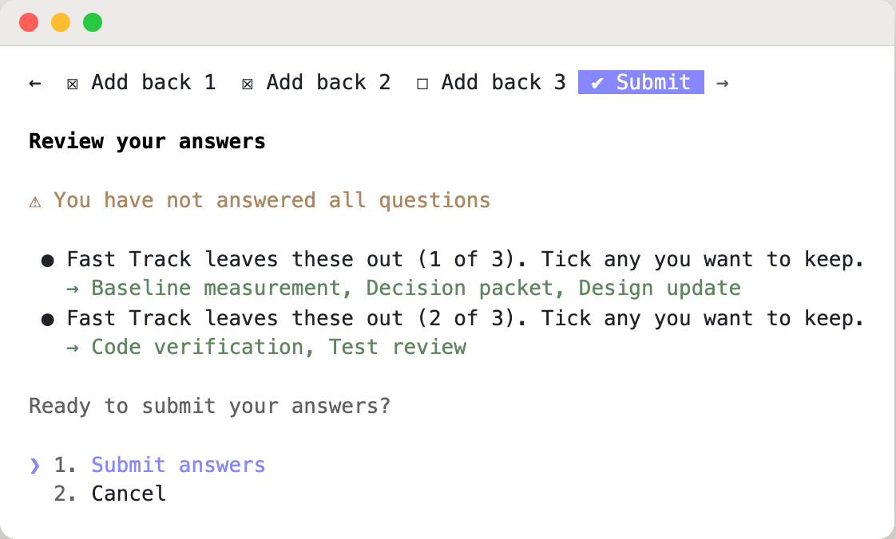

Want it lighter still? Pick "Pick steps myself" at the plan question and a second screen follows:
the steps in the plan you could leave out, cheapest to drop first. The steps that always stay are
not on it. A step you tick gets a lighter form: a thin starter, a deferral with a follow-up issue,
or a decline. This screenshot is from a second run of the same fix, where Conventions check was
deferred to a follow-up issue.

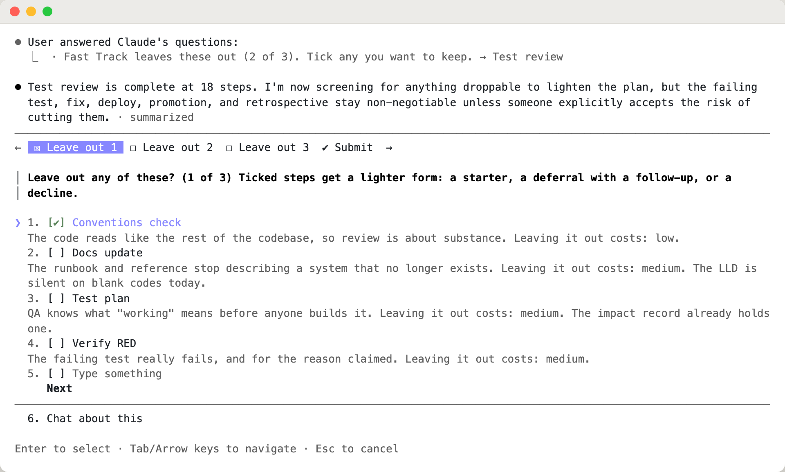

## 7. Recorded, and on its way

The plan, the tier and every left-out step go into `.hitl/current-change.yaml`, each with who decided
and why. The breadcrumb shows a left-out step as ⊘, so it is visibly skipped rather than gone.
Claude also points out the one kept step that has little to do on a crash fix.

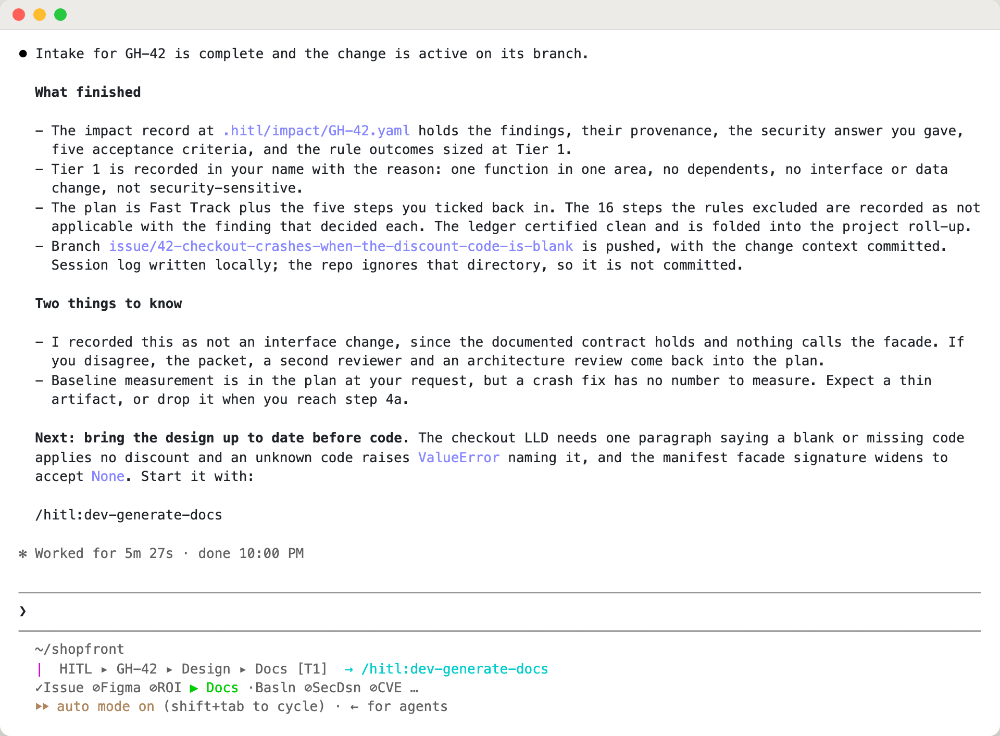

After the design doc step, the breadcrumb moves on and names the next command.

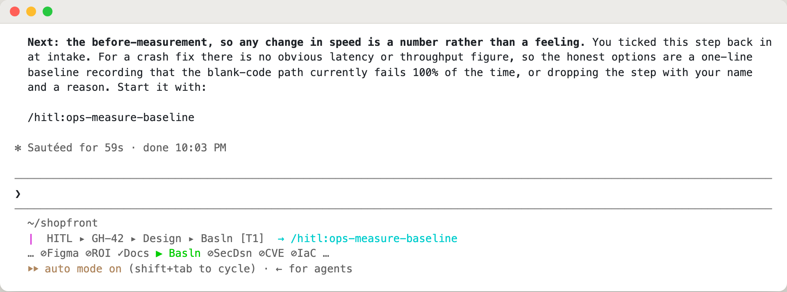

## What always stays

| Step | Rule |
|---|---|
| Write the failing test, make it pass | Always stay. They can be made thin (one test), never dropped |
| Deploy, promote, the retrospective | Dropped only if a named person accepts the risk |
| Integration check (tier 2 and up); decision packet, architecture review, QA check and rollout plan (tier 3) | Same: a named person accepts the risk |
| Penetration test (any tier), security design review and dependency audit (tier 3), when the change touches security or dependencies | Same: a named person accepts the risk |

## What Fast Track is not

- **Not quieter protection.** Every left-out step is recorded with the finding that dropped it, and
  the retrospective reads that record back.
- **Not a shortcut through intake.** Intake still reads the code, reproduces the bug and asks what
  it can't know. Fast Track cuts the steps that come after.

To try it, run `/hitl:dev-start-change` and say your goal. The [getting-started guide](getting-started.md#fast-track-the-fewest-steps)
covers the rest of the workflow.
