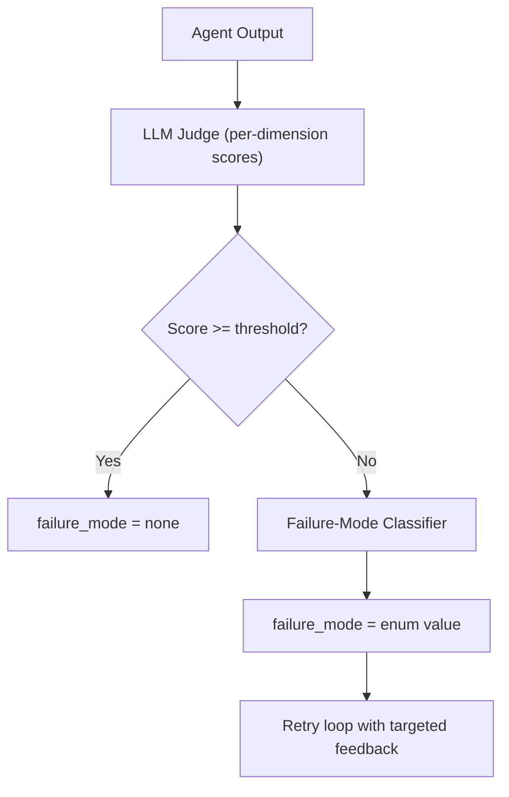

# Pattern: Per-Agent Failure Mode Taxonomy

**Applies to:** Agentic systems with LLM-based self-evaluation

---

## The Problem

A single quality score (e.g., "self_eval = 0.72") tells you **whether** an agent failed, but not **how** it failed. When an agent's pass rate drops, you open the trace viewer and see a wall of low-scoring traces — each with a different root cause. Without categorization, iteration is directionless: you tweak prompts based on hunches from reading 5–10 traces.

## The Pattern

Define a small (4–6 modes) **failure taxonomy per agent**. When a trace fails the quality threshold, an additional classifier tags the trace with one failure mode. This makes the "what to fix next" question queryable.

## How It Works

1. **Define the taxonomy** — 4–6 failure modes specific to each agent. Each mode should suggest a different fix.
2. **Classify on failure only** — run the classifier only when the trace fails the threshold. Cost: one extra LLM call per failed run, not per run.
3. **Tag the trace** — attach the failure mode as a structured score in your observability tool (e.g., Langfuse score).
4. **Query and iterate** — "show me brand-voice failures from the last 7 days" becomes possible.

## Example Taxonomy

For a **content generation agent** (4 modes + `none`):

| Mode | Description | Typical fix |
|------|-------------|-------------|
| `brief_understanding` | Output addresses the wrong intent — wrong topic, wrong audience | Improve brief-extraction prompt; add disambiguation |
| `brand_voice` | On-topic but wrong tone, register, or vocabulary | Update brand context; refine voice examples |
| `creative_quality` | On-brand but generic, repetitive, or low-effort | Adjust creativity weight; raise temperature; expand examples |
| `factual_accuracy` | References things that don't exist or contradict source data | Tighten RAG scope; add hallucination guardrail |

For a **code generation agent** (4 modes + `none`):

| Mode | Description | Typical fix |
|------|-------------|-------------|
| `requirement_miss` | Output doesn't address the stated requirement | Improve requirement extraction from the prompt |
| `convention_violation` | Code works but doesn't follow project conventions | Include conventions in context; add convention checker |
| `logic_error` | Code follows conventions but has incorrect behavior | Improve test generation; add edge case examples |
| `integration_gap` | Code works in isolation but breaks when integrated | Include more dependency context; add integration tests |

## Design Guidelines

- **Keep it small** — 4–6 modes. More than that and the classifier becomes unreliable.
- **Each mode suggests a different fix** — if two modes have the same fix, merge them.
- **Modes are per-agent** — a content agent fails differently than a code agent.
- **`none` is always a mode** — traces that pass the threshold get `failure_mode = none`.
- **The classifier receives the eval scores** — it doesn't re-evaluate from scratch; it reads the per-dimension scores and categorizes.

## What This Enables

| Capability | Without taxonomy | With taxonomy |
|-----------|-----------------|---------------|
| "Why did pass rate drop?" | Read 20 traces manually | Query: group failures by mode, see which spiked |
| "Did my prompt change help?" | Compare aggregate scores | Compare per-mode scores: "brief_understanding +12%, brand_voice -3%" |
| Model comparison | "Model A: 0.78, Model B: 0.81" | "Model B is +15% on factual accuracy, -5% on creative quality" |
| PM prompt editing | Blind — can't tell what dimension changed | PM sees which mode improved and which regressed |

## Related

- [Agent maturity levels](https://github.com/Prasad-Apparaju/agentic-platform/blob/main/docs/patterns/agent-maturity-levels.md) — failure taxonomy applies at L3 (self-evaluating agents)
- [Agent observability](https://github.com/Prasad-Apparaju/agentic-platform/blob/main/docs/patterns/agent-observability.md) — how to instrument traces for taxonomy tagging
