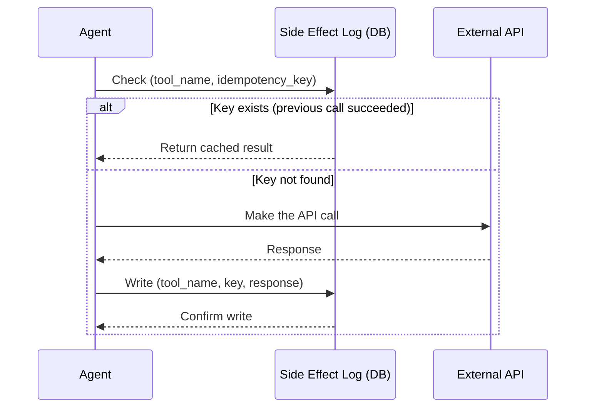

# Pattern: Idempotency Keys for External Side Effects

**Applies to:** Any system where agents or services call external APIs that produce side effects (posting to social media, sending emails, charging payments, etc.)

---

## The Problem

When an agent calls an external API and the response is lost (timeout, crash, network issue), a retry will call the API again. If the first call actually succeeded, you get a duplicate side effect — two posts, two emails, two charges. This is user-visible and often reputationally costly.

In-memory replay logs (memoizing tool calls within a single agent run) protect against **same-run retries**. They do NOT protect against:
- User double-click (two separate requests → two agent runs)
- Scheduler duplicate fires (two pods trigger the same job)
- Admin manual re-runs
- Crash between "external call succeeded" and "result persisted"

## The Pattern

Introduce a persistent **side effect log** keyed on a stable **idempotency key** derived from business state, not runtime state.



### Key design: write the log BEFORE returning

The critical difference from a replay log: the side effect log is written **after the external call succeeds but before the result is returned to the caller**. This closes the gap where a crash between "call succeeded" and "log written" causes a false miss on retry.

## The Idempotency Key

The key must be **derived from business intent**, not from runtime state:

| Good key | Bad key | Why |
|----------|---------|-----|
| `campaign_123:post_0:instagram` | `trace_abc123` | Business intent is the same across retries; trace_id changes per run |
| `order_456:charge` | `request_id_789` | Multiple requests for the same order should dedupe |
| `user_42:welcome_email` | `timestamp_1234567` | Timestamp changes on every retry |

**Formula:** `{entity_id}:{action}:{target}` — identifies WHAT is being done to WHAT, not WHO is doing it or WHEN.

## Two Logs, Two Concerns

If your system already has a replay/memoization log (e.g., LangGraph checkpoint), the idempotency log is complementary, not redundant:

| | Replay Log (existing) | Side Effect Log (new) |
|---|---|---|
| **Purpose** | Determinism within a single run | Exactly-once across all runs |
| **Key** | `(run_id, step, input_hash)` | `(tool_name, idempotency_key)` |
| **Scope** | One agent run | Global, all time |
| **Lifetime** | Per run (cleaned after N days) | As long as the external resource exists |
| **Miss behavior** | Execute tool, write log after | Execute external call, write log before returning |

## Schema (example)

```sql
CREATE TABLE external_side_effect_log (
    tool_name   VARCHAR(100) NOT NULL,
    idempotency_key VARCHAR(500) NOT NULL,
    response    JSONB NOT NULL,
    created_at  TIMESTAMPTZ DEFAULT NOW(),
    PRIMARY KEY (tool_name, idempotency_key)
);

CREATE INDEX idx_side_effect_created ON external_side_effect_log(created_at);
```

## Implementation Checklist

- [ ] Every tool that calls an external API accepts an `idempotency_key` parameter
- [ ] The tool raises an error if the key is missing (fail-safe, not fail-open)
- [ ] The key is derived from business state, not runtime state
- [ ] The side effect log is checked BEFORE the external call
- [ ] The side effect log is written AFTER the external call succeeds, BEFORE returning
- [ ] A monitoring alert fires if duplicate keys are seen within a short window (indicates a retry storm)

## What This Prevents

| Scenario | Without idempotency | With idempotency |
|----------|:------------------:|:----------------:|
| User double-click | Two posts published | Second call returns cached result |
| Scheduler duplicate fire | Two emails sent | Second pod gets cached result |
| Crash after external call | Retry causes duplicate | Log was written; retry gets cached result |
| Admin re-run | Unintended duplicate | Admin must explicitly provide a new key to force re-execution |

## Related

- Transient failure retry policy (see agentic-platform patterns) — retry logic that works with idempotency
- Agent maturity levels (see agentic-platform patterns) — idempotency is required at L2+ (tool-using agents)
