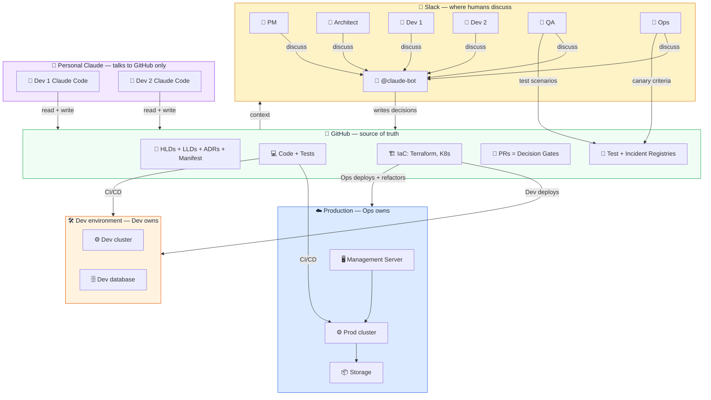
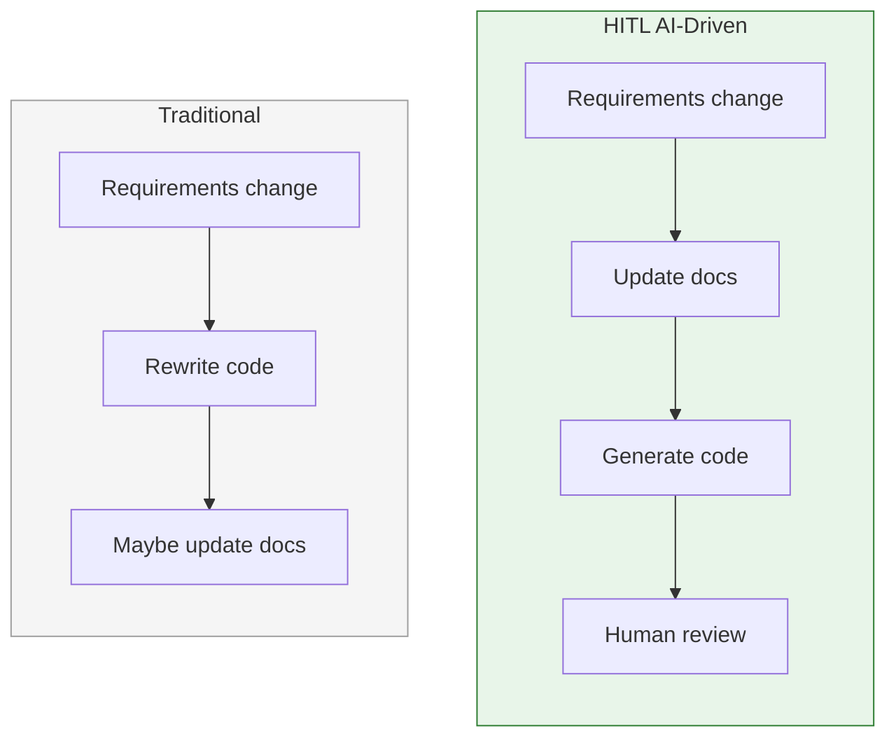

# Core Concepts — Why This Process Exists

## The Core Idea

> AI makes code cheap. This process makes decisions durable.

Design decisions are discussed as a team — PM, Architect, Developers, QA, Ops, and AI — in a shared thread. Once a decision is finalized, it is captured in documentation: HLDs for architecture, LLDs for component design, ADRs for trade-offs, and a System Manifest for domain boundaries. From that point forward, **all downstream activities — code generation, testing, code review, deployment planning, and ROI verification — are driven off that documentation.** The documentation is not a record of what was built. It is the specification that drives what gets built.

This inverts the traditional relationship between docs and code. Write documentation first — with AI's help, significantly faster (observed in pilot projects) — and generate the code from it. When the code diverges from the docs, pause and decide: does the implementation reveal a better design (update the docs), or did the implementation drift from the intended design (fix the code)? The decision is explicit and documented — never silently normalize drift. Any developer (or AI session) can then pick up any part of the system, read the docs, and produce correct, convention-honoring code — because the docs capture not just *what* the system does, but *why* it does it that way, *what alternatives were considered*, and *what conventions must be followed*.

### The Core Loop

The process is not "AI writes docs, then AI writes code."

The process is:

1. A human states intent.
2. AI turns that intent into a concrete artifact: PRD, HLD, LLD, ADR, test plan, decision packet, or code.
3. Humans review the artifact and disagree with it where needed.
4. AI revises the artifact.
5. The team repeats until the artifact expresses the decision accurately.
6. Only then does AI use that artifact to generate the next downstream artifact.

Design is reviewed through generated documents. LLD is reviewed through precise interfaces, edge cases, and tests. Code is reviewed against the LLD and tests. Each layer is an iterative human-AI convergence loop before it becomes input to the next layer.

**The value is not that AI produces artifacts. The value is that AI makes intent visible fast enough for humans to correct it before it becomes code.**

### Shared Memory Across AI Harnesses

Every developer's AI harness has its own context window, chat history, local memory, and assumptions. If decisions live inside those private sessions, the team fragments.

This process moves team knowledge out of private AI memory and into version-controlled artifacts:

- Requirements live in issues and PRDs.
- Architecture lives in HLDs.
- Component behavior lives in LLDs.
- Tradeoffs live in ADRs.
- Domain boundaries and facade contracts live in the system manifest.
- Standards live in `CLAUDE.md` and convention checks.
- Past failures live in the incident registry.
- Test expectations live in the test registry.
- Per-change intent lives in decision packets.

Any human or AI harness can read the same artifacts and continue from the same agreed context. The unit of collaboration is not the chat session. **The unit of collaboration is the documented decision.**

On large projects, the full artifact set can exceed the AI's context window. [Graphify](https://github.com/safishamsi/graphify) indexes these artifacts as a knowledge graph, so AI skills retrieve only the relevant domain slice via graph queries instead of reading entire files. This keeps token cost predictable as the doc set grows. Skills fall back to direct file reads automatically if Graphify is unavailable.

> Private AI context does not scale. Version-controlled decisions do.

> **[Download editable PowerPoint version](docs/hitl-team-collaboration.pptx)** — 4 slides covering team collaboration, the 30-step workflow, and the three boundaries.

View as Mermaid diagram (text-based, copy-pasteable)

---

## 1. The Problem This Solves

The goal is a **coherent, traceable implementation** where:

- The team **critically reviews requirements** before anyone writes or generates code
- Design decisions are **thought through, discussed, and agreed** — not invented by individual AI sessions
- Every piece of code **traces back to a reviewed design decision** — requirement → design → code → test → deployment
- The team **communicates important decisions** to each other and to downstream stakeholders (PM, ops, QA)
- **Everything is documented** — not as an afterthought, but as the specification that drives what gets built
- AI generates code that **conforms to what the team agreed and documented** — it implements decisions, it does not make them

Without this discipline, AI code generation amplifies problems instead of solving them:

| What goes wrong | Why it happens | What it costs |
|----------------|---------------|---------------|
| **Incoherent codebase** — three error handling strategies, two naming conventions, inconsistent patterns | Each developer's AI session invents its own approach. No shared specification constrains the output. | Rework. Every new feature must untangle which pattern to follow. |
| **Untraceable decisions** — "why does this work this way?" has no answer | Design decisions live in ephemeral AI chat transcripts, not in reviewed documents. | Debugging is significantly more expensive than prevention (industry consensus). New team members can't understand the system. |
| **AI invents instead of implementing** — plausible but wrong code that compiles and passes naive tests | AI was given a vague instruction ("implement publishing") instead of a precise spec. It filled the gaps with hallucinated assumptions. | Bugs surface in integration, not in unit tests. The fix requires re-examining the design. |
| **Decisions don't reach stakeholders** — PM promises features that don't exist, ops deploys without knowing the failure modes | No formal step for communicating what changed, what can break, and how the team's mental model needs to update. | Organizational confusion. Support troubleshoots based on stale assumptions. |

These problems exist in traditional development too, but AI amplifies them because of the sheer volume of code it produces.

### 1.1 How this process addresses each goal

| Goal | How the process achieves it | Where in the workflow |
|------|----------------------------|----------------------|
| **Coherent implementation** | System manifest defines domain boundaries and conventions. CLAUDE.md inlines the rules into every AI session. Convention checker enforces in CI. | Manifest (pre-work), CLAUDE.md (every session), CI (every PR) |
| **Critical review of requirements** | Design PR must merge before code starts. Team reviews HLD/LLD in PR comments. No code generation until design is locked. | Steps 3-5 (design phase), Design PR gate |
| **Decisions thought through** | HLD captures architecture. LLD captures component design. ADRs capture trade-offs and alternatives. TDD tests reveal spec gaps before code exists. | Update docs (step 5), Test case planning through Verify RED (steps 7, 9-12) |
| **Traceability** | Issue → design PR → impl PR → traceability check. Lead verifies the chain is unbroken at integration verification. | GitHub issue (step 1), Integration verification (step 24) |
| **Team communication** | Downstream impact brief tells PM, QA, and ops what changed. PM mental model update section ensures product team stays current. | Downstream impact brief (step 21) |
| **Institutional memory** | Test registry catalogs every test by domain, risk, and origin. Incident registry connects past failures to regression tests and canary criteria. Both are queryable during impact analysis so the team doesn't repeat past mistakes. | Impact analysis (step 3), Test case planning (step 7), Risk-rated rollout plan (step 22), post-incident |
| **QA + Ops without bottlenecks** | QA and Ops contribute to specs (design time) and monitoring (canary time), not to gates (merge time). Their past inputs live in the registries — available even when the individuals are not. | Design PR review, Test case planning (step 7), Risk-rated rollout plan (step 22), canary monitoring |
| **Everything documented** | Docs written before code (steps 3-5). If implementation diverged, the team explicitly decides whether to update docs or fix the code (reconcile docs, step 20). Updated in every PR. | Steps 3-5 (before), Reconcile docs step 20 (after), every PR |
| **AI conforms to agreements** | Tests written first define expected behavior. Convention checker verifies compliance. Two-round code review checks LLD adherence. | TDD phase (steps 9-12), Code review rounds (steps 17-18), CI |

### 1.2 Why documentation first

Treat the LLD as a spec, not a narrative: precise interfaces, explicit edge cases, exact method signatures. Vague prose produces vague code.

**Known limitation:** this works best when the domain and framework are well-understood. For exploratory work, see the Unknown (PoC) phase in Section 5.

---

