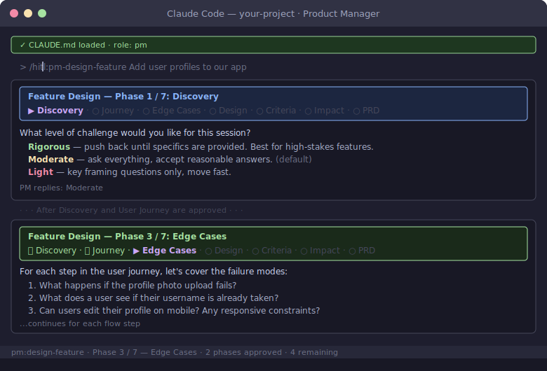

# PM Guide — Using Claude to Drive Product Requirements

**Audience:** Product Owner
**Setup:** Clone the repo, open in your IDE with Claude Code (VS Code, Cursor, or CLI).

```bash
git clone https://github.com/your-org/your-project.git
cd your-project
```

Claude auto-loads the PRD, architecture, and process docs — you don't need to read them manually.

---

## Your Commands

Type these in Claude Code. Claude loads the right context automatically.

| Command | What it does |
|---|---|
| `/pm:design-feature <rough idea>` | Guided 7-phase process: shapes a rough idea into structured requirements, a UI prototype, and acceptance criteria |
| `/pm:add-feature <description>` | Draft a new requirement in the PRD with acceptance criteria, use case, and GitHub issue |
| `/pm:update-requirement FR-xxx-N <change>` | Update an existing requirement, flag ripple effects |
| `/pm:review-progress` | Gap analysis: PRD requirements vs what's actually built |
| `/pm:prioritize` | Review backlog by priority, suggest promotions/demotions |
| `/pm:report-bug <description>` | Create a structured GitHub issue (checks for duplicates first) |
| `/pm:answer-questions` | Walk through PRD §10 open questions one at a time, resolve them |
| `/pm:prep-demo` | Generate a demo checklist from PRD use cases + acceptance criteria |
| `/pm:review-scope-change <PR#>` | Summarize a team-proposed PRD change, generate review questions |

---

## Designing a Feature with `/pm:design-feature`

Use this command when you have a rough idea and need to shape it into something the team can build from. It runs you through 7 phases — each one requires your approval before moving to the next.



A progress banner appears at the top of every phase so you always know where you are and how far you've come:

```
---
Feature Design — Phase 3 / 7: Edge Cases
✅ Discovery · ✅ Journey · ▶ Edge Cases · ○ Design · ○ Criteria · ○ Impact · ○ PRD
---
```

**The 7 phases:**

| Phase | What happens |
|---|---|
| 1 · Discovery | Claude asks about the problem, evidence, success criteria, and scope. You pick the challenge level (Rigorous / Moderate / Light). |
| 2 · User Journey | Walk through the feature step by step — what the user sees, what they do, and what happens. |
| 3 · Edge Cases | Cover failure modes: empty states, errors, timeouts, duplicate actions, mobile constraints. |
| 4 · Design | If it has a UI: prototype with Claude Design (or bring your own sketch/Figma file). Required before Phase 5. |
| 5 · Criteria | Claude writes testable acceptance criteria from the approved design. You confirm before they go into the PRD. |
| 6 · Impact | Honest assessment: effort range, architecture implications, dependencies, technical debt. |
| 7 · PRD | Claude writes the requirement into the PRD and creates a GitHub issue. |

You can defer any question to a **TODO list** ("add that to open items") and come back to it — Claude won't block you, but will show the open items at the end of Phase 1.

---

## Your 4 Touchpoints in the Development Process

You don't need to be involved in every step. Here's where you contribute:

| When | What you do | What you review | Time |
|---|---|---|---|
| **1. Requirements** | Write/update the PRD using the prompts above | — | Hours |
| **2. Design review** | Review HLD for product alignment | Does the architecture support what you asked for? | 30 min |
| **3. Impact brief** | Read Section 4 (PM mental model update) | What assumptions changed? What can you tell customers? | 10 min |
| **4. Demo** | Accept or request changes | Does it match the acceptance criteria in the PRD? | 30 min |

Everything between these touchpoints — test generation, code generation, code review, convention checks — is handled by the architect and engineers.

---

## How to Write Requirements Claude and the Team Can Use

AI generates code from your requirements (through HLDs and LLDs the architect creates from your PRD). The quality of what AI produces depends on the clarity of what you write.

### Do this

- **Be specific:** "Users can filter products by category, price range, and availability" — becomes 3 filter components
- **Include acceptance criteria:** "When the user selects 'In Stock', only products with inventory > 0 appear" — becomes a test case
- **Describe edge cases:** "If no products match the filter, show 'No results found' with a link to clear filters" — AI misses edge cases unless you specify them
- **Use Must Have / Should Have / Nice to Have** — tells the team what to build first
- **State what's out of scope** — prevents features you didn't ask for

### Don't do this

- **Don't specify technical implementation:** "Use JWT with bcrypt" — that's the architect's decision
- **Don't be vague:** "The system should be user-friendly" — can't generate code from this
- **Don't skip acceptance criteria:** "Add a dashboard" — showing what? For whom? What data?

### Template

Use the [PRD template](../../templates/prd-template.md) for new sections.

---

## How to Read an Impact Brief

Every significant change produces a **downstream impact brief** before deployment. Section 4 is written for you:

> **Section 4: Product Mental Model Update**
> What assumptions do you currently hold that are no longer true after this change?

Examples:
- "Publishing now supports 3 channels instead of 2. The new channel has a daily post limit of 100."
- "Approve no longer triggers immediate publish — it queues for scheduled delivery."

**What to do with it:** Update your roadmap, customer communications, and support docs based on what changed. If the mental model update is wrong or incomplete, flag it.

---

## What You Don't Need to Do

- **Read HLDs/LLDs** — unless you're curious. The architect translates your requirements into technical design.
- **Review code** — that's the dev team's job. You review the demo.
- **Understand the system manifest** — that's the architect's tool.
- **Write tests** — AI generates tests from the LLDs.
- **Attend daily standups about code** — your touchpoints are requirements, design review, impact brief, and demo.

---

## Quick Reference

| I want to... | Do this |
|---|---|
| Add a new feature | Use prompt #2 above to draft it in the PRD, then create a GitHub issue |
| Change a requirement | Use prompt #3 to update the PRD, notify the architect |
| See what's done vs what I asked for | Use prompt #5 for a gap analysis |
| Understand what shipped | Read Section 4 of the impact brief |
| Report a bug | Use prompt #8 to create a GitHub issue |
| Prioritize work | Use prompt #7 to review the backlog |
| Answer open questions | Use prompt #10 to resolve them in the PRD |
| Review the architecture | Ask Claude: "Read the HLDs and tell me if they cover my PRD requirements" |

---

## Escalation

The team escalates to you for:
- **PRD scope changes** — they propose via PR with a diff to `docs/01-product/prd.md`. You approve or reject.
- **Priority conflicts** — you decide what gets built next.
- **Acceptance** — you sign off on whether a delivered feature meets the product intent.

All discussions happen through documented artifacts (PRD diffs, impact briefs, GitHub issues) — not verbal-only.
