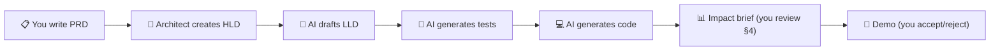

# PM Guide — Your Role in the HITL AI-Driven Development Process

This guide explains how you — as a Product Manager — participate in the development process. AI generates code, tests, and documentation from your requirements. Your job is to make those requirements clear, review what AI produces, and make product decisions.

---

## How Your Requirements Become Working Software



Your PRD is the starting point for everything. The more specific your requirements and acceptance criteria, the fewer iterations the team needs.

---

## Your 4 Touchpoints

You don't need to be involved in every step. Here's where you contribute:

| When | What you do | What you review | Time |
|------|------------|----------------|:----:|
| **1. Requirements** | Write/update the PRD | — | Hours |
| **2. Design review** | Review HLD for product alignment | Does the architecture support what you asked for? | 30 min |
| **3. Impact brief** | Read Section 4 (PM mental model update) | What assumptions changed? What can you now tell customers? | 10 min |
| **4. Demo** | Accept or request changes | Does it match the acceptance criteria in the PRD? | 30 min |

Everything between these touchpoints — test generation, code generation, code review, convention checks — is handled by the dev team and AI.

---

## How to Write Requirements AI Can Use

AI generates code from your requirements (indirectly — through the HLDs and LLDs the architect creates from your PRD). The quality of what AI produces depends on the clarity of what you write.

### Do this

- **Be specific:** "Users can filter products by category, price range, and availability" — AI generates three filter components
- **Include acceptance criteria:** "When the user selects 'In Stock', only products with inventory > 0 appear" — this becomes a test case
- **Describe edge cases:** "If no products match the filter, show 'No results found' with a link to clear filters" — AI misses edge cases unless you specify them
- **Use Must Have / Should Have / Nice to Have** — this tells the team what to build first
- **State what's out of scope** — prevents AI from generating features you didn't ask for

### Don't do this

- **Don't specify technical implementation:** "Use JWT with bcrypt for auth" — that's the architect's decision (ADR), not the PRD
- **Don't be vague:** "The system should be user-friendly" — AI can't generate code from this
- **Don't skip acceptance criteria:** "Add a dashboard" — dashboard showing what? For whom? What data? What actions?

### Template

Use the [PRD template](../../templates/prd-template.md) to structure your requirements. It includes inline guidance on writing requirements that work well with AI.

---

## How to Read an Impact Brief

Every significant change produces a **downstream impact brief** before deployment. Section 4 is written for you:

> **Section 4: Product Mental Model Update**
> 
> What assumptions do you currently hold that are no longer true after this change?

Examples:
- "Publishing now supports 3 channels instead of 2. The new channel has a daily post limit of 100."
- "Approve no longer triggers immediate publish — it queues for scheduled delivery."
- "Users can now see campaign performance metrics in real-time instead of next-day batch."

**What to do with it:** Update your roadmap, customer communications, and support docs based on what changed. If the mental model update is wrong or incomplete, flag it — the dev team may have missed something.

---

## How to Iterate on Agent Prompts (for AI/agentic products)

If your product includes AI agents, you can change what agents do without engineering involvement. Agent behavior is controlled by **skill files** — versioned markdown files that define the agent's instructions.

```
skills/
├── campaign-generator/
│   └── system-prompt.md    ← You can edit this
├── style-transfer/
│   └── system-prompt.md    ← You can edit this
```

**Workflow:**
1. Edit the skill file (it's markdown — no code)
2. Open a PR for the change
3. Run the eval suite to compare scores before/after
4. If scores improve (or are neutral), merge

This lets you iterate on AI behavior (tone, format, what the agent focuses on) without waiting for an engineering sprint. Changes are version-controlled and rollback-able.

---

## What You Don't Need to Do

- **Read HLDs/LLDs** — unless you're curious. The architect translates your requirements into technical design.
- **Review code** — that's the dev team's job. You review the demo.
- **Understand the system manifest** — that's the architect's tool for scoping AI context.
- **Write tests** — AI generates tests from the LLDs. QA reviews them.
- **Attend daily standups about code** — your touchpoints are at requirements, design review, impact brief, and demo.

---

## Quick Reference

| I want to... | Do this |
|--------------|---------|
| Add a new feature | Write it in the PRD (use the [template](../../templates/prd-template.md)), create a GitHub issue |
| Change a requirement | Update the PRD, notify the architect |
| Understand what shipped | Read Section 4 of the impact brief |
| Change how an AI agent behaves | Edit the skill file, open a PR |
| See what decisions were made | Read the [decision catalog](../../templates/consolidated-decisions-template.md) or browse ADRs |
| Report a bug | Create a GitHub issue with steps to reproduce |
| See the roadmap | Check `docs/01-product/roadmap.md` in the project repo |

---

## Related

- [PRD template](../../templates/prd-template.md) — start here for new requirements
- [Process overview](process-overview.md) — the full workflow (all roles)
- [README](../../README.md) — the practitioner's guide (more technical)
