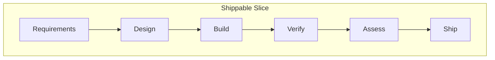

# Process Overview — The 28-Step HITL AI-Driven Workflow

Every change — feature, bug fix, improvement — follows this pipeline. AI does the production work. Humans hold gates at every decision point.

## The Pipeline View

## The 28 Steps

### Requirements (steps 1-2)
1. **GitHub Issue** — describe the change, root cause, proposed solution
2. **Figma review** (if design exists) — extract requirements, interactions, visual specs into the issue

### Design (steps 3-8)
3. **Impact analysis** — AI identifies affected components, APIs, configs, dependencies
4. **ROI estimate** (conditional) — if change costs >1 day, add ROI section to issue: expected outcome, baseline metric, measurement plan, 30/90-day checkpoints
5. **Update docs** — HLD, LLD, ADRs, test cases BEFORE code
6. **Update IaC** — infrastructure manifests, migrations, configs
7. **Test case planning** — new tests, updated tests, removed tests, regression tests
8. **Training plan stub** (conditional) — if change introduces a new capability

### Build — TDD Cycle (steps 9-16)
9. **AI generates tests (RED)** — read LLD + test plan + manifest facade contracts. Generate maximum test coverage: happy paths, error paths, edge cases, preconditions, boundary entities, contract compliance. No implementation code exists yet.
10. **Human reviews tests** — developer adds edge cases AI missed, adds integration scenarios from domain knowledge, removes trivial/wrong tests, challenges assumptions.
11. **Tests improve the design** — AI analyzes the test suite for gaps in the LLD. If tests cover behavior the LLD doesn't describe, update the LLD first, before any code.
12. **Verify RED** — run the full test suite. All new tests must fail (no implementation exists). If any pass, investigate.
13. **Generate code (GREEN)** — AI generates the simplest implementation that makes all failing tests pass. Follow the LLD and cross-cutting conventions.
14. **Verify GREEN** — run the full test suite (new + existing). All must pass. If new pass but old fail, that is a regression — fix first.
15. **Refactor** — simplify passing code. Remove duplication, improve naming. Rerun tests after each change; if any break, revert.
16. **Convention checks** — run locally before proposing the change. Fix any violations in-session. Do not defer to CI.

### Verify (steps 17-20)
17. **Code review Round 1** — AI reviews structure, security, LLD adherence.
18. **Code review Round 2** — AI reviews edge cases, regressions, completeness.
19. **Rerun tests** — confirm no regressions from review fixes.
20. **Reconcile docs** — if implementation diverged from design docs, pause and decide: does the implementation reveal a better design (update the docs), or did the implementation drift from the intended design (fix the code)? The decision is explicit and documented.

### Assess (steps 21-22)
21. **Downstream impact brief** — flows changed, risk assessment, manual verification scenarios, PM mental model update, rollout strategy
22. **Risk-rated rollout plan** — Low (direct deploy) / Medium (feature flag + soak) / High (canary 5-10% + monitor) / Critical (canary 1% + manual gates)

### Ship (steps 23-26)
23. **Create PR** — links to issue, includes docs + IaC + code + tests
24. **Integration verification** — lead runs feature E2E, verifies traceability, reviews impact brief + rollout plan
25. **Figma comparison** (if design exists) — compare implementation to Figma, list and resolve differences
26. **Merge + canary deploy** — deploy per risk-rated plan; monitor go/no-go criteria

### Post-ship (steps 27-28)
27. **30-day ROI check** — developer + lead: is the metric moving?
28. **90-day ROI check** — lead + PM: actual vs estimated ROI, update ADR with Actual Outcome

## Key Concepts

### Two-Round Code Review
Round 1 (pre-test) catches structural/design problems. Round 2 (post-test) catches behavioral/edge-case problems. Finding structural issues after tests pass means the tests are wrong too — Round 1 catches those early.

### Design Spec Bookends
If a visual design exists, it appears twice: at the beginning (feeding requirements) and at the end (verification). The design is both input and acceptance criteria.

### Training Plan Trigger
New architectural pattern, new external system, new framework, new ML/AI technique, or a significant mental-model-changing refactor → training plan required. New endpoints, bug fixes, preserving-the-model refactors → not required.

### ROI Estimation
Every change >1 day gets a measurable thesis: expected outcome (falsifiable), baseline metric (measured), measurement plan, 30/90-day checkpoints. The 90-day review creates a calibration loop — each estimate is compared to reality.

### Downstream Impact Assessment
Not the same as impact analysis (which identifies affected code). This identifies affected *people and processes*: what flows changed, what can break, how the PM's mental model needs to update, and how to derisk the deployment.

## Full Detail

See [skills/dev-practices.md](../../skills/dev-practices.md) for the complete workflow with subsections on test planning (§1b), training plans (§1c), ROI estimation (§1d), and downstream impact (§1e).

## LLD Enforcement

Code generation is strictly gated on LLD existence. Three mechanisms work together:

| Mechanism | Where | What it does |
|---|---|---|
| LLD Confirmation Gate | `skills/apply-change.md` Step 3 | Claude reads the LLD and presents scope for human approval before any code is written |
| PreToolUse Hook | `.claude/settings.json` + `scripts/check-lld-exists.sh` | Blocks file writes at the OS level when no LLD exists for the target domain |
| LLD Adherence Review | `skills/review-lld-adherence.md` | Post-generation check — verifies every LLD element is implemented and no unspecified public interfaces were added. Required before PR. |

See [hooks-setup.md](hooks-setup.md) for hook installation instructions.
