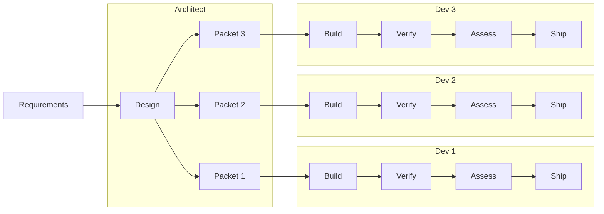

# Process Overview — The 31-Step HITL AI-Driven Workflow

**The steps below describe the full Tier 3 workflow** — cross-domain changes, new integrations, migrations, and any change where the cost of getting it wrong is high. Most routine work is Tier 1 or Tier 2 and follows an abbreviated path. See [Process Tiers](common-pitfalls.md#61-process-tiers-by-change-type) before assuming every change needs all 31 steps.

The process relocates human judgment to higher-leverage checkpoints — reviewing AI-generated specs before code exists, approving test plans before implementation, verifying traceability before merge — rather than eliminating it. AI does the production work. Humans hold the gates that matter.

## The Pipeline View

## The 31 Steps

### Step Ownership at a Glance

**AI handles 21 of 31 steps** — executing or co-piloting. You gate 10 times.

| Phase | Steps | 🤖 AI executes | 👤🤖 AI + human | 👤 Human gate |
|-------|:-----:|:--------------:|:---------------:|:-------------:|
| Requirements | 2 | 0 | 1 | 1 |
| Design | 7 | 1 | 5 | 1 |
| Build — TDD | 8 | **6** | 1 | 1 |
| Verify | 5 | **3** | 1 | 1 |
| Assess | 2 | 0 | 1 | 1 |
| Ship | 5 | 0 | 2 | 3 |
| Post-Ship | 2 | 0 | 0 | 2 |
| **Total** | **31** | **10** | **11** | **10** |

### Requirements (steps 1-2)
1. 👤🤖 **GitHub Issue** — describe the change, root cause, proposed solution → `/pm/add-feature` · `/pm/report-bug`
2. 👤 **Figma review** (if design exists) — PM/developer reads the Figma file directly and adds requirements, interactions, and visual specs into the GitHub issue; no command

### Design (steps 3-9)
> **Architect shortcut:** `/architect:design-feature` runs steps 3–9 as a single guided session — impact analysis, HLD, LLD, slice decomposition, and decision packet assembly with approval gates at each phase.

3. 🤖 **Impact analysis** — AI identifies affected components, APIs, configs, and dependencies from the system manifest, test registry, and incident registry; produces effort estimate; outputs `.hitl/current-change.yaml`. On projects with Graphify installed, the skill uses targeted graph queries (`/graphify query "domain: <name> facade APIs"`) instead of reading the full `system-manifest.yaml` — automatic fallback to direct reads if Graphify is unavailable → `/apply-change` (or phase 1 of `/architect:design-feature`)
4. 👤🤖 **ROI estimate** (if step 3 effort estimate > 1 day) — record in `.hitl/current-change.yaml` under `roi_estimate`: expected outcome (falsifiable), baseline metric (measured now), measurement plan, 30/90-day checkpoints; post a pointer comment on the GitHub issue; follow `skills/dev-practices/roi-estimation.md`
5. 👤🤖 **Update docs** — using the affected component list from `.hitl/current-change.yaml` (step 3) and Figma specs from step 2 (if available): create or update HLD at `docs/02-design/technical/hld/<feature>.md` and LLD at `docs/02-design/technical/lld/<component>.md`; architect approves HLD before LLD generation begins → `/generate-docs` · `/architect:review-design`
6. 👤🤖 **Update IaC** — using the IaC section of `.hitl/current-change.yaml` (step 3) and the LLD at `docs/02-design/technical/lld/<component>.md` (step 5): update infrastructure manifests, migrations, configs; only if step 3 identified IaC changes
7. 👤🤖 **Test case planning** — QA runs `/qa:plan-tests` to query incident history and contribute regression-required scenarios before the TDD cycle starts; developer lists new tests, updated tests, removed tests, and regression tests from the LLD; each QA-contributed scenario must be acknowledged; record the test plan in `.hitl/current-change.yaml` under `tests.plan` → `/qa:plan-tests`
8. 👤🤖 **Training plan stub** (if change introduces a new architectural pattern, external system, framework, ML/AI technique, or significant mental-model-changing refactor) — draft stub at `docs/03-engineering/training/<capability>.md`
9. 👤🤖 **Package decision packet** — architect assembles `docs/decisions/issue-<N>.yaml` (one per slice) using `templates/decision-packet-template.yaml`; fields include: issue number, affected domain from `system-manifest.yaml`, LLD path from step 5, IaC plan from step 6, test plan from step 7, training stub path from step 8 if applicable; constraint: each packet must touch exactly one manifest domain — if two slices would modify the same domain they are sequential, not parallel; architect hands one packet per slice to each assigned developer; set `approvals.architecture: approved` in `.hitl/current-change.yaml` → `/architect:design-feature`

### Build — TDD Cycle (steps 10-17)
10. 🤖 **AI generates tests (RED)** — developer passes the LLD path from the decision packet to `/tdd`; the skill reads `docs/02-design/technical/lld/<component>.md` (step 5) and `system-manifest.yaml` directly; generates maximum coverage: happy paths, error paths, edge cases, preconditions, boundary entities, contract compliance; writes test files to `tests/`; registers each test in `docs/03-engineering/testing/test-registry.yaml`; no implementation code yet → `/tdd`
11. 👤 **Human reviews tests** — developer reads the same LLD (`docs/02-design/technical/lld/<component>.md`, step 5) and incident registry to identify gaps in the generated tests; adds edge cases AI missed, adds integration scenarios from domain knowledge, removes trivial/wrong tests, challenges assumptions; updates `docs/03-engineering/testing/test-registry.yaml` → `/qa:review-tests`
12. 🤖 **Tests improve the design** — `/tdd` analyzes test files in `tests/` against the LLD at `docs/02-design/technical/lld/<component>.md`; for each test that covers behavior the LLD does not describe, proposes an LLD update; LLD is updated at the same path before any code; if LLD changes are significant, architect re-reviews before proceeding → `/tdd`
13. 🤖 **Verify RED** — run the full test suite; all new tests must fail; if any pass: fix the test (it is wrong) or remove it (LLD already describes existing behavior); resolve all before proceeding
14. 🤖 **Generate code (GREEN)** — `/tdd` reads the failing test files in `tests/`, the LLD at `docs/02-design/technical/lld/<component>.md` (step 12), `system-manifest.yaml`, and `CLAUDE.md`; generates the simplest implementation that makes all failing tests pass → `/tdd`
15. 🤖 **Verify GREEN** — run the full test suite (new + existing); all must pass; if existing tests fail: regression — fix and re-run step 14 before proceeding
16. 👤🤖 **Refactor** — simplify passing code; remove duplication, improve naming; rerun tests after each change; done when no further simplification is possible without breaking a test
17. 🤖 **Convention checks** — run `semgrep scan --config .semgrep/ --error` and manifest drift check against `convention-checks.yaml`; exit criterion: zero violations; fix all before proceeding → `/check-conventions`

### Verify (steps 18-22)
18. 🤖 **Code review Round 1** — reads implementation files plus the LLD at `docs/02-design/technical/lld/<component>.md` (step 12) and `system-manifest.yaml`: reviews structure, security, LLD adherence, and naming conventions; fix all CRITICAL and HIGH findings before proceeding → `/check-implementation`
19. 🤖 **Code review Round 2** — reads implementation files, test files in `tests/`, and the test plan from `.hitl/current-change.yaml` (step 7): reviews edge cases, regressions, test quality, and completeness against the test plan; fix all findings; rerun full test suite → `/check-implementation`
20. 🤖 **Rerun tests** — confirm no regressions from review fixes; all tests must pass
21. 👤🤖 **Reconcile docs** — compare implementation against the LLD at `docs/02-design/technical/lld/<component>.md`; make the decision explicit: if implementation reveals a better design, update the LLD using `/generate-docs` and have architect confirm; if implementation drifted from the intended design, fix the code and rerun steps 18–20; document the decision in the PR description or as an ADR update → `/generate-docs` (if docs update branch)
22. 👤 **QA post-handoff verification** — QA runs independent verification against the running build: verifies each acceptance criterion, runs exploratory tests beyond the happy path, probes failure modes from the incident registry; if any AC fails or a blocking defect is found, QA files `/qa:report-defect` and sets `approvals.qa: blocked` in `.hitl/current-change.yaml`; nothing advances to Assess until QA lifts the block → `/qa:verify-quality` · `/qa:report-defect` (if blocking)

### Assess (steps 23-24)
23. 👤🤖 **Downstream impact brief** — `/impact-brief` reads `.hitl/current-change.yaml`, `git diff main...HEAD`, `system-manifest.yaml`, incident registry, and test registry; produces 5-section brief; section 5 contains the rollout strategy draft; section 4 (product mental model update) requires human judgment → `/impact-brief`
24. 👤 **Risk-rated rollout plan** — ops reads the rollout strategy from step 23's section 5 and the incident registry for the affected domains; reviews and approves canary tier and go/no-go criteria, or adjusts them; approved plan must exist before PR is created → `/ops:review-release`

### Ship (steps 25-29)
25. 👤🤖 **Create PR** — includes: issue link, HLD/LLD from step 5 (`docs/02-design/technical/`), IaC from step 6, implementation code, test files from `tests/`, decision packet (`docs/decisions/issue-<N>.yaml`, step 9), impact brief (step 23), approved rollout plan (step 24)
26. 👤 **Integration verification** — lead runs each slice E2E and then verifies cross-slice composition: do the slices integrate correctly when all are deployed together? Lead also verifies the traceability chain for each slice: GitHub issue → design PR merged → implementation matches LLD at `docs/02-design/technical/lld/<component>.md` → test files in `tests/` cover the spec → impact brief complete → rollout plan approved; signs off or sends back with findings → `/architect:verify-traceability`
27. 👤 **Figma comparison** (if design exists) — lead compares running implementation to the Figma spec from step 2; lists and resolves all differences; exit criterion: zero unresolved differences before merge
28. 👤🤖 **Build, apply IaC, and deploy** — ops verifies branch state and triggers the build using `/ops:build`; if step 6 identified IaC changes, ops runs `/ops:apply-iac` (dry-run then apply with explicit approval); lead then triggers merge and deploys per the approved rollout plan from step 24 using `/ops:deploy`; remaining slices rebase against main and rerun steps 17–19 before their own merge → `/ops:build` · `/ops:apply-iac` (conditional) · `/ops:deploy` · `/ops:monitor-canary`
29. 👤 **Promote or rollback** — at each canary step, verify all go/no-go criteria from the approved plan (step 24); if all met: promote to next tier; if any fail: pause and investigate before deciding; lead makes the final call

### Post-ship (steps 30-31)
30. 👤 **30-day ROI check** (if step 4 was done) — reads expected outcome and baseline metric from step 4 in the GitHub issue; developer + lead assess whether the metric is moving in the right direction; follow `skills/dev-practices/roi-estimation.md`
31. 👤 **90-day ROI check** (if step 4 was done) — reads expected outcome and baseline metric from step 4 and 30-day findings from step 30; lead + PM compare actual vs estimated ROI; update ADR at `docs/02-design/technical/adrs/` with Actual Outcome section; follow `skills/dev-practices/roi-estimation.md`

## Key Concepts

### Two-Round Code Review
Both rounds use `/check-implementation` (the `spec-conformance-reviewer` agent) which reads the implementation against the LLD — not from its own reasoning. Round 1 focuses on structure, security, and LLD adherence. Round 2 focuses on edge cases, regressions, and test completeness against the test plan. Finding structural issues at Round 2 means the tests are wrong too — Round 1 catches those earlier.

### Slice Independence and Integration
Slices are only parallel if they are domain-independent. The architect enforces this at step 9: each packet must touch exactly one manifest domain; no two concurrent slices may modify the same domain. If two pieces of work touch the same domain, they are sequential — complete and merge one before starting the other.

Even domain-independent slices share a main branch. When the first slice merges, remaining slices must rebase against main and rerun convention checks (step 17) and code reviews (steps 18-19) before proceeding. The lead coordinates merge order at step 28.

Integration verification (step 25) covers both individual slices and their composition. Each slice passes in isolation first; then the lead verifies the slices work correctly together before any canary deployment.

### Artifact Grounding
Every AI step reads specific files from the repo, not from memory or general reasoning. The LLD at `docs/02-design/technical/lld/<component>.md` is the source for test generation (step 10), code generation (step 14), and both code review rounds (steps 18-19). The test plan in `.hitl/current-change.yaml` is the source for Round 2 completeness review (step 19). The approved rollout plan from step 24 is the source for canary promotion decisions (step 29). If a command is not explicitly reading a file from the repo, it is not grounded.

### Design Spec Bookends
If a visual design exists, it appears twice: at the beginning (feeding requirements into the issue at step 2) and at the end (Figma comparison before merge at step 27). The design is both input and acceptance criteria.

### Training Plan Trigger
New architectural pattern, new external system, new framework, new ML/AI technique, or a significant mental-model-changing refactor → training plan required. New endpoints, bug fixes, preserving-the-model refactors → not required.

### ROI Estimation
Every change with a step 3 effort estimate > 1 day gets a measurable thesis: expected outcome (falsifiable), baseline metric (measured now), measurement plan, 30/90-day checkpoints. The 90-day review creates a calibration loop — each estimate is compared to reality. See `skills/dev-practices/roi-estimation.md` for the template.

### Downstream Impact Assessment
Not the same as impact analysis (which identifies affected code). This identifies affected *people and processes*: what flows changed, what can break, how the PM's mental model needs to update, and how to derisk the deployment.

### The Change-Context File

`.hitl/current-change.yaml` is the runtime contract of the workflow — the handoff between human process decisions and AI enforcement. It is created by `/apply-change` (step 3) and updated at each phase gate. Hooks, skills, and commands read it to know: what change is in flight, which domain is approved, what evidence is complete, and whether the current action is permitted.

Every field in the file has a purpose: `tier` determines which steps apply; `status` gates what AI is allowed to do next; `allowed_paths` constrains domain boundary enforcement; `required_evidence` tracks what must exist before a PR can be created. If this file is absent or stale, the process has no enforcement. See [`docs/changes/change-context.schema.yaml`](../../docs/changes/change-context.schema.yaml) for the full schema.

### Graph-First Retrieval

One of the distinctive ideas in this platform: AI steps prefer graph queries over full-file reads for design docs. The combination of Graphify for retrieval and repo files as source-of-truth means AI always works from the agreed spec — and on large doc sets, retrieves only the relevant domain slice rather than loading everything. The fallback to direct file reads ensures the process works without Graphify. See the when-to-use table in `CLAUDE.md` for which situations call for each approach.

### Canonical Artifact Locations

Every artifact class has exactly one canonical location. Path drift undermines enforcement.

| Artifact | Canonical location |
|---|---|
| Change runtime state | `.hitl/current-change.yaml` |
| System manifest | `docs/system-manifest.yaml` |
| HLDs | `docs/02-design/technical/hld/<feature>.md` |
| LLDs | `docs/02-design/technical/lld/<component>.md` |
| ADRs | `docs/02-design/technical/adrs/` |
| Decision packets | `docs/decisions/issue-<N>.yaml` |
| Test registry | `docs/03-engineering/testing/test-registry.yaml` |
| Incident registry | `docs/04-operations/incident-registry.yaml` |
| Test files | `tests/` |
| Token cost registry | `docs/03-engineering/costs/token-cost-registry.yaml` |

## Full Detail

See [skills/dev-practices/SKILL.md](../../skills/dev-practices/SKILL.md) for the complete workflow with subsections on test planning (§1b), training plans (§1c), ROI estimation (§1d), and downstream impact (§1e).
