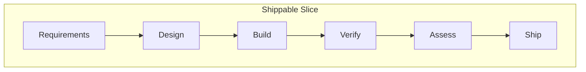

# Process Overview — The 22-Step HITL AI-Driven Workflow

Every change — feature, bug fix, improvement — follows this pipeline. AI does the production work. Humans hold gates at every decision point.

## The Pipeline View

## The 22 Steps

### Requirements (steps 1-2)
1. **GitHub Issue** — describe the change, root cause, proposed solution
2. **Design spec review** — if Figma/visual design exists, extract requirements into the issue

### Design (steps 3-7)
3. **Impact analysis** — AI identifies affected components, APIs, configs, dependencies
4. **ROI estimate** (conditional) — if change costs >1 day, add ROI section to issue: expected outcome, baseline metric, measurement plan, 30/90-day checkpoints
5. **Update docs** — HLD, LLD, ADRs, test cases BEFORE code
6. **Update IaC** — infrastructure manifests, migrations, configs
7. **Test case planning** — new tests, updated tests, removed tests, regression tests
8. **Training plan stub** (conditional) — if change introduces a new capability

### Build (steps 9-13)
9. **Code generation** — AI generates from updated LLD + test plan
10. **Code review Round 1** — AI reviews structure, security, LLD adherence (before tests)
11. **Test generation** — AI generates from test plan
12. **Run full test suite** — all must pass
13. **Code review Round 2** — AI reviews edge cases, regressions, completeness (after tests)
14. **Rerun tests** — confirm no regressions from Round 2 fixes
15. **Reconcile docs** — update docs if implementation diverged

### Assess (steps 16-17)
16. **Downstream impact brief** — flows changed, risk assessment, manual verification scenarios, PM mental model update, rollout strategy
17. **Risk-rated rollout plan** — Low (direct deploy) / Medium (feature flag + soak) / High (canary 5-10% + monitor) / Critical (canary 1% + manual gates)

### Ship (steps 18-22)
18. **Create PR** — links to issue, includes docs + IaC + code + tests
19. **Integration verification** — lead runs feature E2E, verifies traceability, reviews impact brief
20. **Canary deploy** — deploy per risk-rated plan, AI monitors go/no-go criteria
21. **Promote or rollback** — lead decision based on metrics

### Post-ship (steps 21-22)
22. **30-day ROI check** — developer + lead: is the metric moving?
23. **90-day ROI check** — lead + PM: actual vs estimated ROI, update ADR with Actual Outcome

## Key Concepts

### Two-Round Code Review
Round 1 (pre-test) catches structural/design problems. Round 2 (post-test) catches behavioral/edge-case problems. Finding structural issues after tests pass means the tests are wrong too — Round 1 catches those early.

### Design Spec Bookends
If a visual design exists, it appears twice: at the beginning (feeding requirements) and at the end (verification). The design is both input and acceptance criteria.

### Training Plan Trigger
New architectural pattern, new external system, new framework, new ML/AI technique, or a significant mental-model-changing refactor → training plan required. New endpoints, bug fixes, preserving-the-model refactors → not required.

### ROI Estimation
Every change >1 day gets a measurable thesis: expected outcome (falsifiable), baseline metric (measured), measurement plan, 30/90-day checkpoints. The 90-day review creates a calibration loop — each estimate is compared to reality.

### Downstream Impact Assessment
Not the same as impact analysis (which identifies affected code). This identifies affected *people and processes*: what flows changed, what can break, how the PM's mental model needs to update, and how to derisk the deployment.

## Full Detail

See [skills/dev-practices.md](../../skills/dev-practices.md) for the complete workflow with subsections on test planning (§1b), training plans (§1c), ROI estimation (§1d), and downstream impact (§1e).
