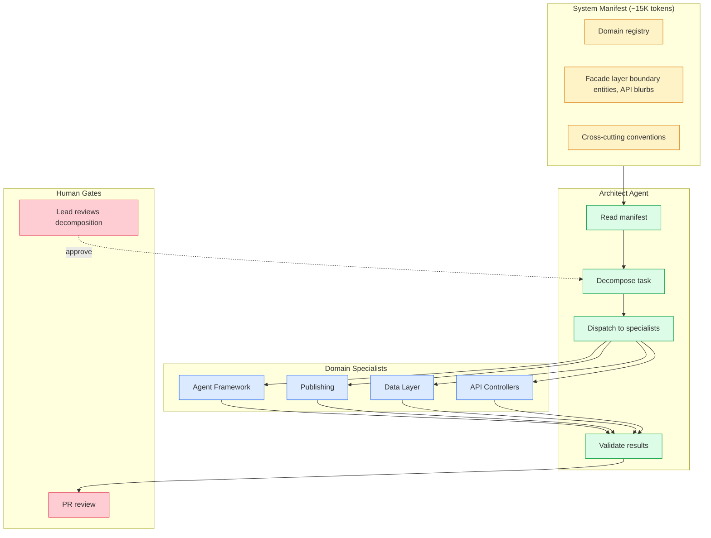

# System Manifest — Scaling AI Context

## 3. Scaling AI Context: The System Manifest

### 3.1 Problem

The process works well when the system is small. A single AI session can hold the full context — all the docs, all the code, all the patterns — and produce correct output. But systems grow. At 50+ source modules, 33 LLDs, 14 HLDs, 55 architectural decisions, and 300+ tests, no single context window can hold all of it productively. Even if it could, most of the content is noise for any given task.

The two failure modes from Section 1 reappear at scale:
- **Agent reads too much** — hallucinated connections between unrelated modules, changes outside its scope.
- **Agent reads too little** — violated conventions it did not know about, produced interfaces that did not match what other parts of the system expected.

### 3.2 Solution: Hierarchical Knowledge Architecture

Conway's Law (1967): "The structure of a system mirrors the communication structure of the organization that builds it." Applied to AI: **design the knowledge boundaries explicitly, and the quality of agent output mirrors those boundaries.** Scoped agents with clean facades produce modular, convention-honoring output. Unshaped agents with unlimited context produce monolithic, inconsistent output.

### 3.3 How It Works: The System Manifest

A **System Manifest** is a single YAML file checked into the repo that describes the system at three levels of detail:

| Level | What it captures | Who reads it | Size per domain |
|-------|-----------------|-------------|-----------------|
| **Topology** | Domain boundaries, dependency graph, convention assignments | Architect agent only | ~200 tokens |
| **Facade** | Boundary entities, API blurbs, mutation descriptions, preconditions, error modes, events | Architect + any specialist that interacts with this domain | ~500-1500 tokens |
| **Internals** | Source code, test files, LLD detail | Only that domain's specialist | ~5K-30K tokens |

The manifest contains levels 1 and 2. Level 3 (internals) is loaded on demand from the actual source files.

**Why YAML and not a knowledge graph?** Simpler to author, version, diff, and review in a pull request. A knowledge graph would be more powerful for complex cross-domain queries, but harder to maintain. Revisit if cross-domain queries become too complex for flat YAML.

**Why three levels, not two?** Two levels (manifest + source) would force the architect to either include all source code (back to "reads too much") or include no cross-domain information (specialists cannot honor interfaces). The facade level is the resolution: **enough to call correctly and reason about side effects, not enough to understand the internal implementation.** Same principle as a Java or Go interface — the contract, not the body.

### 3.4 The Architect/Specialist Pattern



1. **Architect reads the manifest** (~15K tokens) and decomposes the task into scoped task packets.
2. **Human gate**: the lead reviews the decomposition before execution.
3. **Specialists receive task packets** that include exactly the files they need, exactly the conventions to follow, exactly the facades of adjacent domains — and explicit boundaries on what they must *not* modify.
4. **Specialists return result packets** that include files created/modified, conventions honored, interface compliance checks, and cross-cutting discoveries.
5. **Architect validates** interface compliance, propagates cross-cutting discoveries, and updates the manifest.

Specialists are stateless. They re-read their domain files each activation. This is simpler and more reproducible than maintaining warm state, and the cost is acceptable — reading a few source files is cheap compared to re-reading the whole codebase.

### 3.5 Prompt Management (for agentic systems)

For systems that include AI agents, the agent's prompts are design artifacts — not string literals buried in code. A different system prompt produces different agent behavior, so prompt changes go through the same review process as code changes.

Prompts live in git-managed skill files alongside the agent they belong to:

```
claude/
  campaign-generation/
    system-prompt.md        # The agent's personality and instructions
    guardrails.md           # Input/output validation rules
    eval-criteria.yaml      # Quality dimensions + weights + pass threshold
    tools.yaml              # Which tools this agent can use
    docs/examples/               # Few-shot examples for the prompt
```

The skill loader reads these at agent init time. Changes are PRs — reviewed, version-controlled, rollback-able. PMs can iterate on prompts without engineering involvement. A/B testing becomes "change the prompt file, run eval, compare scores."

See the Skill System pattern in the companion agentic-platform repo for the full implementation guide.

### 3.6 Facade-Level Interop

The facade is how disjoint agents know about each other. When the publishing specialist needs to interact with the agent framework, it does not read the framework's source code. It reads a blurb like:

> *"The tool loop in the base agent calls your tool via tool.execute(**args). It expects a ToolResult back. tenant_id is auto-injected if not in args."*

That is enough to produce a correct integration. The specialist does not need to understand the framework's internal state machine — just its boundary contract. This is the same principle as microservice API contracts, applied to AI agent context.

---

