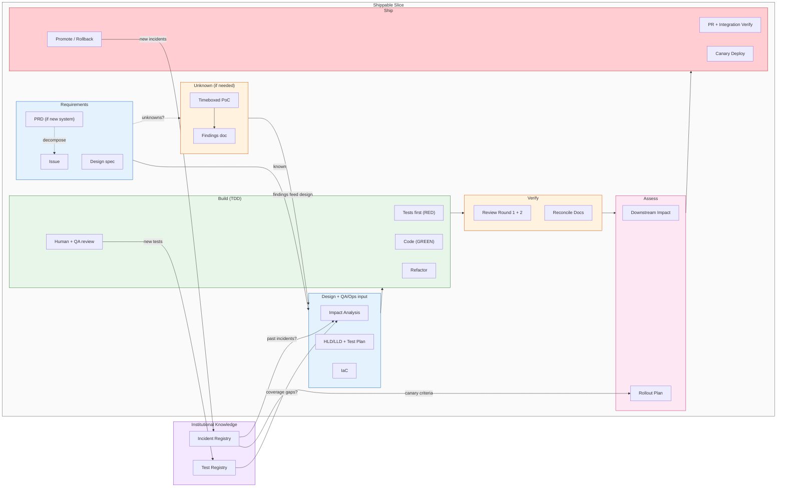
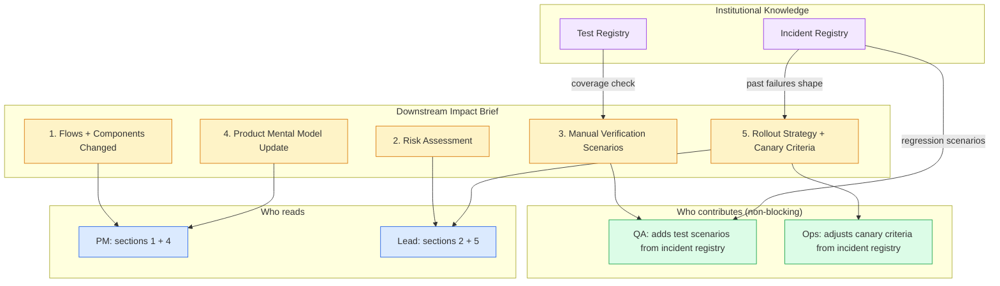

# Workflow Reference — The Full 30-Step Process

## 4. Collaborative Development: The Design Room

### 4.1 What It Is

An **AI Design Room** is a per-feature thread where the team collaborates with AI as a participant, not just a tool. This is different from autonomous coding tools (which operate without human oversight) and different from simple AI assistants (which respond to individual prompts without maintaining conversation context across the team).

### 4.2 Three Boundaries

| Boundary | Rule |
|----------|------|
| **Working medium** | Slack (or similar) — the thread where discussion, AI drafts, and human decisions happen in real time |
| **Source of truth** | GitHub — every decision materializes as a commit, PR, or issue update |
| **Decision gates** | PRs — the thread generates artifacts, but nothing ships without PR review and merge |

### 4.3 How It Works

Multiple humans and AI participate in one thread. AI drafts; humans decide. The workflow steps, the manifest, and the role definitions provide the structure. The design room provides the collaboration layer.

**Current state:** The workflow steps, the manifest, and the role definitions exist. A unified thread experience does not yet exist — coordination currently happens across Slack conversations, GitHub PRs, and separate AI sessions. Unifying that is an open project.

---

## 5. The Workflow

**Two phases — Unknown and Known:**

Some changes have unknowns that must be resolved before the team can commit to a design. The workflow splits into an **exploration phase** (resolve the unknowns) and an **execution phase** (build the known).

| Phase | When | What happens | Output |
|-------|------|-------------|--------|
| **Unknown (PoC / Spike)** | A key question is unanswered — "will the API support this?", "can the model handle this latency?", "does this approach scale?" — and without answering it the team cannot approve a precise LLD. | Timeboxed PoC. AI generates the throwaway code. Developer validates the hypothesis. No production standards required — this is learning, not building. | Findings doc: what worked, what didn't, constraints discovered, revised assumptions. |
| **Known (Execution)** | The design is understood well enough for AI to generate a precise LLD that the architect can review and approve. | Full workflow below. The findings from the PoC feed directly into the LLD — they ARE the design input. | Production code, tests, docs, deployment. |

The PoC phase is explicitly **not** held to the full workflow. Its purpose is to answer questions cheaply so the execution phase doesn't discover unknowns mid-build. But PoC findings MUST be documented — they become the basis for the LLD. A PoC without a findings doc is wasted learning.

**Three entry points:**

| Starting from | What happens first |
|---------------|-------------------|
| **A PRD (new system or major feature)** | Run `/architect/design-system` — produces domain decomposition, system manifest, HLDs, LLDs, and ADRs. Each resulting issue then enters the workflow below. |
| **An issue with unknowns** | PoC phase first → findings doc → then enter the execution workflow with the unknowns resolved. |
| **An issue (known, ready to build)** | Enter the execution workflow directly. |

> **Brownfield (existing codebase not yet in HITL):** Two valid approaches — choose based on how much time you can invest upfront:
>
> | Approach | What you do first | Tradeoff |
> |---|---|---|
> | **Full baseline sprint** (recommended) | Run the full reverse-engineer sprint via `/generate-docs reverse-engineer` — produces manifest, HLDs, LLDs, registries, and process setup before any change work starts | Cleaner start; AI output from step 1 is more reliable |
> | **Incremental** | Run `/start` Path B — produces manifest, priority component docs, and registry stubs; start change work immediately | Faster to first commit; AI output for undocumented components is less reliable until docs are corrected through use |
>
> In both cases, run `/start` first. For the full sprint, it routes you to `/generate-docs reverse-engineer`. For incremental, it walks you through the lightweight setup. See the [adoption guide](adoption-guide.md) for full sprint details.
>
> **Once onboarded (via either approach), the 31-step execution workflow, PM skills, and all commands are identical to a greenfield project.** The brownfield distinction ends at onboarding.

For truly small changes (a one-line config fix), this workflow is too heavy — see "Common Pitfalls" (Section 6) for when to abbreviate.

### 5.1 The Pipeline View

Each shippable unit — a vertical slice of backend + frontend + tests + docs — goes through this pipeline:

### 5.2 The Steps

Most steps are AI-driven. Human work is review and judgment, not production.

> 🤖 AI does it &nbsp; 👤🤖 AI drafts, human reviews &nbsp; 👤 Human only &nbsp; 🔁 Iterative until correct

| Phase | Steps |
|-------|-------|
| **Requirements** | Issue 👤🤖 → Figma review 👤 (if exists) |
| **Design** | Impact analysis 🤖 → ROI estimate 👤🤖 (conditional) → Update docs 👤🤖 🔁 → Update IaC 👤🤖 → Test plan 👤🤖 🔁 → Training plan 👤🤖 → Decision packet 👤 |
| **Build (TDD)** | Generate tests (RED) 🤖 → Human reviews tests 👤 🔁 → Tests improve design 🤖 🔁 → Verify RED 🤖 → Generate code (GREEN) 🤖 → Verify GREEN 🤖 🔁 → Refactor 👤🤖 🔁 → Convention checks 🤖 |
| **Verify** | Code review R1 🤖 🔁 → Code review R2 🤖 🔁 → Rerun tests 🤖 → Reconcile docs 👤🤖 🔁 |
| **Assess** | Impact brief 👤🤖 🔁 → Rollout plan 👤 |
| **Ship** | Create PR 👤🤖 → Integration verify 👤 → Figma comparison 👤 (if exists) → Merge + canary deploy 👤🤖 → Promote or rollback 👤 |
| **Post-ship** | 30-day ROI check 👤 → 90-day ROI check 👤 |

The 🔁 steps loop until the human is satisfied — AI revises, human re-reviews, repeat. Non-🔁 steps run once.

Of 31 steps: **10 AI-driven** 🤖, **11 AI-assisted** 👤🤖, **9 human-only** 👤.

### 5.3 The Two-Round Code Review

| | Round 1 (pre-test) | Round 2 (post-test) |
|---|---|---|
| **Focus** | Structure, security, spec adherence | Edge cases, regressions, completeness |
| **What it catches** | Design-level problems | Behavior-level problems |
| **When it saves time** | Before test investment | After tests reveal unexpected behavior |
| **Who** | AI reviewer | AI reviewer |

Finding structural problems after tests pass means the tests are now wrong too. Round 1 catches those early.

### 5.4 Design Spec: Input at the Start, Verification at the End

If a visual design (Figma or similar) exists, it appears twice in the workflow: at the start it feeds requirements into the issue, and at the end it verifies the implementation matches the original intent. The design is both the input and the acceptance criteria. This prevents the common drift where the implemented feature gradually diverges from the original design during implementation.

### 5.5 ROI Estimation

**When it applies (Tier 3 changes and above):** initiatives larger than one sprint, infrastructure spend, reliability investments, or major architecture bets. Not required for ordinary feature work — applying it to every change makes it feel like paperwork and teams will stop filling it out.

When it applies, record three items in `.hitl/current-change.yaml` under `roi_estimate` before build starts: (1) a specific, falsifiable expected outcome with timeframe, (2) the current baseline metric (measured, not estimated), and (3) what happens if ROI is not realized. Post a pointer comment on the GitHub issue linking to the decision packet. Verify at 30 days (direction check) and 90 days (magnitude check). Document the actual outcome in the ADR so future estimates calibrate against reality.

### 5.6 Downstream Impact Assessment

This step solves a problem that most AI-assisted development processes ignore entirely: **the people downstream of the code change need to understand what happened and why.**

When AI generates code at high velocity, the blast radius of each change increases. A developer using AI can produce in a day what previously took a sprint — but the product team, QA, ops, and customer support then need to absorb a sprint's worth of changes in a day. If they do not, the code is correct but the team's mental model is wrong, leading to mis-prioritized roadmap items, missed regression scenarios, and deployment incidents that ops did not anticipate.

The impact brief has five sections, each aimed at a different stakeholder:

**Section 4 — the mental model update — is the one most often skipped and most often regretted.** Example: if you change the campaign approval flow so that "approved" no longer triggers publishing (instead it queues for scheduled delivery), the PM's mental model of "approve = publish" is now wrong. Every roadmap discussion, every customer promise, every support playbook that assumed "approve = publish" is silently incorrect. Writing "approve now queues for scheduled delivery instead of publishing immediately" in the impact brief takes 30 seconds and prevents weeks of downstream confusion.

> **The impact brief is not about protecting against technical risk.** Tests and code review handle that. The brief is about protecting against **organizational risk** — the risk that the humans around the code do not understand what changed.

**Who writes it**: the developer, with AI assistance. AI can draft the flows/components section from the diff and the risk section from the test plan. The mental model section requires human judgment — you need to know what assumptions the PM holds.

**When it is reviewed**: by the team lead during integration verification (step 24). The lead checks: "Is this brief complete? Would the PM understand what changed from reading this? Would ops know how to deploy it safely?"

### 5.7 Canary Deployment Strategy

The rollout plan at step 22 is risk-rated — not every change gets the full canary treatment:

| Risk level | Example | Rollout |
|-----------|---------|---------|
| **First release** | Initial deployment — no prior version in production | Direct deploy to staging → manual smoke-test gate → production. Rollback = tear down deployment (no prior version exists). |
| **Low** | CSS fix, copy change, internal doc update | Direct deploy |
| **Medium** | New feature behind feature flag, additive endpoint | Flag off, staging, 24h soak, production |
| **High** | Changed existing behavior, external integration, schema migration | Canary 5-10%, 4h monitor, 25%, 4h, 100% |
| **Critical** | Irreversible side effects, billing, data migration | Canary 1%, manual gate each step, 24h soak per tier |

Each promotion step checks explicit go/no-go criteria: error rate delta, latency delta, business metric delta (e.g., campaign publish success rate), and failure-mode score trends from the observability layer. If any criterion fails, the canary pauses — not rolls back immediately, but pauses so the team can investigate. Most "failures" turn out to be noise or pre-existing; automatic rollback on noise creates churn.

Calibrate the criteria to the specific change, not universal thresholds. A change to the payment flow has tighter thresholds than a change to a dashboard component. The developer proposes the criteria in the rollout plan; the lead reviews them during integration verification.

> **Canary deployment is not new.** What is new is making it a formal step in the dev workflow with AI-generated monitoring summaries. AI reads the observability dashboards during the canary window and produces a go/no-go recommendation — the human still makes the call, but the analysis is pre-digested.

### 5.8 Worked Example: "Add a New Publishing Channel"

| Step | Who | What happens |
|------|-----|-------------|
| 1 | PM + AI | PM describes the need. AI drafts PRD update. PM reviews. |
| 2 | Architect + AI | AI analyzes impact across LLDs. Architect opens Design PR with HLD/LLD/IaC/test plan changes. |
| 3 | Team + QA + Ops | Devs review LLD sections. QA adds test scenarios from incident registry. Ops reviews IaC. PR merged — design locked. |
| 4 | Devs + AI | AI generates tests (RED). Dev + QA review, add edge cases. AI generates code (GREEN). Refactor. |
| 5 | AI | Reviews both PRs against LLD. Flags gaps. Devs fix. |
| 6 | Dev + AI | Downstream impact brief. QA adds manual verification scenarios. PM mental model update written. |
| 7 | Dev + Ops | Rollout plan. Ops adjusts canary criteria from incident registry. |
| 8 | Architect | Reviews traceability + impact brief + rollout plan. |
| 9 | Dev → QA + Ops | **Handoff.** Dev delivers stable build with evidence: test registry results, impact brief, rollout plan, baseline IaC. QA and Ops take it from here. |
| 10 | QA | Independent quality verification. Exploratory testing. Blocks promotion if criteria not met. Pulls Dev in for fixes if needed. |
| 11 | Ops + AI | Deploys to canary. Refactors IaC if needed (Dev applies refinements back to dev). AI monitors go/no-go criteria. Promotes or rolls back. |
| 12 | Team + PM | Demo. PM gives feedback. Next iteration if needed. |

**Total time: varies by team and change complexity.** In practice, the process often compresses implementation time compared to informal approaches — but that depends on how precisely the LLD is written and how familiar the team is with the workflow. The downstream impact brief adds ~30 minutes of active work. The canary monitoring adds ~4 hours of wall-clock time (mostly waiting, not working). Both prevent classes of problems that would otherwise take days to diagnose and fix.

---

