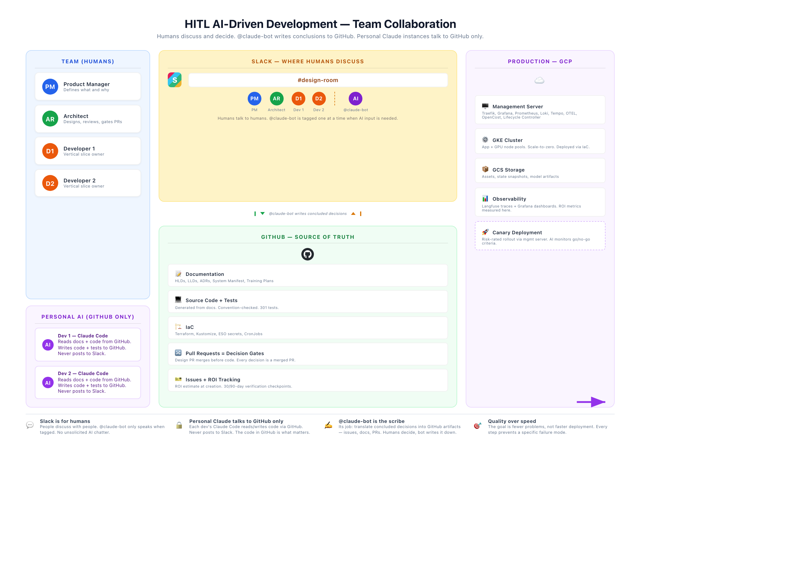
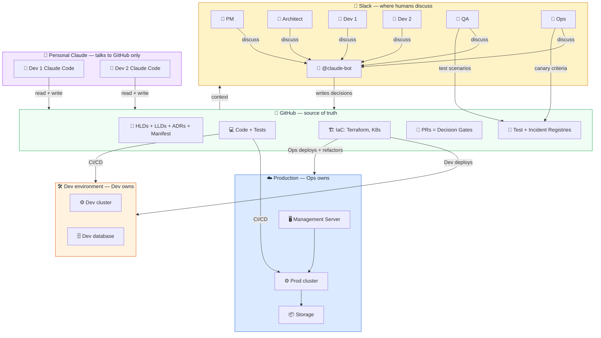
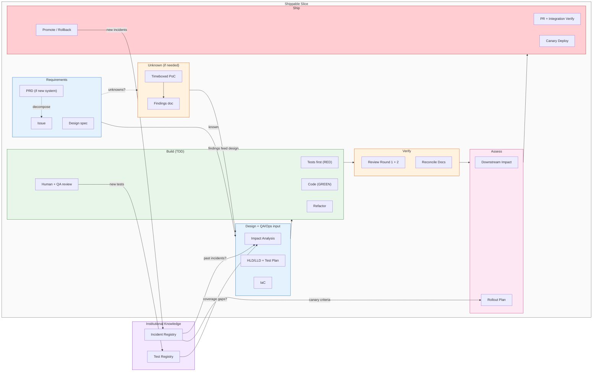
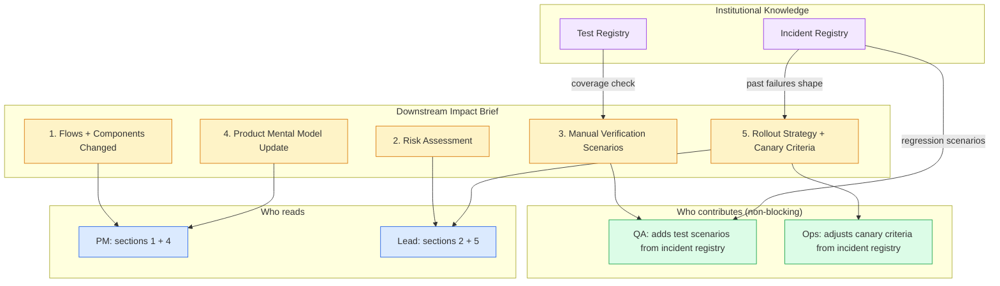

# HITL AI-Driven Development — Reference Manual

Look up any part of the process. Each section is self-contained.

> **AI tool note:** This guide uses Claude Code and `CLAUDE.md` as examples. The process works with any AI coding assistant that supports auto-loaded project rules (Cursor, Windsurf, Cline, etc.).

---

## Process overview

The team discusses and agrees on design decisions. Decisions are captured in documentation (HLDs, LLDs, ADRs, system manifest). AI generates code, tests, and docs from that documentation. Humans review at defined gates. The documentation is the source of truth; the code is derived from it.

This process applies to any system — REST APIs, data pipelines, agentic AI, frontend apps, infrastructure. "AI-driven" refers to how the team develops, not what they're building.



> **[Download editable PowerPoint](hitl-team-collaboration.pptx)** | **[Printable PDF](hitl-team-collaboration.pdf)**

<details open>
<summary>Team collaboration diagram (Mermaid)</summary>



</details>

---

## Roles

| Role | In dev | After handoff |
|------|--------|--------------|
| **PM** | Defines requirements. Reviews AI-drafted PRDs. | Reviews demo. Accepts or requests changes. |
| **Architect** | Designs, reviews, gates PRs. Verifies traceability. | Available for design clarification. |
| **Developer** | Owns everything in dev: code, tests, IaC, docs, QA-level testing. Builds until stable, then hands off. | Pulled in by QA/Ops as needed. Applies Ops IaC refinements back to dev. |
| **QA** | Contributes test scenarios from incident registry (non-blocking). | Independent quality verification. Can block promotion. |
| **Ops** | Contributes canary criteria from incident registry (non-blocking). | Deploys, refactors IaC, monitors, promotes. Can block if unstable. |
| **Claude** | Drafts docs, generates code + tests, reviews PRs, monitors metrics. | Reports canary metrics. Available for analysis. |

---

## Workflow phases



| Phase | Steps | Who does the work |
|-------|-------|----|
| **Design** | Issue → Design spec (if exists) → Impact analysis → Update docs → Update IaC → Test plan → Training plan | 🤖 AI drafts, 👤 human reviews. Iterate until the doc reflects what should happen. |
| **Build (TDD)** | Generate tests → Human + QA review 🔁 → Tests improve LLD 🔁 → Verify RED → Generate code → Verify GREEN 🔁 → Refactor 🔁 | 🤖 AI generates tests + code. 👤 Human adds domain edge cases. |
| **Verify** | Code review R1 → Code review R2 → Reconcile docs | 🤖 AI-driven. R1 catches structure, R2 catches behavior. |
| **Assess** | Impact brief 🔁 → Rollout plan | 👤🤖 AI drafts. Human adds PM mental model update + manual verification scenarios. |
| **Ship** | PR + integration verify → Handoff to QA + Ops → QA verifies → Ops deploys + monitors → Promote/rollback | 👤 Human gates. 🤖 AI monitors canary. |
| **Post-ship** | 30-day ROI check → 90-day ROI check | 👤 Did the change deliver expected value? Update ADR with actual outcome. |

🔁 = iterate until correct.

---

## Entry points

| Starting from | What to do |
|---------------|-----------|
| **PRD** (new system) | Decompose into HLD → LLDs → issues. Each issue enters the workflow. |
| **Issue with unknowns** | Timeboxed PoC first. Document findings. Then enter the workflow with unknowns resolved. |
| **Issue (known)** | Enter the workflow directly at Design phase. |

---

## Artifacts and where they live

| Artifact | Location | Purpose |
|----------|----------|---------|
| HLD | `docs/02-design/technical/hld/` | Architecture-level design. One per major system area. |
| LLD | `docs/02-design/technical/lld/` | Component-level design. Precise enough for AI to generate code from. |
| ADR | `docs/02-design/technical/adrs/` | Design decisions with context, alternatives, consequences. |
| System manifest | `docs/system-manifest.yaml` | Domain boundaries, facade APIs, conventions, interaction matrix. |
| CLAUDE.md | Repo root | Auto-loaded rules for every Claude session. Conventions inlined. |
| Test registry | `docs/test-registry.yaml` | Test catalog by domain, risk, origin, incident link. |
| Incident registry | `docs/incident-registry.yaml` | Production incidents linked to regression tests and canary criteria. |
| Training plan | `docs/03-engineering/training/` | Onboarding material for new capabilities. Module-based format. |
| Convention checks | `convention-checks.yaml` | YAML config for the pluggable convention checker. |
| Issue template | `.github/ISSUE_TEMPLATE/` | ROI estimation + downstream impact sections. |

---

## System manifest — quick reference

The manifest scopes AI context per domain. Each domain entry contains:

| Field | Auto/Human | What it captures |
|-------|:---:|-----------------|
| `purpose` | Human | One-line description |
| `files` | Auto | Source files in this domain |
| `depends_on` | Auto | Other domains this one imports from |
| `conventions` | Auto | Which cross-cutting conventions apply |
| `boundary_entities` | Human | Entity shapes that cross the domain boundary |
| `facade_apis` | Human | What this domain looks like from outside — signature, blurb, mutations, preconditions, error modes |
| `events_emitted` / `events_consumed` | Human | What this domain tells/hears from other domains |
| `last_changed` | Human | Date + one-line summary |

**Auto** fields are generated by `tools/generate-manifest/generator.py`. **Human** fields require judgment and are preserved across re-runs.

---

## Convention checker — quick reference

```bash
# Run all checks
python tools/check-conventions/runner.py --config convention-checks.yaml --verbose

# Run one check
python tools/check-conventions/runner.py --config convention-checks.yaml --only manifest_drift
```

Check types available:

| Type | What it verifies |
|------|-----------------|
| `subclass_method_check` | Subclasses of X implement methods Y |
| `import_check` | Files that import A also import B |
| `pattern_check` | Files with pattern X also have pattern Y (or don't have forbidden Z) |
| `file_contains` | File X contains text Y |
| `manifest_drift` | Files listed in manifest exist on disk |
| `mermaid_br_tags` | No `<br/>` in Mermaid code blocks |
| `inline_comments` | Files >50 lines have >5% comment density (warning) |

---

## TDD cycle — quick reference

```
1. AI generates max tests from LLD + manifest        (no code exists)
2. Human + QA review — add edge cases, domain knowledge
3. AI finds LLD gaps revealed by tests → update LLD   (before code)
4. Verify RED — all new tests must fail
5. AI generates simplest code that passes
6. Verify GREEN — full suite passes
7. Refactor — simplify without changing behavior
```

Tests are a design tool, not just verification. The human review step (2) is where domain expertise enters. LLD gaps found at step (3) are fixed BEFORE code exists.

---

## Impact brief — quick reference



Five sections, each for a different stakeholder:

| Section | Question it answers | Who reads it |
|---------|-------------------|-------------|
| 1. Flows changed | What user-visible behaviors are different? | PM, QA |
| 2. Risk assessment | What can break? Severity × likelihood? | Architect, Ops |
| 3. Manual verification | What should be tested beyond the automated suite? | QA, Ops |
| 4. Mental model update | What assumptions does the PM hold that are no longer true? | PM |
| 5. Rollout strategy | How to deploy safely? Canary tier + go/no-go criteria? | Ops, Architect |

Section 4 is the one most often skipped and most often regretted.

---

## Rollout risk levels

| Level | When | Strategy |
|-------|------|----------|
| **Low** | Cosmetic, internal-only | Direct deploy |
| **Medium** | New feature, additive | Feature flag → staging → 24h soak → production |
| **High** | Changes existing behavior, new external integration | Canary 5-10% → 4h monitor → 25% → 4h → 100% |
| **Critical** | Irreversible side effects, billing, data migration | Canary 1% → manual gate per step → 24h soak per tier |

Go/no-go criteria are calibrated per change, not universal thresholds. The incident registry for the affected domain shapes the criteria.

---

## ROI estimation — quick reference

For changes >1 day of effort, add to the GitHub issue:

1. **Expected outcome** — specific, falsifiable, with timeframe
2. **Baseline metric** — measured, not estimated
3. **Decision if not realized** — revert / rearchitect / accept partial

Verify at 30 days (direction check) and 90 days (magnitude check). Document actual outcome in the ADR.

---

## Prompt management (agentic systems)

Prompts are design artifacts, not code strings. They live in versioned skill files:

```
skills/<agent-name>/
  system-prompt.md         # Agent personality and instructions
  guardrails.md            # Input/output validation
  eval-criteria.yaml       # Quality dimensions + weights
  tools.yaml               # Available tools
  examples/                # Few-shot examples
```

Changes go through PRs. PMs can edit without code deploys. See [Skill System pattern](https://github.com/Prasad-Apparaju/agentic-platform/blob/main/docs/patterns/skill-system.md).

---

## Gap assessment after brownfield sprint

| Tier | Gate | AI does | Architect does |
|------|------|---------|---------------|
| **Blocker** | Fix before feature work | Scans code, generates fix + tests | Reviews: structurally enforced? |
| **Near-term** | Fix in parallel | Generates retry wrappers, test stubs, ADR drafts | Reviews: reasonable? |
| **Medium-term** | Fix as rider on feature PRs | Fixes one gap per PR in the touched domain | Reviews: behavior change or style only? |
| **Long-term** | Fix when touched | Generates fix when developer opens the file | Standard PR review |

Feature work proceeds when blockers are zero.

---

## Skills and tools

| Name | Source | What it does |
|------|--------|-------------|
| `/dev-practices` | [skills/dev-practices.md](../skills/dev-practices.md) | Full workflow |
| `/apply-change` | [skills/apply-change.md](../skills/apply-change.md) | Impact analysis |
| `/generate-docs` | [skills/generate-docs/](../skills/generate-docs/) | HLD/LLD/ADR generation + reverse-engineer mode |
| `/tdd` | [skills/tdd.md](../skills/tdd.md) | TDD-as-design loop |
| `/impact-brief` | [skills/impact-brief.md](../skills/impact-brief.md) | 5-section downstream impact brief |
| `/check-conventions` | [skills/check-conventions.md](../skills/check-conventions.md) | Convention checker in-chat |
| Manifest generator | [tools/generate-manifest/](../tools/generate-manifest/) | Auto-generate system-manifest.yaml |
| Convention checker | [tools/check-conventions/](../tools/check-conventions/) | YAML-driven, AST-based, CI-ready |
| Mermaid fixer | [tools/fix-mermaid/](../tools/fix-mermaid/) | Remove `<br/>` for Obsidian |

---

## Templates

| Template | Source | Use when |
|----------|--------|----------|
| CLAUDE.md | [templates/CLAUDE.md.template](../templates/CLAUDE.md.template) | Setting up a new project |
| System manifest schema | [templates/system-manifest.schema.yaml](../templates/system-manifest.schema.yaml) | Creating a manifest |
| Issue template | [templates/issue-template.md](../templates/issue-template.md) | Every issue |
| ADR template | [templates/adr-template.md](../templates/adr-template.md) | Every architectural decision |
| Training plan | [templates/training-plan-template.md](../templates/training-plan-template.md) | New capability introduced |
| Test strategy | [templates/test-strategy-template.md](../templates/test-strategy-template.md) | Planning tests for a vertical slice |
| Security audit | [templates/security-audit-template.md](../templates/security-audit-template.md) | Security assessment |
| Best practices | [templates/best-practices-template.md](../templates/best-practices-template.md) | Documenting domain practices |
| Cost analysis | [templates/cost-analysis-template.md](../templates/cost-analysis-template.md) | Infrastructure cost comparison |
| Performance optimization | [templates/performance-optimization-template.md](../templates/performance-optimization-template.md) | Tiered optimization plan |
| Data model mapping | [templates/data-model-mapping-template.md](../templates/data-model-mapping-template.md) | Schema migration (field-by-field) |
| API contract mapping | [templates/api-contract-mapping-template.md](../templates/api-contract-mapping-template.md) | Endpoint migration mapping |
| Decision catalog | [templates/consolidated-decisions-template.md](../templates/consolidated-decisions-template.md) | Consolidated decision reference |
| Test registry | [templates/test-registry-template.yaml](../templates/test-registry-template.yaml) | Setting up test tracking |
| Incident registry | [templates/incident-registry-template.yaml](../templates/incident-registry-template.yaml) | Setting up incident tracking |

---

## Patterns

Architectural patterns for common challenges. Especially relevant for agentic systems.

| Pattern | Source | What it covers |
|---------|--------|---------------|
| Failure mode taxonomy | [docs/patterns/failure-mode-taxonomy.md](patterns/failure-mode-taxonomy.md) | Classify HOW agents fail — enables directional iteration |
| Idempotency keys | [docs/patterns/idempotency-keys.md](patterns/idempotency-keys.md) | Exactly-once external side effects across retries |

---

## Playbooks

| Guide | When to use |
|-------|-------------|
| [Process overview](playbook/process-overview.md) | Understanding the full workflow |
| [Adoption guide](playbook/adoption-guide.md) | Brownfield one-week sprint + gap assessment |
| [Migration guide](playbook/migration-guide.md) | Migrating a backend to a new architecture |

---

## Agentic patterns

For teams building systems that include AI agents, see the [agentic-platform repo](https://github.com/Prasad-Apparaju/agentic-platform):

| Pattern | What it covers |
|---------|---------------|
| [Agent Maturity Levels](https://github.com/Prasad-Apparaju/agentic-platform/blob/main/docs/patterns/agent-maturity-levels.md) | L0-L3 progression |
| [Progressive Rollout](https://github.com/Prasad-Apparaju/agentic-platform/blob/main/docs/patterns/progressive-rollout.md) | Shadow → canary → GA |
| [Lethal Trifecta Audit](https://github.com/Prasad-Apparaju/agentic-platform/blob/main/docs/patterns/lethal-trifecta-audit.md) | Prompt injection risk assessment |
| [Dormant Workflows](https://github.com/Prasad-Apparaju/agentic-platform/blob/main/docs/patterns/dormant-workflows.md) | Long-running per-entity agent processes |
| [Skill System](https://github.com/Prasad-Apparaju/agentic-platform/blob/main/docs/patterns/skill-system.md) | PM-editable agent behavior |
| [Agent Observability](https://github.com/Prasad-Apparaju/agentic-platform/blob/main/docs/patterns/agent-observability.md) | What to trace, score, alert on |
| [Showcase-Based Delivery](https://github.com/Prasad-Apparaju/agentic-platform/blob/main/docs/patterns/showcase-delivery.md) | Vertical slices, not horizontal layers |
