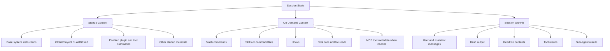

# Claude Code Context Map

How information typically gets into Claude Code context, in a form that is easier to explain to teams.

## Executive View

Claude Code context is easiest to understand as three buckets:

1. **Loaded at session start**  
   Core instructions and project guidance that are available from the beginning.
2. **Loaded only when needed**  
   Skills, commands, files, tool results, and hook outputs that enter context only after a trigger.
3. **Accumulated during the session**  
   The conversation itself, plus tool output and file contents, which is usually what makes long sessions heavy.

## Simple Diagram

## What Usually Loads At Startup

| Category | Typical examples | Notes |
|---|---|---|
| Base instructions | Claude's built-in system behavior | Highest-authority layer |
| Global guidance | `~/.ai/claude/CLAUDE.md` | Shared across projects |
| Project guidance | project `CLAUDE.md` and parent-scoped files | The most relevant local conventions |
| Enabled capability summaries | skill descriptions, tool names, plugin metadata | Usually small compared with later session growth |
| Session metadata | date, environment, identity info | Low context cost |

## What Loads Only When Triggered

| Trigger | What enters context |
|---|---|
| User runs a slash command | command content and related instructions |
| A skill is invoked | the relevant skill instructions |
| A hook fires | hook output or hook-driven context additions |
| The model reads a file | file contents |
| The model uses a tool | tool result |
| MCP capability is first used | tool metadata or schema details |

## What Makes Sessions Heavy

The biggest source of context growth is usually not startup instructions. It is:

- long conversations
- repeated file reads
- verbose shell output
- large tool responses
- sub-agent or helper outputs

That is why fresh sessions often feel better than trying to carry one thread across unrelated tasks.

## Practical Takeaway

If you want Claude Code to stay effective longer:

- keep project instructions concise
- avoid dumping large files unless needed
- keep shell output tight
- start a new session when the task changes materially

## Confidence Notes

This model is best used as an **operational mental map**, not a strict implementation spec.

- Some parts are well documented, such as project instruction loading and tool-driven context growth.
- Some parts are best treated as informed inference, especially exact internal assembly order, internal file locations, and low-level runtime mechanics.
