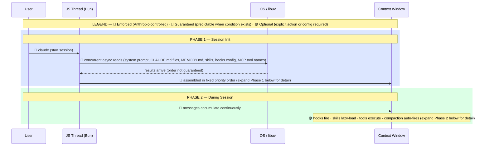
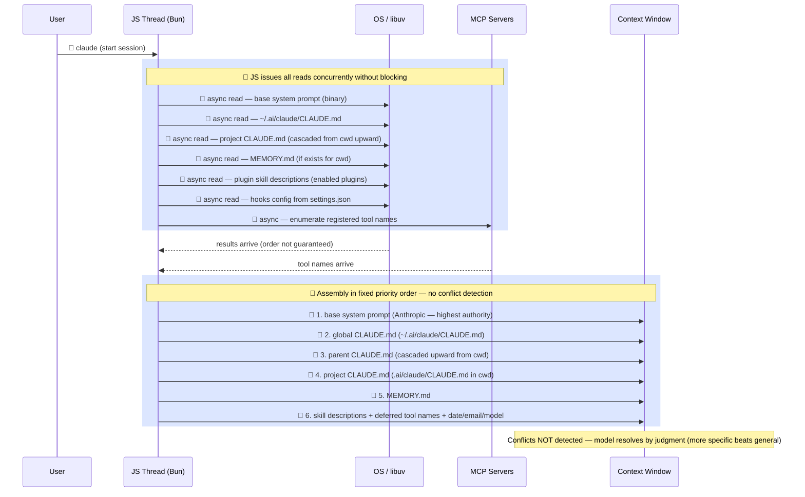
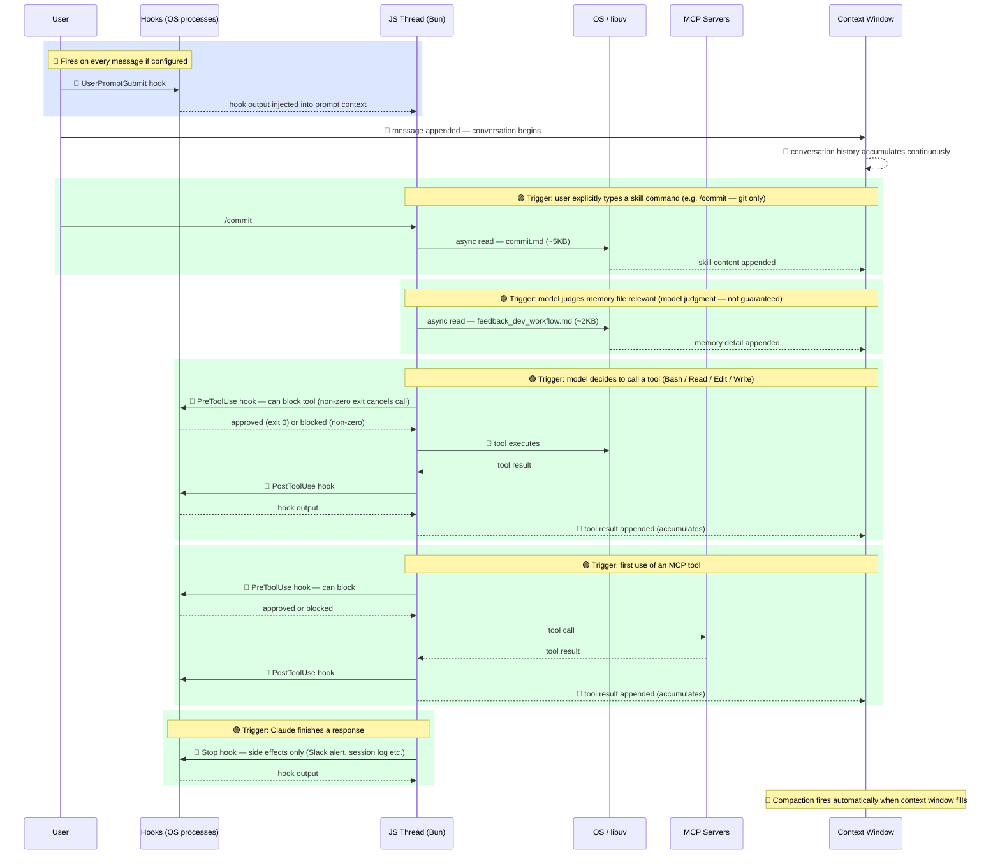

# Claude Code — Context Injection Mental Map

How all the pieces get loaded into context when you start a Claude Code session.

> **Confidence framing:** This map is a practical mental model, not a formal internal spec. Items marked 🔴 reflect documented or consistently enforced behavior. Items marked 🔵 are predictable in practice and directly observable. Claims about internal mechanics — concurrent read ordering, exact assembly sequence, binary file locations, and token size estimates — are informed inference from observed behavior and should be treated as directional, not authoritative. The three-zone model (always loaded / lazy loaded / session growth) is the part most worth relying on.

## Diagram

### Overview

---

<strong>Phase 1 — Session Init (detail)</strong>

<strong>Phase 2 — During Session (detail)</strong>

---

## Zone Breakdown

### Blue — Always Loaded (fixed cost per session)

Paid on every session regardless of what you do.

| Source | File / Location | Size (order of magnitude — treat as directional) |
|---|---|---|
| Base system prompt | Binary (`~/.local/bin/claude`) | ~6–8K tokens |
| Global instructions | `~/.ai/claude/CLAUDE.md` | ~0.5KB |
| Project instructions | `<project>/.ai/claude/CLAUDE.md` or parent `CLAUDE.md` | ~4KB |
| Project memory index | `~/.ai/claude/projects/<slug>/memory/MEMORY.md` | 0–7KB |
| Skills list | Descriptions from enabled plugin `SKILL.md` frontmatter | ~4KB |
| Deferred tools list | Tool names from MCP servers + harness | ~2–3KB |
| System injections | Date, user email, model info | ~0.1KB |

**Rough fixed cost: ~12–25K tokens per session** _(observed range — not a guarantee)_

---

### Green — Lazy Loaded (pay only when triggered)

| Trigger | What loads | Size |
|---|---|---|
| `/skill-name` typed | Full `SKILL.md` content | 5–32KB each |
| I judge memory relevant | Individual `feedback_*.md`, `project_*.md` | 1–3KB each |
| First use of an MCP tool | Tool schema via `ToolSearch` | 1–5KB |
| `Read` tool call | File contents | varies |
| Slash command run | Command `.md` file | 2–10KB |

---

### Red — Grows During Session

Every message, tool call, and result accumulates and never shrinks until compaction.

| Source | Notes |
|---|---|
| Conversation turns | Every user + assistant message |
| Tool results | Bash output, file reads, web fetches — can be large |
| Sub-agent outputs | Agent tool results returned to main context |

This is where long sessions balloon. Large file reads, verbose bash output, and agent results stack up fast. Compaction kicks in automatically when context gets large.

---

## Key Insight

The always-loaded blue zone is largely fixed and small. Real context pressure comes from the red zone growing during a session. Disabling unused plugins trims a few lines from the skills list, but the bigger wins are:

1. **Keeping tool results lean** — avoid reading large files unnecessarily
2. **Disabling MCP servers you don't use** — removes tool names from the deferred list and prevents schema loads
3. **Disabling unused plugins** — removes skill entries from the always-loaded list
4. **Starting fresh sessions** for unrelated tasks — avoids carrying red zone weight forward

## Files Referenced

| Path | Purpose |
|---|---|
| `~/.local/bin/claude` | Claude Code binary (base prompt baked in) |
| `~/.ai/claude/settings.json` | Plugin enable/disable, theme, env vars, status line |
| `~/.ai/claude/CLAUDE.md` | Global instructions (all projects) |
| `~/.ai/claude/plugins/cache/` | Cached plugin skill files |
| `~/.ai/claude/projects/<slug>/memory/` | Per-project persistent memory |
| `<project>/.ai/claude/settings.json` | Project-local overrides |
| `<project>/CLAUDE.md` | Project-specific instructions |
