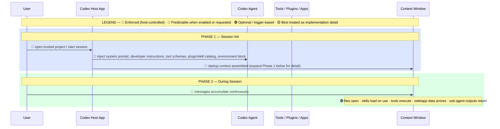
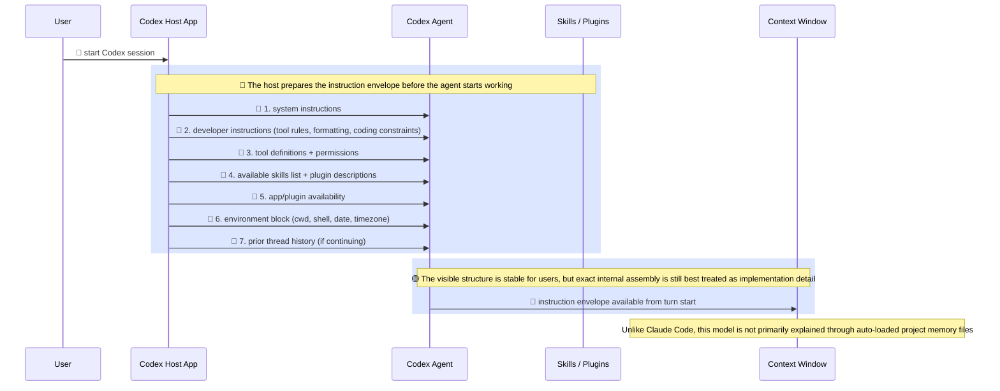
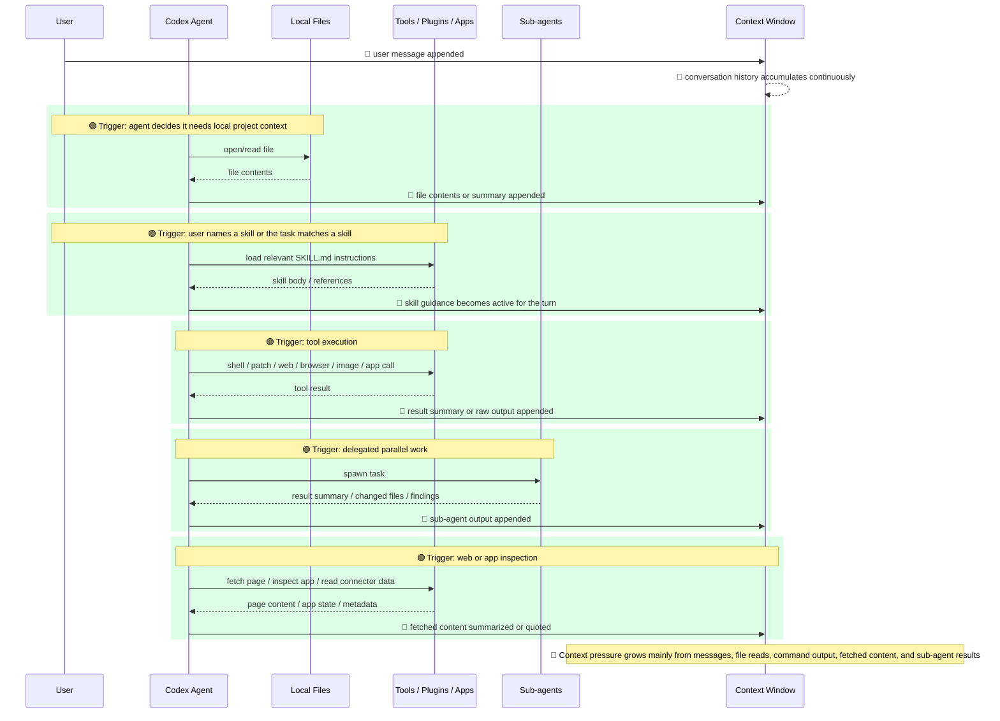

# Codex — Context Injection Mental Map

How the visible pieces get into Codex context when a session starts and as work continues.

This version reflects the **Codex app session model**: host-provided instructions up front, then file/tool/plugin context added as the session evolves.

## Diagram

### Overview

---

<strong>Phase 1 — Session Init (detail)</strong>

<strong>Phase 2 — During Session (detail)</strong>

---

## Zone Breakdown

### Blue — Present From Startup

Available from the beginning of the session.

| Source | Typical contents | Confidence |
|---|---|---|
| System instructions | Global behavior rules | Documented by visible session structure |
| Developer instructions | Coding, tool, formatting, review, and workflow rules | Documented by visible session structure |
| Tool definitions | Schemas, permission model, tool availability | Documented by visible session structure |
| Skill / plugin catalog | Skill names, descriptions, plugin availability | Documented by visible session structure |
| Environment block | cwd, shell, date, timezone | Documented by visible session structure |
| Thread history | Prior turns in the same conversation | Observed |

### Green — Loaded On Demand

Only enters context when a trigger happens.

| Trigger | What loads |
|---|---|
| Opening a file | File contents |
| Using a skill | `SKILL.md` instructions and referenced guidance |
| Running a tool | Tool result |
| Browsing the web or an app | Retrieved page/app state |
| Spawning a sub-agent | Sub-agent results |
| Viewing an image or document | Extracted visual/document content |

### Red — Grows During Session

This is usually what makes the context window feel full.

| Source | Notes |
|---|---|
| Conversation turns | Every user and assistant message |
| Terminal output | Can grow fast if commands are noisy |
| File reads | Large files add a lot of weight |
| Web/app fetches | Pages and fetched content can be bulky |
| Sub-agent results | Helpful, but they stack up |

## Key Insight

For Codex, the startup context is important, but most context pressure still comes from the growing session layer.

The biggest wins usually come from:

1. **Keeping tool output tight**
2. **Reading only the files needed for the task**
3. **Starting a fresh thread for unrelated work**
4. **Using summaries instead of repeatedly pasting raw logs**

## Important Difference From Claude Code

Claude Code is often explained through auto-loaded project memory such as `CLAUDE.md`, memory files, hooks, and slash-command content.

Codex is better understood as:

1. **Host-injected instruction envelope first**
2. **Tool/file/skill loading second**
3. **Session accumulation third**

That makes Codex feel more like a controlled agent runtime than a project-memory-first shell.

## Accuracy Note

This map is meant as a practical mental model, not an internal product spec.

- The visible startup envelope is well supported by what Codex exposes in-session.
- The on-demand loading behavior for files, skills, tools, web content, and sub-agents is directly observable.
- Exact hidden assembly order inside the host should still be treated as implementation detail, not a guaranteed contract.
