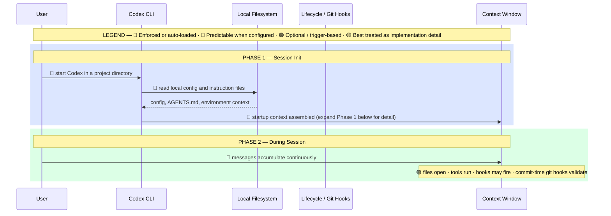
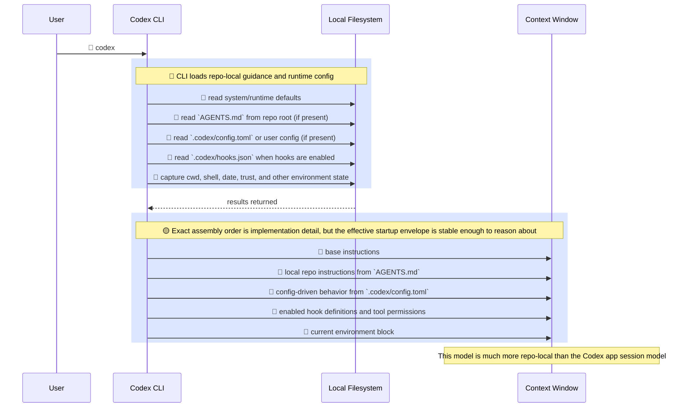
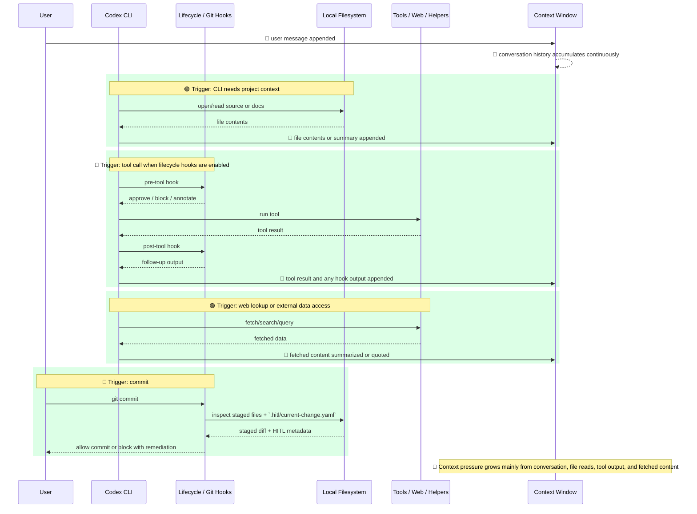

# Codex CLI — Context Injection Mental Map

How the main visible pieces get into **Codex CLI** context when a session starts and as work continues.

This version is for the **Codex CLI + local repo configuration** model, where repo files such as `AGENTS.md` and `.codex/config.toml` matter much more than host-app session scaffolding.

## Diagram

### Overview

---

<strong>Phase 1 — Session Init (detail)</strong>

<strong>Phase 2 — During Session (detail)</strong>

---

## Zone Breakdown

### Blue — Present From Startup

Available at the beginning of the session.

| Source | Typical contents | Confidence |
|---|---|---|
| Base runtime instructions | Global CLI/runtime behavior | Partly visible, partly implementation detail |
| `AGENTS.md` | Repo-local workflow, standards, conventions | Directly observable |
| `.codex/config.toml` | model, approval, sandbox, features, hooks enablement | Directly observable |
| `.codex/hooks.json` | lifecycle hook wiring when enabled | Directly observable |
| Environment block | cwd, shell, date, trust, runtime context | Directly observable |

### Green — Loaded On Demand

Only enters context when triggered.

| Trigger | What loads |
|---|---|
| Reading project files | file contents |
| Running a tool | tool result |
| Using web/search capabilities | fetched content |
| Hook execution | hook output |
| Committing changes | git-hook diagnostics and validation output |

### Red — Grows During Session

This is usually what makes the session heavy.

| Source | Notes |
|---|---|
| Conversation turns | Every user and assistant message |
| File reads | Source files, docs, logs, configs |
| Tool results | Shell output, search results, web responses |
| Hook output | Usually small, but can add up |

## Key Insight

For Codex CLI, the most important startup artifact is usually **`AGENTS.md` plus local `.codex` configuration**.

The biggest wins usually come from:

1. **Keeping `AGENTS.md` sharp and focused**
2. **Using hooks to enforce behavior instead of relying on memory**
3. **Reading only the files needed for the current task**
4. **Starting a fresh session when the task changes materially**

## Important Difference From The Codex App Model

The Codex app model is best explained as a host-injected instruction envelope.

Codex CLI is better explained as:

1. **CLI/runtime defaults**
2. **Repo-local instructions from `AGENTS.md`**
3. **Local `.codex` config and optional hooks**
4. **Session growth from files, tools, and conversation**

That makes Codex CLI feel more like a configurable local harness than a pre-orchestrated host environment.

## Accuracy Note

This map is meant as a practical mental model, not a formal internal spec.

- The role of `AGENTS.md`, `.codex/config.toml`, hooks, and git-hook enforcement is directly observable in real setups.
- File reads, tool output, and conversation growth are directly observable.
- Exact low-level startup ordering inside the CLI should still be treated as implementation detail.
