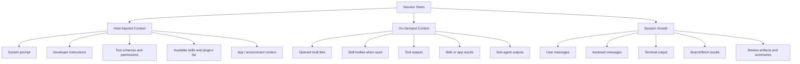

# Codex Context Map

How information typically gets into Codex context during a session.

## Executive View

Codex context is shaped less by a local `CLAUDE.md`-style memory file and more by **host-injected instructions plus live tool output**.

The three useful buckets are:

1. **Injected at session start**  
   System rules, developer instructions, tool definitions, app/plugin availability, and environment context.
2. **Loaded on demand**  
   Local files, skill bodies, tool output, browser state, MCP/app data, and sub-agent results.
3. **Accumulated during the session**  
   User messages, assistant responses, command output, fetched content, and spawned-agent summaries.

## Simple Diagram

## What Usually Exists At Session Start

| Category | Typical examples | Notes |
|---|---|---|
| System rules | platform-wide model instructions | Highest-authority layer |
| Developer instructions | coding rules, tool usage rules, formatting constraints, review style | Strongly shapes behavior |
| Tool definitions | shell tools, patching tools, web tools, image tools, agent tools | Determines what Codex can do |
| Plugin and skill manifests | available skills, available plugins, how they should be used | Usually metadata first, full bodies later |
| Environment block | current working directory, shell, date, timezone | Small but important |
| Thread history | earlier user/assistant turns | Grows over time |

## What Loads Only When Needed

| Trigger | What enters context |
|---|---|
| Opening a file | file contents |
| Using a skill | the relevant `SKILL.md` instructions |
| Running a tool | command output or tool response |
| Browsing the web or an app | fetched page or app state |
| Spawning or waiting on an agent | sub-agent result summary |
| Viewing an image or document | extracted visual/document content |

## What Makes Codex Sessions Heavy

In practice, Codex context pressure usually comes from:

- large file reads
- verbose terminal output
- long review threads
- pasted logs
- web fetches and tool responses
- accumulated sub-agent output

The startup layer is important, but the session-growth layer is usually what dominates.

## Key Difference From Claude Code

The Claude model often starts from project memory artifacts such as `CLAUDE.md`-style instructions.  
Codex, by contrast, is more obviously shaped by:

- the host application's system and developer messages
- the currently available tools and plugins
- the files and results the agent explicitly pulls in

So the best Codex mental model is:

> **instruction envelope first, tool-driven context second, accumulated outputs third**

## Confidence Notes

This diagram reflects the current Codex session model visible from inside the tool:

- host instructions are clearly injected up front
- tool results and file reads are clearly appended on demand
- plugin and skill lists are exposed before their full bodies are loaded

What should still be treated as implementation-detail-sensitive:

- exact ordering of some host-injected sections
- whether a specific local repo file is auto-read versus merely available
- how much hidden bookkeeping the host performs outside visible thread context
