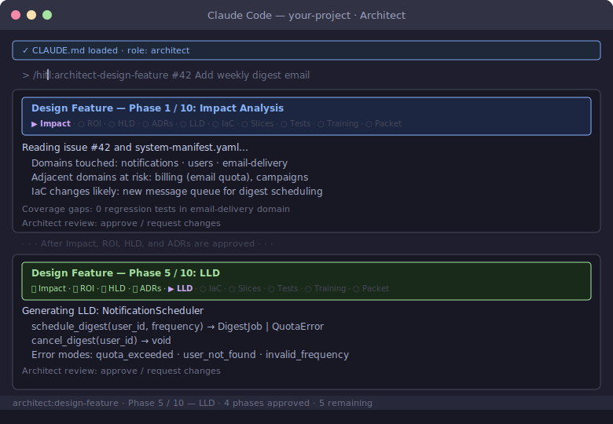

# Architect Role Guide

You hold the design and integration gates. You review designs before implementation starts and verify the traceability chain before merge. On small teams you also cover the QA and Ops roles — use the `/hitl:qa-` and `/hitl:ops-` command namespaces for those activities.

## Your Commands


**`/hitl:architect-design-system`** — Run once at project inception. Takes the PRD and produces domain decomposition, `docs/system-manifest.yaml`, system HLDs, foundational ADRs, domain LLDs, and the HITL process bootstrap. The domain decomposition gate is the most consequential — domain boundary errors cascade through every subsequent artifact.
```
/hitl:architect-design-system docs/01-product/prd.md
```

**`/hitl:architect-design-feature`** — Run at the start of every Tier 2+ change. Walks through steps 3–9: impact analysis, HLD/LLD generation with TA approval gates, ADR capture, slice decomposition, test planning, and decision packet assembly.
```
/hitl:architect-design-feature 42

I am designing the refund flow for issue #42. The change affects the
payments domain — refunds need to be idempotent and reversible.
```

**`/hitl:architect-review-design`** — After design docs are produced, before implementation starts. Checks LLD precision, manifest facade API updates, and ADR completeness.
```
/hitl:architect-review-design

Review the LLD at docs/02-design/technical/lld/payments/refund-flow.md.
Confirm method signatures are precise enough for test generation, all
error modes are enumerated, and the manifest is updated.
```

**`/hitl:architect-review-code`** — Step 19a. After AI review rounds complete, creates the GitHub PR with the AI findings summary and a 7-item judgment checklist. You review on GitHub using line comments and approve or request changes.
```
/hitl:architect-review-code 42

Create the PR for issue #42 — payments refund flow. Include the
AI review summary and the judgment checklist in the description.
```

**`/hitl:architect-verify-traceability`** — Final check before approving merge. Confirms the full chain: issue → design → implementation → tests → impact brief → rollout plan.
```
/hitl:architect-verify-traceability

Verify traceability for issue #42 — payments refund flow — before I
approve the merge. Confirm the implementation matches the LLD and all
evidence is complete.
```

**`/hitl:qa-plan-tests`** — At design time, contribute test scenarios from incident history before the TDD cycle starts. Non-blocking input to the test plan.
```
/hitl:qa-plan-tests

Review the LLD at docs/02-design/technical/lld/payments/refund-flow.md
and the incident registry for the payments domain. What test scenarios
should the developer add beyond the happy path?
```

**`/hitl:qa-review-tests`** — After RED test generation, formal review before implementation begins. Checks ACs, LLD edge cases, and incident regressions.
```
/hitl:qa-review-tests

Review the tests generated for the payments refund flow. Verify every
acceptance criterion in issue #42 has a test and all LLD error modes
are exercised.
```

**`/hitl:qa-verify-quality`** — After developer handoff, independent quality verification against the running build. This is the gate before Ops.
```
/hitl:qa-verify-quality

Verify the payments refund flow against the acceptance criteria in
issue #42. Run exploratory tests beyond the happy path and probe the
failure modes in the incident registry.
```

**`/hitl:qa-report-defect`** — When verify-quality finds a blocking issue. Files a structured defect with AC reference, reproduction steps, and severity.
```
/hitl:qa-report-defect

AC-3 fails: when a refund amount exceeds the original transaction total,
the API returns 200 instead of 422. Reproduction: POST /refunds with
amount: 9999 on a $10 order. Severity: high — blocks issue #42.
```

**`/hitl:ops-review-release`** — Before release, assess the rollout plan, canary criteria, observability readiness, and rollback procedure.
```
/hitl:ops-review-release

Review the rollout plan for issue #42 — payments refund flow.
Check canary percentages, soak times, go/no-go criteria, and
confirm rollback is defined.
```

**`/hitl:ops-monitor-canary`** — During an active canary deployment, read dashboards against go/no-go criteria and produce a promotion recommendation.
```
/hitl:ops-monitor-canary

Monitor the canary deployment for issue #42. Check the payments
error rate and p99 latency dashboards against the criteria in the
approved rollout plan.
```

## Delegation When Unavailable

| Gate | Substitute | Constraint |
|------|-----------|------------|
| Design approval | Most senior engineer with domain context | Must have context on the affected domain |
| Integration verification | Most experienced engineer on the domain | Architect reviews within 48h |

Gates should not block progress for more than 24 hours.

## Progress Breadcrumbs

`/hitl:architect-design-feature` shows a 10-phase breadcrumb trail. The long trail reflects the full scope: impact analysis, ROI, HLD, ADRs, LLD, IaC, slice decomposition (each slice must be demoable or observable — not just technically independent), test planning, training stub, and decision packet.



## Further Reading

- [QA role guide](qa.md) — test review and quality verification
- [Ops role guide](ops.md) — release review and canary monitoring
- [Roles and responsibilities](../playbook/roles.md)
- [Common pitfalls and process tiers](../playbook/common-pitfalls.md)
- [Architect playbook template](../playbook/architect-playbook.md)
- [Manifest governance](../playbook/manifest-governance.md)
