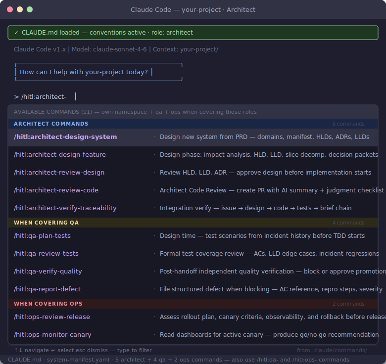

# Architect Role Guide

You hold the design and integration gates. You review designs before implementation starts and verify the traceability chain before merge. On small teams you also cover the QA and Ops roles — use the `/qa:` and `/ops:` command namespaces for those activities.

## Your Commands

| Command | When to use | Gate it covers |
|---------|-------------|----------------|
| `/architect:design-system` | New project — designing the full system from a PRD | System foundation (one-time) |
| `/architect:design-feature` | Starting any Tier 2+ change — steps 3–9 end-to-end | Impact analysis through decision packet handoff |
| `/architect:review-design` | After design docs are produced — before implementation starts | Design approval gate |
| `/architect:verify-traceability` | Final check before approving merge | Integration verification gate |
| `/qa:plan-tests` | At design time — contribute test scenarios from incident history before TDD starts | QA gate (when covering QA) |
| `/qa:review-tests` | After the TDD cycle — review test coverage against ACs and LLD | QA gate (when covering QA) |
| `/qa:verify-quality` | After developer handoff — independent quality verification | QA gate (when covering QA) |
| `/qa:report-defect` | When verify-quality blocks — file structured defect with AC reference and severity | QA gate (when covering QA) |
| `/ops:review-release` | Before release — assess rollout plan, canary criteria, rollback | Ops gate (when covering Ops) |
| `/ops:monitor-canary` | During active canary — read dashboards, produce go/no-go | Ops gate (when covering Ops) |

## Your Commands in Context

### New System (`/architect:design-system`)
Run once at project inception. Takes the PRD and produces: domain decomposition, `docs/system-manifest.yaml`, system HLDs, foundational ADRs, domain LLDs, and the HITL process bootstrap. The domain decomposition gate is the most consequential — domain boundary errors cascade through every subsequent artifact.

### New Change (`/architect:design-feature`)
Run at the start of every Tier 2+ change. Walks through steps 3–9: impact analysis, HLD/LLD generation with approval gates, ADR capture, slice decomposition (domain independence check), test case planning, and decision packet assembly. Produces `.hitl/current-change.yaml` set to `implementation-approved` and hands one decision packet per slice to each developer.

### Design Review (`/architect:review-design`)
Run after design docs are produced — before implementation starts. Check:
- LLD is precise enough to generate tests from — every method has a signature, error modes are enumerated, preconditions are explicit
- Manifest facade APIs are updated if new domain APIs are introduced
- ADRs are written for all tradeoffs — specific rationale, genuine alternatives, honest consequences

Do not approve implementation until the LLD has `status: approved` in its frontmatter.

### Integration Verification (`/architect:verify-traceability`)
Final check before approving merge. Confirm the chain is unbroken:

GitHub issue exists → design PR merged → implementation matches LLD → tests cover the spec → impact brief complete → rollout plan approved

Run the feature end-to-end and ask: "Does this actually do what the design said it would?"

## Delegation When Unavailable

| Gate | Substitute | Constraint |
|------|-----------|------------|
| Design approval | Most senior engineer with domain context | Must have context on the affected domain |
| Integration verification | Most experienced engineer on the domain | Architect reviews within 48h |

Gates should not block progress for more than 24 hours.

## Further Reading

- [QA role guide](qa.md) — test review and quality verification
- [Ops role guide](ops.md) — release review and canary monitoring
- [Roles and responsibilities](../playbook/roles.md)
- [Common pitfalls and process tiers](../playbook/common-pitfalls.md)
- [Architect playbook template](../../templates/architect-playbook.md)
- [Manifest governance](../playbook/manifest-governance.md)
