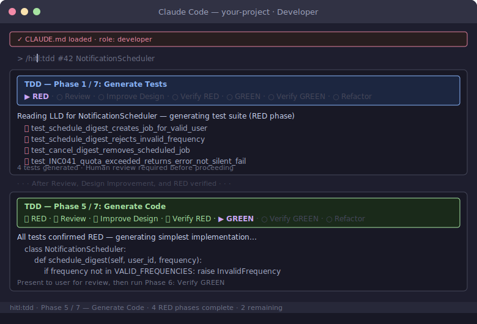

# Developer Role Guide

You own the full vertical slice — docs, code, tests, IaC, and bugs. AI handles the mechanical production; you handle design judgment, review, and anything that requires understanding the system.

## Your Commands


| Command | When to use |
|---------|-------------|
| `/dev-practices` | Starting any Tier 1+ change — loads the full HITL workflow with the right steps for your change tier |
| `/generate-docs` | Before writing code — generate HLD, LLD, ADR from a feature description; or reverse-engineer docs from existing code |
| `/tdd` | After the LLD is approved — runs the RED → GREEN → REFACTOR cycle, tests first |
| `/apply-change` | Before touching code — impact analysis across components, APIs, docs, and tests |
| `/check-conventions` | At any point — runs semgrep, manifest drift, and convention checks in-chat before CI catches them |
| `/check-implementation` | After TDD — two-round spec conformance review comparing implementation against the LLD and manifest |
| `/impact-brief` | When the PR is ready — generates the downstream impact brief and rollout plan for the architect to review |
| `/conclude` | After a design-room thread reaches a decision — turns the Slack thread into an ADR, GitHub issue, and HLD/LLD updates |

## Workflow in Brief

1. Open a GitHub issue
2. Run `/apply-change` — understand what you're touching
3. Run `/generate-docs` — draft HLD/LLD before writing code
4. Get architect design approval (`/architect:review-design`)
5. Run `/tdd` — tests first, then code
6. Run `/check-conventions` — fix violations
7. Run `/check-implementation` — two-round spec conformance review against the LLD
8. Run `/architect:review-code` — architect reviews on GitHub; this creates the PR
9. Run `/impact-brief` — downstream impact brief + rollout plan (added to the open PR at step 25)
10. Architect runs `/architect:verify-traceability` before merge

## Setup Note: Graphify (recommended for large codebases)

On projects with many domains, install [Graphify](https://github.com/safishamsi/graphify) so the HITL skills query the knowledge graph instead of reading the full `system-manifest.yaml` each time. This is especially valuable for `/apply-change`, `/tdd`, and `/impact-brief` on large systems.

```bash
uv tool install graphifyy
graphify claude install
graphify .
```

## Progress Breadcrumbs

`/tdd` shows a 7-phase breadcrumb trail through the full Red → Green → Refactor cycle. The human review phase (Phase 2) is an explicit stop — the breadcrumb stays on Review until you approve the tests.



## Further Reading

- [Full 32-step workflow](../playbook/workflow-reference.md)
- [TDD as design](../../ai/claude/dev-practices/tdd-design.md)
- [Downstream impact](../../ai/claude/dev-practices/downstream-impact.md)
- [Developer playbook template](../playbook/developer-playbook.md)
