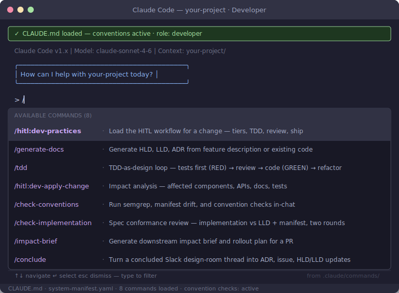

# Developer Role Guide

You own the full vertical slice — docs, code, tests, IaC, and bugs. AI handles the mechanical production; you handle design judgment, review, and anything that requires understanding the system.

## Your Commands



| Command | When to use |
|---------|-------------|
| `/dev-practices` | Starting any Tier 1+ change — loads the full HITL workflow with the right steps for your change tier |
| `/generate-docs` | Before writing code — generate HLD, LLD, ADR from a feature description; or reverse-engineer docs from existing code |
| `/tdd` | After the LLD is approved — runs the RED → GREEN → REFACTOR cycle, tests first |
| `/apply-change` | Before touching code — impact analysis across components, APIs, docs, and tests |
| `/check-conventions` | At any point — runs semgrep, manifest drift, and convention checks in-chat before CI catches them |
| `/check-implementation` | After TDD — two-round spec conformance review comparing implementation against the LLD and manifest |
| `/impact-brief` | When the PR is ready — generates the downstream impact brief and rollout plan for the architect to review |
| `/conclude` | After a design-room thread reaches a decision — turns the Slack thread into an ADR, GitHub issue, and HLD/LLD updates |

## Workflow in Brief

1. Open a GitHub issue
2. Run `/apply-change` — understand what you're touching
3. Run `/generate-docs` — draft HLD/LLD before writing code
4. Get architect design approval (`/architect:review-design`)
5. Run `/tdd` — tests first, then code
6. Run `/check-implementation` — two-round spec conformance review against the LLD
7. Run `/check-conventions` — fix violations before PR
8. Run `/impact-brief` — downstream impact brief + rollout plan
9. Create the PR — architect runs `/architect:verify-traceability` before merge (QA test review and post-handoff verification already completed at steps 11 and 22)

## Setup Note: Graphify (recommended for large codebases)

On projects with many domains, install [Graphify](https://github.com/safishamsi/graphify) so the HITL skills query the knowledge graph instead of reading the full `system-manifest.yaml` each time. This is especially valuable for `/apply-change`, `/tdd`, and `/impact-brief` on large systems.

```bash
pip install graphifyy && graphify install
graphify . --directed --no-viz          # run from your repo root
python3 -m graphify.serve graphify-out/graph.json   # keep running in background
```

Skills fall back to direct file reads automatically if Graphify is not running — no action needed on small repos.

## Further Reading

- [Full 30-step workflow](../playbook/workflow-reference.md)
- [TDD as design](../../skills/dev-practices/tdd-design.md)
- [Downstream impact](../../skills/dev-practices/downstream-impact.md)
- [Developer playbook template](../../templates/developer-playbook.md)
