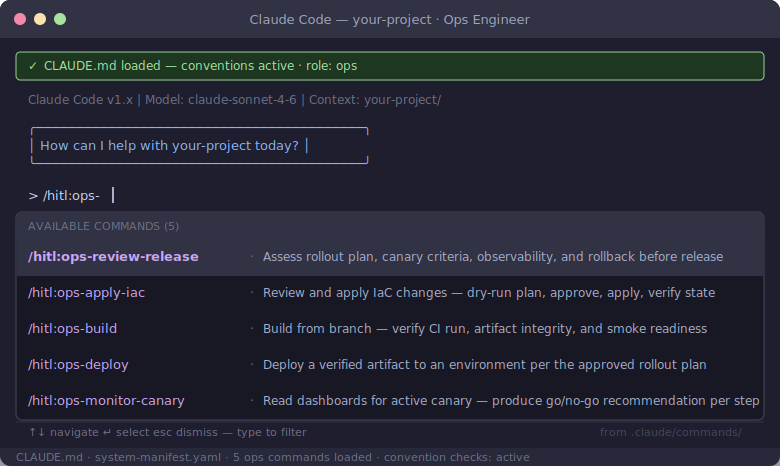
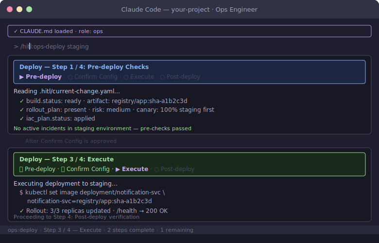

# Ops Engineer Role Guide

You own the release. You take the handoff from QA, assess deployment risk, deploy to canary, monitor go/no-go criteria, and promote or roll back. Your input at design time (canary criteria) is non-blocking; your gate at release is real — you can block any Tier 3+ change.

## Your Commands

| Command | When to use |
|---------|-------------|
| `/ops:review-release` | After the developer completes the impact brief — review rollout plan, canary criteria, observability readiness, and rollback procedure |
| `/ops:apply-iac` | Before deployment — when the change plan includes IaC changes, review and apply them with a dry-run gate |
| `/ops:build` | Before deployment — build the app from the release branch, verify CI artifact and run smoke check |
| `/ops:deploy` | After build and IaC are verified — deploy to target environment per the approved rollout plan |
| `/ops:monitor-canary` | During an active canary deployment — read dashboards against go/no-go criteria and produce a promotion recommendation |

## Your Role in the Workflow

**At design time (non-blocking):** When the developer shares the impact brief draft, contribute canary criteria from the incident registry. Your past incident knowledge shapes what thresholds are tight enough for this domain.

**Before release (gate):** Run `/ops:review-release`. Check that the rollout plan has explicit canary percentages and soak times, go/no-go criteria are specific numbers (not "error rate is low"), rollback is defined, and side-effect safety is assessed for irreversible operations. Required for Tier 3+; advisory for Tier 2.

**IaC changes:** If the change plan includes infrastructure changes, run `/ops:apply-iac` before deployment. This runs a dry-run plan, presents all changes (adds, updates, deletes) for your approval, and applies only after explicit confirmation. Destructive changes require a second confirmation. The deploy command blocks until IaC shows `status: applied`.

**Build:** Run `/ops:build` to verify the release branch has a passing CI run and a clean artifact. The skill checks the artifact digest against CI output, runs a smoke check, and records the artifact reference in the HITL context. Never deploy an artifact whose origin you cannot trace to a CI run.

**Deploy:** Run `/ops:deploy` once build and IaC are verified. The skill reads the rollout plan risk level, confirms the canary configuration with you, presents the exact deployment command before running it, and guides post-deployment verification. For canary deployments it hands off to `/ops:monitor-canary`.

**During canary (monitoring):** Run `/ops:monitor-canary` at each promotion step. AI reads the observability data and produces a recommendation — you make the final call. If a criterion fails, pause (do not immediately roll back) and investigate. Most canary "failures" are noise or pre-existing issues; automatic rollback on noise creates churn.

**After incidents:** Update the incident registry with root cause, fix, regression test reference, and canary criteria adjustments. This feeds future releases.

## What You Do Not Own

- Application code
- Product requirements or architecture decisions
- QA verification (that is QA's gate)
- Your approval is required for Tier 3+ releases; for Tier 2, your review is non-blocking but valued

## Progress Breadcrumbs

`/ops:deploy` shows a 4-step breadcrumb trail. Step 2 (Confirm Config) is an explicit confirmation gate — the skill presents the canary configuration and waits for your approval before executing.

## Further Reading

- [Rollout strategy](../playbook/rollout-strategy.md)
- [Deployment gates](../playbook/deployment-gates.md)
- [Workflow reference — ship steps](../playbook/workflow-reference.md)
- [Incident registry template](../../shared/templates/incident-registry-template.yaml)
- [Deployment manifest template](../../shared/templates/deployment-manifest-template.yaml)
