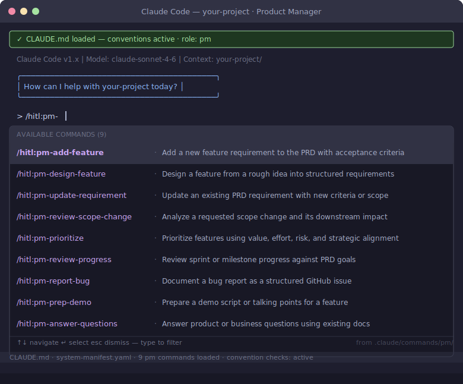

# Product Manager Role Guide

You define what gets built and why. You review AI-drafted PRDs, accept or request changes at demos, and keep the product mental model current as the team ships. You do not need to understand the code — you need to understand the decisions.

## Your Commands

| Command | When to use |
|---------|-------------|
| `/pm:add-feature` | A new feature needs to be documented — adds it to the PRD with acceptance criteria and a requirement ID |
| `/pm:design-feature` | You have a rough idea — shapes it into structured requirements before handing to the team |
| `/pm:update-requirement` | An existing requirement changes — updates the PRD with new criteria or scope |
| `/pm:review-scope-change` | The team flags a scope change — analyzes downstream impact before you decide |
| `/pm:prioritize` | Backlog grooming — scores features by value, effort, risk, and strategic alignment |
| `/pm:review-progress` | Sprint or milestone check-in — reviews progress against PRD goals |
| `/pm:report-bug` | You found a bug — documents it as a structured GitHub issue with reproduction steps |
| `/pm:prep-demo` | Before a demo — generates a script and talking points for the feature |
| `/pm:answer-questions` | Stakeholder question — answers product or business questions using the existing docs |

## Your Role in the Workflow

- **Before design starts:** Write or review the PRD. Use `/pm:add-feature` or `/pm:design-feature`.
- **During design review:** Review the HLD's scope against your requirements. Flag if the design doesn't match what you asked for.
- **After shipping:** Review the downstream impact brief — specifically section 4 (product mental model update). This is where you learn how your mental model needs to update.
- **At demo:** Accept or request changes. Your feedback drives the next iteration.

## Further Reading

- [PM guide](../playbook/pm-guide.md)
- [PM playbook template](../../templates/pm-playbook.md)
- [PRD template](../../templates/prd-template.md)
