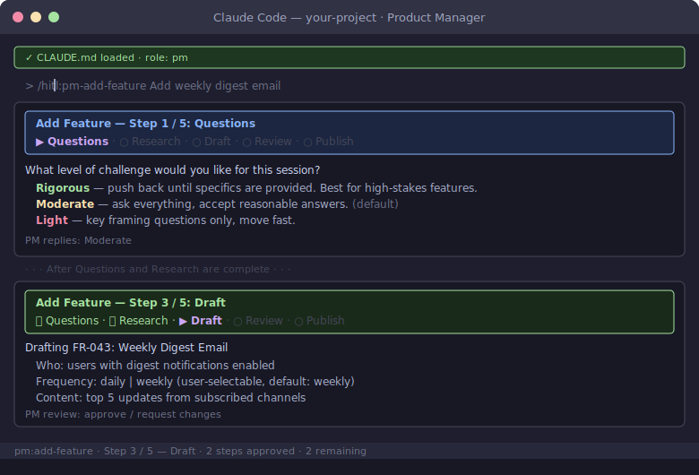

# Product Manager Role Guide

You define what gets built and why. You review AI-drafted PRDs, accept or request changes at demos, and keep the product mental model current as the team ships. You do not need to understand the code — you need to understand the decisions.

## Your Commands


**`/hitl:pm-design-feature`** — You have a rough idea. 7-phase guided process: discovery, user journey, edge cases, UI prototype, acceptance criteria, impact analysis, and PRD write. Shows a progress breadcrumb at every phase.
```
/hitl:pm-design-feature a way for users to refer friends and earn store credit
```

**`/hitl:pm-add-feature`** — You know what you want. Drafts a structured requirement in the PRD with acceptance criteria and a requirement ID, then creates a GitHub issue.
```
/hitl:pm-add-feature users should be able to export their full order history as a CSV file
```

**`/hitl:pm-update-requirement`** — An existing requirement changes. Shows the current text, drafts the change, flags ripple effects on related requirements.
```
/hitl:pm-update-requirement FR-005-2 change the export format to also include product images as URLs
```

**`/hitl:pm-review-scope-change`** — The team proposes a change to the PRD via a PR. Summarises what changed, assesses downstream impact, and generates review questions.
```
/hitl:pm-review-scope-change 87
```

**`/hitl:pm-prioritize`** — Backlog grooming. Scores open features by value, effort, risk, and strategic alignment, then helps you decide what to promote or defer.
```
/hitl:pm-prioritize
```

**`/hitl:pm-review-progress`** — Sprint or milestone check-in. Compares PRD requirements against what is actually built and shows Done / Partial / Not started for each.
```
/hitl:pm-review-progress
```

**`/hitl:pm-report-bug`** — You found a bug. Checks for duplicates, gathers reproduction steps, and creates a structured GitHub issue.
```
/hitl:pm-report-bug the referral link stops working after a user resets their password
```

**`/hitl:pm-prep-demo`** — Before a demo. Generates a structured script: what to show, in what order, what to say at each step, and what edge cases to avoid.
```
/hitl:pm-prep-demo the referral program feature for the Q2 stakeholder demo
```

**`/hitl:pm-answer-questions`** — Walks through unresolved questions in the PRD one at a time, takes your answers, and updates the document.
```
/hitl:pm-answer-questions
```

## Your Role in the Workflow

- **Before design starts:** Write or review the PRD. Use `/hitl:pm-add-feature` or `/hitl:pm-design-feature`.
- **During design review:** Review the HLD's scope against your requirements. Flag if the design doesn't match what you asked for.
- **After shipping:** Review the downstream impact brief — specifically section 4 (product mental model update). This is where you learn how your mental model needs to update.
- **At demo:** Accept or request changes. Your feedback drives the next iteration.

## Progress Breadcrumbs

Every command shows a breadcrumb banner at the start of each phase — completed phases (✅), current phase (▶), and remaining phases (○). You always know where you are and what comes next.

**`/hitl:pm-add-feature`** — 5-step process (Questions → Research → Draft → Review → Publish):



**`/hitl:pm-design-feature`** — 7-phase process (Discovery → Journey → Edge Cases → Design → Criteria → Impact → PRD):


## Further Reading

- [PM guide](../playbook/pm-guide.md)
- [PM playbook template](../playbook/pm-playbook.md)
- [PRD template](../../ai/shared/templates/prd-template.md)
