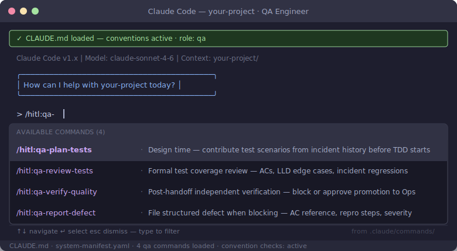

# QA Engineer Role Guide

You own quality verification — independently, after the developer hands off. Your input at design time is non-blocking (contributing test scenarios to the plan); your gate post-handoff is a real block. Nothing promotes to Ops without your approval on Tier 2+ changes.

## Your Commands

| Command | When to use |
|---------|-------------|
| `/qa:review-tests` | After the TDD cycle — formal review of test coverage against acceptance criteria, LLD edge cases, and incident registry regressions |
| `/qa:verify-quality` | After the developer handoff — independent quality verification against the running build; you block or approve promotion |

## Your Role in the Workflow

**At design time (non-blocking):** When the developer shares the design PR, review the test plan and contribute test scenarios from the incident registry. Flag coverage gaps before the TDD cycle starts — this is input, not a gate.

**After TDD (gate):** Run `/qa:review-tests`. Verify every acceptance criterion has a test, every LLD error mode is exercised, and all relevant incident regressions are present. The test registry must be updated. Do not approve the PR without this.

**After handoff (gate):** Run `/qa:verify-quality`. The developer has delivered a stable build. You run independent verification — exploratory testing, edge cases the developer may not have anticipated, regression scenarios from past incidents. If anything fails, block promotion and pull the developer in for fixes.

## What You Do Not Own

- Writing implementation code
- Architectural decisions (that is the architect)
- Release and deployment decisions (that is Ops)
- You add tests when gaps are found — you do not delete developer-written tests without an explicit reason

## Further Reading

- [Common pitfalls — process tiers](../playbook/common-pitfalls.md)
- [Workflow reference — QA steps](../playbook/workflow-reference.md)
- [Test registry template](../../templates/test-registry-template.yaml)
- [Incident registry template](../../templates/incident-registry-template.yaml)
