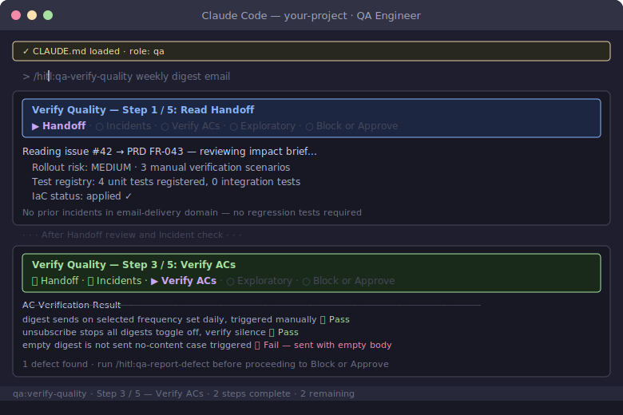

# QA Engineer Role Guide

You own quality verification — independently, after the developer hands off. Your input at design time is non-blocking (contributing test scenarios to the plan); your gate post-handoff is a real block. Nothing promotes to Ops without your approval on Tier 2+ changes.

## Your Commands


**`/hitl:qa-plan-tests`** — At design time, review the LLD and query incident history to contribute test scenarios before the TDD cycle starts. Non-blocking input to the developer's test plan.
```
/hitl:qa-plan-tests

Review the LLD at docs/02-design/technical/lld/payments/refund-flow.md
and check the incident registry for the payments domain. Produce a
prioritised list of test scenarios the developer must cover, with any
regression-required cases from past incidents flagged clearly.
```

**`/hitl:qa-review-tests`** — After RED test generation (AI Generates Tests (RED)), formal review before implementation begins. Verify ACs, LLD edge cases, and incident registry regressions are all covered.
```
/hitl:qa-review-tests

Review the tests generated for the payments refund flow in tests/payments/.
Confirm every acceptance criterion in issue #42 has a test, every LLD
error mode is exercised, and the test registry is updated.
```

**`/hitl:qa-verify-quality`** — After developer handoff, independent quality verification against the running build. This is the gate before Ops — you block or approve promotion.
```
/hitl:qa-verify-quality

Independently verify the payments refund flow against each acceptance
criterion in issue #42. Run exploratory tests beyond the happy path and
probe the failure modes documented in the incident registry.
```

**`/hitl:qa-report-defect`** — When verify-quality finds a blocking issue. Files a structured defect with AC reference, reproduction steps, and severity.
```
/hitl:qa-report-defect

AC-3 fails: refund endpoint returns 200 when amount exceeds the
original transaction total instead of 422. Steps: POST /refunds
with amount: 9999 on a $10 order. Severity: high — blocks issue #42.
```

## Your Role in the Workflow

**At design time (non-blocking):** Run `/hitl:qa-plan-tests` when the LLD is shared. Query the incident registry for the domain, identify edge cases and failure modes the developer may miss, and produce a prioritized list of test scenarios. Regression-required scenarios (from past incidents) must be in the test plan before the TDD cycle starts. This is input, not a gate — but the developer must acknowledge each scenario.

**After RED test generation (gate):** Run `/hitl:qa-review-tests` after AI Generates Tests (RED) generates the test suite — before implementation begins. Verify every acceptance criterion has a test, every LLD error mode is exercised, and all relevant incident regressions from the registry are present. The test registry must be updated. Do not approve implementation until coverage is complete.

**After handoff (gate):** Run `/hitl:qa-verify-quality`. The developer has delivered a stable build. You run independent verification — verify each AC against the running build, run exploratory testing beyond the happy path, and probe failure modes from the incident registry. If anything fails, run `/hitl:qa-report-defect` and block promotion.

**When blocking:** Run `/hitl:qa-report-defect` for every issue that blocks promotion. A block without a filed defect is not actionable — the developer cannot prioritize or fix what is not documented. After fixes, a full re-run of `/hitl:qa-verify-quality` is required before lifting the block.

## What You Do Not Own

- Writing implementation code
- Architectural decisions (that is the architect)
- Release and deployment decisions (that is Ops)
- You add tests when gaps are found — you do not delete developer-written tests without an explicit reason

## Progress Breadcrumbs

`/hitl:qa-verify-quality` shows a 5-step breadcrumb trail. Step 5 (Block or Approve) is the gate — the breadcrumb does not advance past it until you file all defects or post the approval comment.



## Further Reading

- [Common pitfalls — process tiers](../playbook/common-pitfalls.md)
- [Workflow reference — QA steps](../playbook/workflow-reference.md)
- [Test registry template](../../ai/shared/templates/test-registry-template.yaml)
- [Incident registry template](../../ai/shared/templates/incident-registry-template.yaml)
