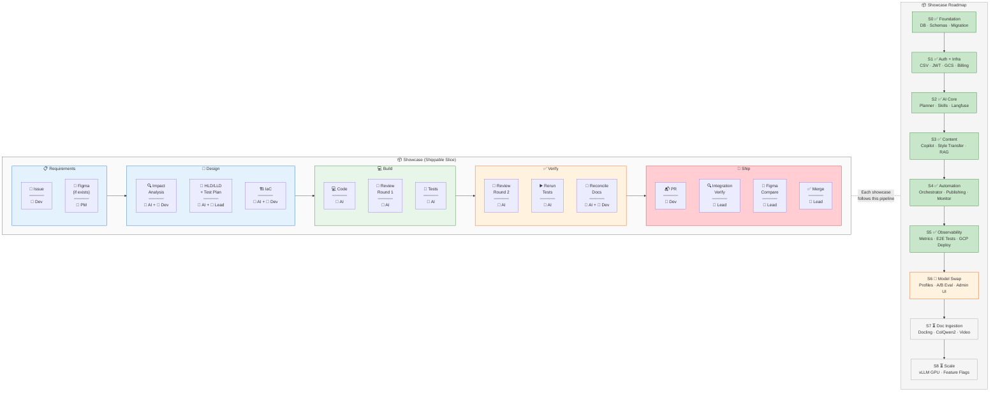

# Development Practices

Apply these practices for ALL coding work — features, bug fixes, refactors, improvements. When the user asks to implement, build, fix, change, or modify code, follow the change workflow and standards defined here. These are mandatory, not suggestions.

---

## 1. Change Workflow (MANDATORY ORDER)

Every change — feature, bug fix, improvement, refactor — follows this exact sequence:

### Pipeline View

Each **Showcase** is a shippable vertical slice (backend + frontend + tests + docs) that goes through this pipeline end-to-end:



**Roles:** 👤 PM = Product Manager · 👤 Dev = Developer · 👤 Lead = Team Lead · 🤖 AI = AI-assisted (Claude Code)

**Legend:** 🤖 = AI-driven · 👤 = Human-required · All other steps = AI-assisted, developer-supervised

### Detailed Flowchart

```mermaid
graph TD
    A["1. 🎫 GitHub Issue<br/>Describe change, root cause, proposed solution"] --> AA
    AA{"Figma<br/>design<br/>exists?"} -->|Yes| AB["1a. 🎨 Review Figma Design<br/>Extract requirements, interactions,<br/>visual specs into issue"]
    AA -->|No| B
    AB --> B
    B["2. 🔍 Impact Analysis<br/>Affected components, APIs, configs, deps"] --> C
    C["3. 📝 Update Docs<br/>HLD/LLD, design decisions, test cases<br/>Reference Figma specs if available"] --> D
    D["4. 🏗️ Update IaC<br/>Manifests, migrations, configs"] --> E
    E["5. 🧪 Test Case Planning<br/>New, updated, removed, regression tests"] --> EA
    EA{"New technical<br/>capability?"}
    EA -->|Yes| EB["5a. 📚 Training Plan Stub<br/>docs/03-engineering/training/&lt;capability&gt;.md<br/>Link from implementation issue"]
    EA -->|No| F
    EB --> F
    F["6. 💻 Code Changes<br/>Implement per updated docs"] --> G

    G["7. 🤖 Code Review — Round 1<br/>AI reviews: structure, security, LLD adherence"] --> H
    H{"Issues<br/>found?"}
    H -->|Yes| F
    H -->|No| I

    I["8. 🧪 Test Changes<br/>Add new, update changed, remove obsolete"] --> J
    J["9. ▶️ Run Full Test Suite<br/>All tests must pass"] --> K
    K{"Tests<br/>pass?"}
    K -->|No| F
    K -->|Yes| L

    L["10. 🤖 Code Review — Round 2<br/>AI reviews: edge cases, regressions, completeness"] --> M
    M{"Issues<br/>found?"}
    M -->|Yes| F
    M -->|No| N

    N["11. ▶️ Rerun Tests<br/>Confirm no regressions from Round 2 fixes"] --> O
    O{"Tests<br/>pass?"}
    O -->|No| F
    O -->|Yes| P

    P["12. 📄 Reconcile Docs<br/>Update docs + IaC if implementation diverged"] --> Q
    Q["13. 📬 Create PR<br/>Link to issue, include docs + IaC + code + tests"] --> R

    R["14. 👤 Team Lead — Integration Verification<br/>Run feature E2E, verify intent matches HLD/LLD"]
    R --> S{"Figma<br/>design<br/>exists?"}
    S -->|Yes| T["15. 👤 Team Lead — Figma Comparison<br/>Compare implementation to Figma,<br/>list differences, resolve before sign-off"]
    S -->|No| U
    T --> U["16. ✅ Merge"]

    style A fill:#e3f2fd,stroke:#1565c0
    style B fill:#e3f2fd,stroke:#1565c0
    style C fill:#e3f2fd,stroke:#1565c0
    style D fill:#e3f2fd,stroke:#1565c0
    style E fill:#e3f2fd,stroke:#1565c0
    style EB fill:#e3f2fd,stroke:#1565c0
    style F fill:#e8f5e9,stroke:#2e7d32
    style G fill:#fff3e0,stroke:#e65100
    style I fill:#e8f5e9,stroke:#2e7d32
    style J fill:#f3e5f5,stroke:#6a1b9a
    style L fill:#fff3e0,stroke:#e65100
    style N fill:#f3e5f5,stroke:#6a1b9a
    style P fill:#e3f2fd,stroke:#1565c0
    style Q fill:#e3f2fd,stroke:#1565c0
    style R fill:#ffcdd2,stroke:#c62828
    style T fill:#ffcdd2,stroke:#c62828
    style U fill:#c8e6c9,stroke:#2e7d32
```



```
1.  GitHub Issue            → describe the change, root cause, proposed solution
1a. 🎨 Review Figma Design → if Figma exists, extract requirements, interactions, visual specs into issue
2.  Impact Analysis         → identify affected components, APIs, configs, dependencies
2a. 📊 ROI Estimate        → if the change costs >1 day of effort, add an ROI Estimate section to the
                              issue: value dimension, expected outcome (specific + falsifiable), baseline
                              metric (measured, not guessed), cost (build + ongoing + maintenance),
                              measurement plan, 30/90-day checkpoint dates, decision if ROI not realized
                              (see §1d below)
3.  Update Docs             → HLD/LLD, design decisions, test cases BEFORE code (reference Figma specs)
4.  Update IaC              → infrastructure manifests, migrations, configs if affected
5.  Test Case Planning      → identify tests to add, update, or remove (see §1b below)
5a. 📚 Training Plan Stub  → if the change introduces a new technical capability, draft a training plan
                              in docs/03-engineering/training/<capability>.md and link from the issue (see §1c)
6.  Code Changes            → implement per the updated docs
7.  Code Review Round 1     → AI reviews structure, security, LLD adherence (before any tests)
8.  Test Changes            → add new tests, update changed tests, remove obsolete tests
9.  Run Full Suite          → all tests must pass, no regressions
10. Code Review Round 2     → AI reviews edge cases, regressions, completeness (after tests pass)
11. Rerun Tests             → confirm no regressions from Round 2 fixes
12. Reconcile Docs + Training → if implementation diverged, update docs + IaC + training plan examples
13. Create PR               → link to GitHub issue, include docs + IaC + training plan + code + tests in same PR
14. 👤 Downstream Impact    → developer + AI produce impact brief: flows changed, risks, PM mental model
                              update, manual verification scenarios (see §1e below)
15. 📋 Rollout Plan         → risk-rated canary strategy with go/no-go criteria (see §1e below)
16. 👤 Integration Verification → team lead runs feature E2E, verifies intent matches HLD/LLD,
                              reviews impact brief + rollout plan for completeness
17. 👤 Figma Comparison     → if Figma design exists, compare implementation, list & resolve differences
18. 🚀 Canary Deploy        → deploy per the risk-rated plan; AI monitors go/no-go criteria
19. ✅ Promote or Rollback   → lead promotes to full production or reverts canary
20. Merge + Demo            → after lead sign-off; demo to PM
--- post-ship ---
21. 📊 30-day ROI Check     → developer + lead review: is the metric moving in the right direction?
22. 📊 90-day ROI Check     → lead + PM review: actual vs estimated ROI; update ADR with Actual Outcome
```

**Never skip steps 1-5.** Documentation is the source of truth, not code.

**Step 2a is conditional** — it fires for any change costing more than ~1 day of effort. For smaller changes, state "ROI estimate not required — change is <1 day." See §1d for the template.

**Step 5a is conditional** — it fires only when the change introduces a new technical capability (see §1c below for the trigger list). When it doesn't fire, make the decision explicit in the chat: "no new capability — training plan not required."

**Steps 14-15 are the downstream assessment** — impact brief + rollout plan. These protect against organizational risk (team's mental model is wrong, ops doesn't know how to deploy). See §1e.

**Steps 21-22 are post-ship** — they don't block the merge but ARE mandatory follow-ups. The 30/90-day checkpoints are scheduled at issue creation time and tracked as checklist items on the issue.

**Figma bookends the workflow:** Figma feeds into requirements and design at step 1a, and closes the loop as a verification check at step 17. The design is both the input and the acceptance criteria.

### 1b. Test Case Planning (Step 5)

Before writing any code, analyze the change and produce a test plan:

- **New tests needed** — what new behavior or edge cases require coverage?
- **Existing tests to update** — which tests assert on changed behavior and must be modified?
- **Obsolete tests to remove** — which tests cover deleted/replaced functionality?
- **Regression tests** — what existing tests must still pass to confirm no breakage?

Document this in the GitHub issue or PR description. The test plan is reviewed alongside the design, not added as an afterthought.

### 1c. Training Plan (Step 5a — conditional)

If the change introduces a new technical capability, draft a training plan alongside the design docs so the team can ramp on the new capability without rediscovering it from the code.

**Training plan required when the change introduces any of:**

- A new architectural pattern (e.g., bandit routing, plan-mode tools, context compression)
- A new external system integrated into the platform (e.g., vLLM, Cohere embeddings, DSPy)
- A new framework or primitive (e.g., LangGraph, MemoryProcessor, BrandScopedToolBroker)
- A new ML/AI technique (e.g., best-of-N sampling, Thompson sampling, DPO)
- A significant refactor that changes how engineers reason about a subsystem

**Not required for:**

- New endpoints on existing controllers
- Bug fixes
- Mental-model-preserving refactors
- Test/doc-only changes

When in doubt, write one — training plans are cheap. When the answer is no, state it explicitly in the chat (`no new capability — training plan not required`) so the decision is visible.

**Location:** `docs/03-engineering/training/<capability-name>.md` — match the existing [`agent-architecture.md`](https://github.com/Prasad-Apparaju/styleflow/blob/main/docs/03-engineering/training/agent-architecture.md) template.

**Shape:**

- **Overview** — total estimated time, prerequisites, a one-sentence statement of what the reader will be able to do after completing the plan
- **Modules** — 30-60 min each, sequential, building on each other
- **Per module:** goal, reading list (files or docs to read), key concepts, hands-on exercise, checkpoint ("if you can answer these questions, you understood the module")
- **Audience note at the top** — primary dev team, secondary PM team; customer-facing enablement is a separate artifact

**Who writes it, when:**

1. **Dev Lead drafts the stub** during step 5a, as part of the Design PR. Module outlines, reading list, learning goals — no working code examples yet (the implementation does not exist).
2. **Developer fleshes it out** in the implementation PR. Working code examples from the shipped code replace placeholders. Hands-on exercises are validated against the final code.
3. **AI code review (step 10)** checks the training plan compiles — referenced files exist, code examples run, reading list is accurate, exercises have known-good answers.
4. **Dev Lead traceability check (step 14)** verifies the implementation issue body has a link to the training plan doc.

**Issue link format:** add a dedicated section in the implementation issue body:

```markdown
## Training Plan

[training: <capability-name>](../blob/main/docs/03-engineering/training/<capability-name>.md)
```

This pattern makes it grep-able across the repo and easy to audit during traceability reviews.

### 1d. ROI Estimation (Step 2a — conditional)

If the change costs more than ~1 day of effort, add an ROI Estimate section to the GitHub issue during the design phase. This ensures every significant technical investment has a measurable thesis that can be verified after shipping.

**Issue template section:**

```markdown
## ROI Estimate

**Value dimension:** [Quality / Reliability / Velocity / Cost / Risk / UX]
**Expected outcome:** [specific, falsifiable prediction with timeframe]
  e.g., "self_eval/overall improves by 15-25% within 30 days"
**Baseline metric (before):** [current measured value, not estimated]
  e.g., "Current self_eval/overall mean = 0.72 (last 30 days from Langfuse)"
**Expected cost:**
  - Build: [engineering days]
  - Ongoing: [per-call or per-month cost delta]
  - Maintenance: [new operational burden]
**Measurement plan:** [which metric, which dashboard, when to check]
**Verification checkpoints:**
  - [ ] 30-day check: [date]
  - [ ] 90-day check: [date]
**Decision if ROI not realized:** [revert / rearchitect / accept partial return]
```

**Value dimension reference:**

| Dimension | Example changes | How to measure |
|-----------|----------------|----------------|
| Quality | Best-of-N sampling, context compression | Eval score lift, HITL rejection rate |
| Reliability | Retry policy, idempotency, DLQ | Error rate, incident count, MTTR |
| Velocity | System manifest, training plans | Time-to-first-PR, rework rate |
| Cost | Model routing, prompt caching | Cost per generation, tokens per output |
| Risk | Brand isolation, canary deployment | Blast radius, rollback frequency |
| UX | Latency improvements, streaming | p95 latency, time-to-first-token |

**Verification cadence:**

| Checkpoint | Who | What they check | Outcomes |
|-----------|-----|----------------|----------|
| **30-day** | Developer + Lead | Metric direction, cost within estimate, unexpected side effects | On track / Inconclusive (extend to 60d) / Off track (investigate) |
| **90-day** | Lead + PM | Actual vs estimated ROI, business impact | ROI realized / Partial / Not realized → execute decision plan |

**After the 90-day checkpoint:** update the ADR with an "Actual Outcome" section:

```markdown
## Actual Outcome (90-day verification, YYYY-MM-DD)

**Expected:** [original prediction]
**Actual:** [measured result]
**Verdict:** [ROI realized / Partial / Not realized — and what was done about it]
```

The 90-day reviews create a calibration loop: over 5-10 verified changes, the team learns whether it systematically overestimates value, underestimates cost, or misses timelines. Each estimate gets compared to reality, not just filed and forgotten.

**When step 2a is skipped:** for changes under ~1 day (config fix, doc update, small refactor), state "ROI estimate not required — change is <1 day" so the skip is explicit and auditable.

### 1e. Downstream Impact Assessment + Rollout Plan (Steps 14-15)

After all code + tests + docs are ready (steps 6-13), and before creating the PR (step 13), produce two artifacts:

**Downstream impact brief (step 14):**

The developer + AI produce a structured brief answering five questions, each aimed at a different stakeholder:

| Section | Question | Who reads it |
|---------|----------|-------------|
| 1. Flows + components | What user-visible behaviors changed? | PM, QA |
| 2. Risk assessment | What can break? Severity x likelihood | Lead, Ops |
| 3. Manual verification | What should be tested beyond the automated suite? | QA, Ops |
| 4. Mental model update | What assumptions does the PM hold that are no longer true? | PM |
| 5. Rollout strategy | How do we derisk deployment? | Ops, Lead |

Section 4 (mental model update) is the one teams most often skip and most often regret. Writing "approve now queues for scheduled delivery instead of publishing immediately" takes 30 seconds and prevents weeks of downstream confusion.

**Risk-rated rollout plan (step 15):**

| Risk level | Example | Rollout |
|-----------|---------|---------|
| Low | Config fix, doc update | Direct deploy |
| Medium | New feature behind flag, additive endpoint | Flag off → staging → 24h soak → production |
| High | Changed existing behavior, new external integration | Canary 5-10% → 4h monitor → 25% → 4h → 100% |
| Critical | Irreversible side effects, billing, migration | Canary 1% → manual gate each step → 24h soak per tier |

Each promotion step checks explicit go/no-go criteria calibrated to the specific change:
- Error rate delta < threshold
- Latency delta < threshold
- Business metric within tolerance of baseline
- No increase in failure-mode scores

If any criterion fails, the canary pauses for investigation. Rollback path: revert canary, full traffic returns to the previous version.

The developer proposes the criteria in the rollout plan; the lead reviews them during integration verification (step 16).

---

## 2. Doc-Driven AI Development

- **AI writes all docs and code.** Developer reviews, corrects, approves.
- **LLDs are the prompt.** Every LLD is precise enough to generate code from.
- **Design PR before code PR.** HLD/LLD/test cases reviewed and merged before code generation begins.
- **Chat with AI first.** Discuss the task, explore approaches, raise edge cases. AI produces the LLD at the end of the conversation.

---

## 3. Code Generation Standards

- **Inline comments on every significant line** — explain the "why", not the "what"
- **Type hints everywhere** — models, function signatures, return types
- **Async/await for all I/O** — database, HTTP, file system, all async where the framework supports it
- **Security first** — no injection vulnerabilities, sanitize inputs, validate at boundaries

---

## 4. Testing Standards

- **Tests must exercise real service code** — not reimplementations or mock-only assertions
- **Mock external APIs** — never make real API calls in tests
- **Every new feature needs** — happy path, error cases, edge cases, boundary conditions
- **Every bug fix needs** — a regression test that would have caught the bug
- **Every deleted feature needs** — removal of its tests (dead tests are worse than no tests)
- **Test names describe behavior** — `test_returns_404_when_brand_not_owned`, not `test_brand_3`

---

## 5. Impact Analysis

Before any change, identify:

- **Affected endpoints/APIs** — what callers will see different behavior?
- **Affected services/modules** — what internal code paths change?
- **Affected infrastructure** — do manifests, configs, secrets, or migrations need updating?
- **Affected documentation** — which HLD/LLD docs describe the changed behavior?
- **Affected tests** — which existing tests cover the changed code? (this feeds into §1a)

---

## 6. Infrastructure as Code

- **IaC for cloud resources** — networking, compute, storage, IAM, secrets, budgets
- **Declarative manifests for orchestration** — base + environment overlays
- **Secrets via external secrets management** — never hardcode credentials
- **Every new service/secret/job** — update IaC manifests and local dev config

---

## 7. Observability

- **Trace every LLM call** — observability platform must capture all AI operations
- **Include tenant/user context in traces** — for cost attribution and debugging
- **Structured logging** — JSON, with correlation IDs across services

---

## 8. API Design

- **Scope endpoints to the owning entity** — e.g., `/api/{tenant}/{resource}`
- **Consistent auth pattern** — one mechanism, one ownership check function
- **Return 404 not 403 for ownership failures** — prevent resource enumeration
- **Version or shim for backwards compatibility** — don't break existing clients

---

## 9. Code Review (Two Rounds)

### Round 1 — Before Unit Tests (after code generation)
- **Focus:** structural issues, security vulnerabilities, LLD adherence, naming conventions
- **Run AI review agents** (code-reviewer, silent-failure-hunter) on generated code
- **Fix all CRITICAL and HIGH findings** before proceeding to tests
- **Goal:** catch design-level problems early, before investing time writing and running tests

### Round 2 — After All Tests Pass
- **Focus:** edge cases, regressions, completeness, test quality
- **Run AI review agents** again on the full changeset (code + tests)
- **Fix findings, then rerun the full test suite** to confirm no regressions from fixes
- **MEDIUM/LOW findings** tracked as issues — can defer to next sprint

## 10. Integration Verification (👤 Team Lead Only)

After all automated tests pass and code review rounds are complete, the team lead performs a final intent verification before merge:

- **Run the feature end-to-end** — not unit tests, but the actual user journey
- **Compare behavior against HLD/LLD** — does the implementation deliver what was designed?
- **Check traceability** — requirement → design → IaC → code → tests (nothing missing)
- **Figma comparison (when applicable)** — if a Figma design exists for this feature:
  - Compare the implementation screen-by-screen against the Figma document
  - List all visual and behavioral differences
  - Resolve each difference (fix implementation, update Figma, or document as intentional deviation)
  - No merge until differences are resolved or explicitly accepted
- **Sign-off** — team lead approves the PR only after integration verification passes

---

## 11. Design Decisions

- **Document every decision** with rationale, alternatives considered, and conditions for revisiting
- **When technology changes** — check the decision rationale to know WHEN to switch
- **Reusable patterns** — extract and document patterns that apply across features

---

## 12. Team Process

- **PM brainstorms with AI** → updates PRD + mockups
- **Dev Lead designs with AI** → HLD + first-cut LLDs + IaC (all in Design PR)
- **Design PR must merge before code begins** — this is the gate
- **Developers refine LLD + generate code + tests** — each owns a vertical slice
- **AI code review before human review** — fix mechanical issues first
- **Lead reviews traceability** — requirement → design → IaC → code → tests
- **Demo to PM** → iterate based on feedback
