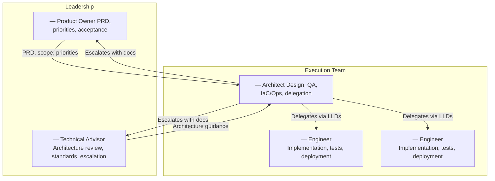

# Team Responsibilities — Template

<!-- 
INSTRUCTIONS: Replace the example roles below with your actual team.
Keep the structure: role definitions → ownership matrix → escalation path → conflict resolution.
-->

---

## 1. Team Structure

---

## 2. Role Definitions

### Product Owner

| Responsibility | Details |
|---|---|
| **PRD ownership** | Maintains requirements, priorities, acceptance criteria |
| **Scope decisions** | Approves or rejects scope changes proposed by the team |
| **Acceptance** | Signs off on whether delivered features meet product intent |
| **Prioritization** | Decides what gets built next |

**Does not:** Write code, review code, make architectural decisions, manage infrastructure.

### Technical Advisor

| Responsibility | Details |
|---|---|
| **Architecture review** | Reviews and approves HLD changes and new ADRs |
| **Standards** | Maintains CLAUDE.md, system manifest, playbooks |
| **Escalation point** | Resolves architectural trade-offs |
| **Quality bar** | Sets quality expectations — production-ready, no shortcuts |

**Does not:** Day-to-day implementation, code review, sprint management.

### Architect / Team Lead

| Responsibility | Details |
|---|---|
| **Architecture & design** | Evolves HLDs and LLDs. Proposes ADRs. |
| **QA** | Defines test strategy, reviews coverage, ensures every slice passes |
| **IaC / Ops** | Infrastructure, deployment, migrations, monitoring |
| **Integration** | Ensures slices work together |
| **Delegation** | Assigns work via LLDs. Reviews at each gate. |
| **Code review** | Reviews all PRs — two rounds (pre-test + post-test) |
| **Working system** | System is deployable and functional after every slice |

### Engineers

| Responsibility | Details |
|---|---|
| **Implementation** | Build from approved LLDs following the 22-step process |
| **Testing** | Write tests (TDD), run suites, fix regressions |
| **Deployment** | Deploy their own work, verify in target environment |
| **End-to-end ownership** | Whoever builds it owns it: build, test, fix, deploy |
| **Convention compliance** | Run checks locally before every PR |

**Does not:** Make architectural decisions unilaterally, change PRD scope, skip process steps.

---

## 3. Ownership Matrix

<!-- Replace areas with your project's domains -->

| Area | Product Owner | Tech Advisor | Architect | Engineers |
|---|---|---|---|---|
| **PRD / requirements** | Own | Review | Propose changes | — |
| **HLD / architecture** | — | Approve | Own | — |
| **LLD / detailed design** | — | — | Own | Implement from |
| **ADRs** | Informed | Approve | Propose | — |
| **Backend code** | — | — | Own + build | Build |
| **Frontend code** | — | — | Own + build | Build |
| **Database / migrations** | — | — | Own | Build |
| **Infrastructure** | — | — | Own | Assist |
| **QA / test strategy** | — | — | Own | Execute |
| **Code review** | — | — | Own | Submit |
| **Deployment** | — | — | Own | Execute |
| **Incident response** | Informed | Escalation | Own | Fix |

---

## 4. Escalation Path

All escalations must use prescribed documentation formats. No undocumented decisions.

| Type | Format | Who decides |
|---|---|---|
| **Architectural decision** | New ADR — options, trade-offs, recommendation | Tech Advisor approves |
| **PRD scope change** | Update PRD with proposed change + affected requirements | Product Owner approves |
| **Design change** | Update HLD/LLD, present the diff | Architect owns (escalate if cross-cutting) |
| **Risk decision** | Downstream impact brief (5-section format) | Tech Advisor + Product Owner review |

---

## 5. Conflict Resolution

| Scenario | Resolution |
|---|---|
| **Prioritization disagreement** | Product Owner decides |
| **Architecture disagreement** | Tech Advisor decides |
| **Design disagreement (within team)** | Architect decides — propose ADR if non-obvious |
| **Code quality disagreement** | CLAUDE.md and system manifest are the authority |
| **Timeline pressure vs quality** | Quality wins. Problem prevention over throughput. |
