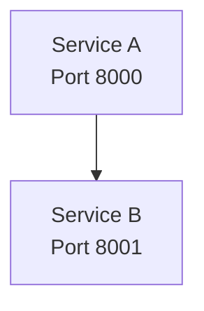
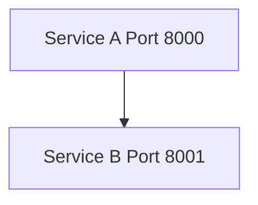

# Mermaid Fixer

Removes `<br/>` tags inside Mermaid code blocks for Obsidian compatibility. Obsidian's Mermaid renderer treats `<br/>` as unsupported HTML, showing "Unsupported markdown: list" errors.

Only modifies content inside ` ```mermaid ` blocks — regular HTML `<br/>` outside Mermaid is left untouched.

## Usage

```bash
# Fix specific files
python tools/fix-mermaid/fix_br_tags.py docs/02-design/technical/hld/system.md

# Fix all markdown files in a directory
find docs/ -name "*.md" -exec python tools/fix-mermaid/fix_br_tags.py {} \;
```

## Requirements

Python 3 (no dependencies).

## What It Does

Before:


After:


## When to Use

- After generating docs with `/generate-docs` (AI sometimes produces `<br/>` in Mermaid)
- Before committing docs that will be viewed in Obsidian
- The convention checker (`mermaid_br_tags` check) flags these automatically
